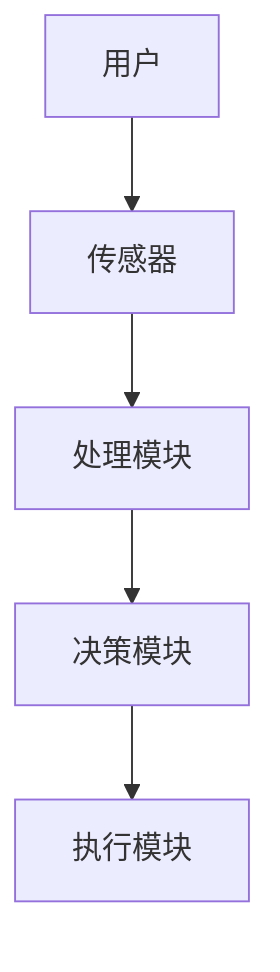
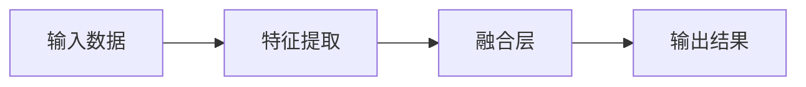
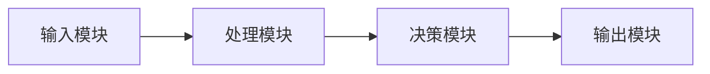
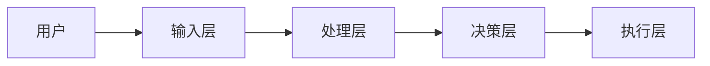
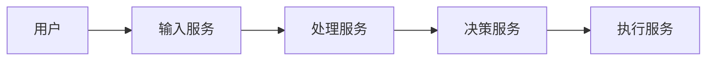
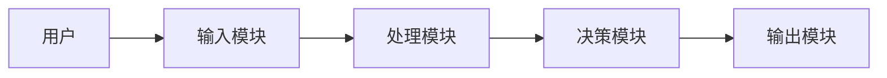

                 


# 开发多模态交互的AI Agent系统

## 关键词：多模态交互、AI Agent、系统架构、算法原理、项目实战

## 摘要：
本文详细探讨了开发多模态交互的AI Agent系统的各个方面，从背景介绍到系统架构设计，再到项目实战，全面解析了该系统的开发过程和实现细节。文章首先介绍了多模态交互和AI Agent的基本概念，然后深入分析了多模态数据融合和行为决策算法的原理，接着详细讲解了系统的架构设计和接口设计，最后通过项目实战展示了如何实现一个多模态交互的AI Agent系统。本文适合对AI Agent和多模态交互感兴趣的技术人员阅读。

---

# 第一部分: 多模态交互AI Agent系统开发基础

## 第1章: 多模态交互AI Agent系统概述

### 1.1 多模态交互的背景与意义

#### 1.1.1 多模态交互的定义与特点
多模态交互是指通过多种感官通道（如视觉、听觉、触觉等）进行信息交流的方式。与传统的单模态交互相比，多模态交互能够更全面地理解用户的需求和意图，提供更智能和个性化的服务。其特点包括：
- **多样性**：支持多种交互方式。
- **互补性**：不同模态的信息可以相互补充。
- **实时性**：能够实时处理和反馈信息。

#### 1.1.2 多模态交互在AI Agent中的作用
AI Agent（智能代理）是一种能够感知环境、自主决策并执行任务的智能体。多模态交互能力使得AI Agent能够更自然地与人类交互，提高用户体验和系统的智能化水平。

#### 1.1.3 多模态交互的典型应用场景
- **智能家居**：通过语音和触摸交互控制家电。
- **虚拟助手**：支持语音、文本和手势等多种交互方式。
- **机器人**：结合视觉、听觉和触觉实现复杂任务。

### 1.2 AI Agent的基本概念

#### 1.2.1 AI Agent的定义与分类
AI Agent是一种能够感知环境、自主决策并执行任务的智能体。根据功能和应用场景，AI Agent可以分为：
- **简单反射型Agent**：基于当前输入做出反应。
- **基于模型的反射型Agent**：使用内部模型来预测结果。
- **目标驱动型Agent**：根据目标进行决策。
- **效用驱动型Agent**：通过最大化效用函数来决策。

#### 1.2.2 AI Agent的核心功能与能力
- **感知能力**：通过多种传感器获取环境信息。
- **推理能力**：基于获取的信息进行逻辑推理。
- **决策能力**：根据推理结果做出决策。
- **执行能力**：通过执行机构完成任务。

#### 1.2.3 AI Agent与传统软件的区别
AI Agent具有自主性、反应性和社会性，能够根据环境变化自主调整行为，而传统软件通常需要人工干预。

### 1.3 多模态交互AI Agent的系统架构

#### 1.3.1 多模态交互的系统组成
- **输入模块**：接收多种模态的输入数据（如语音、图像）。
- **处理模块**：对输入数据进行预处理和融合。
- **决策模块**：基于融合后的数据进行决策。
- **输出模块**：根据决策结果输出相应的反馈。

#### 1.3.2 AI Agent的模块划分
- **感知模块**：负责接收和处理环境信息。
- **推理模块**：负责逻辑推理和知识表示。
- **决策模块**：负责制定行动计划。
- **执行模块**：负责执行具体任务。

#### 1.3.3 系统架构的优缺点分析
- **优点**：模块化设计便于维护和扩展。
- **缺点**：模块之间的交互可能导致复杂性增加。

### 1.4 本章小结
本章介绍了多模态交互和AI Agent的基本概念，分析了多模态交互在AI Agent中的作用，并详细讲解了多模态交互AI Agent的系统架构。

---

## 第2章: 多模态交互的核心概念与联系

### 2.1 多模态数据的处理与融合

#### 2.1.1 多模态数据的定义与分类
多模态数据包括文本、语音、图像、视频等多种类型的数据。根据数据类型，可以分为：
- **结构化数据**：如数据库中的表格数据。
- **非结构化数据**：如文本、图像等。

#### 2.1.2 多模态数据的处理流程
1. **数据采集**：通过传感器或API获取数据。
2. **数据预处理**：对数据进行清洗和标准化。
3. **数据融合**：将不同模态的数据进行融合，提取有用信息。

#### 2.1.3 多模态数据的融合方法
- **特征级融合**：在特征层面对不同模态的数据进行融合。
- **决策级融合**：在决策层面对不同模态的结果进行融合。

### 2.2 AI Agent的行为决策机制

#### 2.2.1 行为决策的基本原理
行为决策是AI Agent根据感知到的信息和内部状态，选择最优行动的过程。常用的方法包括：
- **基于规则的决策**：根据预定义的规则进行决策。
- **基于学习的决策**：通过机器学习模型进行决策。

#### 2.2.2 基于多模态数据的决策模型
多模态数据的决策模型通常包括以下几个步骤：
1. **数据融合**：将不同模态的数据进行融合。
2. **特征提取**：提取融合后数据的特征。
3. **模型训练**：使用机器学习模型进行训练。
4. **决策推理**：基于模型推理出决策结果。

#### 2.2.3 决策模型的优化与改进
- **模型优化**：通过调整模型参数提高决策准确率。
- **模型改进**：引入新的算法或方法提高决策效率。

### 2.3 多模态交互中的实体关系分析

#### 2.3.1 实体关系图的构建
实体关系图用于描述系统中各个实体之间的关系。例如，在一个多模态交互系统中，实体可能包括用户、传感器、处理模块等。



#### 2.3.2 实体关系的动态变化
实体关系可能会随着环境的变化而动态调整。例如，当用户输入语音指令时，实体关系可能会发生变化。

#### 2.3.3 实体关系与系统架构的关系
实体关系图可以帮助我们更好地理解系统架构的设计，特别是在模块划分和接口设计方面。

### 2.4 本章小结
本章详细讲解了多模态数据的处理与融合方法，分析了AI Agent的行为决策机制，并通过实体关系图展示了多模态交互中的实体关系。

---

## 第3章: 多模态交互AI Agent的算法原理

### 3.1 多模态数据融合算法

#### 3.1.1 多模态数据融合的数学模型
多模态数据融合可以通过多种数学模型实现，例如：
$$ y = f(x_1, x_2, \ldots, x_n) $$
其中，$x_i$ 表示不同模态的数据，$y$ 表示融合后的结果。

#### 3.1.2 基于深度学习的融合方法
深度学习是一种常用的融合方法，可以通过神经网络对不同模态的数据进行特征提取和融合。



#### 3.1.3 融合算法的优缺点分析
- **优点**：能够充分利用多模态数据的信息。
- **缺点**：算法复杂度较高，需要大量的训练数据。

### 3.2 AI Agent的行为决策算法

#### 3.2.1 基于强化学习的决策模型
强化学习是一种常用的决策算法，通过奖励机制来优化决策策略。

$$ R = \sum_{t=1}^{T} r_t $$
其中，$r_t$ 表示在时间 $t$ 的奖励，$R$ 表示总奖励。

#### 3.2.2 基于监督学习的决策模型
监督学习是一种常用的决策算法，通过标签数据来训练模型。

$$ y = \arg\max_{i} P(y=i|x) $$
其中，$x$ 表示输入数据，$y$ 表示输出标签。

#### 3.2.3 决策算法的数学公式与实现
强化学习和监督学习的实现可以通过Python代码来完成。例如，使用深度神经网络进行训练和推理。

```python
import torch
import torch.nn as nn

class DecisionModel(nn.Module):
    def __init__(self, input_size, output_size):
        super(DecisionModel, self).__init__()
        self.fc = nn.Linear(input_size, output_size)
    
    def forward(self, x):
        return self.fc(x)
```

### 3.3 算法的实现与优化

#### 3.3.1 算法实现的步骤与流程
1. **数据准备**：收集和预处理数据。
2. **模型训练**：使用训练数据训练模型。
3. **模型推理**：使用训练好的模型进行决策。

#### 3.3.2 算法优化的策略与方法
- **参数调整**：通过调整学习率和批量大小来优化模型。
- **模型改进**：引入新的算法或结构来提高性能。

#### 3.3.3 算法实现的代码示例
以下是一个简单的强化学习算法实现：

```python
import torch
import torch.nn as nn
import torch.optim as optim

class PolicyNetwork(nn.Module):
    def __init__(self, input_size, output_size):
        super(PolicyNetwork, self).__init__()
        self.fc1 = nn.Linear(input_size, 64)
        self.fc2 = nn.Linear(64, output_size)
    
    def forward(self, x):
        x = torch.relu(self.fc1(x))
        return torch.softmax(self.fc2(x), dim=1)

# 初始化网络
policy_net = PolicyNetwork(input_size, output_size)
optimizer = optim.Adam(policy_net.parameters(), lr=0.001)

# 训练过程
for epoch in range(num_epochs):
    optimizer.zero_grad()
    outputs = policy_net(inputs)
    loss = criterion(outputs, labels)
    loss.backward()
    optimizer.step()
```

### 3.4 本章小结
本章详细讲解了多模态数据融合和行为决策算法的原理，并通过代码示例展示了如何实现这些算法。

---

## 第4章: 多模态交互AI Agent的系统分析与架构设计

### 4.1 系统功能设计

#### 4.1.1 系统功能模块划分
多模态交互AI Agent系统可以划分为以下几个功能模块：
- **输入模块**：接收多种模态的输入数据。
- **处理模块**：对输入数据进行预处理和融合。
- **决策模块**：基于融合后的数据进行决策。
- **输出模块**：根据决策结果输出相应的反馈。

#### 4.1.2 系统功能的交互流程
输入模块将数据传递给处理模块，处理模块对数据进行融合后传递给决策模块，决策模块根据融合后的数据做出决策，并将决策结果传递给输出模块。

#### 4.1.3 功能模块之间的交互关系


### 4.2 系统架构设计

#### 4.2.1 分层架构设计
分层架构将系统划分为多个层次，每个层次负责不同的功能。



#### 4.2.2 微服务架构设计
微服务架构将系统划分为多个独立的服务，每个服务负责不同的功能。



### 4.3 系统接口设计

#### 4.3.1 系统内部接口设计
系统内部接口用于模块之间的数据传递和通信。

#### 4.3.2 系统外部接口设计
系统外部接口用于与外部设备或系统的交互。

### 4.4 系统交互流程设计

#### 4.4.1 系统交互的流程图


### 4.5 本章小结
本章详细讲解了多模态交互AI Agent系统的功能设计和架构设计，并通过流程图展示了系统的交互流程。

---

## 第5章: 多模态交互AI Agent的项目实战

### 5.1 项目背景与目标

#### 5.1.1 项目背景
本项目旨在开发一个多模态交互的AI Agent系统，能够通过多种模态的输入数据与用户进行交互。

#### 5.1.2 项目目标
- 实现多模态数据的采集和处理。
- 实现多模态数据的融合和决策。
- 实现系统的交互和反馈。

### 5.2 系统核心实现

#### 5.2.1 环境安装与配置
需要安装以下环境和工具：
- Python 3.8+
- PyTorch 1.9+
- OpenCV 4.5+
- 其他依赖库

#### 5.2.2 核心代码实现
以下是系统的核心代码实现：

```python
import torch
import torch.nn as nn
import torch.optim as optim
import cv2
import speech_recognition as sr

# 多模态数据融合
class MultiModalFuser:
    def __init__(self):
        self.models = {
            'text': TextProcessor(),
            'image': ImageProcessor(),
            'audio': AudioProcessor()
        }
    
    def fuse(self, text, image, audio):
        text_feats = self.models['text'].process(text)
        image_feats = self.models['image'].process(image)
        audio_feats = self.models['audio'].process(audio)
        return torch.cat([text_feats, image_feats, audio_feats], dim=1)

# 行为决策模型
class DecisionModel(nn.Module):
    def __init__(self, input_size, output_size):
        super(DecisionModel, self).__init__()
        self.fc = nn.Linear(input_size, output_size)
    
    def forward(self, x):
        return self.fc(x)

# 系统主程序
def main():
    fuser = MultiModalFuser()
    decision_model = DecisionModel(input_size, output_size)
    optimizer = optim.Adam(decision_model.parameters(), lr=0.001)
    
    # 训练过程
    for epoch in range(num_epochs):
        optimizer.zero_grad()
        outputs = decision_model(fuser.fuse(text_input, image_input, audio_input))
        loss = criterion(outputs, target)
        loss.backward()
        optimizer.step()
    
    # 推理过程
    with torch.no_grad():
        outputs = decision_model(fuser.fuse(text_input, image_input, audio_input))
        predicted = torch.argmax(outputs, dim=1)
        print(predicted)

if __name__ == "__main__":
    main()
```

#### 5.2.3 代码解读与分析
- **MultiModalFuser**：一个多模态数据融合类，负责将不同模态的数据进行融合。
- **DecisionModel**：决策模型，基于神经网络进行决策。
- **main**：主程序，负责训练和推理过程。

### 5.3 项目小结
本章通过一个具体的项目案例，展示了如何实现一个多模态交互的AI Agent系统。通过代码实现和分析，读者可以更好地理解系统的实现过程。

---

## 第6章: 开发多模态交互AI Agent系统的最佳实践

### 6.1 小结
本文详细讲解了开发多模态交互AI Agent系统的各个方面，从背景介绍到系统架构设计，再到项目实战，全面解析了该系统的开发过程和实现细节。

### 6.2 注意事项
- 在开发过程中，需要注意数据的多样性和质量。
- 需要合理设计系统的模块划分和接口。
- 需要选择合适的算法和优化策略。

### 6.3 拓展阅读
- **推荐书籍**：《Deep Learning》、《Reinforcement Learning》
- **推荐论文**：相关领域的最新研究成果
- **在线资源**：GitHub上的开源项目和 tutorials

---

## 附录: 常用工具与库

- **Python库**：
  - PyTorch：深度学习框架
  - OpenCV：计算机视觉库
  - speech_recognition：语音识别库
- **工具**：
  - Mermaid：图表工具
  - PyCharm：开发工具

---

以上是《开发多模态交互的AI Agent系统》的完整目录和详细内容，涵盖了从基础概念到项目实战的各个方面，适合对AI Agent和多模态交互感兴趣的技术人员阅读。

