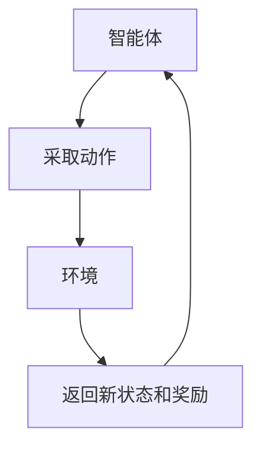
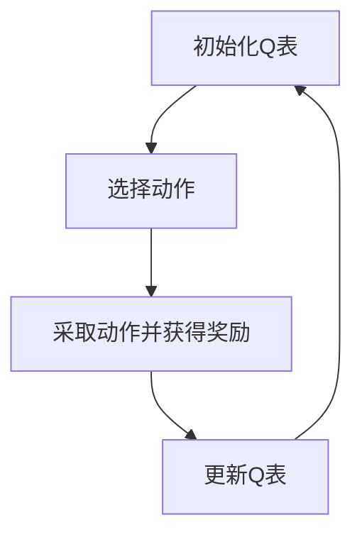
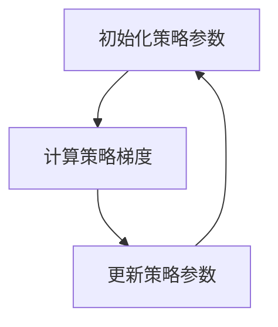
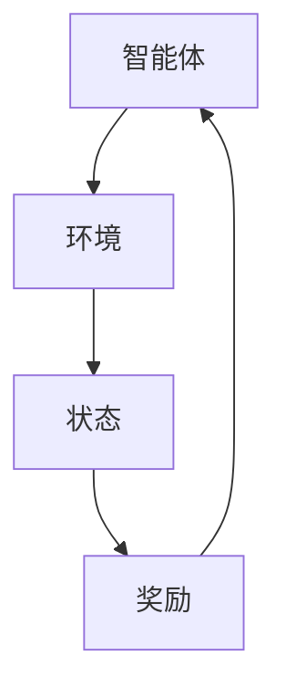

                 

<think>
好的，我需要撰写一篇关于《强化学习在AI Agent决策中的应用》的技术博客文章。我会按照用户的要求，先介绍文章的标题、关键词、摘要，然后再逐步展开文章的各个章节内容。

首先，我会先写出文章的标题：

# 强化学习在AI Agent决策中的应用

接下来，列出文章的核心关键词，包括：强化学习、AI Agent、决策优化、马尔可夫决策过程、Q-learning、策略梯度。

然后，写一个摘要，概述文章的主要内容：

> **摘要：**  
> 强化学习作为机器学习的重要分支，通过试错机制优化AI Agent的决策能力。本文从强化学习的基本概念、核心算法、数学模型、系统架构设计到实际应用案例，全面解析强化学习在AI Agent决策中的应用。通过详细讲解Q-learning、策略梯度等核心算法，结合马尔可夫决策过程（MDP）的数学模型，分析AI Agent在游戏、机器人控制和自动驾驶等领域的实际应用。文章最后总结了强化学习的优势、挑战和未来研究方向，为读者提供深入的理解和实践指导。

接下来，我会按照目录大纲逐步展开文章内容，确保每个章节都有详细的讲解，包含背景介绍、核心概念、算法原理、系统设计、项目实战等部分，并使用代码、流程图和数学公式来辅助说明。

现在，开始撰写正文：

---

# 强化学习在AI Agent决策中的应用

## 关键词：强化学习、AI Agent、决策优化、马尔可夫决策过程、Q-learning、策略梯度

## 摘要：  
强化学习作为机器学习的重要分支，通过试错机制优化AI Agent的决策能力。本文从强化学习的基本概念、核心算法、数学模型、系统架构设计到实际应用案例，全面解析强化学习在AI Agent决策中的应用。通过详细讲解Q-learning、策略梯度等核心算法，结合马尔可夫决策过程（MDP）的数学模型，分析AI Agent在游戏、机器人控制和自动驾驶等领域的实际应用。文章最后总结了强化学习的优势、挑战和未来研究方向，为读者提供深入的理解和实践指导。

---

## 第1章: 强化学习与AI Agent概述

### 1.1 强化学习的基本概念

#### 1.1.1 强化学习的定义与特点
强化学习（Reinforcement Learning, RL）是一种机器学习范式，通过智能体（Agent）与环境的交互，逐步优化决策策略，以最大化累积奖励。其核心特点包括：
- **试错性**：智能体通过不断尝试动作，从环境中获得反馈（奖励或惩罚）。
- **长期目标**：智能体的决策不仅考虑当前奖励，还考虑未来可能获得的奖励。
- **动态性**：环境的状态和转移概率可能动态变化。

#### 1.1.2 AI Agent的基本概念与分类
AI Agent是一种智能体，能够感知环境并采取行动以实现目标。根据智能体的智能水平，可以分为：
- **反应式Agent**：仅基于当前感知做出决策，适用于简单的任务。
- **认知式Agent**：具备复杂推理和规划能力，适用于复杂任务。

#### 1.1.3 强化学习在AI Agent中的作用
强化学习为AI Agent提供了一种通过试错优化决策的方法，使其能够在动态和不确定的环境中做出最优决策。

---

### 1.2 强化学习的核心概念

#### 1.2.1 状态、动作、奖励的定义
- **状态（State）**：环境在某一时刻的观测。
- **动作（Action）**：智能体采取的行动。
- **奖励（Reward）**：智能体采取动作后获得的反馈，用于指导优化方向。

#### 1.2.2 马尔可夫决策过程（MDP）的介绍
马尔可夫决策过程（Markov Decision Process, MDP）是强化学习的核心数学模型，由以下要素组成：
- **状态空间（State Space）**：所有可能的状态集合。
- **动作空间（Action Space）**：所有可能的动作集合。
- **转移概率（Transition Probability）**：从当前状态采取某个动作后转移到下一个状态的概率。
- **奖励函数（Reward Function）**：智能体采取动作后获得的奖励。

#### 1.2.3 策略与价值函数的定义
- **策略（Policy）**：智能体选择动作的概率分布。
- **价值函数（Value Function）**：衡量从当前状态出发采取某种策略的期望累积奖励。

---

## 第2章: 强化学习的核心概念与联系

### 2.1 强化学习的核心原理

#### 2.1.1 状态转移的概率模型
状态转移是强化学习中的关键部分，智能体通过选择动作，根据环境的动态模型，转移到新的状态。转移概率矩阵（Transition Probability Matrix）描述了从当前状态到下一个状态的概率。

#### 2.1.2 动作选择的策略函数
策略函数（Policy Function）定义了智能体在给定状态下选择动作的概率。策略可以是随机的（Stochastic Policy）或确定的（Deterministic Policy）。

#### 2.1.3 奖励函数的设计原则
奖励函数的设计直接影响智能体的决策优化效果。设计奖励函数时需要考虑以下原则：
- **明确性**：奖励应明确指导优化方向。
- **及时性**：奖励应尽快反馈给智能体。
- **一致性**：奖励应保持一致，避免混淆。

---

### 2.2 强化学习的主要方法

#### 2.2.1 值函数方法（Q-learning）
Q-learning是一种基于值函数的强化学习算法，通过学习Q值函数（Q-Table）来优化决策。Q值表示从当前状态采取某个动作后，预期的累积奖励。

#### 2.2.2 策略梯度方法
策略梯度（Policy Gradient）方法直接优化策略，通过计算梯度来更新策略参数，使累积奖励最大化。

#### 2.2.3 深度强化学习（DNN-based）
深度强化学习结合深度神经网络（DNN）与强化学习，通过神经网络近似价值函数或策略函数，适用于高维状态空间的问题。

---

### 2.3 实体关系图与流程图

#### 2.3.1 实体关系图（ER图）
```mermaid
erDiagram
    actor 智能体 {
        <角色> 智能体
    }
    actor 环境 {
        <角色> 环境
    }
    智能体 --> 环境 : 采取动作
    环境 --> 智能体 : 返回新状态和奖励
```

#### 2.3.2 流程图（Mermaid）


---

## 第3章: 强化学习的数学模型与算法原理

### 3.1 马尔可夫决策过程的数学模型

#### 3.1.1 状态空间与动作空间的定义
状态空间（S）和动作空间（A）是强化学习问题的基础，分别定义了智能体可能遇到的所有状态和可采取的所有动作。

#### 3.1.2 转移概率矩阵的构建
转移概率矩阵（P）描述了从当前状态s采取动作a后，转移到下一个状态s'的概率。

#### 3.1.3 奖励函数的数学表达
奖励函数（R）通常表示为R(s, a, s')，即在状态s采取动作a后转移到状态s'时获得的奖励。

---

### 3.2 贝尔曼方程与价值迭代

#### 3.2.1 贝尔曼方程的推导
贝尔曼方程（Bellman Equation）是强化学习的核心方程，描述了状态的价值函数与未来奖励的关系。

$$ V(s) = \max_a \left[ r(s,a) + \gamma \sum_{s'} P(s'|s,a) V(s') \right] $$

其中：
- \( V(s) \)：状态s的价值函数。
- \( r(s,a) \)：在状态s采取动作a时的即时奖励。
- \( P(s'|s,a) \)：从状态s采取动作a后转移到状态s'的概率。
- \( \gamma \)：折扣因子，控制未来奖励的重要性。

#### 3.2.2 价值迭代算法的步骤
价值迭代（Value Iteration）通过迭代计算价值函数，逐步逼近最优策略。

---

### 3.3 算法流程图

#### 3.3.1 Q-learning算法流程图（Mermaid）


#### 3.3.2 策略梯度算法流程图（Mermaid）


---

## 第4章: 强化学习的系统架构与设计

### 4.1 AI Agent的系统架构

#### 4.1.1 感知层的设计
感知识别层（Perception Layer）负责感知环境状态，通常包括传感器和数据处理模块。

#### 4.1.2 决策层的实现
决策层（Decision Layer）基于感知到的状态，通过强化学习算法生成动作。

#### 4.1.3 执行层的优化
执行层（Execution Layer）负责将决策层生成的动作转化为实际操作。

---

### 4.2 系统功能设计

#### 4.2.1 状态识别
状态识别是强化学习的第一步，需要将环境信息转换为智能体可理解的状态表示。

#### 4.2.2 动作选择
根据当前状态和训练好的策略，选择最优动作。

#### 4.2.3 奖励机制
设计合理的奖励函数，确保智能体朝着目标方向优化。

---

### 4.3 系统架构设计

#### 4.3.1 系统组件
- **环境接口**：与环境交互，获取状态和奖励。
- **强化学习算法**：实现Q-learning、策略梯度等算法。
- **状态表示**：将环境信息转换为状态向量。

#### 4.3.2 系统交互流程图（Mermaid）


---

## 第5章: 强化学习的项目实战

### 5.1 项目介绍与环境搭建

#### 5.1.1 项目背景
以经典的游戏AI为例，展示强化学习在游戏决策中的应用。

#### 5.1.2 环境搭建
安装必要的库和框架，如OpenAI Gym、TensorFlow等。

---

### 5.2 系统核心实现

#### 5.2.1 Q-learning算法实现
```python
import numpy as np

class QLearning:
    def __init__(self, state_space, action_space, gamma=0.99):
        self.state_space = state_space
        self.action_space = action_space
        self.gamma = gamma
        self.q_table = np.zeros((state_space, action_space))
    
    def choose_action(self, state, epsilon=0.1):
        if np.random.random() < epsilon:
            return np.random.randint(self.action_space)
        else:
            return np.argmax(self.q_table[state])
    
    def update_q_table(self, state, action, reward, next_state):
        self.q_table[state][action] = self.q_table[state][action] * self.gamma + reward + np.max(self.q_table[next_state])
```

#### 5.2.2 训练过程
```python
agent = QLearning(5, 2)
for episode in range(1000):
    state = env.reset()
    total_reward = 0
    while True:
        action = agent.choose_action(state)
        next_state, reward, done, _ = env.step(action)
        agent.update_q_table(state, action, reward, next_state)
        total_reward += reward
        state = next_state
        if done:
            break
```

---

## 第6章: 强化学习的高级应用与挑战

### 6.1 多智能体强化学习
多智能体强化学习（Multi-Agent Reinforcement Learning, MARL）涉及多个智能体的协作与竞争，增加了决策的复杂性。

### 6.2 深度强化学习
深度强化学习（Deep RL）通过深度神经网络近似价值函数或策略函数，提高了处理高维状态空间的能力。

### 6.3 应用场景扩展
强化学习在推荐系统、自动驾驶、机器人控制等领域有广泛应用。

---

## 第7章: 总结与展望

### 7.1 本章总结
强化学习通过试错机制优化AI Agent的决策能力，已在多个领域取得显著成果。

### 7.2 未来研究方向
- **算法优化**：提高强化学习的收敛速度和稳定性。
- **多智能体协作**：解决多智能体协作中的协调问题。
- **应用扩展**：探索强化学习在更多领域的应用潜力。

### 7.3 最佳实践 Tips
- **选择合适的算法**：根据问题特点选择Q-learning、策略梯度等算法。
- **设计合理的奖励函数**：明确奖励机制，避免混淆。
- **处理高维状态空间**：采用深度强化学习方法。

---

通过以上内容，我们全面解析了强化学习在AI Agent决策中的应用，从基础概念到实际应用，为读者提供了系统性的知识框架和实践指导。

