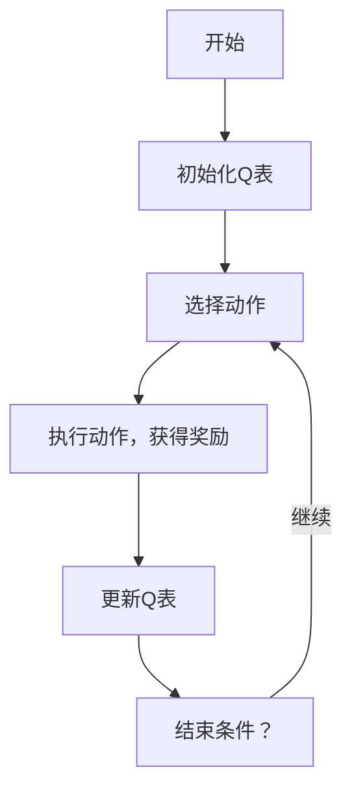
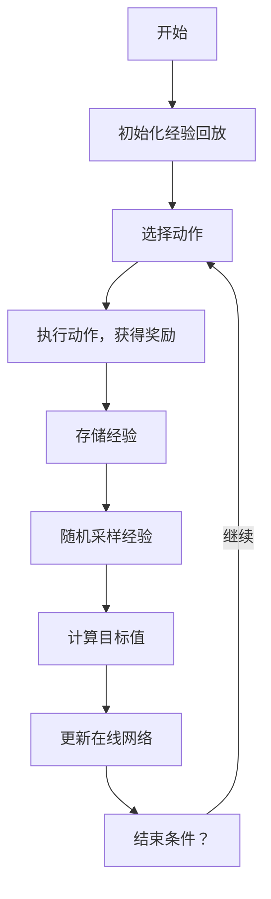
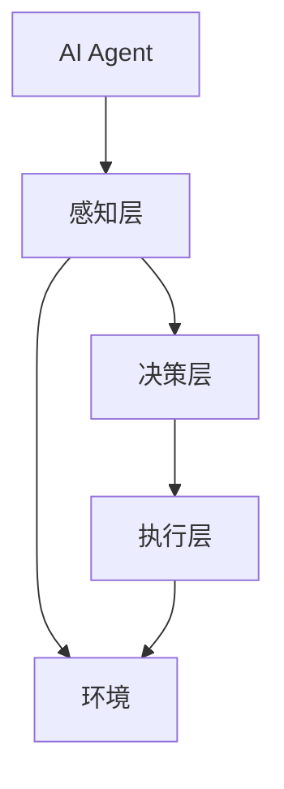
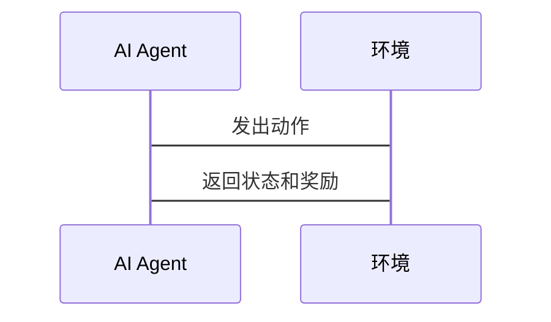

                 


# 强化学习在AI Agent行为优化中的应用

> **关键词**：强化学习、AI Agent、行为优化、Q-learning、DQN、算法实现

> **摘要**：本文深入探讨了强化学习在AI Agent行为优化中的应用，从基础概念到高级算法，结合实际案例分析，详细讲解了如何利用强化学习优化AI Agent的行为决策过程。

---

## 第一部分: 强化学习与AI Agent基础

### 第1章: 强化学习与AI Agent概述

#### 1.1 强化学习的基本概念

**1.1.1 强化学习的定义与特点**

强化学习（Reinforcement Learning, RL）是一种机器学习范式，通过智能体与环境交互，逐步优化其行为策略以最大化累积奖励。与监督学习不同，强化学习不依赖于标记数据，而是通过试错机制学习最优策略。

**1.1.2 AI Agent的基本概念**

AI Agent（人工智能代理）是指能够感知环境并采取行动以实现目标的智能体。AI Agent可以是软件程序或物理机器人，通过感知和行动与环境交互。

**1.1.3 强化学习在AI Agent中的作用**

强化学习为AI Agent提供了一种优化行为决策的方法。通过与环境的交互，AI Agent可以学习如何在复杂环境中做出最优决策，从而实现目标。

#### 1.2 强化学习的核心概念

**1.2.1 状态、动作、奖励的定义**

- **状态（State）**：环境在某一时刻的观测。
- **动作（Action）**：AI Agent在某一状态下采取的行动。
- **奖励（Reward）**：AI Agent采取行动后获得的反馈，用于评估行动的好坏。

**1.2.2 Q值与策略的定义**

- **Q值（Q-value）**：表示在状态s采取动作a后所能获得的期望奖励。
- **策略（Policy）**：决定AI Agent在某一状态下采取哪个动作的规则。

**1.2.3 马尔可夫决策过程（MDP）**

马尔可夫决策过程描述了强化学习的基本框架，包括状态空间、动作空间、转移概率和奖励函数。MDP假设当前状态足够描述未来，无需考虑历史信息。

#### 1.3 强化学习的典型应用场景

- **游戏AI**：如AlphaGo、Dota AI。
- **机器人控制**：如自动驾驶、工业机器人。
- **自动驾驶**：如特斯拉的Autopilot系统。

---

## 第二部分: 强化学习的核心原理

### 第2章: 强化学习的核心原理

#### 2.1 强化学习的基本原理

**2.1.1 奖励机制**

奖励机制是强化学习的核心，通过奖励信号指导AI Agent的学习方向。正向奖励鼓励AI Agent采取正确行为，负向奖励则相反。

**2.1.2 动作选择策略**

- **探索（Exploration）**：尝试新动作以发现更好的策略。
- **利用（Exploitation）**：基于当前知识采取最优动作。

**2.1.3 状态转移模型**

状态转移模型描述了AI Agent在采取某个动作后，环境状态如何变化。强化学习通过学习状态转移模型优化行为策略。

#### 2.2 Q-learning算法

**2.2.1 Q-learning的基本原理**

Q-learning是一种经典的强化学习算法，通过更新Q表中的Q值，学习状态-动作对的最优奖励。

**2.2.2 Q-learning的数学模型**

贝尔曼方程定义了Q值的更新规则：
$$ Q(s, a) = r + \gamma \max_{a'} Q(s', a') $$

其中，$\gamma$是折扣因子，$r$是即时奖励。

**2.2.3 Q-learning的收敛性分析**

Q-learning在无限 episodes 下收敛到最优策略，但收敛速度依赖于探索策略和环境的马尔可夫性质。

#### 2.3 Deep Q-Networks（DQN）

**2.3.1 DQN的基本原理**

DQN将Q值函数近似为深度神经网络，通过经验回放和目标网络优化策略，解决了Q-learning的样本不够多样性和训练不稳定问题。

**2.3.2 DQN的网络结构**

DQN由两个DQN网络组成，一个用于当前策略（在线网络），另一个用于目标值计算（目标网络）。

**2.3.3 DQN的训练过程**

DQN通过经验回放机制训练网络，每一步更新网络参数，逼近最优策略。

---

## 第三部分: 强化学习的算法与实现

### 第3章: 强化学习的算法与实现

#### 3.1 Q-learning算法实现

**3.1.1 算法流程图**



**3.1.2 Python代码实现**

```python
import numpy as np

class QLearning:
    def __init__(self, state_size, action_size, gamma=0.99, learning_rate=0.1):
        self.state_size = state_size
        self.action_size = action_size
        self.gamma = gamma
        self.learning_rate = learning_rate
        self.Q = np.zeros((state_size, action_size))

    def choose_action(self, state, epsilon=0.1):
        if np.random.random() < epsilon:
            return np.random.randint(self.action_size)
        else:
            return np.argmax(self.Q[state, :])

    def update_Q(self, state, action, reward, next_state):
        target = reward + self.gamma * np.max(self.Q[next_state, :])
        self.Q[state, action] += self.learning_rate * (target - self.Q[state, action])
```

**3.1.3 代码解读与分析**

Q-learning算法通过Q表记录状态-动作对的Q值，通过选择动作、执行动作、更新Q值的循环，逐步逼近最优策略。代码实现简单直观，适合处理离散状态和动作空间。

#### 3.2 DQN算法实现

**3.2.1 算法流程图**



**3.2.2 DQN的网络结构**

DQN由两个DQN网络组成，一个用于当前策略（在线网络），另一个用于目标值计算（目标网络）。

**3.2.3 DQN的训练过程**

DQN通过经验回放机制训练网络，每一步更新网络参数，逼近最优策略。

#### 3.3 其他强化学习算法

- **Actor-Critic算法**：同时学习策略和价值函数，通过Actor和Critic网络优化策略。
- **Policy Gradient方法**：直接优化策略参数，通过梯度上升方法寻找最优策略。
- **贝叶斯强化学习**：结合贝叶斯推断，处理不确定性环境中的强化学习问题。

---

## 第四部分: AI Agent的行为优化策略

### 第4章: AI Agent的行为优化策略

#### 4.1 多目标优化

**4.1.1 多目标优化的定义**

多目标优化是指在多个目标之间寻找最优平衡点，避免单一目标优化的局限性。

**4.1.2 多目标强化学习的挑战**

多目标强化学习需要同时优化多个目标，面临目标冲突、目标权重难以确定等挑战。

**4.1.3 解决方案与实例分析**

- **帕累托优化**：寻找非支配解集，实现多目标优化。
- **权重分配**：通过调整目标权重，实现多目标优化。
- **实例分析**：以自动驾驶为例，多目标优化可以平衡安全性、舒适性和效率。

---

## 第五部分: 系统设计与架构

### 第5章: 系统设计与架构

#### 5.1 系统功能设计

- **领域模型**：定义系统的核心实体及其关系，例如AI Agent、环境、动作、状态等。
- **系统架构**：设计系统的分层架构，包括感知层、决策层和执行层。

#### 5.2 系统架构设计



#### 5.3 系统接口设计

- **输入接口**：接收环境状态信息。
- **输出接口**：输出AI Agent的动作指令。

#### 5.4 系统交互设计



---

## 第六部分: 项目实战

### 第6章: 项目实战

#### 6.1 环境配置

- **安装依赖**：如Python、TensorFlow、OpenAI Gym等。
- **环境搭建**：配置强化学习实验环境，如OpenAI Gym。

#### 6.2 系统核心实现源代码

```python
import gym
import numpy as np

env = gym.make('CartPole-v0')
env.seed(42)

class DQN:
    def __init__(self, state_size, action_size, gamma=0.99, epsilon=0.1):
        self.state_size = state_size
        self.action_size = action_size
        self.gamma = gamma
        self.epsilon = epsilon
        self.Q = np.zeros((state_size, action_size))

    def choose_action(self, state):
        if np.random.random() < self.epsilon:
            return np.random.randint(self.action_size)
        else:
            return np.argmax(self.Q[state, :])

    def update_Q(self, state, action, reward, next_state):
        target = reward + self.gamma * np.max(self.Q[next_state, :])
        self.Q[state, action] += self.learning_rate * (target - self.Q[state, action])
```

#### 6.3 代码应用解读与分析

代码实现了一个简单的DQN算法，应用于CartPole环境，通过不断学习优化AI Agent的行为策略，使其能够在环境中保持平衡。

#### 6.4 实际案例分析

以自动驾驶为例，分析如何通过强化学习优化AI Agent的决策过程，如加速、减速和转向等动作。

#### 6.5 项目总结

项目展示了如何通过强化学习优化AI Agent的行为策略，验证了强化学习在实际应用中的有效性。

---

## 第七部分: 总结与展望

### 第7章: 总结与展望

#### 7.1 总结

强化学习为AI Agent的行为优化提供了一种有效的方法，通过不断试错和学习，优化行为策略以实现最优目标。

#### 7.2 研究热点与未来趋势

- **多目标优化**：解决复杂环境中的多目标决策问题。
- **分布式强化学习**：通过分布式计算提高学习效率。
- **元强化学习**：学习如何学习，提高适应性和通用性。

#### 7.3 最佳实践 tips

- **环境设计**：合理设计环境和奖励机制，确保学习目标明确。
- **算法选择**：根据问题特点选择合适的算法，如Q-learning、DQN等。
- **参数调优**：合理设置算法参数，如学习率、折扣因子等。

---

## 参考文献

- 《深度强化学习（Deep Reinforcement Learning）》
- 《强化学习：理论与算法》
- 《AI Agent与智能体设计》

---

**声明**：本文为技术博客文章，版权归作者所有，转载请注明出处。

