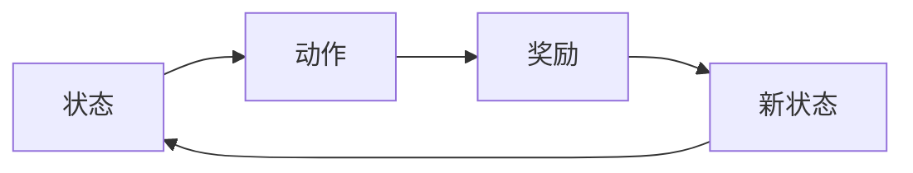
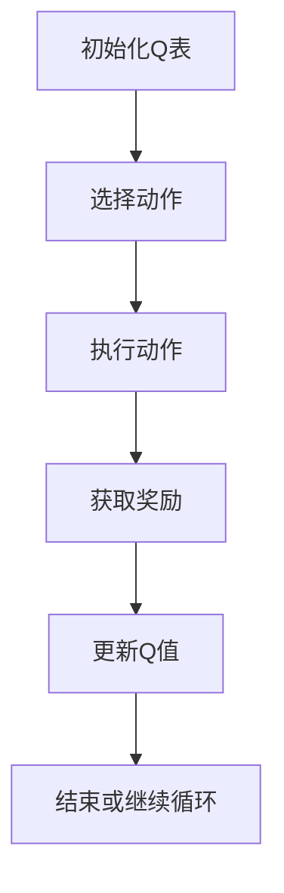
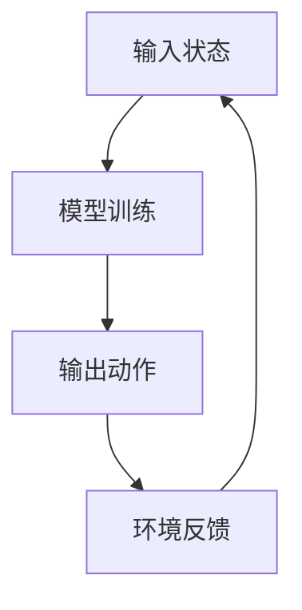

                 


# 强化学习：通过奖励机制改进AI Agent

> 关键词：强化学习，奖励机制，AI Agent，Q-learning，Deep Q-Network，马尔可夫决策过程（MDP）

> 摘要：强化学习是一种通过奖励机制来优化AI代理（Agent）行为的机器学习方法。本文将从强化学习的核心概念、算法原理、系统架构设计、数学模型以及项目实战等方面，全面解析如何通过奖励机制改进AI Agent。我们将从基础理论到实际应用，详细探讨强化学习的各个方面，包括其在游戏AI、机器人控制和自然语言处理等领域的应用。

---

# 第一部分: 强化学习概述

## 第1章: 强化学习的背景与核心概念

### 1.1 强化学习的定义与核心要素

#### 1.1.1 什么是强化学习
强化学习（Reinforcement Learning, RL）是一种机器学习范式，其中AI代理通过与环境交互，学习如何采取一系列动作以最大化累积奖励。与监督学习和无监督学习不同，强化学习依赖于即时反馈（奖励或惩罚）来指导学习过程。

#### 1.1.2 强化学习的核心要素
1. **状态（State）**：代理所处的环境情况。
2. **动作（Action）**：代理在给定状态下采取的行为。
3. **奖励（Reward）**：代理在采取动作后获得的反馈，用于指导学习。
4. **策略（Policy）**：决定代理在某个状态下采取什么动作的规则。
5. **值函数（Value Function）**：衡量某个状态或动作的好坏程度。

#### 1.1.3 强化学习与监督学习的区别
| 方面         | 监督学习                     | 强化学习                     |
|--------------|------------------------------|------------------------------|
| 数据来源     | 标签化的数据集               | 环境的即时反馈（奖励）         |
| 目标函数     | 最小化预测误差               | 最大化累积奖励               |
| 动作选择     | 预测确定性输出               | 学习最优策略                 |

### 1.2 强化学习的核心框架：马尔可夫决策过程（MDP）

#### 1.2.1 MDP的定义
马尔可夫决策过程是一种数学模型，描述了强化学习问题中的环境、状态、动作和奖励的关系。MDP由以下五个元组定义：
- **S**：所有可能的状态集合。
- **A**：所有可能的动作集合。
- **P(s', r | s, a)**：从状态s采取动作a后，进入状态s'并获得奖励r的概率分布。
- **γ**：折扣因子，用于平衡当前奖励和未来奖励的重要性。
- **R**：奖励函数，定义在状态s和动作a下获得的奖励。

#### 1.2.2 策略与值函数的定义
- **策略（Policy）**：策略π(a|s)表示在状态s下采取动作a的概率。
- **值函数（Value Function）**：
  - **状态值函数（V(s)）**：在状态s下，按照策略π行动所能获得的期望累积奖励。
  - **动作值函数（Q(s,a)）**：在状态s下采取动作a后，按照策略π行动所能获得的期望累积奖励。

#### 1.2.3 探索与利用的权衡
- **探索（Exploration）**：尝试不同的动作以发现更好的策略。
- **利用（Exploitation）**：根据当前知识采取最优动作以获得最大奖励。
- **平衡探索与利用**：避免陷入局部最优，同时提高学习效率。

### 1.3 强化学习的应用场景

#### 1.3.1 游戏AI
强化学习在游戏AI中的应用最为广泛，例如AlphaGo、DeepMind在《星际争霸II》中的应用。

#### 1.3.2 机器人控制
强化学习可以用于训练机器人在复杂环境中完成任务，例如自动驾驶和工业机器人。

#### 1.3.3 自然语言处理
强化学习在对话系统、文本摘要和机器翻译等领域也有广泛应用。

---

## 第2章: 强化学习的核心概念与联系

### 2.1 强化学习的核心原理

#### 2.1.1 奖励机制的作用
奖励机制是强化学习的核心，决定了代理行为的优化方向。奖励函数的设计直接影响学习效果。

#### 2.1.2 动作选择与策略优化
- **随机策略**：随机选择动作，通常用于探索阶段。
- **确定性策略**：选择最优动作，通常用于利用阶段。

#### 2.1.3 长期目标与即时奖励的平衡
强化学习通过折扣因子γ平衡当前奖励和未来奖励的重要性，γ的取值范围是[0,1]。

### 2.2 强化学习的核心概念对比

#### 2.2.1 策略与值函数的对比
| 方面         | 策略（Policy）         | 值函数（Value Function）     |
|--------------|-----------------------|-----------------------------|
| 定义         | 动作选择规则           | 状态或动作的期望奖励         |
| 作用         | 指导动作选择           | 评估状态或动作的价值         |
| 表示方式     | π(a|s)                | V(s) 或 Q(s,a)              |

#### 2.2.2 探索与利用的权衡
| 方面         | 探索                   | 利用                   |
|--------------|-----------------------|---------------------------|
| 定义         | 尝试新动作             | 利用已知最佳动作           |
| 目的         | 发现更好的策略         | 提高当前奖励              |
| 方法         | 随机选择动作           | 选择最优动作             |

#### 2.2.3 状态转移与动作选择的关系
状态转移由环境决定，动作选择由策略决定。两者共同作用，影响代理的累积奖励。

### 2.3 强化学习的ER实体关系图



---

## 第3章: 强化学习的算法原理

### 3.1 Q-learning算法

#### 3.1.1 Q-learning的基本原理
Q-learning是一种经典的强化学习算法，适用于离散状态和动作空间。其核心思想是通过更新Q表（Q-table）来学习状态-动作对的值函数。

#### 3.1.2 Q-learning的更新公式
$$ Q(s,a) = Q(s,a) + \alpha [r + \gamma \max_{a'} Q(s',a') - Q(s,a)] $$

#### 3.1.3 Q-learning的收敛性分析
- **收敛条件**：学习率α趋近于0，且满足渐进性条件。
- **优点**：简单易实现，适用于离散问题。
- **缺点**：难以扩展到连续状态和动作空间。

### 3.2 Deep Q-Network（DQN）算法

#### 3.2.1 DQN的网络结构
DQN通过深度神经网络近似Q函数，适用于连续状态和动作空间。其网络结构通常包括输入层、隐藏层和输出层。

#### 3.2.2 DQN的训练流程



#### 3.2.3 DQN的优缺点
- **优点**：能够处理高维状态空间，适用于复杂任务。
- **缺点**：需要大量训练数据，训练时间较长。

### 3.3 算法流程图


---

## 第4章: 强化学习的数学模型与公式

### 4.1 贝尔曼方程

#### 4.1.1 状态值函数的贝尔曼方程
$$ V(s) = \max_a Q(s,a) $$

#### 4.1.2 动作值函数的贝尔曼方程
$$ Q(s,a) = r + \gamma \max_{a'} Q(s',a') $$

### 4.2 策略梯度方法

#### 4.2.1 策略梯度的基本思想
策略梯度方法通过优化策略的参数θ来最大化累积奖励。其梯度公式为：
$$ \nabla J(\theta) = \mathbb{E}[ \nabla \log \pi_\theta(a|s) Q(s,a) ] $$

#### 4.2.2 策略梯度的优化步骤
1. 计算策略梯度。
2. 更新策略参数。
3. 重复直到收敛。

---

## 第5章: 强化学习的系统架构设计

### 5.1 系统架构设计

#### 5.1.1 系统功能设计
- **输入处理**：接收环境的状态和动作。
- **模型训练**：更新Q函数或策略。
- **输出决策**：根据当前状态输出最优动作。

#### 5.1.2 系统架构图



---

## 第6章: 强化学习的项目实战

### 6.1 环境安装与配置

#### 6.1.1 安装Python和依赖库
```bash
pip install numpy gym matplotlib
```

#### 6.1.2 配置强化学习环境
```python
import gym
env = gym.make('CartPole-v1')
env.reset()
```

### 6.2 核心代码实现

#### 6.2.1 Q-learning算法实现
```python
import numpy as np

class QLearning:
    def __init__(self, state_space, action_space, gamma=0.99, epsilon=0.1):
        self.state_space = state_space
        self.action_space = action_space
        self.gamma = gamma
        self.epsilon = epsilon
        self.q_table = np.zeros((state_space, action_space))

    def choose_action(self, state):
        if np.random.random() < self.epsilon:
            return np.random.randint(self.action_space)
        else:
            return np.argmax(self.q_table[state])

    def learn(self, state, action, reward, next_state):
        target = reward + self.gamma * np.max(self.q_table[next_state])
        self.q_table[state][action] = target
```

#### 6.2.2 DQN算法实现
```python
import torch
import torch.nn as nn

class DQN(nn.Module):
    def __init__(self, input_dim, output_dim):
        super(DQN, self).__init__()
        self.fc1 = nn.Linear(input_dim, 64)
        self.fc2 = nn.Linear(64, output_dim)

    def forward(self, x):
        x = torch.relu(self.fc1(x))
        x = torch.relu(self.fc2(x))
        return x
```

### 6.3 案例分析与详细讲解

#### 6.3.1 游戏AI案例
使用Q-learning训练AI代理在CartPole游戏中保持平衡。

#### 6.3.2 机器人控制案例
使用DQN算法训练机器人在复杂环境中完成任务。

---

## 第7章: 最佳实践与小结

### 7.1 最佳实践
- **奖励函数设计**：奖励函数应明确指导学习方向。
- **探索与利用的平衡**：避免过早收敛到局部最优。
- **模型选择**：根据任务特点选择合适算法。

### 7.2 小结
本文从强化学习的核心概念、算法原理、系统架构设计到项目实战，全面解析了如何通过奖励机制改进AI Agent。通过本文的学习，读者可以掌握强化学习的核心思想，并能够将其应用于实际问题中。

### 7.3 注意事项
- **计算资源**：强化学习需要大量计算资源。
- **数据处理**：确保数据质量和数量。
- **算法调优**：根据具体任务调整超参数。

### 7.4 拓展阅读
- **书籍推荐**：《Reinforcement Learning: Theory and Algorithms》
- **论文推荐**：DeepMind的DQN论文和OpenAI的策略梯度方法论文。

---

通过本文的学习，读者可以系统地掌握强化学习的核心知识，并能够将其应用到实际问题中。

