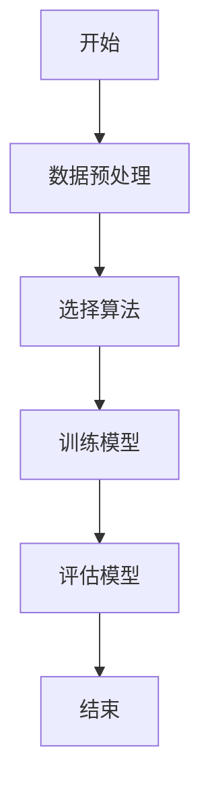
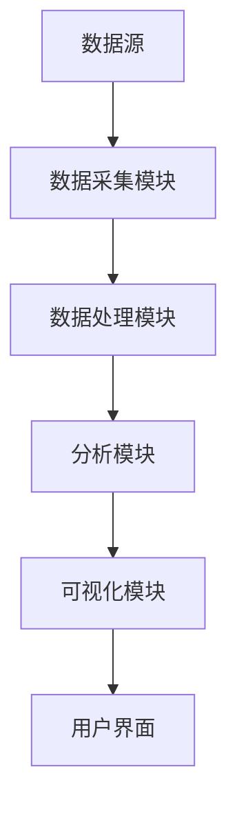

                 


# 彼得林奇如何分析公司的客户细分策略演变

## 关键词：
- 彼得林奇
- 客户细分
- 策略演变
- 企业价值
- 数据分析

## 摘要：
本文深入探讨彼得·林奇如何分析公司客户细分策略的演变过程。从背景介绍到数学模型，从系统架构到项目实战，系统阐述客户细分策略对企业价值的影响，以及如何通过现代数据分析技术优化客户细分策略。

---

# 第一部分：客户细分策略的背景与演变

## 第1章：客户细分策略的定义与背景

### 1.1 客户细分的定义
- **1.1.1 客户细分的基本概念**  
  客户细分是将客户按特定标准划分为不同群体的过程。每个群体具有相似的需求、行为或特征，以便企业更精准地制定营销策略。

- **1.1.2 客户细分的演变历程**  
  从传统的地理和人口统计细分，到现代的数据驱动分析，客户细分经历了从简单到复杂、从定性到定量的演变。

- **1.1.3 客户细分与企业战略的关系**  
  客户细分不仅是营销手段，更是企业战略的重要组成部分，直接影响市场定位和资源分配。

### 1.2 彼得林奇的分析框架
- **1.2.1 彼得林奇的客户细分视角**  
  彼得林奇认为，客户细分的核心在于识别高价值客户，优化资源配置。

- **1.2.2 林奇分析方法的核心要素**  
  通过分析客户行为、需求和价值，识别关键客户群体，评估其对企业的贡献。

- **1.2.3 林奇分析框架对企业的影响**  
  通过精准客户细分，企业可以提高客户满意度和忠诚度，增强市场竞争力。

## 第2章：客户细分策略的演变过程

### 2.1 传统客户细分方法
- **2.1.1 基于地理、人口统计的细分**  
  按照地理位置、年龄、性别等基本特征划分客户群体。

- **2.1.2 基于行为数据的传统分析**  
  分析客户的购买频率、金额等行为数据，初步细分客户群体。

- **2.1.3 传统方法的局限性**  
  数据来源单一，分析维度有限，难以捕捉客户深层需求。

### 2.2 现代客户细分策略
- **2.2.1 数据驱动的客户细分**  
  利用大数据和AI技术，从海量数据中提取客户特征，进行更精准的细分。

- **2.2.2 利用AI和大数据的现代方法**  
  通过机器学习算法，如聚类分析，自动识别客户群体的相似性。

- **2.2.3 现代策略的优势与挑战**  
  优势：数据全面，分析精准；挑战：数据处理复杂，计算成本高。

---

# 第二部分：客户细分策略的核心概念与分析

## 第3章：客户细分的核心概念

### 3.1 客户细分的类型
- **3.1.1 按行为细分**  
  根据客户的购买行为，如频率、金额等进行细分。

- **3.1.2 按需求细分**  
  根据客户的需求层次，如基本需求、情感需求等进行细分。

- **3.1.3 按价值细分**  
  根据客户为企业创造的价值，如利润贡献度进行细分。

### 3.2 影响客户细分的因素
- **3.2.1 市场趋势**  
  市场环境的变化影响客户细分的标准和方法。

- **3.2.2 企业目标**  
  企业的战略目标决定客户细分的具体维度。

- **3.2.3 客户特征**  
  包括人口统计、心理特征、行为习惯等。

## 第4章：客户细分与企业价值的关系

### 4.1 客户细分对企业价值的影响
- **4.1.1 提高客户满意度**  
  通过精准细分，提供个性化服务，提升客户满意度。

- **4.1.2 增强市场适应能力**  
  根据客户需求变化，快速调整市场策略。

- **4.1.3 优化资源配置**  
  将资源集中在高价值客户群体，提高投资回报率。

### 4.2 彼得林奇的客户价值评估
- **4.2.1 客户价值评分模型**  
  通过权重和评分系统，评估客户的价值，识别高价值客户。

- **4.2.2 评估方法与步骤**  
  数据收集、模型构建、评估结果分析。

- **4.2.3 案例分析**  
  以某零售企业为例，展示如何通过客户细分提高企业价值。

---

# 第三部分：客户细分策略的数学模型与算法

## 第5章：客户细分的分类算法

### 5.1 常见的分类算法
- **5.1.1 K均值聚类**  
  将客户分为K个簇，每个簇内的客户具有相似特征。

- **5.1.2 层次聚类**  
  通过层次结构将客户逐步细分，形成树状结构。

- **5.1.3 线性判别分析**  
  基于线性模型，将客户分为不同类别。

### 5.2 算法流程图


## 第6章：数学模型与公式

### 6.1 客户价值评分模型
$$ CV = \sum_{i=1}^{n} w_i x_i $$
- 其中，\( w_i \) 是权重，\( x_i \) 是客户特征。

### 6.2 客户生命周期价值模型
$$ CLV = \sum_{t=1}^{T} \text{贡献度}_t \times \text{留存概率}_t $$

### 6.3 示例计算
- 客户A：年龄30岁，收入50万，购买频率高，评分权重为0.4。
- 客户B：年龄25岁，收入30万，购买频率低，评分权重为0.2。

---

# 第四部分：系统分析与架构设计

## 第7章：系统分析与架构设计方案

### 7.1 问题场景介绍
- 客户细分系统需要处理大量数据，快速分析，实时反馈。

### 7.2 系统架构设计


### 7.3 系统功能设计
- 数据采集：从数据库获取客户数据。
- 数据处理：清洗、转换数据。
- 分析模块：应用聚类算法，生成客户细分结果。
- 可视化模块：展示分析结果，方便用户理解。

---

# 第五部分：项目实战

## 第8章：项目实战与案例分析

### 8.1 环境安装
- 安装Python、机器学习库（如scikit-learn）、可视化工具（如Matplotlib）。

### 8.2 核心实现代码
```python
from sklearn.cluster import KMeans
import pandas as pd
import numpy as np

# 数据预处理
data = pd.read_csv('customers.csv')
data = data.dropna()
data = pd.get_dummies(data)

# 模型训练
model = KMeans(n_clusters=3, random_state=42)
model.fit(data)

# 可视化
import matplotlib.pyplot as plt
plt.scatter(data['age'], data['income'], c=model.labels_)
plt.xlabel('Age')
plt.ylabel('Income')
plt.show()
```

### 8.3 结果解读
- 通过K均值聚类，将客户分为3个群体：高收入年轻群体、中收入中年群体、低收入老年群体。

### 8.4 优化建议
- 根据细分结果，制定针对性营销策略，如针对高收入群体推出高端产品。

---

# 第六部分：总结与展望

## 第9章：最佳实践与小结

### 9.1 最佳实践
- 定期更新客户数据，保持分析的准确性。
- 组合使用多种算法，提高细分的准确性。

### 9.2 小结
通过客户细分策略的演变和数据分析技术的应用，企业可以更精准地识别高价值客户，优化资源配置，提升整体价值。

### 9.3 注意事项
- 数据隐私保护
- 模型的可解释性
- 持续监控与优化

### 9.4 拓展阅读
- 推荐书籍：《客户关系管理》、《数据分析实战》
- 在线课程：Coursera上的数据分析课程

---

通过以上步骤，我们系统地分析了彼得林奇如何通过客户细分策略的演变提升企业价值，并结合实际案例展示了如何应用现代数据分析技术优化客户细分策略。

