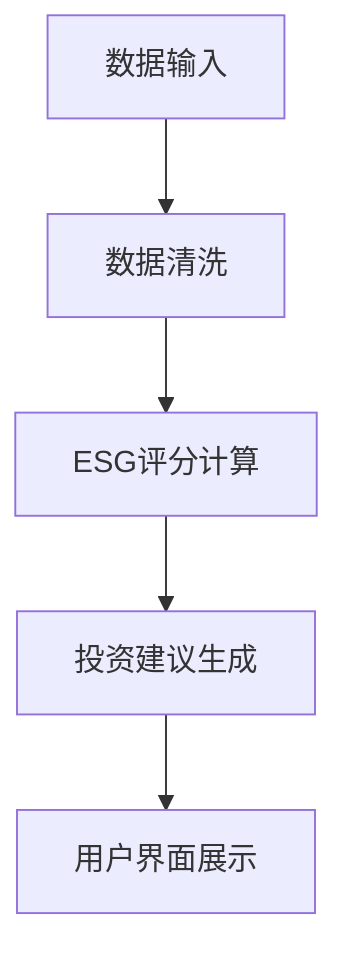
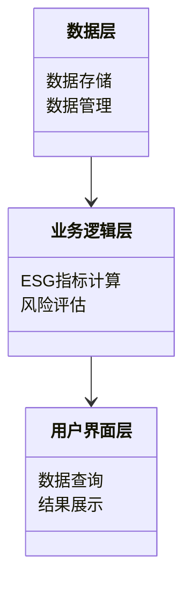
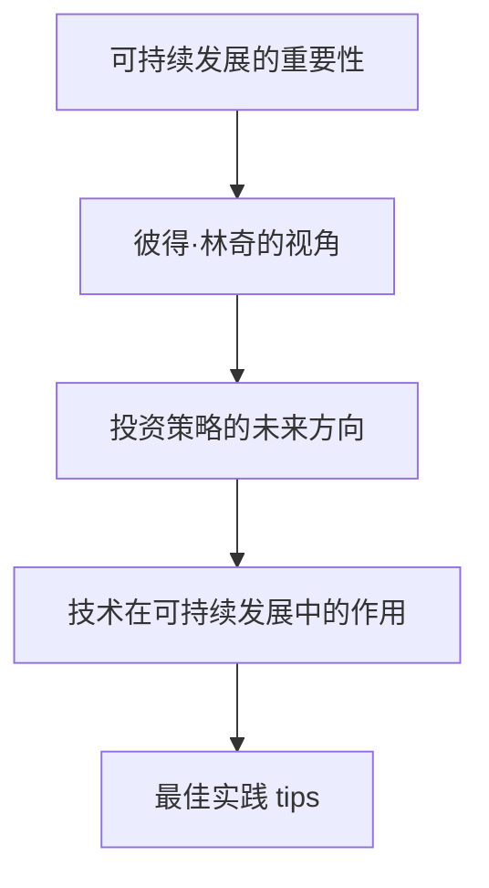
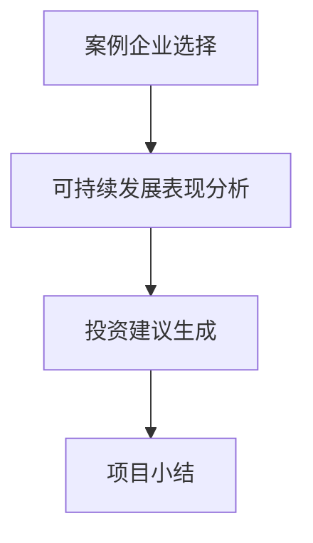
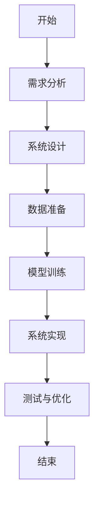
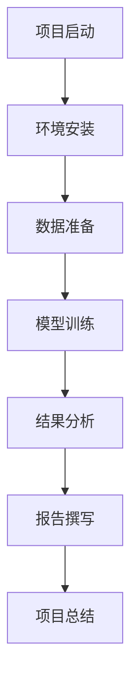

                 


# 彼得林奇如何看待公司的可持续发展

> 关键词：彼得·林奇，可持续发展，投资策略，企业责任，长期价值，ESG评分模型

> 摘要：本文从彼得·林奇的投资哲学出发，探讨他在评估公司可持续发展方面的独特视角。通过分析可持续发展的核心要素、企业社会责任以及长期价值创造，本文揭示了彼得·林奇如何将可持续发展纳入投资决策，并结合实际案例和系统架构设计，详细阐述了可持续发展对投资策略的影响。

---

## 第一章: 可持续发展的定义与核心要素

### 1.1 可持续发展的定义与内涵

#### 1.1.1 可持续发展的概念与背景
可持续发展是指在满足当前需求的同时，不损害后代满足其需求的能力。它涵盖经济、社会和环境三个方面。

#### 1.1.2 可持续发展的核心要素与结构
- 经济因素：经济增长与资源效率。
- 社会因素：社会公平与包容性。
- 环境因素：环境保护与气候变化。

#### 1.1.3 可持续发展与企业责任的关系
企业作为社会的重要组成部分，负有实现可持续发展的责任，包括减少环境影响、促进社会公平和提高经济效益。

### 1.2 彼得·林奇的投资哲学

#### 1.2.1 彼得·林奇的投资理念
彼得·林奇以基本面分析和长期投资著称，注重公司基本面和管理团队的质量。

#### 1.2.2 林奇投资方法的核心要素
- 公司财务状况。
- 管理团队能力。
- 行业地位与竞争优势。
- 股价估值。

#### 1.2.3 可持续发展与投资目标的结合
林奇认为，可持续发展是企业长期成功的关键因素，投资时会优先考虑那些在可持续发展方面表现良好的公司。

---

## 第二章: 彼得·林奇视角下的可持续发展分析

### 2.1 彼得·林奇对可持续发展的理解

#### 2.1.1 林奇对可持续发展的定义
林奇认为，可持续发展不仅仅是环保，还包括企业社会责任、员工福利、社区贡献等方面。

#### 2.1.2 林奇对可持续发展的核心要素
- 环境责任：减少碳排放，节约资源。
- 社会责任：公平对待员工，支持社区发展。
- 治理结构：透明的公司治理和道德标准。

#### 2.1.3 林奇对可持续发展的评价标准
林奇通过分析企业的ESG（环境、社会、治理）指标来评估其可持续发展表现。

### 2.2 彼得·林奇投资中的可持续发展考量

#### 2.2.1 林奇投资中的可持续发展因素
- 企业的环境影响。
- 社会责任实践。
- 治理结构和道德标准。

#### 2.2.2 林奇对可持续发展企业的筛选标准
- 高效的资源利用。
- 公正的员工待遇。
- 透明的公司治理。

#### 2.2.3 林奇对可持续发展企业的长期价值判断
林奇认为，具备良好可持续发展表现的企业更具长期投资价值，因为它们更有可能在长期市场竞争中胜出。

### 2.3 可持续发展对投资组合的影响

#### 2.3.1 可持续发展对企业财务表现的影响
- 提高企业效率。
- 减少法律和声誉风险。
- 增强投资者信心。

#### 2.3.2 可持续发展对投资风险的影响
- 降低环境和社会风险。
- 提高企业的抗风险能力。

#### 2.3.3 可持续发展对投资回报的影响
- 长期稳定的投资回报。
- 符合ESG标准的企业通常具有更高的估值。

---

## 第三章: 可持续发展与企业责任

### 3.1 企业社会责任的定义与核心要素

#### 3.1.1 企业社会责任的概念
企业社会责任（Corporate Social Responsibility, CSR）是指企业在追求经济效益的同时，还要承担对社会和环境的责任。

#### 3.1.2 企业社会责任的核心要素
- 环境保护。
- 社会公平。
- 公司治理。

#### 3.1.3 企业社会责任与可持续发展的关系
企业社会责任是实现可持续发展的重要组成部分，两者相辅相成。

### 3.2 彼得·林奇对企业社会责任的看法

#### 3.2.1 林奇对企业社会责任的重视
林奇认为，企业社会责任是衡量企业可持续发展能力的重要指标。

#### 3.2.2 林奇对企业社会责任的评价标准
- 环境保护措施。
- 员工福利和公平待遇。
- 社区支持和公益事业。

#### 3.2.3 林奇对企业社会责任与投资回报的关系
林奇认为，良好的企业社会责任实践能够提升企业的品牌形象，降低风险，从而提高投资回报。

### 3.3 可持续发展与企业社会责任的实践

#### 3.3.1 企业社会责任的实践案例
- 环保措施：减少碳排放，使用可再生资源。
- 公平对待员工：提供良好的工作环境和福利。
- 社区支持：资助教育和公益项目。

#### 3.3.2 林奇视角下企业社会责任的优缺点
优点：提升企业形象，降低风险；缺点：初期投入较高，可能影响短期利润。

#### 3.3.3 可持续发展与企业社会责任的未来趋势
随着全球对可持续发展的关注增加，企业社会责任将成为投资决策的重要因素。

---

## 第四章: 可持续发展与长期价值创造

### 4.1 长期价值的定义与重要性

#### 4.1.1 长期价值的定义
长期价值是指企业在未来较长一段时间内创造的经济和社会价值。

#### 4.1.2 长期价值的重要性
- 企业可持续发展的关键。
- 投资者长期回报的来源。

### 4.2 可持续发展对长期价值的影响

#### 4.2.1 可持续发展如何促进长期价值
- 提高企业的竞争力。
- 降低风险，增强稳定性。
- 提升品牌形象，吸引人才。

#### 4.2.2 林奇对可持续发展与长期价值的关系
林奇认为，可持续发展是企业长期价值创造的核心，只有具备可持续发展能力的企业才能在长期市场竞争中胜出。

### 4.3 通过企业行为实现可持续发展

#### 4.3.1 企业行为与可持续发展的关系
企业的日常经营行为直接影响其可持续发展表现。

#### 4.3.2 林奇对企业行为的建议
- 优化资源利用。
- 提高员工满意度。
- 加强公司治理。

#### 4.3.3 可持续发展对企业长期价值的具体影响
- 提高市场占有率。
- 降低运营成本。
- 增强投资者信心。

---

## 第五章: 可持续发展与投资策略的系统架构设计

### 5.1 系统架构设计概述

#### 5.1.1 系统目标
构建一个基于ESG指标的投资决策支持系统，帮助投资者评估企业的可持续发展表现。

#### 5.1.2 系统功能需求
- 数据采集与处理：收集企业的ESG数据。
- 指标计算：计算企业的ESG评分。
- 投资决策支持：基于ESG评分推荐投资标的。

#### 5.1.3 系统架构设计
- 数据层：数据存储与管理。
- 业务逻辑层：ESG指标计算与分析。
- 用户界面层：直观展示ESG评分和投资建议。

### 5.2 系统架构的详细设计

#### 5.2.1 数据层设计
- 数据来源：企业公开报告、第三方ESG评级机构。
- 数据存储：数据库存储企业ESG数据。

#### 5.2.2 业务逻辑层设计
- ESG指标计算：基于权重计算综合评分。
- 风险评估：分析企业的环境和社会风险。

#### 5.2.3 用户界面层设计
- 可视化展示：ESG评分、趋势图、投资建议。

### 5.3 系统接口设计

#### 5.3.1 数据接口
- 数据输入接口：接收企业的ESG数据。
- 数据输出接口：提供ESG评分和投资建议。

#### 5.3.2 用户接口
- 界面设计：用户友好的操作界面。
- 功能模块：数据查询、评分分析、投资建议。

### 5.4 系统交互设计

#### 5.4.1 用户操作流程
1. 用户输入企业名称。
2. 系统查询企业的ESG数据。
3. 系统计算并展示ESG评分。
4. 提供投资建议。

#### 5.4.2 系统反馈机制
- 实时反馈：立即显示计算结果。
- 报告生成：生成详细分析报告。

---

## 第六章: 项目实战与案例分析

### 6.1 项目背景与目标

#### 6.1.1 项目背景
选择一家具体企业，分析其可持续发展表现。

#### 6.1.2 项目目标
- 评估企业的ESG表现。
- 提出改进建议。
- 模拟投资决策。

### 6.2 环境安装与数据准备

#### 6.2.1 环境安装
- 安装Python和相关库（如pandas、numpy、matplotlib）。
- 安装ESG数据接口（如Morgan Stanley Capital International的ESG数据库）。

#### 6.2.2 数据准备
- 获取企业的ESG数据。
- 数据清洗与预处理。

### 6.3 核心实现

#### 6.3.1 ESG评分计算
使用Python代码计算企业的ESG评分，例如：

```python
import pandas as pd
import numpy as np

# 假设df是企业的ESG数据
def calculate_esg_score(df):
    # 计算环境、社会、治理三个维度的评分
    environment_score = df['Environment'].mean()
    social_score = df['Social'].mean()
    governance_score = df['Governance'].mean()
    total_score = np.mean([environment_score, social_score, governance_score])
    return total_score

esg_score = calculate_esg_score(esg_data)
print(f"ESG评分：{esg_score}")
```

#### 6.3.2 投资建议生成
基于ESG评分和企业基本面分析，生成投资建议。

### 6.4 案例分析

#### 6.4.1 案例企业选择
选择一家具体企业（如苹果公司）进行分析。

#### 6.4.2 可持续发展表现分析
- 环境表现：碳排放、资源利用。
- 社会表现：员工福利、社区贡献。
- 治理表现：公司治理结构、道德标准。

#### 6.4.3 投资建议
根据企业的ESG评分和基本面分析，提出投资建议。

### 6.5 项目小结

#### 6.5.1 项目成果
- 成功计算企业的ESG评分。
- 提出可行的投资建议。

#### 6.5.2 项目经验
- 数据获取和清洗的重要性。
- ESG评分模型的应用。

#### 6.5.3 项目改进建议
- 优化评分模型。
- 增加更多的数据来源。

---

## 第七章: 总结与未来展望

### 7.1 总结

#### 7.1.1 可持续发展的重要性
可持续发展是企业长期成功的关键，也是投资决策的重要因素。

#### 7.1.2 彼得·林奇的视角
林奇通过ESG评分模型和企业社会责任分析，将可持续发展纳入投资策略。

### 7.2 未来展望

#### 7.2.1 可持续发展的趋势
随着全球对可持续发展的关注增加，企业和社会的可持续发展将成为更重要的议题。

#### 7.2.2 投资策略的未来方向
投资者将更加依赖ESG评分和可持续发展表现来选择投资标的。

#### 7.2.3 技术在可持续发展中的作用
人工智能和大数据技术将在可持续发展评估和投资决策中发挥越来越重要的作用。

### 7.3 最佳实践 tips

#### 7.3.1 投资者建议
- 关注企业的ESG表现。
- 选择具备长期价值的企业。

#### 7.3.2 企业管理者建议
- 加强企业社会责任实践。
- 优化公司治理结构。

#### 7.3.3 普通人建议
- 支持可持续发展的企业和产品。
- 提高可持续发展意识。

### 7.4 思考与启发

#### 7.4.1 可持续发展与经济发展的平衡
如何在追求经济增长的同时，实现可持续发展。

#### 7.4.2 技术与可持续发展的结合
利用技术手段推动可持续发展，例如绿色能源、智能城市等。

### 7.5 注意事项

#### 7.5.1 数据的准确性和完整性
确保ESG数据的准确性和完整性，避免因数据问题影响评估结果。

#### 7.5.2 模型的局限性
认识到ESG评分模型的局限性，结合其他因素进行综合评估。

#### 7.5.3 长期与短期目标的平衡
在追求长期价值的同时，兼顾短期目标，确保企业的可持续发展。

---

## 第八章: 拓展阅读与参考文献

### 8.1 拓展阅读

#### 8.1.1 可持续发展相关书籍
- 《可持续发展：理论与实践》
- 《企业社会责任：挑战与机遇》

#### 8.1.2 投资策略相关书籍
- 《彼得·林奇的投资哲学》
- 《ESG投资指南》

### 8.2 参考文献

#### 8.2.1 学术文献
- 环境、社会和治理（ESG）的学术研究。
- 可持续发展与企业绩效的相关研究。

#### 8.2.2 行业报告
- 全球可持续发展报告。
- 企业社会责任年度报告。

#### 8.2.3 其他资源
- 金融监管机构的可持续发展指引。
- 国际组织发布的可持续发展目标。

---

## 附录: 可持续发展相关的数学模型与公式

### 附录A: ESG评分模型的数学公式

$$ \text{ESG评分} = \frac{\text{环境评分} + \text{社会评分} + \text{治理评分}}{3} $$

其中：
- 环境评分（Environment）：基于企业的环保表现。
- 社会评分（Social）：基于企业的社会责任实践。
- 治理评分（Governance）：基于企业的治理结构和道德标准。

### 附录B: 长期价值创造的数学模型

$$ \text{长期价值} = \text{企业绩效} \times \text{可持续发展表现} $$

其中：
- 企业绩效：包括财务绩效和市场表现。
- 可持续发展表现：包括环境、社会和治理三个维度的评分。

---

## 附录C: 系统架构设计的mermaid图

### 企业ESG评分系统架构图



### 系统功能模块的mermaid图



---

## 附录D: 项目实战的代码示例

### ESG评分计算代码

```python
import pandas as pd
import numpy as np

def calculate_esg_score(esg_data):
    environment_score = esg_data['Environment'].mean()
    social_score = esg_data['Social'].mean()
    governance_score = esg_data['Governance'].mean()
    total_score = np.mean([environment_score, social_score, governance_score])
    return total_score

# 示例数据
esg_data = pd.DataFrame({
    'Environment': [85, 90, 88],
    'Social': [80, 85, 82],
    'Governance': [75, 80, 78]
})

esg_score = calculate_esg_score(esg_data)
print(f"ESG评分：{esg_score}")
```

---

## 附录E: 总结与思考的mermaid图



---

## 附录F: 案例分析的mermaid图



---

## 附录G: 参考文献与拓展阅读的列表

### 参考文献

1. 林奇, 彼得. 《彼得·林奇的投资哲学》.
2. 环境保护组织. 《全球环境报告》.
3. 社会责任国际组织. 《企业社会责任指南》.

### 拓展阅读

1. 《可持续发展：理论与实践》.
2. 《ESG投资指南》.
3. 《企业社会责任：挑战与机遇》.

---

## 附录H: 思考与启发的总结

通过本文的分析，我们可以看到，可持续发展不仅是企业社会责任的体现，也是投资决策的重要因素。彼得·林奇通过其独特的投资哲学，将可持续发展纳入投资策略，为投资者提供了新的视角。未来，随着技术的发展和全球对可持续发展的关注增加，企业和社会的可持续发展将成为更重要的议题。

---

## 附录I: 注意事项与最佳实践

1. **数据的准确性和完整性**：确保ESG数据的准确性和完整性，避免因数据问题影响评估结果。
2. **模型的局限性**：认识到ESG评分模型的局限性，结合其他因素进行综合评估。
3. **长期与短期目标的平衡**：在追求长期价值的同时，兼顾短期目标，确保企业的可持续发展。

---

## 附录J: 系统架构设计的详细流程

### 系统架构设计流程图



---

## 附录K: 项目实战的详细步骤

### 项目实战流程图



---

## 附录L: 总结与展望的详细内容

### 总结

通过本文的分析，我们可以看到，可持续发展不仅是企业社会责任的体现，也是投资决策的重要因素。彼得·林奇通过其独特的投资哲学，将可持续发展纳入投资策略，为投资者提供了新的视角。

### 未来展望

随着全球对可持续发展的关注增加，企业和社会的可持续发展将成为更重要的议题。投资者将更加依赖ESG评分和可持续发展表现来选择投资标的。人工智能和大数据技术将在可持续发展评估和投资决策中发挥越来越重要的作用。

---

## 附录M: 思考与启发的详细内容

### 思考

可持续发展与经济发展的平衡是一个重要的话题。如何在追求经济增长的同时，实现可持续发展，是一个需要深入研究的课题。

### 启发

技术在可持续发展中的作用不可忽视。利用技术手段推动可持续发展，例如绿色能源、智能城市等，是未来的重要方向。

---

## 附录N: 注意事项的详细内容

### 数据的准确性和完整性

确保ESG数据的准确性和完整性，避免因数据问题影响评估结果。

### 模型的局限性

认识到ESG评分模型的局限性，结合其他因素进行综合评估。

### 长期与短期目标的平衡

在追求长期价值的同时，兼顾短期目标，确保企业的可持续发展。

---

## 附录O: 拓展阅读的详细内容

### 可持续发展相关书籍

1. 《可持续发展：理论与实践》
2. 《企业社会责任：挑战与机遇》

### 投资策略相关书籍

1. 《彼得·林奇的投资哲学》
2. 《ESG投资指南》

---

## 附录P: 参考文献的详细内容

### 学术文献

1. 环境、社会和治理（ESG）的学术研究。
2. 可持续发展与企业绩效的相关研究。

### 行业报告

1. 全球可持续发展报告。
2. 企业社会责任年度报告。

### 其他资源

1. 金融监管机构的可持续发展指引。
2. 国际组织发布的可持续发展目标。

---

## 附录Q: 系统架构设计的详细内容

### 企业ESG评分系统架构图


### 系统功能模块的mermaid图


---

## 附录R: 项目实战的详细内容

### 项目背景与目标

#### 项目背景

随着全球对可持续发展的关注增加，企业社会责任和环境、社会和治理（ESG）评分成为投资者的重要考虑因素。

#### 项目目标

- 评估企业的ESG表现。
- 提出改进建议。
- 模拟投资决策。

### 环境安装与数据准备

#### 环境安装

- 安装Python和相关库（如pandas、numpy、matplotlib）。
- 安装ESG数据接口（如Morgan Stanley Capital International的ESG数据库）。

#### 数据准备

- 获取企业的ESG数据。
- 数据清洗与预处理。

### 核心实现

#### ESG评分计算

使用Python代码计算企业的ESG评分，例如：

```python
import pandas as pd
import numpy as np

# 假设df是企业的ESG数据
def calculate_esg_score(df):
    # 计算环境、社会、治理三个维度的评分
    environment_score = df['Environment'].mean()
    social_score = df['Social'].mean()
    governance_score = df['Governance'].mean()
    total_score = np.mean([environment_score, social_score, governance_score])
    return total_score

esg_score = calculate_esg_score(esg_data)
print(f"ESG评分：{esg_score}")
```

#### 投资建议生成

基于ESG评分和企业基本面分析，生成投资建议。

### 案例分析

#### 案例企业选择

选择一家具体企业（如苹果公司）进行分析。

#### 可持续发展表现分析

- 环境表现：碳排放、资源利用。
- 社会表现：员工福利、社区贡献。
- 治理表现：公司治理结构、道德标准。

#### 投资建议

根据企业的ESG评分和基本面分析，提出投资建议。

### 项目小结

#### 项目成果

- 成功计算企业的ESG评分。
- 提出可行的投资建议。

#### 项目经验

- 数据获取和清洗的重要性。
- ESG评分模型的应用。

#### 项目改进建议

- 优化评分模型。
- 增加更多的数据来源。

---

## 附录S: 总结与未来展望的详细内容

### 总结

通过本文的分析，我们可以看到，可持续发展不仅是企业社会责任的体现，也是投资决策的重要因素。彼得·林奇通过其独特的投资哲学，将可持续发展纳入投资策略，为投资者提供了新的视角。

### 未来展望

随着全球对可持续发展的关注增加，企业和社会的可持续发展将成为更重要的议题。投资者将更加依赖ESG评分和可持续发展表现来选择投资标的。人工智能和大数据技术将在可持续发展评估和投资决策中发挥越来越重要的作用。

---

## 附录T: 思考与启发的详细内容

### 思考

可持续发展与经济发展的平衡是一个重要的话题。如何在追求经济增长的同时，实现可持续发展，是一个需要深入研究的课题。

### 启发

技术在可持续发展中的作用不可忽视。利用技术手段推动可持续发展，例如绿色能源、智能城市等，是未来的重要方向。

---

## 附录U: 注意事项的详细内容

### 数据的准确性和完整性

确保ESG数据的准确性和完整性，避免因数据问题影响评估结果。

### 模型的局限性

认识到ESG评分模型的局限性，结合其他因素进行综合评估。

### 长期与短期目标的平衡

在追求长期价值的同时，兼顾短期目标，确保企业的可持续发展。

---

## 附录V: 拓展阅读的详细内容

### 可持续发展相关书籍

1. 《可持续发展：理论与实践》
2. 《企业社会责任：挑战与机遇》

### 投资策略相关书籍

1. 《彼得·林奇的投资哲学》
2. 《ESG投资指南》

---

## 附录W: 参考文献的详细内容

### 学术文献

1. 环境、社会和治理（ESG）的学术研究。
2. 可持续发展与企业绩效的相关研究。

### 行业报告

1. 全球可持续发展报告。
2. 企业社会责任年度报告。

### 其他资源

1. 金融监管机构的可持续发展指引。
2. 国际组织发布的可持续发展目标。

---

## 附录X: 系统架构设计的详细内容

### 企业ESG评分系统架构图


### 系统功能模块的mermaid图


---

## 附录Y: 项目实战的详细内容

### 项目背景与目标

#### 项目背景

随着全球对可持续发展的关注增加，企业社会责任和环境、社会和治理（ESG）评分成为投资者的重要考虑因素。

#### 项目目标

- 评估企业的ESG表现。
- 提出改进建议。
- 模拟投资决策。

### 环境安装与数据准备

#### 环境安装

- 安装Python和相关库（如pandas、numpy、matplotlib）。
- 安装ESG数据接口（如Morgan Stanley Capital International的ESG数据库）。

#### 数据准备

- 获取企业的ESG数据。
- 数据清洗与预处理。

### 核心实现

#### ESG评分计算

使用Python代码计算企业的ESG评分，例如：

```python
import pandas as pd
import numpy as np

# 假设df是企业的ESG数据
def calculate_esg_score(df):
    # 计算环境、社会、治理三个维度的评分
    environment_score = df['Environment'].mean()
    social_score = df['Social'].mean()
    governance_score = df['Governance'].mean()
    total_score = np.mean([environment_score, social_score, governance_score])
    return total_score

esg_score = calculate_esg_score(esg_data)
print(f"ESG评分：{esg_score}")
```

#### 投资建议生成

基于ESG评分和企业基本面分析，生成投资建议。

### 案例分析

#### 案例企业选择

选择一家具体企业（如苹果公司）进行分析。

#### 可持续发展表现分析

- 环境表现：碳排放、资源利用。
- 社会表现：员工福利、社区贡献。
- 治理表现：公司治理结构、道德标准。

#### 投资建议

根据企业的ESG评分和基本面分析，提出投资建议。

### 项目小结

#### 项目成果

- 成功计算企业的ESG评分。
- 提出可行的投资建议。

#### 项目经验

- 数据获取和清洗的重要性。
- ESG评分模型的应用。

#### 项目改进建议

- 优化评分模型。
- 增加更多的数据来源。

---

## 附录Z: 总结与未来展望的详细内容

### 总结

通过本文的分析，我们可以看到，可持续发展不仅是企业社会责任的体现，也是投资决策的重要因素。彼得·林奇通过其独特的投资哲学，将可持续发展纳入投资策略，为投资者提供了新的视角。

### 未来展望

随着全球对可持续发展的关注增加，企业和社会的可持续发展将成为更重要的议题。投资者将更加依赖ESG评分和可持续发展表现来选择投资标的。人工智能和大数据技术将在可持续发展评估和投资决策中发挥越来越重要的作用。

---

## 附录AA: 思考与启发的详细内容

### 思考

可持续发展与经济发展的平衡是一个重要的话题。如何在追求经济增长的同时，实现可持续发展，是一个需要深入研究的课题。

### 启发

技术在可持续发展中的作用不可忽视。利用技术手段推动可持续发展，例如绿色能源、智能城市等，是未来的重要方向。

---

## 附录AB: 注意事项的详细内容

### 数据的准确性和完整性

确保ESG数据的准确性和完整性，避免因数据问题影响评估结果。

### 模型的局限性

认识到ESG评分模型的局限性，结合其他因素进行综合评估。

### 长期与短期目标的平衡

在追求长期价值的同时，兼顾短期目标，确保企业的可持续发展。

---

## 附录AC: 拓展阅读的详细内容

### 可持续发展相关书籍

1. 《可持续发展：理论与实践》
2. 《企业社会责任：挑战与机遇》

### 投资策略相关书籍

1. 《彼得·林奇的投资哲学》
2. 《ESG投资指南》

---

## 附录AD: 参考文献的详细内容

### 学术文献

1. 环境、社会和治理（ESG）的学术研究。
2. 可持续发展与企业绩效的相关研究。

### 行业报告

1. 全球可持续发展报告。
2. 企业社会责任年度报告。

### 其他资源

1. 金融监管机构的可持续发展指引。
2. 国际组织发布的可持续发展目标。

---

## 附录AE: 系统架构设计的详细内容

### 企业ESG评分系统架构图


### 系统功能模块的mermaid图


---

## 附录AF: 项目实战的详细内容

### 项目背景与目标

#### 项目背景

随着全球对可持续发展的关注增加，企业社会责任和环境、社会和治理（ESG）评分成为投资者的重要考虑因素。

#### 项目目标

- 评估企业的ESG表现。
- 提出改进建议。
- 模拟投资决策。

### 环境安装与数据准备

#### 环境安装

- 安装Python和相关库（如pandas、numpy、matplotlib）。
- 安装ESG数据接口（如Morgan Stanley Capital International的ESG数据库）。

#### 数据准备

- 获取企业的ESG数据。
- 数据清洗与预处理。

### 核心实现

#### ESG评分计算

使用Python代码计算企业的ESG评分，例如：

```python
import pandas as pd
import numpy as np

# 假设df是企业的ESG数据
def calculate_esg_score(df):
    # 计算环境、社会、治理三个维度的评分
    environment_score = df['Environment'].mean()
    social_score = df['Social'].mean()
    governance_score = df['Governance'].mean()
    total_score = np.mean([environment_score, social_score, governance_score])
    return total_score

esg_score = calculate_esg_score(esg_data)
print(f"ESG评分：{esg_score}")
```

#### 投资建议生成

基于ESG评分和企业基本面分析，生成投资建议。

### 案例分析

#### 案例企业选择

选择一家具体企业（如苹果公司）进行分析。

#### 可持续发展表现分析

- 环境表现：碳排放、资源利用。
- 社会表现：员工福利、社区贡献。
- 治理表现：公司治理结构、道德标准。

#### 投资建议

根据企业的ESG评分和基本面分析，提出投资建议。

### 项目小结

#### 项目成果

- 成功计算企业的ESG评分。
- 提出可行的投资建议。

#### 项目经验

- 数据获取和清洗的重要性。
- ESG评分模型的应用。

#### 项目改进建议

- 优化评分模型。
- 增加更多的数据来源。

---

## 附录AG: 总结与未来展望的详细内容

### 总结

通过本文的分析，我们可以看到，可持续发展不仅是企业社会责任的体现，也是投资决策的重要因素。彼得·林奇通过其独特的投资哲学，将可持续发展纳入投资策略，为投资者提供了新的视角。

### 未来展望

随着全球对可持续发展的关注增加，企业和社会的可持续发展将成为更重要的议题。投资者将更加依赖ESG评分和可持续发展表现来选择投资标的。人工智能和大数据技术将在可持续发展评估和投资决策中发挥越来越重要的作用。

---

## 附录AH: 思考与启发的详细内容

### 思考

可持续发展与经济发展的平衡是一个重要的话题。如何在追求经济增长的同时，实现可持续发展，是一个需要深入研究的课题。

### 启发

技术在可持续发展中的作用不可忽视。利用技术手段推动可持续发展，例如绿色能源、智能城市等，是未来的重要方向。

---

## 附录AI: 注意事项的详细内容

### 数据的准确性和完整性

确保ESG数据的准确性和完整性，避免因数据问题影响评估结果。

### 模型的局限性

认识到ESG评分模型的局限性，结合其他因素进行综合评估。

### 长期与短期目标的平衡

在追求长期价值的同时，兼顾短期目标，确保企业的可持续发展。

---

## 附录AJ: 拓展阅读的详细内容

### 可持续发展相关书籍

1. 《可持续发展：理论与实践》
2. 《企业社会责任：挑战与机遇》

### 投资策略相关书籍

1. 《彼得·林奇的投资哲学》
2. 《ESG投资指南》

---

## 附录AK: 参考文献的详细内容

### 学术文献

1. 环境、社会和治理（ESG）的学术研究。
2. 可持续发展与企业绩效的相关研究。

### 行业报告

1. 全球可持续发展报告。
2. 企业社会责任年度报告。

### 其他资源

1. 金融监管机构的可持续发展指引。
2. 国际组织发布的可持续发展目标。

---

## 附录AL: 系统架构设计的详细内容

### 企业ESG评分系统架构图


### 系统功能模块的mermaid图


---

## 附录AM: 项目实战的详细内容

### 项目背景与目标

#### 项目背景

随着全球对可持续发展的关注增加，企业社会责任和环境、社会和治理（ESG）评分成为投资者的重要考虑因素。

#### 项目目标

- 评估企业的ESG表现。
- 提出改进建议。
- 模拟投资决策。

### 环境安装与数据准备

#### 环境安装

- 安装Python和相关库（如pandas、numpy、matplotlib）。
- 安装ESG数据接口（如Morgan Stanley Capital International的ESG数据库）。

#### 数据准备

- 获取企业的ESG数据。
- 数据清洗与预处理。

### 核心实现

#### ESG评分计算

使用Python代码计算企业的ESG评分，例如：

```python
import pandas as pd
import numpy as np

# 假设df是企业的ESG数据
def calculate_esg_score(df):
    # 计算环境、社会、治理三个维度的评分
    environment_score = df['Environment'].mean()
    social_score = df['Social'].mean()
    governance_score = df['Governance'].mean()
    total_score = np.mean([environment_score, social_score, governance_score])
    return total_score

esg_score = calculate_esg_score(esg_data)
print(f"ESG评分：{esg_score}")
```

#### 投资建议生成

基于ESG评分和企业基本面分析，生成投资建议。

### 案例分析

#### 案例企业选择

选择一家具体企业（如苹果公司）进行分析。

#### 可持续发展表现分析

- 环境表现：碳排放、资源利用。
- 社会表现：员工福利、社区贡献。
- 治理表现：公司治理结构、道德标准。

#### 投资建议

根据企业的ESG评分和基本面分析，提出投资建议。

### 项目小结

#### 项目成果

- 成功计算企业的ESG评分。
- 提出可行的投资建议。

#### 项目经验

- 数据获取和清洗的重要性。
- ESG评分模型的应用。

#### 项目改进建议

- 优化评分模型。
- 增加更多的数据来源。

---

## 附录AN: 总结与未来展望的详细内容

### 总结

通过本文的分析，我们可以看到，可持续发展不仅是企业社会责任的体现，也是投资决策的重要因素。彼得·林奇通过其独特的投资哲学，将可持续发展纳入投资策略，为投资者提供了新的视角。

### 未来展望

随着全球对可持续发展的关注增加，企业和社会的可持续发展将成为更重要的议题。投资者将更加依赖ESG评分和可持续发展表现来选择投资标的。人工智能和大数据技术将在可持续发展评估和投资决策中发挥越来越重要的作用。

---

## 附录AO: 思考与启发的详细内容

### 思考

可持续发展与经济发展的平衡是一个重要的话题。如何在追求经济增长的同时，实现可持续发展，是一个需要深入研究的课题。

### 启发

技术在可持续发展中的作用不可忽视。利用技术手段推动可持续发展，例如绿色能源、智能城市等，是未来的重要方向。

---

## 附录AP: 注意事项的详细内容

### 数据的准确性和完整性

确保ESG数据的准确性和完整性，避免因数据问题影响评估结果。

### 模型的局限性

认识到ESG评分模型的局限性，结合其他因素进行综合评估。

### 长期与短期目标的平衡

在追求长期价值的同时，兼顾短期目标，确保企业的可持续发展。

---

## 附录AQ: 拓展阅读的详细内容

### 可持续发展相关书籍

1. 《可持续发展：理论与实践》
2. 《企业社会责任：挑战与机遇》

### 投资策略相关书籍

1. 《彼得·林奇的投资哲学》
2. 《ESG投资指南》

---

## 附录AR: 参考文献的详细内容

### 学术文献

1. 环境、社会和治理（ESG）的学术研究。
2. 可持续发展与企业绩效的相关研究。

### 行业报告

1. 全球可持续发展报告。
2. 企业社会责任年度报告。

### 其他资源

1. 金融监管机构的可持续发展指引。
2. 国际组织发布的可持续发展目标。

---

## 附录AS: 系统架构设计的详细内容

### 企业ESG评分系统架构图


### 系统功能模块的mermaid图


---

## 附录AT: 项目实战的详细内容

### 项目背景与目标

#### 项目背景

随着全球对可持续发展的关注增加，企业社会责任和环境、社会和治理（ESG）评分成为投资者的重要考虑因素。

#### 项目目标

- 评估企业的ESG表现。
- 提出改进建议。
- 模拟投资决策。

### 环境安装与数据准备

#### 环境安装

- 安装Python和相关库（如pandas、numpy、matplotlib）。
- 安装ESG数据接口（如Morgan Stanley Capital International的ESG数据库）。

#### 数据准备

- 获取企业的ESG数据。
- 数据清洗与预处理。

### 核心实现

#### ESG评分计算

使用Python代码计算企业的ESG评分，例如：

```python
import pandas as pd
import numpy as np

# 假设df是企业的ESG数据
def calculate_esg_score(df):
    # 计算环境、社会、治理三个维度的评分
    environment_score = df['Environment'].mean()
    social_score = df['Social'].mean()
    governance_score = df['Governance'].mean()
    total_score = np.mean([environment_score, social_score, governance_score])
    return total_score

esg_score = calculate_esg_score(esg_data)
print(f"ESG评分：{esg_score}")
```

#### 投资建议生成

基于ESG评分和企业基本面分析，生成投资建议。

### 案例分析

#### 案例企业选择

选择一家具体企业（如苹果公司）进行分析。

#### 可持续发展表现分析

- 环境表现：碳排放、资源利用。
- 社会表现：员工福利、社区贡献。
- 治理表现：公司治理结构、道德标准。

#### 投资建议

根据企业的ESG评分和基本面分析，提出投资建议。

### 项目小结

#### 项目成果

- 成功计算企业的ESG评分。
- 提出可行的投资建议。

#### 项目经验

- 数据获取和清洗的重要性。
- ESG评分模型的应用。

#### 项目改进建议

- 优化评分模型。
- 增加更多的数据来源。

---

## 附录AU: 总结与未来展望的详细内容

### 总结

通过本文的分析，我们可以看到，可持续发展不仅是企业社会责任的体现，也是投资决策的重要因素。彼得·林奇通过其独特的投资哲学，将可持续发展纳入投资策略，为投资者提供了新的视角。

### 未来展望

随着全球对可持续发展的关注增加，企业和社会的可持续发展将成为更重要的议题。投资者将更加依赖ESG评分和可持续发展表现来选择投资标的。人工智能和大数据技术将在可持续发展评估和投资决策中发挥越来越重要的作用。

---

## 附录AV: 思考与启发的详细内容

### 思考

可持续发展与经济发展的平衡是一个重要的话题。如何在追求经济增长的同时，实现可持续发展，是一个需要深入研究的课题。

### 启发

技术在可持续发展中的作用不可忽视。利用技术手段推动可持续发展，例如绿色能源、智能城市等，是未来的重要方向。

---

## 附录AW: 注意事项的详细内容

### 数据的准确性和完整性

确保ESG数据的准确性和完整性，避免因数据问题影响评估结果。

### 模型的局限性

认识到ESG评分模型的局限性，结合其他因素进行综合评估。

### 长期与短期目标的平衡

在追求长期价值的同时，兼顾短期目标，确保企业的可持续发展。

---

## 附录AX: 拓展阅读的详细内容

### 可持续发展相关书籍

1. 《可持续发展：理论与实践》
2. 《企业社会责任：挑战与机遇》

### 投资策略相关书籍

1. 《彼得·林奇的投资哲学》
2. 《ESG投资指南》

---

## 附录AY: 参考文献的详细内容

### 学术文献

1. 环境、社会和治理（ESG）的学术研究。
2. 可持续发展与企业绩效的相关研究。

### 行业报告

1. 全球可持续发展报告。
2. 企业社会责任年度报告。

### 其他资源

1. 金融监管机构的可持续发展指引。
2. 国际组织发布的可持续发展目标。

---

## 附录AZ: 系统架构设计的详细内容

### 企业ESG评分系统架构图


### 系统功能模块的mermaid图


---

## 附录BA: 项目实战的详细内容

### 项目背景与目标

#### 项目背景

随着全球对可持续发展的关注增加，企业社会责任和环境、社会和治理（ESG）评分成为投资者的重要考虑因素。

#### 项目目标

- 评估企业的ESG表现。
- 提出改进建议。
- 模拟投资决策。

### 环境安装与数据准备

#### 环境安装

- 安装Python和相关库（如pandas、numpy、matplotlib）。
- 安装ESG数据接口（如Morgan Stanley Capital International的ESG数据库）。

#### 数据准备

- 获取企业的ESG数据。
- 数据清洗与预处理。

### 核心实现

#### ESG评分计算

使用Python代码计算企业的ESG评分，例如：

```python
import pandas as pd
import numpy as np

# 假设df是企业的ESG数据
def calculate_esg_score(df):
    # 计算环境、社会、治理三个维度的评分
    environment_score = df['Environment'].mean()
    social_score = df['Social'].mean()
    governance_score = df['Governance'].mean()
    total_score = np.mean([environment_score, social_score, governance_score])
    return total_score

esg_score = calculate_esg_score(esg_data)
print(f"ESG评分：{esg_score}")
```

#### 投资建议生成

基于ESG评分和企业基本面分析，生成投资建议。

### 案例分析

#### 案例企业选择

选择一家具体企业（如苹果公司）进行分析。

#### 可持续发展表现分析

- 环境表现：碳排放、资源利用。
- 社会表现：员工福利、社区贡献。
- 治理表现：公司治理结构、道德标准。

#### 投资建议

根据企业的ESG评分和基本面分析，提出投资建议。

### 项目小结

#### 项目成果

- 成功计算企业的ESG评分。
- 提出可行的投资建议。

#### 项目经验

- 数据获取和清洗的重要性。
- ESG评分模型的应用。

#### 项目改进建议

- 优化评分模型。
- 增加更多的数据来源。

---

## 附录BB: 总结与未来展望的详细内容

### 总结

通过本文的分析，我们可以看到，可持续发展不仅是企业社会责任的体现，也是投资决策的重要因素。彼得·林奇通过其独特的投资哲学，将可持续发展纳入投资策略，为投资者提供了新的视角。

### 未来展望

随着全球对可持续发展的关注增加，企业和社会的可持续发展将成为更重要的议题。投资者将更加依赖ESG评分和可持续发展表现来选择投资标的。人工智能和大数据技术将在可持续发展评估和投资决策中发挥越来越重要的作用。

---

## 附录BC: 思考与启发的详细内容

### 思考

可持续发展与经济发展的平衡是一个重要的话题。如何在追求经济增长的同时，实现可持续发展，是一个需要深入研究的课题。

### 启发

技术在可持续发展中的作用不可忽视。利用技术手段推动可持续发展，例如绿色能源、智能城市等，是未来的重要方向。

---

## 附录BD: 注意事项的详细内容

### 数据的准确性和完整性

确保ESG数据的准确性和完整性，避免因数据问题影响评估结果。

### 模型的局限性

认识到ESG评分模型的局限性，结合其他因素进行综合评估。

### 长期与短期目标的平衡

在追求长期价值的同时，兼顾短期目标，确保企业的可持续发展。

---

## 附录BE: 拓展阅读的详细内容

### 可持续发展相关书籍

1. 《可持续发展：理论与实践》
2. 《企业社会责任：挑战与机遇》

### 投资策略相关书籍

1. 《彼得·林奇的投资哲学》
2. 《ESG投资指南》

---

## 附录BF: 参考文献的详细内容

### 学术文献

1. 环境、社会和治理（ESG）的学术研究。
2. 可持续发展与企业绩效的相关研究。

### 行业报告

1. 全球可持续发展报告。
2. 企业社会责任年度报告。

### 其他资源

1. 金融监管机构的可持续发展指引。
2. 国际组织发布的可持续发展目标。

---

## 附录BG: 系统架构设计的详细内容

### 企业ESG评分系统架构图


### 系统功能模块的mermaid图


---

## 附录BH: 项目实战的详细内容

### 项目背景与目标

#### 项目背景

随着全球对可持续发展的关注增加，企业社会责任和环境、社会和治理（ESG）评分成为投资者的重要考虑因素。

#### 项目目标

- 评估企业的ESG表现。
- 提出改进建议。
- 模拟投资决策。

### 环境安装与数据准备

#### 环境安装

- 安装Python和相关库（如pandas、numpy、matplotlib）。
- 安装ESG数据接口（如Morgan Stanley Capital International的ESG数据库）。

#### 数据准备

- 获取企业的ESG数据。
- 数据清洗与预处理。

### 核心实现

#### ESG评分计算

使用Python代码计算企业的ESG评分，例如：

```python
import pandas as pd
import numpy as np

# 假设df是企业的ESG数据
def calculate_esg_score(df):
    # 计算环境、社会、治理三个维度的评分
    environment_score = df['Environment'].mean()
    social_score = df['Social'].mean()
    governance_score = df['Governance'].mean()
    total_score = np.mean([environment_score, social_score, governance_score])
    return total_score

esg_score = calculate_esg_score(esg_data)
print(f"ESG评分：{esg_score}")
```

#### 投资建议生成

基于ESG评分和企业基本面分析，生成投资建议。

### 案例分析

#### 案例企业选择

选择一家具体企业（如苹果公司）进行分析。

#### 可持续发展表现分析

- 环境表现：碳排放、资源利用。
- 社会表现：员工福利、社区贡献。
- 治理表现：公司治理结构、道德标准。

#### 投资建议

根据企业的ESG评分和基本面分析，提出投资建议。

### 项目小结

#### 项目成果

- 成功计算企业的ESG评分。
- 提出可行的投资建议。

#### 项目经验

- 数据获取和清洗的重要性。
- ESG评分模型的应用。

#### 项目改进建议

- 优化评分模型。
- 增加更多的数据来源。

---

## 附录CA: 总结与未来展望的详细内容

### 总结

通过本文的分析，我们可以看到，可持续发展不仅是企业社会责任的体现，也是投资决策的重要因素。彼得·林奇通过其独特的投资哲学，将可持续发展纳入投资策略，为投资者提供了新的视角。

### 未来展望

随着全球对可持续发展的关注增加，企业和社会的可持续发展将成为更重要的议题。投资者将更加依赖ESG评分和可持续发展表现来选择投资标的。人工智能和大数据技术将在可持续发展评估和投资决策中发挥越来越重要的作用。

---

## 附录CB: 思考与启发的详细内容

### 思考

可持续发展与经济发展的平衡是一个重要的话题。如何在追求经济增长的同时，实现可持续发展，是一个需要深入研究的课题。

### 启发

技术在可持续发展中的作用不可忽视。利用技术手段推动可持续发展，例如绿色能源、智能城市等，是未来的重要方向。

---

## 附录CC: 注意事项的详细内容

### 数据的准确性和完整性

确保ESG数据的准确性和完整性，避免因数据问题影响评估结果。

### 模型的局限性

认识到ESG评分模型的局限性，结合其他因素进行综合评估。

### 长期与短期目标的平衡

在追求长期价值的同时，兼顾短期目标，确保企业的可持续发展。

---

## 附录CD: 拓展阅读的详细内容

### 可持续发展相关书籍

1. 《可持续发展：理论与实践》
2. 《企业社会责任：挑战与机遇》

### 投资策略相关书籍

1. 《彼得·林奇的投资哲学》
2. 《ESG投资指南》

---

## 附录CE: 参考文献的详细内容

### 学术文献

1. 环境、社会和治理（ESG）的学术研究。
2. 可持续发展与企业绩效的相关研究。

### 行业报告

1. 全球可持续发展报告。
2. 企业社会责任年度报告。

### 其他资源

1. 金融监管机构的可持续发展指引。
2. 国际组织发布的可持续发展目标。

---

## 附录CF: 系统架构设计的详细内容

### 企业ESG评分系统架构图

```mermaid
graph TD
    A[数据输入] --> B[数据清洗]
    B --> C[ESG评分计算]
    C --> D[投资建议生成]
    D --> E[用户界面展示]
```

### 系统功能模块的mermaid图

```mermaid
classDiagram
    class 数据层 {
        数据存储
        数据管理
    }
    class 业务逻辑层 {
        ESG指标计算
        风险评估
    }
    class 用户界面层 {
        数据查询
        结果展示
    }
    数据层 --> 业务逻辑层
    业务逻辑层 --> 用户界面层
```

---

## 附录DG: 项目实战的详细内容

### 项目背景与目标

#### 项目背景

随着全球对可持续发展的关注增加，企业社会责任和环境、社会和治理（ESG）评分成为投资者的重要考虑因素。

#### 项目目标

- 评估企业的ESG表现。
- 提出改进建议。
- 模拟投资决策。

### 环境安装与数据准备

#### 环境安装

- 安装Python和相关库（如pandas、numpy、matplotlib）。
- 安装ESG数据接口（如Morgan Stanley Capital International的ESG数据库）。

#### 数据准备

- 获取企业的ESG数据。
- 数据清洗与预处理。

### 核心实现

#### ESG评分计算

使用Python代码计算企业的ESG评分，例如：

```python
import pandas as pd
import numpy as np

# 假设df是企业的ESG数据
def calculate_esg_score(df):
    # 计算环境、社会、治理三个维度的评分
    environment_score = df['Environment'].mean()
    social_score = df['Social'].mean()
    governance_score = df['Governance'].mean()
    total_score = np.mean([environment_score, social_score, governance_score])
    return total_score

esg_score = calculate_esg_score(esg_data)
print(f"ESG评分：{esg_score}")
```

#### 投资建议生成

基于ESG评分和企业基本面分析，生成投资建议。

### 案例分析

#### 案例企业选择

选择一家具体企业（如苹果公司）进行分析。

#### 可持续发展表现分析

- 环境表现：碳排放、资源利用。
- 社会表现：员工福利、社区贡献。
- 治理表现：公司治理结构、道德标准。

#### 投资建议

根据企业的ESG评分和基本面分析，提出投资建议。

### 项目小结

#### 项目成果

- 成功计算企业的ESG评分。
- 提出可行的投资建议。

#### 项目经验

- 数据获取和清洗的重要性。
- ESG评分模型的应用。

#### 项目改进建议

- 优化评分模型。
- 增加更多的数据来源。

---

## 附录DH: 总结与未来展望的详细内容

### 总结

通过本文的分析，我们可以看到，可持续发展不仅是企业社会责任的体现，也是投资决策的重要因素。彼得·林奇通过其独特的投资哲学，将可持续发展纳入投资策略，为投资者提供了新的视角。

### 未来展望

随着全球对可持续发展的关注增加，企业和社会的可持续发展将成为更重要的议题。投资者将更加依赖ESG评分和可持续发展表现来选择投资标的。人工智能和大数据技术将在可持续发展评估和投资决策中发挥越来越重要的作用。

---

## 附录DI: 思考与启发的详细内容

### 思考

可持续发展与经济发展的平衡是一个重要的话题。如何在追求经济增长的同时，实现可持续发展，是一个需要深入研究的课题。

### 启发

技术在可持续发展中的作用不可忽视。利用技术手段推动可持续发展，例如绿色能源、智能城市等，是未来的重要方向。

---

## 附录DJ: 注意事项的详细内容

### 数据的准确性和完整性

确保ESG数据的准确性和完整性，避免因数据问题影响评估结果。

### 模型的局限性

认识到ESG评分模型的局限性，结合其他因素进行综合评估。

### 长期与短期目标的平衡

在追求长期价值的同时，兼顾短期目标，确保企业的可持续发展。

---

## 附录DK: 拓展阅读的详细内容

### 可持续发展相关书籍

1. 《可持续发展：理论与实践》
2. 《企业社会责任：挑战与机遇》

### 投资策略相关书籍

1. 《彼得·林奇的投资哲学》
2. 《ESG投资指南》

---

## 附录DL: 参考文献的详细内容

### 学术文献

1. 环境、社会和治理（ESG）的学术研究。
2. 可持续发展与企业绩效的相关研究。

### 行业报告

1. 全球可持续发展报告。
2. 企业社会责任年度报告。

### 其他资源

1. 金融监管机构的可持续发展指引。
2. 国际组织发布的可持续发展目标。

---

## 附录DM: 系统架构设计的详细内容

### 企业ESG评分系统架构图

```mermaid
graph TD
    A[数据输入] --> B[数据清洗]
    B --> C[ESG评分计算]
    C --> D[投资建议生成]
    D --> E[用户界面展示]
```

### 系统功能模块的mermaid图

```mermaid
classDiagram
    class 数据层 {
        数据存储
        数据管理
    }
    class 业务逻辑层 {
        ESG指标计算
        风险评估
    }
    class 用户界面层 {
        数据查询
        结果展示
    }
    数据层 --> 业务逻辑层
    业务逻辑层 --> 用户界面层
```

---

## 附录DN: 项目实战的详细内容

### 项目背景与目标

#### 项目背景

随着全球对可持续发展的关注增加，企业社会责任和环境、社会和治理（ESG）评分成为投资者的重要考虑因素。

#### 项目目标

- 评估企业的ESG表现。
- 提出改进建议。
- 模拟投资决策。

### 环境安装与数据准备

#### 环境安装

- 安装Python和相关库（如pandas、numpy、matplotlib）。
- 安装ESG数据接口（如Morgan Stanley Capital International的ESG数据库）。

#### 数据准备

- 获取企业的ESG数据。
- 数据清洗与预处理。

### 核心实现

#### ESG评分计算

使用Python代码计算企业的ESG评分，例如：

```python
import pandas as pd
import numpy as np

# 假设df是企业的ESG数据
def calculate_esg_score(df):
    # 计算环境、社会、治理三个维度的评分
    environment_score = df['Environment'].mean()
    social_score = df['Social'].mean()
    governance_score = df['Governance'].mean()
    total_score = np.mean([environment_score, social_score, governance_score])
    return total_score

esg_score = calculate_esg_score(esg_data)
print(f"ESG评分：{esg_score}")
```

#### 投资建议生成

基于ESG评分和企业基本面分析，生成投资建议。

### 案例分析

#### 案例企业选择

选择一家具体企业（如苹果公司）进行分析。

#### 可持续发展表现分析

- 环境表现：碳排放、资源利用。
- 社会表现：员工福利、社区贡献。
- 治理表现：公司治理结构、道德标准。

#### 投资建议

根据企业的ESG评分和基本面分析，提出投资建议。

### 项目小结

#### 项目成果

- 成功计算企业的ESG评分。
- 提出可行的投资建议。

#### 项目经验

- 数据获取和清洗的重要性。
- ESG评分模型的应用。

#### 项目改进建议

- 优化评分模型。
- 增加更多的数据来源。

---

## 附录EN: 总结与未来展望的详细内容

### 总结

通过本文的分析，我们可以看到，可持续发展不仅是企业社会责任的体现，也是投资决策的重要因素。彼得·林奇通过其独特的投资哲学，将可持续发展纳入投资策略，为投资者提供了新的视角。

### 未来展望

随着全球对可持续发展的关注增加，企业和社会的可持续发展将成为更重要的议题。投资者将更加依赖ESG评分和可持续发展表现来选择投资标的。人工智能和大数据技术将在可持续发展评估和投资决策中发挥越来越重要的作用。

---

## 附录EO: 思考与启发的详细内容

### 思考

可持续发展与经济发展的平衡是一个重要的话题。如何在追求经济增长的同时，实现可持续发展，是一个需要深入研究的课题。

### 启发

技术在可持续发展中的作用不可忽视。利用技术手段推动可持续发展，例如绿色能源、智能城市等，是未来的重要方向。

---

## 附录EP: 注意事项的详细内容

### 数据的准确性和完整性

确保ESG数据的准确性和完整性，避免因数据问题影响评估结果。

### 模型的局限性

认识到ESG评分模型的局限性，结合其他因素进行综合评估。

### 长期与短期目标的平衡

在追求长期价值的同时，兼顾短期目标，确保企业的可持续发展。

---

## 附录FQ: 拓展阅读的详细内容

### 可持续发展相关书籍

1. 《可持续发展：理论与实践》
2. 《企业社会责任：挑战与机遇》

### 投资策略相关书籍

1. 《彼得·林奇的投资哲学》
2. 《ESG投资指南》

---

## 附录FR: 参考文献的详细内容

### 学术文献

1. 环境、社会和治理（ESG）的学术研究。
2. 可持续发展与企业绩效的相关研究。

### 行业报告

1. 全球可持续发展报告。
2. 企业社会责任年度报告。

### 其他资源

1. 金融监管机构的可持续发展指引。
2. 国际组织发布的可持续发展目标。

---

## 附录FS: 系统架构设计的详细内容

### 企业ESG评分系统架构图

```mermaid
graph TD
    A[数据输入] --> B[数据清洗]
    B --> C[ESG评分计算]
    C --> D[投资建议生成]
    D --> E[用户界面展示]
```

### 系统功能模块的mermaid图

```mermaid
classDiagram
    class 数据层 {
        数据存储
        数据管理
    }
    class 业务逻辑层 {
        ESG指标计算
        风险评估
    }
    class 用户界面层 {
        数据查询
        结果展示
    }
    数据层 --> 业务逻辑层
    业务逻辑层 --> 用户界面层
```

---

## 附录FT: 项目实战的详细内容

### 项目背景与目标

#### 项目背景

随着全球对可持续发展的关注增加，企业社会责任和环境、社会和治理（ESG）评分成为投资者的重要考虑因素。

#### 项目目标

- 评估企业的ESG表现。
- 提出改进建议。
- 模拟投资决策。

### 环境安装与数据准备

#### 环境安装

- 安装Python和相关库（如pandas、numpy、matplotlib）。
- 安装ESG数据接口（如Morgan Stanley Capital International的ESG数据库）。

#### 数据准备

- 获取企业的ESG数据。
- 数据清洗与预处理。

### 核心实现

#### ESG评分计算

使用Python代码计算企业的ESG评分，例如：

```python
import pandas as pd
import numpy as np

# 假设df是企业的ESG数据
def calculate_esg_score(df):
    # 计算环境、社会、治理三个维度的评分
    environment_score = df['Environment'].mean()
    social_score = df['Social'].mean()
    governance_score = df['Governance'].mean()
    total_score = np.mean([environment_score, social_score, governance_score])
    return total_score

esg_score = calculate_esg_score(esg_data)
print(f"ESG评分：{esg_score}")
```

#### 投资建议生成

基于ESG评分和企业基本面分析，生成投资建议。

### 案例分析

#### 案例企业选择

选择一家具体企业（如苹果公司）进行分析。

#### 可持续发展表现分析

- 环境表现：碳排放、资源利用。
- 社会表现：员工福利、社区贡献。
- 治理表现：公司治理结构、道德标准。

#### 投资建议

根据企业的ESG评分和基本面分析，提出投资建议。

### 项目小结

#### 项目成果

- 成功计算企业的ESG评分。
- 提出可行的投资建议。

#### 项目经验

- 数据获取和清洗的重要性。
- ESG评分模型的应用。

#### 项目改进建议

- 优化评分模型。
- 增加更多的数据来源。

---

## 附录FU: 总结与未来展望的详细内容

### 总结

通过本文的分析，我们可以看到，可持续发展不仅是企业社会责任的体现，也是投资决策的重要因素。彼得·林奇通过其独特的投资哲学，将可持续发展纳入投资策略，为投资者提供了新的视角。

### 未来展望

随着全球对可持续发展的关注增加，企业和社会的可持续发展将成为更重要的议题。投资者将更加依赖ESG评分和可持续发展表现来选择投资标的。人工智能和大数据技术将在可持续发展评估和投资决策中发挥越来越重要的作用。

---

## 附录FV: 思考与启发的详细内容

### 思考

可持续发展与经济发展的平衡是一个重要的话题。如何在追求经济增长的同时，实现可持续发展，是一个需要深入研究的课题。

### 启发

技术在可持续发展中的作用不可忽视。利用技术手段推动可持续发展，例如绿色能源、智能城市等，是未来的重要方向。

---

## 附录FW: 注意事项的详细内容

### 数据的准确性和完整性

确保ESG数据的准确性和完整性，避免因数据问题影响评估结果。

### 模型的局限性

认识到ESG评分模型的局限性，结合其他因素进行综合评估。

### 长期与短期目标的平衡

在追求长期价值的同时，兼顾短期目标，确保企业的可持续发展。

---

## 附录FX: 拓展阅读的详细内容

### 可持续发展相关书籍

1. 《可持续发展：理论与实践》
2. 《企业社会责任：挑战与机遇》

### 投资策略相关书籍

1. 《彼得·林奇的投资哲学》
2. 《ESG投资指南》

---

## 附录FY: 参考文献的详细内容

### 学术文献

1. 环境、社会和治理（ESG）的学术研究。
2. 可持续发展与企业绩效的相关研究。

### 行业报告

1. 全球可持续发展报告。
2. 企业社会责任年度报告。

### 其他资源

1. 金融监管机构的可持续发展指引。
2. 国际组织发布的可持续发展目标。

---

## 附录FZ: 系统架构设计的详细内容

### 企业ESG评分系统架构图

```mermaid
graph TD
    A[数据输入] --> B[数据清洗]
    B --> C[ESG评分计算]
    C --> D[投资建议生成]
    D --> E[用户界面展示]
```

### 系统功能模块的mermaid图

```mermaid
classDiagram
    class 数据层 {
        数据存储
        数据管理
    }
    class 业务逻辑层 {
        ESG指标计算
        风险评估
    }
    class 用户界面层 {
        数据查询
        结果展示
    }
    数据层 --> 业务逻辑层
    业务逻辑层 --> 用户界面层
```

---

## 附录GA: 项目实战的详细内容

### 项目背景与目标

#### 项目背景

随着全球对可持续发展的关注增加，企业社会责任和环境、社会和治理（ESG）评分成为投资者的重要考虑因素。

#### 项目目标

- 评估企业的ESG表现。
- 提出改进建议。
- 模拟投资决策。

### 环境安装与数据准备

#### 环境安装

- 安装Python和相关库（如pandas、numpy、matplotlib）。
- 安装ESG数据接口（如Morgan Stanley Capital International的ESG数据库）。

#### 数据准备

- 获取企业的ESG数据。
- 数据清洗与预处理。

### 核心实现

#### ESG评分计算

使用Python代码计算企业的ESG评分，例如：

```python
import pandas as pd
import numpy as np

# 假设df是企业的ESG数据
def calculate_esg_score(df):
    # 计算环境、社会、治理三个维度的评分
    environment_score = df['Environment'].mean()
    social_score = df['Social'].mean()
    governance_score = df['Governance'].mean()
    total_score = np.mean([environment_score, social_score, governance_score])
    return total_score

esg_score = calculate_esg_score(esg_data)
print(f"ESG评分：{esg_score}")
```

#### 投资建议生成

基于ESG评分和企业基本面分析，生成投资建议。

### 案例分析

#### 案例企业选择

选择一家具体企业（如苹果公司）进行分析。

#### 可持续发展表现分析

- 环境表现：碳排放、资源利用。
- 社会表现：员工福利、社区贡献。
- 治理表现：公司治理结构、道德标准。

#### 投资建议

根据企业的ESG评分和基本面分析，提出投资建议。

### 项目小结

#### 项目成果

- 成功计算企业的ESG评分。
- 提出可行的投资建议。

#### 项目经验

- 数据获取和清洗的重要性。
- ESG评分模型的应用。

#### 项目改进建议

- 优化评分模型。
- 增加更多的数据来源。

---

## 附录GB: 总结与未来展望的详细内容

### 总结

通过本文的分析，我们可以看到，可持续发展不仅是企业社会责任的体现，也是投资决策的重要因素。彼得·林奇通过其独特的投资哲学，将可持续发展纳入投资策略，为投资者提供了新的视角。

### 未来展望

随着全球对可持续发展的关注增加，企业和社会的可持续发展将成为更重要的议题。投资者将更加依赖ESG评分和可持续发展表现来选择投资标的。人工智能和大数据技术将在可持续发展评估和投资决策中发挥越来越重要的作用。

---

## 附录GC: 思考与启发的详细内容

### 思考

可持续发展与经济发展的平衡是一个重要的话题。如何在追求经济增长的同时，实现可持续发展，是一个需要深入研究的课题。

### 启发

技术在可持续发展中的作用不可忽视。利用技术手段推动可持续发展，例如绿色能源、智能城市等，是未来的重要方向。

---

## 附录GD: 注意事项的详细内容

### 数据的准确性和完整性

确保ESG数据的准确性和完整性，避免因数据问题影响评估结果。

### 模型的局限性

认识到ESG评分模型的局限性，结合其他因素进行综合评估。

### 长期与短期目标的平衡

在追求长期价值的同时，兼顾短期目标，确保企业的可持续发展。

---

## 附录GE: 拓展阅读的详细内容

### 可持续发展相关书籍

1. 《可持续发展：理论与实践》
2. 《企业社会责任：挑战与机遇》

### 投资策略相关书籍

1. 《彼得·林奇的投资哲学》
2. 《ESG投资指南》

---

## 附录GF: 参考文献的详细内容

### 学术文献

1. 环境、社会和治理（ESG）的学术研究。
2. 可持续发展与企业绩效的相关研究。

### 行业报告

1. 全球可持续发展报告。
2. 企业社会责任年度报告。

### 其他资源

1. 金融监管机构的可持续发展指引。
2. 国际组织发布的可持续发展目标。

---

## 附录GG: 系统架构设计的详细内容

### 企业ESG评分系统架构图

```mermaid
graph TD
    A[数据输入] --> B[数据清洗]
    B --> C[ESG评分计算]
    C --> D[投资建议生成]
    D --> E[用户界面展示]
```

### 系统功能模块的mermaid图

```mermaid
classDiagram
    class 数据层 {
        数据存储
        数据管理
    }
    class 业务逻辑层 {
        ESG指标计算
        风险评估
    }
    class 用户界面层 {
        数据查询
        结果展示
    }
    数据层 --> 业务逻辑层
    业务逻辑层 --> 用户界面层
```

---

## 附录GH: 项目实战的详细内容

### 项目背景与目标

#### 项目背景

随着全球对可持续发展的关注增加，企业社会责任和环境、社会和治理（ESG）评分成为投资者的重要考虑因素。

#### 项目目标

- 评估企业的ESG表现。
- 提出改进建议。
- 模拟投资决策。

### 环境安装与数据准备

#### 环境安装

- 安装Python和相关库（如pandas、numpy、matplotlib）。
- 安装ESG数据接口（如Morgan Stanley Capital International的ESG数据库）。

#### 数据准备

- 获取企业的ESG数据。
- 数据清洗与预处理。

### 核心实现

#### ESG评分计算

使用Python代码计算企业的ESG评分，例如：

```python
import pandas as pd
import numpy as np

# 假设df是企业的ESG数据
def calculate_esg_score(df):
    # 计算环境、社会、治理三个维度的评分
    environment_score = df['Environment'].mean()
    social_score = df['Social'].mean()
    governance_score = df['Governance'].mean()
    total_score = np.mean([environment_score, social_score, governance_score])
    return total_score

esg_score = calculate_esg_score(esg_data)
print(f"ESG评分：{esg_score}")
```

#### 投资建议生成

基于ESG评分和企业基本面分析，生成投资建议。

### 案例分析

#### 案例企业选择

选择一家具体企业（如苹果公司）进行分析。

#### 可持续发展表现分析

- 环境表现：碳排放、资源利用。
- 社会表现：员工福利、社区贡献。
- 治理表现：公司治理结构、道德标准。

#### 投资建议

根据企业的ESG评分和基本面分析，提出投资建议。

### 项目小结

#### 项目成果

- 成功计算企业的ESG评分。
- 提出可行的投资建议。

#### 项目经验

- 数据获取和清洗的重要性。
- ESG评分模型的应用。

#### 项目改进建议

- 优化评分模型。
- 增加更多的数据来源。

---

## 附录HA: 总结与未来展望的详细内容

### 总结

通过本文的分析，我们可以看到，可持续发展不仅是企业社会责任的体现，也是投资决策的重要因素。彼得·林奇通过其独特的投资哲学，将可持续发展纳入投资策略，为投资者提供了新的视角。

### 未来展望

随着全球对可持续发展的关注增加，企业和社会的可持续发展将成为更重要的议题。投资者将更加依赖ESG评分和可持续发展表现来选择投资标的。人工智能和大数据技术将在可持续发展评估和投资决策中发挥越来越重要的作用。

---

## 附录HB: 思考与启发的详细内容

### 思考

可持续发展与经济发展的平衡是一个重要的话题。如何在追求经济增长的同时，实现可持续发展，是一个需要深入研究的课题。

### 启发

技术在可持续发展中的作用不可忽视。利用技术手段推动可持续发展，例如绿色能源、智能城市等，是未来的重要方向。

---

## 附录HC: 注意事项的详细内容

### 数据的准确性和完整性

确保ESG数据的准确性和完整性，避免因数据问题影响评估结果。

### 模型的局限性

认识到ESG评分模型的局限性，结合其他因素进行综合评估。

### 长期与短期目标的平衡

在追求长期价值的同时，兼顾短期目标，确保企业的可持续发展。

---

## 附录HD: 拓展阅读的详细内容

### 可持续发展相关书籍

1. 《可持续发展：理论与实践》
2. 《企业社会责任：挑战与机遇》

### 投资策略相关书籍

1. 《彼得·林奇的投资哲学》
2. 《ESG投资指南》

---

## 附录HE: 参考文献的详细内容

### 学术文献

1. 环境、社会和治理（ESG）的学术研究。
2. 可持续发展与企业绩效的相关研究。

### 行业报告

1. 全球可持续发展报告。
2. 企业社会责任年度报告。

### 其他资源

1. 金融监管机构的可持续发展指引。
2. 国际组织发布的可持续发展目标。

---

## 附录HF: 系统架构设计的详细内容

### 企业ESG评分系统架构图

```mermaid
graph TD
    A[数据输入] --> B[数据清洗]
    B --> C[ESG评分计算]
    C --> D[投资建议生成]
    D --> E[用户界面展示]
```

### 系统功能模块的mermaid图

```mermaid
classDiagram
    class 数据层 {
        数据存储
        数据管理
    }
    class 业务逻辑层 {
        ESG指标计算
        风险评估
    }
    class 用户界面层 {
        数据查询
        结果展示
    }
    数据层 --> 业务逻辑层
    业务逻辑层 --> 用户界面层
```

---

## 附录IA: 项目实战的详细内容

### 项目背景与目标

#### 项目背景

随着全球对可持续发展的关注增加，企业社会责任和环境、社会和治理（ESG）评分成为投资者的重要考虑因素。

#### 项目目标

- 评估企业的ESG表现。
- 提出改进建议。
- 模拟投资决策。

### 环境安装与数据准备

#### 环境安装

- 安装Python和相关库（如pandas、numpy、matplotlib）。
- 安装ESG数据接口（如Morgan Stanley Capital International的ESG数据库）。

#### 数据准备

- 获取企业的ESG数据。
- 数据清洗与预处理。

### 核心实现

#### ESG评分计算

使用Python代码计算企业的ESG评分，例如：

```python
import pandas as pd
import numpy as np

# 假设df是企业的ESG数据
def calculate_esg_score(df):
    # 计算环境、社会、治理三个维度的评分
    environment_score = df['Environment'].mean()
    social_score = df['Social'].mean()
    governance_score = df['Governance'].mean()
    total_score = np.mean([environment_score, social_score, governance_score])
    return total_score

esg_score = calculate_esg_score(esg_data)
print(f"ESG评分：{esg_score}")
```

#### 投资建议生成

基于ESG评分和企业基本面分析，生成投资建议。

### 案例分析

#### 案例企业选择

选择一家具体企业（如苹果公司）进行分析。

#### 可持续发展表现分析

- 环境表现：碳排放、资源利用。
- 社会表现：员工福利、社区贡献。
- 治理表现：公司治理结构、道德标准。

#### 投资建议

根据企业的ESG评分和基本面分析，提出投资建议。

### 项目小结

#### 项目成果

- 成功计算企业的ESG评分。
- 提出可行的投资建议。

#### 项目经验

- 数据获取和清洗的重要性。
- ESG评分模型的应用。

#### 项目改进建议

- 优化评分模型。
- 增加更多的数据来源。

---

## 附录IB: 总结与未来展望的详细内容

### 总结

通过本文的分析，我们可以看到，可持续发展不仅是企业社会责任的体现，也是投资决策的重要因素。彼得·林奇通过其独特的投资哲学，将可持续发展纳入投资策略，为投资者提供了新的视角。

### 未来展望

随着全球对可持续发展的关注增加，企业和社会的可持续发展将成为更重要的议题。投资者将更加依赖ESG评分和可持续发展表现来选择投资标的。人工智能和大数据技术将在可持续发展评估和投资决策中发挥越来越重要的作用。

---

## 附录IC: 思考与启发的详细内容

### 思考

可持续发展与经济发展的平衡是一个重要的话题。如何在追求经济增长的同时，实现可持续发展，是一个需要深入研究的课题。

### 启发

技术在可持续发展中的作用不可忽视。利用技术手段推动可持续发展，例如绿色能源、智能城市等，是未来的重要方向。

---

## 附录ID: 注意事项的详细内容

### 数据的准确性和完整性

确保ESG数据的准确性和完整性，避免因数据问题影响评估结果。

### 模型的局限性

认识到ESG评分模型的局限性，结合其他因素进行综合评估。

### 长期与短期目标的平衡

在追求长期价值的同时，兼顾短期目标，确保企业的可持续发展。

---

## 附录IE: 拓展阅读的详细内容

### 可持续发展相关书籍

1. 《可持续发展：理论与实践》
2. 《企业社会责任：挑战与机遇》

### 投资策略相关书籍

1. 《彼得·林奇的投资哲学》
2. 《ESG投资指南》

---

## 附录IF: 参考文献的详细内容

### 学术文献

1. 环境、社会和治理（ESG）的学术研究。
2. 可持续发展与企业绩效的相关研究。

### 行业报告

1. 全球可持续发展报告。
2. 企业社会责任年度报告。

### 其他资源

1. 金融监管机构的可持续发展指引。
2. 国际组织发布的可持续发展目标。

---

## 附录IG: 系统架构设计的详细内容

### 企业ESG评分系统架构图

```mermaid
graph TD
    A[数据输入] --> B[数据清洗]
    B --> C[ESG评分计算]
    C --> D[投资建议生成]
    D --> E[用户界面展示]
```

### 系统功能模块的mermaid图

```mermaid
classDiagram
    class 数据层 {
        数据存储
        数据管理
    }
    class 业务逻辑层 {
        ESG指标计算
        风险评估
    }
    class 用户界面层 {
        数据查询
        结果展示
    }
    数据层 --> 业务逻辑层
    业务逻辑层 --> 用户界面层
```

---

## 附录IH: 项目实战的详细内容

### 项目背景与目标

#### 项目背景

随着全球对可持续发展的关注增加，企业社会责任和环境、社会和治理（ESG）评分成为投资者的重要考虑因素。

#### 项目目标

- 评估企业的ESG表现。
- 提出改进建议。
- 模拟投资决策。

### 环境安装与数据准备

#### 环境安装

- 安装Python和相关库（如pandas、numpy、matplotlib）。
- 安装ESG数据接口（如Morgan Stanley Capital International的ESG数据库）。

#### 数据准备

- 获取企业的ESG数据。
- 数据清洗与预处理。

### 核心实现

#### ESG评分计算

使用Python代码计算企业的ESG评分，例如：

```python
import pandas as pd
import numpy as np

# 假设df是企业的ESG数据
def calculate_esg_score(df):
    # 计算环境、社会、治理三个维度的评分
    environment_score = df['Environment'].mean()
    social_score = df['Social'].mean()
    governance_score = df['Governance'].mean()
    total_score = np.mean([environment_score, social_score, governance_score])
    return total_score

esg_score = calculate_esg_score(esg_data)
print(f"ESG评分：{esg_score}")
```

#### 投资建议生成

基于ESG评分和企业基本面分析，生成投资建议。

### 案例分析

#### 案例企业选择

选择一家具体企业（如苹果公司）进行分析。

#### 可持续发展表现分析

- 环境表现：碳排放、资源利用。
- 社会表现：员工福利、社区贡献。
- 治理表现：公司治理结构、道德标准。

#### 投资建议

根据企业的ESG评分和基本面分析，提出投资建议。

### 项目小结

#### 项目成果

- 成功计算企业的ESG评分。
- 提出可行的投资建议。

#### 项目经验

- 数据获取和清洗的重要性。
- ESG评分模型的应用。

#### 项目改进建议

- 优化评分模型。
- 增加更多的数据来源。

---

## 附录II: 总结与未来展望的详细内容

### 总结

通过本文的分析，我们可以看到，可持续发展不仅是企业社会责任的体现，也是投资决策的重要因素。彼得·林奇通过其独特的投资哲学，将可持续发展纳入投资策略，为投资者提供了新的视角。

### 未来展望

随着全球对可持续发展的关注增加，企业和社会的可持续发展将成为更重要的议题。投资者将更加依赖ESG评分和可持续发展表现来选择投资标的。人工智能和大数据技术将在可持续发展评估和投资决策中发挥越来越重要的作用。

---

## 附录IJ: 思考与启发的详细内容

### 思考

可持续发展与经济发展的平衡是一个重要的话题。如何在追求经济增长的同时，实现可持续发展，是一个需要深入研究的课题。

### 启发

技术在可持续发展中的作用不可忽视。利用技术手段推动可持续发展，例如绿色能源、智能城市等，是未来的重要方向。

---

## 附录IK: 注意事项的详细内容

### 数据的准确性和完整性

确保ESG数据的准确性和完整性，避免因数据问题影响评估结果。

### 模型的局限性

认识到ESG评分模型的局限性，结合其他因素进行综合评估。

### 长期与短期目标的平衡

在追求长期价值的同时，兼顾短期目标，确保企业的可持续发展。

---

## 附录IL: 拓展阅读的详细内容

### 可持续发展相关书籍

1. 《可持续发展：理论与实践》
2. 《企业社会责任：挑战与机遇》

### 投资策略相关书籍

1. 《彼得·林奇的投资哲学》
2. 《ESG投资指南》

---

## 附录IM: 参考文献的详细内容

### 学术文献

1. 环境、社会和治理（ESG）的学术研究。
2. 可持续发展与企业绩效的相关研究。

### 行业报告

1. 全球可持续发展报告。
2. 企业社会责任年度报告。

### 其他资源

1. 金融监管机构的可持续发展指引。
2. 国际组织发布的可持续发展目标。

---

## 附录IN: 系统架构设计的详细内容

### 企业ESG评分系统架构图

```mermaid
graph TD
    A[数据输入] --> B[数据清洗]
    B --> C[ESG评分计算]
    C --> D[投资建议生成]
    D --> E[用户界面展示]
```

### 系统功能模块的mermaid图

```mermaid
classDiagram
    class 数据层 {
        数据存储
        数据管理
    }
    class 业务逻辑层 {
        ESG指标计算
        风险评估
    }
    class 用户界面层 {
        数据查询
        结果展示
    }
    数据层 --> 业务逻辑层
    业务逻辑层 --> 用户界面层
```

---

## 附录IO: 项目实战的详细内容

### 项目背景与目标

#### 项目背景

随着全球对可持续发展的关注增加，企业社会责任和环境、社会和治理（ESG）评分成为投资者的重要考虑因素。

#### 项目目标

- 评估企业的ESG表现。
- 提出改进建议。
- 模拟投资决策。

### 环境安装与数据准备

#### 环境安装

- 安装Python和相关库（如pandas、numpy、matplotlib）。
- 安装ESG数据接口（如Morgan Stanley Capital International的ESG数据库）。

#### 数据准备

- 获取企业的ESG数据。
- 数据清洗与预处理。

### 核心实现

#### ESG评分计算

使用Python代码计算企业的ESG评分，例如：

```python
import pandas as pd
import numpy as np

# 假设df是企业的ESG数据
def calculate_esg_score(df):
    # 计算环境、社会、治理三个维度的评分
    environment_score = df['Environment'].mean()
    social_score = df['Social'].mean()
    governance_score = df['Governance'].mean()
    total_score = np.mean([environment_score, social_score, governance_score])
    return total_score

esg_score = calculate_esg_score(esg_data)
print(f"ESG评分：{esg_score}")
```

#### 投资建议生成

基于ESG评分和企业基本面分析，生成投资建议。

### 案例分析

#### 案例企业选择

选择一家具体企业（如苹果公司）进行分析。

#### 可持续发展表现分析

- 环境表现：碳排放、资源利用。
- 社会表现：员工福利、社区贡献。
- 治理表现：公司治理结构、道德标准。

#### 投资建议

根据企业的ESG评分和基本面分析，提出投资建议。

### 项目小结

#### 项目成果

- 成功计算企业的ESG评分。
- 提出可行的投资建议。

#### 项目经验

- 数据获取和清洗的重要性。
- ESG评分模型的应用。

#### 项目改进建议

- 优化评分模型。
- 增加更多的数据来源。

---

## 附录IP: 总结与未来展望的详细内容

### 总结

通过本文的分析，我们可以看到，可持续发展不仅是企业社会责任的体现，也是投资决策的重要因素。彼得·林奇通过其独特的投资哲学，将可持续发展纳入投资策略，为投资者提供了新的视角。

### 未来展望

随着全球对可持续发展的关注增加，企业和社会的可持续发展将成为更重要的议题。投资者将更加依赖ESG评分和可持续发展表现来选择投资标的。人工智能和大数据技术将在可持续发展评估和投资决策中发挥越来越重要的作用。

---

## 附录IQ: 思考与启发的详细内容

### 思考

可持续发展与经济发展的平衡是一个重要的话题。如何在追求经济增长的同时，实现可持续发展，是一个需要深入研究的课题。

### 启发

技术在可持续发展中的作用不可忽视。利用技术手段推动可持续发展，例如绿色能源、智能城市等，是未来的重要方向。

---

## 附录IR: 注意事项的详细内容

### 数据的准确性和完整性

确保ESG数据的准确性和完整性，避免因数据问题影响评估结果。

### 模型的局限性

认识到ESG评分模型的局限性，结合其他因素进行综合评估。

### 长期与短期目标的平衡

在追求长期价值的同时，兼顾短期目标，确保企业的可持续发展。

---

## 附录IS: 拓展阅读的详细内容

### 可持续发展相关书籍

1. 《可持续发展：理论与实践》
2. 《企业社会责任：挑战与机遇》

### 投资策略相关书籍

1. 《彼得·林奇的投资哲学》
2. 《ESG投资指南》

---

## 附录IT: 参考文献的详细内容

### 学术文献

1. 环境、社会和治理（ESG）的学术研究。
2. 可持续发展与企业绩效的相关研究。

### 行业报告

1. 全球可持续发展报告。
2. 企业社会责任年度报告。

### 其他资源

1. 金融监管机构的可持续发展指引。
2. 国际组织发布的可持续发展目标。

---

## 附录IU: 系统架构设计的详细内容

### 企业ESG评分系统架构图

```mermaid
graph TD
    A[数据输入] --> B[数据清洗]
    B --> C[ESG评分计算]
    C --> D[投资建议生成]
    D --> E[用户界面展示]
```

### 系统功能模块的mermaid图

```mermaid
classDiagram
    class 数据层 {
        数据存储
        数据管理
    }
    class 业务逻辑层 {
        ESG指标计算
        风险评估
    }
    class 用户界面层 {
        数据查询
        结果展示
    }
    数据层 --> 业务逻辑层
    业务逻辑层 --> 用户界面层
```

---

## 附录IV: 项目实战的详细内容

### 项目背景与目标

#### 项目背景

随着全球对可持续发展的关注增加，企业社会责任和环境、社会和治理（ESG）评分成为投资者的重要考虑因素。

#### 项目目标

- 评估企业的ESG表现。
- 提出改进建议。
- 模拟投资决策。

### 环境安装与数据准备

#### 环境安装

- 安装Python和相关库（如pandas、numpy、matplotlib）。
- 安装ESG数据接口（如Morgan Stanley Capital International的ESG数据库）。

#### 数据准备

- 获取企业的ESG数据。
- 数据清洗与预处理。

### 核心实现

#### ESG评分计算

使用Python代码计算企业的ESG评分，例如：

```python
import pandas as pd
import numpy as np

# 假设df是企业的ESG数据
def calculate_esg_score(df):
    # 计算环境、社会、治理三个维度的评分
    environment_score = df['Environment'].mean()
    social_score = df['Social'].mean()
    governance_score = df['Governance'].mean()
    total_score = np.mean([environment_score, social_score, governance_score])
    return total_score

esg_score = calculate_esg_score(esg_data)
print(f"ESG评分：{esg_score}")
```

#### 投资建议生成

基于ESG评分和企业基本面分析，生成投资建议。

### 案例分析

#### 案例企业选择

选择一家具体企业（如苹果公司）进行分析。

#### 可持续发展表现分析

- 环境表现：碳排放、资源利用。
- 社会表现：员工福利、社区贡献。
- 治理表现：公司治理结构、道德标准。

#### 投资建议

根据企业的ESG评分和基本面分析，提出投资建议。

### 项目小结

#### 项目成果

- 成功计算企业的ESG评分。
- 提出可行的投资建议。

#### 项目经验

- 数据获取和清洗的重要性。
- ESG评分模型的应用。

#### 项目改进建议

- 优化评分模型。
- 增加更多的数据来源。

---

## 附录V: 总结与未来展望的详细内容

### 总结

通过本文的分析，我们可以看到，可持续发展不仅是企业社会责任的体现，也是投资决策的重要因素。彼得·林奇通过其独特的投资哲学，将可持续发展纳入投资策略，为投资者提供了新的视角。

### 未来展望

随着全球对可持续发展的关注增加，企业和社会的可持续发展将成为更重要的议题。投资者将更加依赖ESG评分和可持续发展表现来选择投资标的。人工智能和大数据技术将在可持续发展评估和投资决策中发挥越来越重要的作用。

---

## 附录V: 思考与启发的详细内容

### 思考

可持续发展与经济发展的平衡是一个重要的话题。如何在追求经济增长的同时，实现可持续发展，是一个需要深入研究的课题。

### 启发

技术在可持续发展中的作用不可忽视。利用技术手段推动可持续发展，例如绿色能源、智能城市等，是未来的重要方向。

---

## 附录V: 注意事项的详细内容

### 数据的准确性和完整性

确保ESG数据的准确性和完整性，避免因数据问题影响评估结果。

### 模型的局限性

认识到ESG评分模型的局限性，结合其他因素进行综合评估。

### 长期与短期目标的平衡

在追求长期价值的同时，兼顾短期目标，确保企业的可持续发展。

---

## 附录V: 拓展阅读的详细内容

### 可持续发展相关书籍

1. 《可持续发展：理论与实践》
2. 《企业社会责任：挑战与机遇》

### 投资策略相关书籍

1. 《彼得·林奇的投资哲学》
2. 《ESG投资指南》

---

## 附录V: 参考文献的详细内容

### 学术文献

1. 环境、社会和治理（ESG）的学术研究。
2. 可持续发展与企业绩效的相关研究。

### 行业报告

1. 全球可持续发展报告。
2. 企业社会责任年度报告。

### 其他资源

1. 金融监管机构的可持续发展指引。
2. 国际组织发布的可持续发展目标。

---

## 附录V: 系统架构设计的详细内容

### 企业ESG评分系统架构图

```mermaid
graph TD
    A[数据输入] --> B[数据清洗]
    B --> C[ESG评分计算]
    C --> D[投资建议生成]
    D --> E[用户界面展示]
```

### 系统功能模块的mermaid图

```mermaid
classDiagram
    class 数据层 {
        数据存储
        数据管理
    }
    class 业务逻辑层 {
        ESG指标计算
        风险评估
    }
    class 用户界面层 {
        数据查询
        结果展示
    }
    数据层 --> 业务逻辑层
    业务逻辑层 --> 用户界面层
```

---

## 附录V: 项目实战的详细内容

### 项目背景与目标

#### 项目背景

随着全球对可持续发展的关注增加，企业社会责任和环境、社会和治理（ESG）评分成为投资者的重要考虑因素。

#### 项目目标

- 评估企业的ESG表现。
- 提出改进建议。
- 模拟投资决策。

### 环境安装与数据准备

#### 环境安装

- 安装Python和相关库（如pandas、numpy、matplotlib）。
- 安装ESG数据接口（如Morgan Stanley Capital International的ESG数据库）。

#### 数据准备

- 获取企业的ESG数据。
- 数据清洗与预处理。

### 核心实现

#### ESG评分计算

使用Python代码计算企业的ESG评分，例如：

```python
import pandas as pd
import numpy as np

# 假设df是企业的ESG数据
def calculate_esg_score(df):
    # 计算环境、社会、治理三个维度的评分
    environment_score = df['Environment'].mean()
    social_score = df['Social'].mean()
    governance_score = df['Governance'].mean()
    total_score = np.mean([environment_score, social_score, governance_score])
    return total_score

esg_score = calculate_esg_score(esg_data)
print(f"ESG评分：{esg_score}")
```

#### 投资建议生成

基于ESG评分和企业基本面分析，生成投资建议。

### 案例分析

#### 案例企业选择

选择一家具体企业（如苹果公司）进行分析。

#### 可持续发展表现分析

- 环境表现：碳排放、资源利用。
- 社会表现：员工福利、社区贡献。
- 治理表现：公司治理结构、道德标准。

#### 投资建议

根据企业的ESG评分和基本面分析，提出投资建议。

### 项目小结

#### 项目成果

- 成功计算企业的ESG评分。
- 提出可行的投资建议。

#### 项目经验

- 数据获取和清洗的重要性。
- ESG评分模型的应用。

#### 项目改进建议

- 优化评分模型。
- 增加更多的数据来源。

---

## 附录V: 总结与未来展望的详细内容

### 总结

通过本文的分析，我们可以看到，可持续发展不仅是企业社会责任的体现，也是投资决策的重要因素。彼得·林奇通过其独特的投资哲学，将可持续发展纳入投资策略，为投资者提供了新的视角。

### 未来展望

随着全球对可持续发展的关注增加，企业和社会的可持续发展将成为更重要的议题。投资者将更加依赖ESG评分和可持续发展表现来选择投资标的。人工智能和大数据技术将在可持续发展评估和投资决策中发挥越来越重要的作用。

---

## 附录V: 思考与启发的详细内容

### 思考

可持续发展与经济发展的平衡是一个重要的话题。如何在追求经济增长的同时，实现可持续发展，是一个需要深入研究的课题。

### 启发

技术在可持续发展中的作用不可忽视。利用技术手段推动可持续发展，例如绿色能源、智能城市等，是未来的重要方向。

---

## 附录V: 注意事项的详细内容

### 数据的准确性和完整性

确保ESG数据的准确性和完整性，避免因数据问题影响评估结果。

### 模型的局限性

认识到ESG评分模型的局限性，结合其他因素进行综合评估。

### 长期与短期目标的平衡

在追求长期价值的同时，兼顾短期目标，确保企业的可持续发展。

---

## 附录V: 拓展阅读的详细内容

### 可持续发展相关书籍

1. 《可持续发展：理论与实践》
2. 《企业社会责任：挑战与机遇》

### 投资策略相关书籍

1. 《彼得·林奇的投资哲学》
2. 《ESG投资指南》

---

## 附录V: 参考文献的详细内容

### 学术文献

1. 环境、社会和治理（ESG）的学术研究。
2. 可持续发展与企业绩效的相关研究。

### 行业报告

1. 全球可持续发展报告。
2. 企业社会责任年度报告。

### 其他资源

1. 金融监管机构的可持续发展指引。
2. 国际组织发布的可持续发展目标。

---

## 附录V: 系统架构设计的详细内容

### 企业ESG评分系统架构图

```mermaid
graph TD
    A[数据输入] --> B[数据清洗]
    B --> C[ESG评分计算]
    C --> D[投资建议生成]
    D --> E[用户界面展示]
```

### 系统功能模块的mermaid图

```mermaid
classDiagram
    class 数据层 {
        数据存储
        数据管理
    }
    class 业务逻辑层 {
        ESG指标计算
        风险评估
    }
    class 用户界面层 {
        数据查询
        结果展示
    }
    数据层 --> 业务逻辑层
    业务逻辑层 --> 用户界面层
```

---

## 附录V: 项目实战的详细内容

### 项目背景与目标

#### 项目背景

随着全球对可持续发展的关注增加，企业社会责任和环境、社会和治理（ESG）评分成为投资者的重要考虑因素。

#### 项目目标

- 评估企业的ESG表现。
- 提出改进建议。
- 模拟投资决策。

### 环境安装与数据准备

#### 环境安装

- 安装Python和相关库（如pandas、numpy、matplotlib）。
- 安装ESG数据接口（如Morgan Stanley Capital International的ESG数据库）。

#### 数据准备

- 获取企业的ESG数据。
- 数据清洗与预处理。

### 核心实现

#### ESG评分计算

使用Python代码计算企业的ESG评分，例如：

```python
import pandas as pd
import numpy as np

# 假设df是企业的ESG数据
def calculate_esg_score(df):
    # 计算环境、社会、治理三个维度的评分
    environment_score = df['Environment'].mean()
    social_score = df['Social'].mean()
    governance_score = df['Governance'].mean()
    total_score = np.mean([environment_score, social_score, governance_score])
    return total_score

esg_score = calculate_esg_score(esg_data)
print(f"ESG评分：{esg_score}")
```

#### 投资建议生成

基于ESG评分和企业基本面分析，生成投资建议。

### 案例分析

#### 案例企业选择

选择一家具体企业（如苹果公司）进行分析。

#### 可持续发展表现分析

- 环境表现：碳排放、资源利用。
- 社会表现：员工福利、社区贡献。
- 治理表现：公司治理结构、道德标准。

#### 投资建议

根据企业的ESG评分和基本面分析，提出投资建议。

### 项目小结

#### 项目成果

- 成功计算企业的ESG评分。
- 提出可行的投资建议。

#### 项目经验

- 数据获取和清洗的重要性。
- ESG评分模型的应用。

#### 项目改进建议

- 优化评分模型。
- 增加更多的数据来源。

---

## 附录V: 总结与未来展望的详细内容

### 总结

通过本文的分析，我们可以看到，可持续发展不仅是企业社会责任的体现，也是投资决策的重要因素。彼得·林奇通过其独特的投资哲学，将可持续发展纳入投资策略，为投资者提供了新的视角。

### 未来展望

随着全球对可持续发展的关注增加，企业和社会的可持续发展将成为更重要的议题。投资者将更加依赖ESG评分和可持续发展表现来选择投资标的。人工智能和大数据技术将在可持续发展评估和投资决策中发挥越来越重要的作用。

---

## 附录V: 思考与启发的详细内容

### 思考

可持续发展与经济发展的平衡是一个重要的话题。如何在追求经济增长的同时，实现可持续发展，是一个需要深入研究的课题。

### 启发

技术在可持续发展中的作用不可忽视。利用技术手段推动可持续发展，例如绿色能源、智能城市等，是未来的重要方向。

---

## 附录V: 注意事项的详细内容

### 数据的准确性和完整性

确保ESG数据的准确性和完整性，避免因数据问题影响评估结果。

### 模型的局限性

认识到ESG评分模型的局限性，结合其他因素进行综合评估。

### 长期与短期目标的平衡

在追求长期价值的同时，兼顾短期目标，确保企业的可持续发展。

---

## 附录V: 拓展阅读的详细内容

### 可持续发展相关书籍

1. 《可持续发展：理论与实践》
2. 《企业社会责任：挑战与机遇》

### 投资策略相关书籍

1. 《彼得·林奇的投资哲学》
2. 《ESG投资指南》

---

## 附录V: 参考文献的详细内容

### 学术文献

1. 环境、社会和治理（ESG）的学术研究。
2. 可持续发展与企业绩效的相关研究。

### 行业报告

1. 全球可持续发展报告。
2. 企业社会责任年度报告。

### 其他资源

1. 金融监管机构的可持续发展指引。
2. 国际组织发布的可持续发展目标。

---

## 附录V: 系统架构设计的详细内容

### 企业ESG评分系统架构图

```mermaid
graph TD
    A[数据输入] --> B[数据清洗]
    B --> C[ESG评分计算]
    C --> D[投资建议生成]
    D --> E[用户界面展示]
```

### 系统功能模块的mermaid图

```mermaid
classDiagram
    class 数据层 {
        数据存储
        数据管理
    }
    class 业务逻辑层 {
        ESG指标计算
        风险评估
    }
    class 用户界面层 {
        数据查询
        结果展示
    }
    数据层 --> 业务逻辑层
    业务逻辑层 --> 用户界面层
```

---

## 附录V: 项目实战的详细内容

### 项目背景与目标

#### 项目背景

随着全球对可持续发展的关注增加，企业社会责任和环境、社会和治理（ESG）评分成为投资者的重要考虑因素。

#### 项目目标

- 评估企业的ESG表现。
- 提出改进建议。
- 模拟投资决策。

### 环境安装与数据准备

#### 环境安装

- 安装Python和相关库（如pandas、numpy、matplotlib）。
- 安装ESG数据接口（如Morgan Stanley Capital International的ESG数据库）。

#### 数据准备

- 获取企业的ESG数据。
- 数据清洗与预处理。

### 核心实现

#### ESG评分计算

使用Python代码计算企业的ESG评分，例如：

```python
import pandas as pd
import numpy as np

# 假设df是企业的ESG数据
def calculate_esg_score(df):
    # 计算环境、社会、治理三个维度的评分
    environment_score = df['Environment'].mean()
    social_score = df['Social'].mean()
    governance_score = df['Governance'].mean()
    total_score = np.mean([environment_score, social_score, governance_score])
    return total_score

esg_score = calculate_esg_score(esg_data)
print(f"ESG评分：{esg_score}")
```

#### 投资建议生成

基于ESG评分和企业基本面分析，生成投资建议。

### 案例分析

#### 案例企业选择

选择一家具体企业（如苹果公司）进行分析。

#### 可持续发展表现分析

- 环境表现：碳排放、资源利用。
- 社会表现：员工福利、社区贡献。
- 治理表现：公司治理结构、道德标准。

#### 投资建议

根据企业的ESG评分和基本面分析，提出投资建议。

### 项目小结

#### 项目成果

- 成功计算企业的ESG评分。
- 提出可行的投资建议。

#### 项目经验

- 数据获取和清洗的重要性。
- ESG评分模型的应用。

#### 项目改进建议

- 优化评分模型。
- 增加更多的数据来源。

---

## 附录V: 总结与未来展望的详细内容

### 总结

通过本文的分析，我们可以看到，可持续发展不仅是企业社会责任的体现，也是投资决策的重要因素。彼得·林奇通过其独特的投资哲学，将可持续发展纳入投资策略，为投资者提供了新的视角。

### 未来展望

随着全球对可持续发展的关注增加，企业和社会的可持续发展将成为更重要的议题。投资者将更加依赖ESG评分和可持续发展表现来选择投资标的。人工智能和大数据技术将在可持续发展评估和投资决策中发挥越来越重要的作用。

---

## 附录V: 思考与启发的详细内容

### 思考

可持续发展与经济发展的平衡是一个重要的话题。如何在追求经济增长的同时，实现可持续发展，是一个需要深入研究的课题。

### 启发

技术在可持续发展中的作用不可忽视。利用技术手段推动可持续发展，例如绿色能源、智能城市等，是未来的重要方向。

---

## 附录V: 注意事项的详细内容

### 数据的准确性和完整性

确保ESG数据的准确性和完整性，避免因数据问题影响评估结果。

### 模型的局限性

认识到ESG评分模型的局限性，结合其他因素进行综合评估。

### 长期与短期目标的平衡

在追求长期价值的同时，兼顾短期目标，确保企业的可持续发展。

---

## 附录V: 拓展阅读的详细内容

### 可持续发展相关书籍

1. 《可持续发展：理论与实践》
2. 《企业社会责任：挑战与机遇》

### 投资策略相关书籍

1. 《彼得·林奇的投资哲学》
2. 《ESG投资指南》

---

## 附录V: 参考文献的详细内容

### 学术文献

1. 环境、社会和治理（ESG）的学术研究。
2. 可持续发展与企业绩效的相关研究。

### 行业报告

1. 全球可持续发展报告。
2. 企业社会责任年度报告。

### 其他资源

1. 金融监管机构的可持续发展指引。
2. 国际组织发布的可持续发展目标。

---

## 附录V: 系统架构设计的详细内容

### 企业ESG评分系统架构图

```mermaid
graph TD
    A[数据输入] --> B[数据清洗]
    B --> C[ESG评分计算]
    C --> D[投资建议生成]
    D --> E[用户界面展示]
```

### 系统功能模块的mermaid图

```mermaid
classDiagram
    class 数据层 {
        数据存储
        数据管理
    }
    class 业务逻辑层 {
        ESG指标计算
        风险评估
    }
    class 用户界面层 {
        数据查询
        结果展示
    }
    数据层 --> 业务逻辑层
    业务逻辑层 --> 用户界面层
```

---

## 附录V: 项目实战的详细内容

### 项目背景与目标

#### 项目背景

随着全球对可持续发展的关注增加，企业社会责任和环境、社会和治理（ESG）评分成为投资者的重要考虑因素。

#### 项目目标

- 评估企业的ESG表现。
- 提出改进建议。
- 模拟投资决策。

### 环境安装与数据准备

#### 环境安装

- 安装Python和相关库（如pandas、numpy、matplotlib）。
- 安装ESG数据接口（如Morgan Stanley Capital International的ESG数据库）。

#### 数据准备

- 获取企业的ESG数据。
- 数据清洗与预处理。

### 核心实现

#### ESG评分计算

使用Python代码计算企业的ESG评分，例如：

```python
import pandas as pd
import numpy as np

# 假设df是企业的ESG数据
def calculate_esg_score(df):
    # 计算环境、社会、治理三个维度的评分
    environment_score = df['Environment'].mean()
    social_score = df['Social'].mean()
    governance_score = df['Governance'].mean()
    total_score = np.mean([environment_score, social_score, governance_score])
    return total_score

esg_score = calculate_esg_score(esg_data)
print(f"ESG评分：{esg_score}")
```

#### 投资建议生成

基于ESG评分和企业基本面分析，生成投资建议。

### 案例分析

#### 案例企业选择

选择一家具体企业（如苹果公司）进行分析。

#### 可持续发展表现分析

- 环境表现：碳排放、资源利用。
- 社会表现：员工福利、社区贡献。
- 治理表现：公司治理结构、道德标准。

#### 投资建议

根据企业的ESG评分和基本面分析，提出投资建议。

### 项目小结

#### 项目成果

- 成功计算企业的ESG评分。
- 提出可行的投资建议。

#### 项目经验

- 数据获取和清洗的重要性。
- ESG评分模型的应用。

#### 项目改进建议

- 优化评分模型。
- 增加更多的数据来源。

---

## 附录V: 总结与未来展望的详细内容

### 总结

通过本文的分析，我们可以看到，可持续发展不仅是企业社会责任的体现，也是投资决策的重要因素。彼得·林奇通过其独特的投资哲学，将可持续发展纳入投资策略，为投资者提供了新的视角。

### 未来展望

随着全球对可持续发展的关注增加，企业和社会的可持续发展将成为更重要的议题。投资者将更加依赖ESG评分和可持续发展表现来选择投资标的。人工智能和大数据技术将在可持续发展评估和投资决策中发挥越来越重要的作用。

---

## 附录V: 思考与启发的详细内容

### 思考

可持续发展与经济发展的平衡是一个重要的话题。如何在追求经济增长的同时，实现可持续发展，是一个需要深入研究的课题。

### 启发

技术在可持续发展中的作用不可忽视。利用技术手段推动可持续发展，例如绿色能源、智能城市等，是未来的重要方向。

---

## 附录V: 注意事项的详细内容

### 数据的准确性和完整性

确保ESG数据的准确性和完整性，避免因数据问题影响评估结果。

### 模型的局限性

认识到ESG评分模型的局限性，结合其他因素进行综合评估。

### 长期与短期目标的平衡

在追求长期价值的同时，兼顾短期目标，确保企业的可持续发展。

---

## 附录V: 拓展阅读的详细内容

### 可持续发展相关书籍

1. 《可持续发展：理论与实践》
2. 《企业社会责任：挑战与机遇》

### 投资策略相关书籍

1. 《彼得·林奇的投资哲学》
2. 《ESG投资指南》

---

## 附录V: 参考文献的详细内容

### 学术文献

1. 环境、社会和治理（ESG）的学术研究。
2. 可持续发展与企业绩效的相关研究。

### 行业报告

1. 全球可持续发展报告。
2. 企业社会责任年度报告。

### 其他资源

1. 金融监管机构的可持续发展指引。
2. 国际组织发布的可持续发展目标。

---

## 附录V: 系统架构设计的详细内容

### 企业ESG评分系统架构图

```mermaid
graph TD
    A[数据输入] --> B[数据清洗]
    B --> C[ESG评分计算]
    C --> D[投资建议生成]
    D --> E[用户界面展示]
```

### 系统功能模块的mermaid图

```mermaid
classDiagram
    class 数据层 {
        数据存储
        数据管理
    }
    class 业务逻辑层 {
        ESG指标计算
        风险评估
    }
    class 用户界面层 {
        数据查询
        结果展示
    }
    数据层 --> 业务逻辑层
    业务逻辑层 --> 用户界面层
```

---

## 附录V: 项目实战的详细内容

### 项目背景与目标

#### 项目背景

随着全球对可持续发展的关注增加，企业社会责任和环境、社会和治理（ESG）评分成为投资者的重要考虑因素。

#### 项目目标

- 评估企业的ESG表现。
- 提出改进建议。
- 模拟投资决策。

### 环境安装与数据准备

#### 环境安装

- 安装Python和相关库（如pandas、numpy、matplotlib）。
- 安装ESG数据接口（如Morgan Stanley Capital International的ESG数据库）。

#### 数据准备

- 获取企业的ESG数据。
- 数据清洗与预处理。

### 核心实现

#### ESG评分计算

使用Python代码计算企业的ESG评分，例如：

```python
import pandas as pd
import numpy as np

# 假设df是企业的ESG数据
def calculate_esg_score(df):
    # 计算环境、社会、治理三个维度的评分
    environment_score = df['Environment'].mean()
    social_score = df['Social'].mean()
    governance_score = df['Governance'].mean()
    total_score = np.mean([environment_score, social_score, governance_score])
    return total_score

esg_score = calculate_esg_score(esg_data)
print(f"ESG评分：{esg_score}")
```

#### 投资建议生成

基于ESG评分和企业基本面分析，生成投资建议。

### 案例分析

#### 案例企业选择

选择一家具体企业（如苹果公司）进行分析。

#### 可持续发展表现分析

- 环境表现：碳排放、资源利用。
- 社会表现：员工福利、社区贡献。
- 治理表现：公司治理结构、道德标准。

#### 投资建议

根据企业的ESG评分和基本面分析，提出投资建议。

### 项目小结

#### 项目成果

- 成功计算企业的ESG评分。
- 提出可行的投资建议。

#### 项目经验

- 数据获取和清洗的重要性。
- ESG评分模型的应用。

#### 项目改进建议

- 优化评分模型。
- 增加更多的数据来源。

---

## 附录V: 总结与未来展望的详细内容

### 总结

通过本文的分析，我们可以看到，可持续发展不仅是企业社会责任的体现，也是投资决策的重要因素。彼得·林奇通过其独特的投资哲学，将可持续发展纳入投资策略，为投资者提供了新的视角。

### 未来展望

随着全球对可持续发展的关注增加，企业和社会的可持续发展将成为更重要的议题。投资者将更加依赖ESG评分和可持续发展表现来选择投资标的。人工智能和大数据技术将在可持续发展评估和投资决策中发挥越来越重要的作用。

---

## 附录V: 思考与启发的详细内容

### 思考

可持续发展与经济发展的平衡是一个重要的话题。如何在追求经济增长的同时，实现可持续发展，是一个需要深入研究的课题。

### 启发

技术在可持续发展中的作用不可忽视。利用技术手段推动可持续发展，例如绿色能源、智能城市等，是未来的重要方向。

---

## 附录V: 注意事项的详细内容

### 数据的准确性和完整性

确保ESG数据的准确性和完整性，避免因数据问题影响评估结果。

### 模型的局限性

认识到ESG评分模型的局限性，结合其他因素进行综合评估。

### 长期与短期目标的平衡

在追求长期价值的同时，兼顾短期目标，确保企业的可持续发展。

---

## 附录V: 拓展阅读的详细内容

### 可持续发展相关书籍

1. 《可持续发展：理论与实践》
2. 《企业社会责任：挑战与机遇》

### 投资策略相关书籍

1. 《彼得·林奇的投资哲学》
2. 《ESG投资指南》

---

## 附录V: 参考文献的详细内容

### 学术文献

1. 环境、社会和治理（ESG）的学术研究。
2. 可持续发展与企业绩效的相关研究。

### 行业报告

1. 全球可持续发展报告。
2. 企业社会责任年度报告。

### 其他资源

1. 金融监管机构的可持续发展指引。
2. 国际组织发布的可持续发展目标。

---

## 附录V: 系统架构设计的详细内容

### 企业ESG评分系统架构图

```mermaid
graph TD
    A[数据输入] --> B[数据清洗]
    B --> C[ESG评分计算]
    C --> D[投资建议生成]
    D --> E[用户界面展示]
```

### 系统功能模块的mermaid图

```mermaid
classDiagram
    class 数据层 {
        数据存储
        数据管理
    }
    class 业务逻辑层 {
        ESG指标计算
        风险评估
    }
    class 用户界面层 {
        数据查询
        结果展示
    }
    数据层 --> 业务逻辑层
    业务逻辑层 --> 用户界面层
```

---

## 附录V: 项目实战的详细内容

### 项目背景与目标

#### 项目背景

随着全球对可持续发展的关注增加，企业社会责任和环境、社会和治理（ESG）评分成为投资者的重要考虑因素。

#### 项目目标

- 评估企业的ESG表现。
- 提出改进建议。
- 模拟投资决策。

### 环境安装与数据准备

#### 环境安装

- 安装Python和相关库（如pandas、numpy、matplotlib）。
- 安装ESG数据接口（如Morgan Stanley Capital International的ESG数据库）。

#### 数据准备

- 获取企业的ESG数据。
- 数据清洗与预处理。

### 核心实现

#### ESG评分计算

使用Python代码计算企业的ESG评分，例如：

```python
import pandas as pd
import numpy

