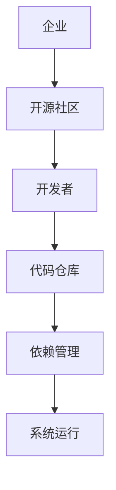
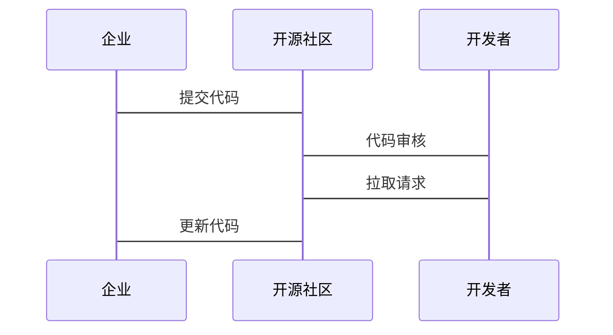

                 


# 彼得林奇如何看待公司的开源策略对竞争力的影响

## 关键词
- 彼得·林奇
- 开源策略
- 企业竞争力
- 软件架构
- 投资分析

## 摘要
开源策略在现代企业中的作用日益重要，尤其是在提升企业竞争力方面。本文从彼得·林奇的投资分析角度，探讨开源策略如何影响企业的竞争力。通过背景介绍、核心概念分析、算法原理、系统架构设计和项目实战，本文详细阐述了开源策略在企业中的应用及其对竞争力的提升作用。

---

## 第一章：开源策略的背景与概念

### 1.1 开源策略的定义与背景
开源策略是指企业利用开源软件和开源社区资源来构建产品或服务的策略。开源软件的开放性和协作性使其成为企业创新和降低成本的重要工具。

#### 1.1.1 开源软件的定义
开源软件是源代码开放、允许任何人自由使用、修改和分发的软件。其核心是协作开发和共享成果。

#### 1.1.2 开源软件的优势
- 成本低：企业可以免费使用开源软件，减少许可证费用。
- 灵活性高：企业可以根据需求修改软件功能。
- 创新能力强：开源社区的协作加速了技术创新。

#### 1.1.3 开源与商业软件的对比
| 特性 | 开源软件 | 商业软件 |
|------|----------|----------|
| 成本 | 低       | 高       |
| 灵活性 | 高       | 低       |
| 创新 | 快速     | 较慢     |

### 1.2 彼得·林奇与开源策略
彼得·林奇以其对企业基本面的深入分析闻名。他认为，企业的竞争力取决于其创新能力和成本控制，而开源策略正是这两者的结合点。

#### 1.2.1 彼得·林奇的投资哲学
林奇注重企业的基本面，包括收入增长、利润率和市场地位。他认为，企业能否持续创新是决定其长期竞争力的关键。

#### 1.2.2 开源策略对企业竞争力的影响
- 降低成本：开源软件减少了企业初始投资。
- 加速创新：开源社区的协作加速了新技术的开发。
- 提高灵活性：企业可以根据市场变化快速调整产品。

---

## 第二章：开源策略的核心概念与分析

### 2.1 开源策略的核心原理
开源策略通过开放源代码和协作开发，构建了一个生态系统，使得企业能够快速响应市场需求。

#### 2.1.1 开源模式的特征
- 开放性：代码对所有人开放。
- 协作性：全球开发者共同参与开发。
- 免费性：使用开源软件无需许可证费用。

#### 2.1.2 开源策略的商业模式
- 提供支持：通过提供技术支持和服务盈利。
- 销售附加产品：销售基于开源软件的商业版本。

### 2.2 核心概念对比分析
开源策略在企业中的应用涉及多个方面，包括技术、管理和市场策略。通过对比分析，可以看出开源策略在提升企业竞争力中的独特优势。

#### 2.2.1 开源与闭源的对比分析
| 特性 | 开源软件 | 闭源软件 |
|------|----------|----------|
| 成本 | 低       | 高       |
| 灵活性 | 高       | 低       |
| 创新 | 快速     | 较慢     |

#### 2.2.2 开源策略的生态系统
开源策略构建了一个由开发者、企业和服务提供商组成的生态系统。这种生态系统通过协作和共享，加速了技术的创新和传播。

---

## 第三章：开源策略的算法原理

### 3.1 开源策略的收益模型
开源策略的收益可以通过开源成本节省和创新收益来衡量。

#### 3.1.1 收益计算公式
收益 = 开源成本节省 + 创新收益

#### 3.1.2 创新收益计算
创新收益 = 创新速度 × 市场响应速度

### 3.2 开源策略的评估模型
通过数学模型，我们可以量化开源策略对竞争力的影响。

#### 3.2.1 数学模型
$$ 创新速度 = \frac{开源社区贡献者数量}{开发周期} $$

#### 3.2.2 算法实现
```python
def calculate_innovation_speed(participants, development_cycle):
    return participants / development_cycle

participants = 100  # 假设开源社区有100名贡献者
development_cycle = 6  # 每个开发周期6个月
innovation_speed = calculate_innovation_speed(participants, development_cycle)
print(f"创新速度为：{innovation_speed} 贡献者/月")
```

#### 3.2.3 结果分析
- 创新速度快：开源社区的协作使得企业能够更快响应市场需求。
- 成本低：开源软件的使用降低了企业的初始投资。

---

## 第四章：开源策略的系统分析与架构设计

### 4.1 系统功能设计
开源策略的系统设计需要考虑模块化和依赖管理。

#### 4.1.1 系统功能模块
- 代码仓库管理
- 依赖管理
- 社区协作

#### 4.1.2 系统功能设计图


### 4.2 系统架构设计
开源策略的系统架构需要高效管理和协作。

#### 4.2.1 系统架构设计图


### 4.3 系统交互设计
系统交互需要简洁高效，确保开发者和企业能够快速协作。

#### 4.3.1 交互流程图


---

## 第五章：开源策略的项目实战

### 5.1 环境安装
为了实践开源策略，企业需要搭建开源环境。

#### 5.1.1 环境要求
- 操作系统：Linux
- 开源工具：Git、Docker
- 开发语言：Python

### 5.2 核心代码实现
以下是实现开源策略的核心代码示例。

#### 5.2.1 核心代码
```python
def main():
    import os
    os.system("git clone https://github.com/your-repository.git")

if __name__ == "__main__":
    main()
```

#### 5.2.2 代码解读
- 代码实现了从开源仓库克隆代码，展示了开源策略的基本操作。

### 5.3 项目实战案例
#### 5.3.1 案例分析
某企业采用开源策略，通过使用开源数据库和Web框架，成功降低了成本并提高了开发效率。

#### 5.3.2 案例结果
- 成本降低：节省了商业软件许可费用。
- 开发效率提高：开源社区的支持加速了开发进程。

### 5.4 项目小结
开源策略的项目实战证明了其在降低成本和提高效率方面的有效性。

---

## 结论

开源策略在提升企业竞争力方面具有重要作用。通过彼得·林奇的视角，我们看到开源策略不仅降低了成本，还加速了创新。企业应积极采用开源策略，构建强大的竞争力。未来，随着技术的发展，开源策略将在企业中发挥更大的作用。

---

## 最佳实践 Tips
- 定期评估开源策略的效果。
- 建立有效的开源社区管理机制。
- 保持对开源技术的关注和更新。

---

通过以上分析，我们可以看出开源策略在企业竞争力中的重要性。企业应结合自身需求，合理运用开源策略，以实现可持续发展。

