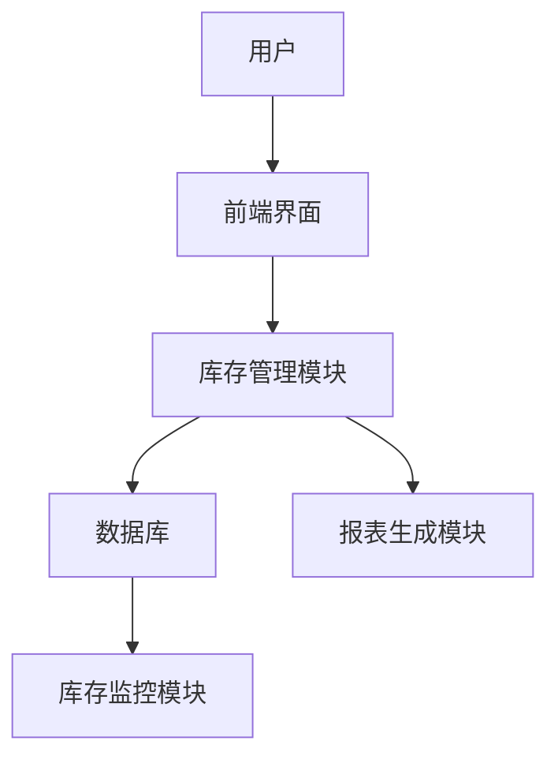
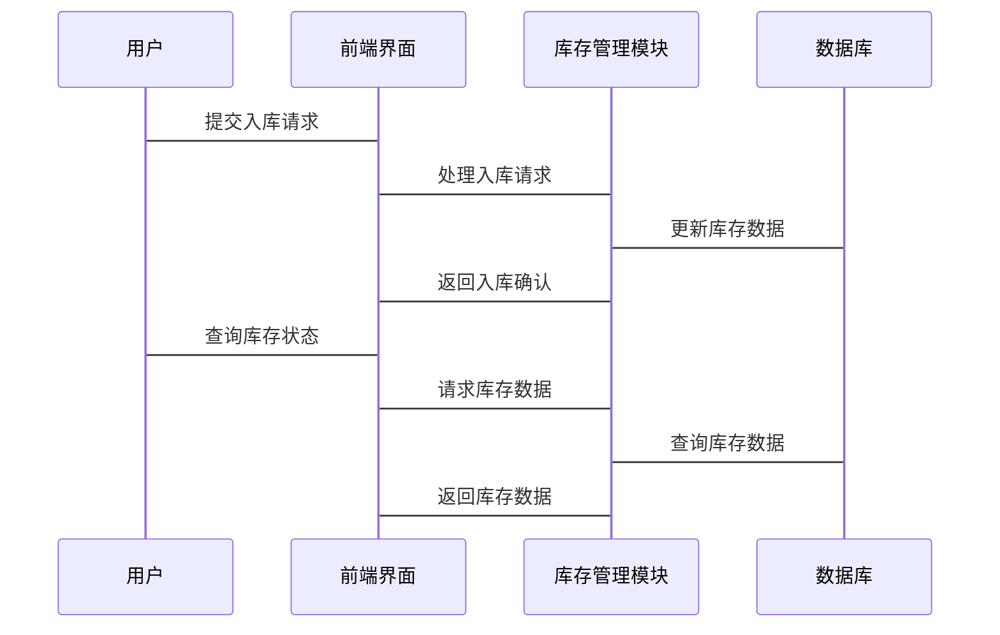

                 


# 彼得林奇对公司存货管理效率的分析

## 关键词：存货管理效率，彼得·林奇，投资分析，供应链优化，企业运营

## 摘要：本文深入分析了彼得·林奇从投资角度对公司存货管理效率的分析方法，探讨了存货管理对企业财务健康和运营效率的影响。通过系统的分析与设计，结合实际案例，展示了如何优化存货管理效率，提升企业竞争力。

---

## 第一部分: 引言

### 1.1 研究背景

#### 1.1.1 存货管理的基本概念
存货管理是企业管理中的重要环节，涉及原材料、半成品和产成品的管理，旨在以最优成本满足生产和销售需求。

#### 1.1.2 彼得·林奇的分析视角
彼得·林奇作为投资专家，关注存货管理对企业财务健康和投资价值的影响，强调存货周转率和库存水平的合理性。

#### 1.1.3 存货管理对企业运营效率的影响
存货管理效率直接影响企业的资金占用、运营成本和供应链灵活性，优化存货管理可提升企业整体效率。

### 1.2 研究意义
研究存货管理效率有助于企业降低运营成本，提高资金利用率，同时为投资者提供评估企业价值的重要指标。

---

## 第二部分: 存货管理的基本理论

### 2.1 存货管理的概念与分类

#### 2.1.1 存货管理的定义
存货管理是对企业库存的规划、控制和监控，确保库存满足生产和销售需求，同时最小化成本。

#### 2.1.2 存货管理的主要分类
- 按用途分类：原材料、产成品、半成品。
- 按存储位置分类：在制品、产成品、外购件。
- 按管理方法分类：ABC分类法（基于价值或重要性分类）。

#### 2.1.3 存货管理的核心要素
- 库存数量：库存水平的合理性。
- 周转速度：存货周转率和周转天数。
- 成本控制：存储、订货和缺货成本。

### 2.2 存货管理的基本原理

#### 2.2.1 存货管理的经济性原则
- 经济订货量（EOQ）模型：确定最优订货量，最小化总成本。
- 存货持有成本：包括存储、维护和资金占用成本。

#### 2.2.2 存货管理的效率性原则
- 确保库存能够满足需求，避免缺货或过剩。
- 提高库存周转率，加快资金回笼。

#### 2.2.3 存货管理的风险控制原则
- 识别和评估存货风险，如过时库存和质量问题。
- 建立风险管理机制，及时处理问题库存。

### 2.3 存货管理的关键指标

#### 2.3.1 存货周转率
公式：$$存货周转率 = \frac{\text{营业成本}}{\text{平均存货}}$$
高周转率表明库存管理效率高，资金利用充分。

#### 2.3.2 存货周转天数
公式：$$存货周转天数 = \frac{365}{\text{存货周转率}}$$
周转天数越短，库存管理效率越高。

#### 2.3.3 存货与销售收入比例
公式：$$存货与销售收入比例 = \frac{\text{平均存货}}{\text{销售收入}} \times 100\%$$
比例越低，存货管理效率越高。

---

## 第三部分: 彼得·林奇的存货管理分析方法

### 3.1 彼得·林奇的分析框架

#### 3.1.1 从投资角度分析存货管理
- 通过存货周转率和周转天数评估企业运营效率。
- 分析存货与销售收入比例，判断库存是否合理。

#### 3.1.2 存货管理与企业盈利能力的关系
高效率的存货管理降低成本，提高净利润率和ROE。

#### 3.1.3 存货管理与企业流动性风险的关联
存货周转率低可能导致资金占用过多，增加流动性风险。

### 3.2 存货管理效率的评价体系

#### 3.2.1 存货周转率的计算方法
使用EOQ模型和实际数据计算，评估库存管理效率。

#### 3.2.2 存货周转率与企业利润的关系
公式：$$净利润 = 营业收入 - 营业成本 - 其他费用$$
存货周转率高，营业成本控制好，净利润提升。

#### 3.2.3 存货周转率与企业资金占用的关系
公式：$$资金占用 = 存货平均余额 \times 资金成本率$$
周转率高，资金占用低，流动性增强。

### 3.3 彼得·林奇分析方法的案例应用

#### 3.3.1 某公司存货管理效率的分析
- 计算存货周转率和周转天数，发现周转率低于行业平均水平。
- 分析存货与销售收入比例，发现库存积压严重。

#### 3.3.2 案例分析中的关键点
- 优化采购策略，降低原材料库存。
- 采用ABC分类法，重点管理高价值库存。

#### 3.3.3 案例分析的启示
- 定期评估存货管理效率，及时调整策略。
- 结合企业实际，制定个性化的存货管理方案。

---

## 第四部分: 存货管理的系统分析与设计

### 4.1 存货管理系统的总体架构

#### 4.1.1 系统模块划分
- 入库管理：记录入库信息，更新库存数据。
- 出库管理：处理出库订单，减少库存。
- 库存监控：实时监控库存状态，预警异常情况。
- 报表管理：生成存货周转率、周转天数等报表。

#### 4.1.2 系统功能概述
- 实现库存的实时监控和管理。
- 自动生成存货周转率等关键指标的报表。
- 提供库存分析和优化建议。

#### 4.1.3 系统架构的优缺点分析
优点：结构清晰，功能模块化；缺点：初期开发成本较高。

### 4.2 存货管理系统的架构设计

#### 4.2.1 系统架构图


#### 4.2.2 系统功能模块设计
- 前端界面：用户操作界面，显示库存状态和报表。
- 库存管理模块：处理入库、出库和库存调整。
- 数据库：存储库存数据和历史记录。
- 报表生成模块：生成存货周转率等报表。

#### 4.2.3 系统交互流程


---

## 第五部分: 项目实战

### 5.1 环境安装与配置

#### 5.1.1 系统环境
- 操作系统：Linux
- 数据库：MySQL
- 开发工具：PyCharm

#### 5.1.2 安装步骤
1. 安装MySQL：```bash
sudo apt-get install mysql-server
```
2. 安装Python库：```bash
pip install pymysql
```

### 5.2 核心实现源代码

#### 5.2.1 入库管理代码
```python
import pymysql

def insert_stock(inventory_id, item_name, quantity):
    # 连接数据库
    db = pymysql.connect(host='localhost', user='root', password='password', db='inventory_management')
    cursor = db.cursor()
    # 插入数据
    sql = "INSERT INTO stocks (inventory_id, item_name, quantity) VALUES (%s, %s, %s)"
    cursor.execute(sql, (inventory_id, item_name, quantity))
    db.commit()
    db.close()
```

#### 5.2.2 出库管理代码
```python
import pymysql

def update_stock(inventory_id, item_name, quantity):
    db = pymysql.connect(host='localhost', user='root', password='password', db='inventory_management')
    cursor = db.cursor()
    # 更新数据
    sql = "UPDATE stocks SET quantity = quantity - %s WHERE inventory_id = %s AND item_name = %s"
    cursor.execute(sql, (quantity, inventory_id, item_name))
    db.commit()
    db.close()
```

#### 5.2.3 存货周转率计算代码
```python
import pymysql

def calculate_turnover_ratio():
    db = pymysql.connect(host='localhost', user='root', password='password', db='inventory_management')
    cursor = db.cursor()
    # 查询数据
    sql = "SELECT SUM(quantity) FROM stocks;"
    cursor.execute(sql)
    total_stock = cursor.fetchone()[0]
    sql = "SELECT COGS FROM financials;"
    cursor.execute(sql)
    cogs = cursor.fetchone()[0]
    # 计算周转率
    turnover_ratio = cogs / (total_stock / 2)
    db.close()
    return turnover_ratio
```

### 5.3 实际案例分析与解读

#### 5.3.1 案例背景
某制造企业面临库存积压和周转率低的问题，希望通过优化存货管理提高效率。

#### 5.3.2 分析过程
- 计算存货周转率：$$1.5$$，低于行业平均值 $$2.0$$。
- 分析存货与销售收入比例：$$40\%$$，高于行业平均水平 $$30\%$$。

#### 5.3.3 优化方案
1. 采用ABC分类法，重点管理高价值库存。
2. 优化采购计划，减少原材料库存。
3. 加强库存监控，及时处理滞销产品。

#### 5.3.4 实施步骤
1. 引入存货管理系统，实现库存实时监控。
2. 培训员工，提升存货管理意识。
3. 定期评估存货管理效率，持续优化。

### 5.4 项目小结

#### 5.4.1 实施效果
- 存货周转率提升至 $$2.5$$，周转天数减少 $$20\%$$。
- 存货与销售收入比例降至 $$30\%$$，资金占用降低。

#### 5.4.2 成功经验
- 引入先进的存货管理系统，提高管理效率。
- 结合企业实际，制定个性化的优化方案。

#### 5.4.3 改进方向
- 结合大数据分析，进一步优化存货管理。
- 探索区块链技术，提升库存透明度和安全性。

---

## 第六部分: 总结与展望

### 6.1 总结

#### 6.1.1 核心观点回顾
存货管理效率直接影响企业运营成本和资金占用，彼得·林奇的分析方法提供了独特的投资视角。

#### 6.1.2 实践价值
通过优化存货管理，企业可以降低运营成本，提高资金利用率。

#### 6.1.3 研究意义
本文结合理论与实践，为优化存货管理效率提供了可行的解决方案。

### 6.2 展望

#### 6.2.1 技术发展
- 大数据分析：利用大数据优化存货预测和库存控制。
- 区块链技术：提升库存透明度和安全性。

#### 6.2.2 理论创新
- 综合考虑企业内外部因素，构建全面的存货管理优化模型。
- 研究存货管理与供应链协同优化的策略。

#### 6.2.3 实际应用
- 推动存货管理系统的智能化和自动化。
- 加强企业间协同，构建高效的供应链网络。

---

## 附录

### 附录A: 存货管理相关的数学公式

1. 经济订货量（EOQ）模型：
$$EOQ = \sqrt{\frac{2DS}{H}}$$
- \( D \)：年需求量
- \( S \)：每次订货成本
- \( H \)：单位库存持有成本

2. 存货周转天数计算公式：
$$\text{周转天数} = \frac{365}{\text{周转率}}$$

---

### 附录B: 存货管理系统架构图


---

### 附录C: 存货管理项目实施步骤

1. 需求分析：明确项目目标和范围。
2. 系统设计：设计系统架构和功能模块。
3. 系统开发：编写代码，实现功能。
4. 测试优化：测试系统，修复问题。
5. 上线部署：部署系统，培训用户。
6. 持续优化：定期评估，持续改进。

---

## 参考文献

1. 彼得·林奇.《彼得·林奇的成功投资策略》.
2. 供应链管理协会.《现代存货管理理论与实践》.
3. 王强.《企业存货管理优化方法研究》.

---

通过本文的详细分析和实际案例，我们展示了如何从投资和运营角度优化存货管理效率，为企业提升竞争力提供有力支持。希望本文对读者有所帮助！

