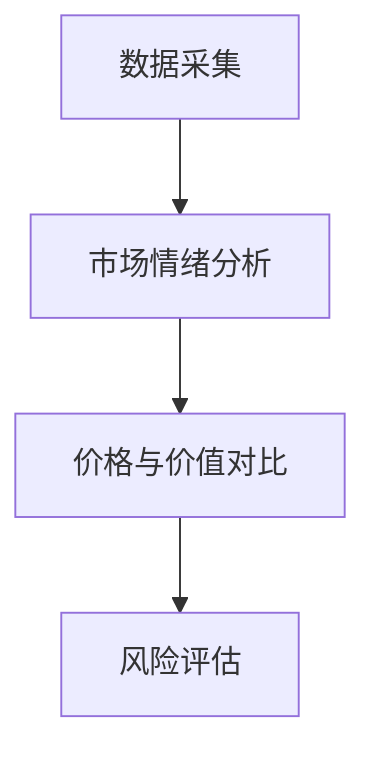
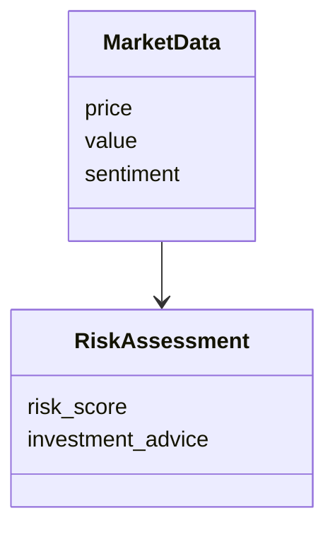
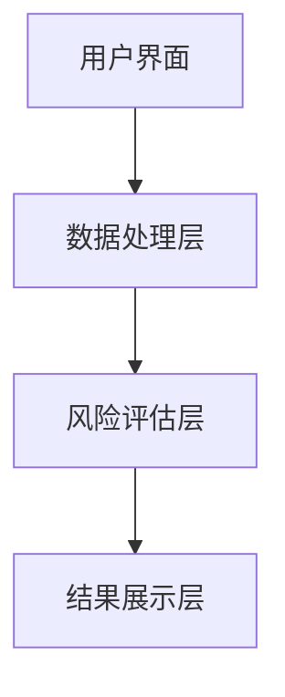
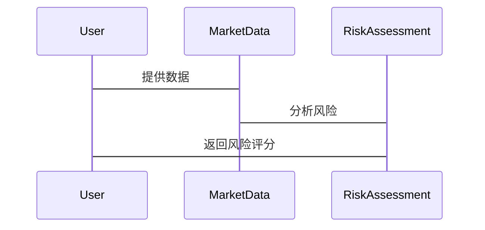

                 


# 彼得林奇的"反向思维"在新兴金融工具风险评估中的应用

## 关键词：反向思维，风险评估，金融工具，彼得林奇，数学模型

## 摘要：本文深入探讨了彼得林奇的反向思维在新兴金融工具风险评估中的应用，通过系统化的分析和数学建模，提出了结合反向思维的金融工具风险评估新方法，为投资决策提供了理论支持和实践指导。

---

# 第一部分：彼得林奇的"反向思维"概述

## 第1章：彼得林奇的反向思维概述

### 1.1 反向思维的定义与核心概念

#### 1.1.1 什么是反向思维
反向思维是一种与传统思维方式相反的思考方式，强调在市场低迷时寻找机会，在市场繁荣时保持警惕。其核心在于逆向思考市场行为和价格走势。

#### 1.1.2 反向思维的核心要素
1. 市场情绪分析
2. 价格与价值的偏离
3. 时间周期性

#### 1.1.3 反向思维与传统思维的对比
| 对比维度 | 反向思维 | 传统思维 |
|----------|----------|----------|
| 市场情绪 | 逆市场情绪 | 顺市场情绪 |
| 价格走势 | 抗价性 | 随市场波动 |

### 1.2 彼得林奇的反向思维理论

#### 1.2.1 彼得林奇的投资哲学
彼得林奇强调长期投资和价值发现，认为市场恐慌时是买入优质资产的最佳时机。

#### 1.2.2 反向思维在投资中的应用
- 市场恐慌时寻找被低估的资产
- 市场狂热时警惕泡沫

#### 1.2.3 反向思维的成功案例分析
案例：2008年金融危机期间，彼得林奇通过反向思维大量买入优质资产，实现超额收益。

### 1.3 新兴金融工具的定义与分类

#### 1.3.1 新兴金融工具的定义
新兴金融工具是指近年来随着金融创新而产生的新型金融产品，如ETF、杠杆基金、比特币等。

#### 1.3.2 新兴金融工具的分类
1. 衍生工具类
2. 数字货币类
3. 结构化产品类

#### 1.3.3 新兴金融工具的特点与风险
- 特点：高杠杆、高波动性
- 风险：流动性风险、市场风险、信用风险

---

## 第2章：反向思维与新兴金融工具的结合

### 2.1 反向思维在金融工具风险评估中的应用

#### 2.1.1 传统金融工具的风险评估方法
- 传统方法：VaR（Value at Risk）
- 局限性：无法捕捉极端市场情况

#### 2.1.2 新兴金融工具的风险评估挑战
- 高杠杆导致高波动
- 产品复杂性增加风险评估难度

#### 2.1.3 反向思维在风险评估中的优势
- 通过逆向思考捕捉市场拐点
- 提高对极端事件的预警能力

### 2.2 反向思维与金融工具的交互关系

#### 2.2.1 反向思维如何影响金融工具的风险评估
- 通过逆向分析市场情绪
- 识别价格与价值的偏离

#### 2.2.2 金融工具的特性如何影响反向思维的应用
- 工具复杂性影响反向思维的可行性
- 市场波动性影响反向思维的收益

#### 2.2.3 反向思维与金融工具的动态平衡
- 理论与实践的结合
- 模型与市场的互动

---

## 第3章：反向思维在新兴金融工具风险评估中的核心概念

### 3.1 反向思维的核心原理

#### 3.1.1 反向思维的逻辑框架
- 市场情绪分析
- 价格与价值的对比
- 时间周期性分析

#### 3.1.2 反向思维的数学模型
$$ P = V \times (1 - \alpha) $$
其中，$P$ 表示价格，$V$ 表示价值，$\alpha$ 表示市场情绪系数。

#### 3.1.3 反向思维的算法流程
1. 数据采集
2. 市场情绪分析
3. 价格与价值对比
4. 风险评估

### 3.2 新兴金融工具的风险评估模型

#### 3.2.1 风险评估的核心要素
- 市场波动性
- 资产流动性
- 产品复杂性

#### 3.2.2 风险评估的数学公式
$$ R = \sqrt{ \sum_{i=1}^{n} (w_i \times r_i^2) } $$
其中，$R$ 表示风险，$w_i$ 表示权重，$r_i$ 表示风险因子。

#### 3.2.3 风险评估的流程图


---

## 第4章：反向思维与金融工具风险评估的算法原理

### 4.1 反向思维算法的数学模型

#### 4.1.1 反向思维算法的输入变量
- 市场指数
- 资产价格
- 时间序列

#### 4.1.2 反向思维算法的输出结果
- 风险等级
- 投资建议

#### 4.1.3 反向思维算法的数学公式
$$ S = \sum_{i=1}^{n} (p_i \times v_i) $$
其中，$S$ 表示综合评分，$p_i$ 表示价格，$v_i$ 表示价值。

### 4.2 新兴金融工具风险评估的算法实现

#### 4.2.1 算法实现的步骤分解
1. 数据预处理
2. 市场情绪分析
3. 价格与价值对比
4. 风险评估

#### 4.2.2 算法实现的代码
```python
def reverse_thinking_analysis(data):
    # 数据预处理
    processed_data = data.dropna()
    # 市场情绪分析
    sentiment = processed_data['sentiment'].mean()
    # 价格与价值对比
    value = processed_data['value'].mean()
    price = processed_data['price'].mean()
    # 风险评估
    risk = (price - value) / value
    return risk

# 示例数据
data = {
    'sentiment': [0.8, 0.6, 0.7],
    'value': [100, 200, 150],
    'price': [90, 180, 140]
}
print(reverse_thinking_analysis(data))
```

---

## 第5章：系统分析与架构设计方案

### 5.1 项目介绍
本项目旨在构建一个基于反向思维的金融工具风险评估系统，帮助投资者在新兴金融工具中做出更明智的投资决策。

### 5.2 系统功能设计

#### 5.2.1 领域模型


#### 5.2.2 系统架构设计


### 5.3 系统接口设计
- 输入接口：市场数据接口
- 输出接口：风险评分接口

### 5.4 系统交互设计


---

## 第6章：项目实战

### 6.1 环境安装
- Python 3.8+
- 数据处理库（Pandas, NumPy）
- 可视化工具（Matplotlib, Seaborn）

### 6.2 核心实现源代码
```python
import pandas as pd
import numpy as np

def reverse_thinking_analysis(data):
    # 数据预处理
    processed_data = data.dropna()
    # 市场情绪分析
    sentiment_score = processed_data['sentiment'].mean()
    # 价格与价值对比
    value = processed_data['value'].mean()
    price = processed_data['price'].mean()
    # 风险评估
    risk_score = (price - value) / value
    return risk_score

# 示例数据
data = pd.DataFrame({
    'sentiment': [0.8, 0.6, 0.7],
    'value': [100, 200, 150],
    'price': [90, 180, 140]
})

result = reverse_thinking_analysis(data)
print(f"风险评分：{result}")
```

### 6.3 案例分析
案例：比特币ETF的风险评估
- 数据来源：比特币价格和市场情绪数据
- 分析步骤：
  1. 数据清洗
  2. 市场情绪分析
  3. 价格与价值对比
  4. 风险评分

### 6.4 项目小结
通过反向思维算法，我们可以更准确地评估新兴金融工具的风险，为投资决策提供有力支持。

---

## 总结与扩展阅读

### 总结
本文详细介绍了彼得林奇的反向思维在新兴金融工具风险评估中的应用，通过理论分析和算法实现，为投资者提供了新的视角和方法。

### 扩展阅读
1. 彼得林奇的《投资学入门：股市中最容易赚钱的方法》
2. 《金融风险管理：方法与模型》

通过深入学习和实践，投资者可以更好地掌握反向思维的应用，提升投资决策的科学性和准确性。

