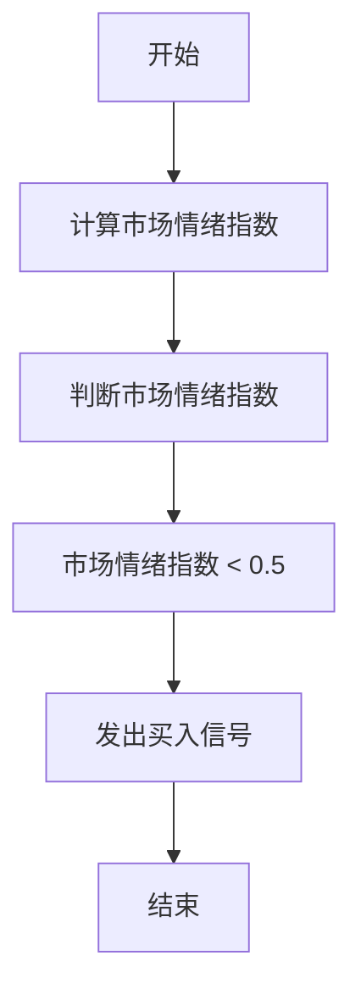

                 


# 彼得林奇的"反向思维"在牛市中的应用

> 关键词：彼得林奇、反向思维、投资策略、牛市分析、风险管理

> 摘要：本文深入探讨了彼得林奇的反向思维在牛市中的应用，通过分析其投资理念、数学模型、系统架构、实际案例以及项目实战，揭示了反向思维在投资决策中的独特价值和具体实现方式。文章结合技术语言和实际操作，为读者提供了全面的指导。

---

## 第一章: 彼得林奇与反向思维的背景介绍

### 1.1 彼得林奇及其投资理念

#### 1.1.1 彼得林奇的生平简介
彼得·林奇（Peter Lynch）是美国著名的投资专家，曾任富达投资管理公司的基金经理，管理着麦哲伦基金，创造了年均29%的回报率。他以独特的投资风格闻名，尤其是对市场趋势的精准判断和反向思维的应用。

#### 1.1.2 彼得林奇的投资哲学
彼得林奇强调长期投资和价值发现，认为市场的短期波动是投资者的机会。他主张在市场恐慌时买入，在市场狂热时卖出，这种策略体现了反向思维的核心。

#### 1.1.3 反向思维在投资中的重要性
反向思维通过分析市场情绪，帮助投资者在市场底部买入，在市场顶部卖出。这种策略在牛市中尤为重要，因为牛市往往伴随着市场情绪的过度乐观。

### 1.2 反向思维的核心概念

#### 1.2.1 反向思维的定义
反向思维是一种逆向思考的投资策略，通过分析市场的非理性行为来寻找投资机会。与传统投资思维不同，反向思维强调在市场低迷时寻找低估资产，在市场繁荣时警惕风险。

#### 1.2.2 反向思维与传统投资思维的区别
| 核心要素 | 反向思维 | 传统投资思维 |
|----------|----------|--------------|
| 市场情绪 | 利用非理性 | 遵循市场趋势 |
| 入场时机 | 低点买入 | 高点追涨 |
| 风险管理 | 逆市加仓 | 随市调整 |

#### 1.2.3 反向思维在牛市中的应用背景
牛市中，市场情绪往往过度乐观，投资者容易被市场热浪冲昏头脑。反向思维提醒投资者保持冷静，寻找市场中的低估资产，避免追高。

---

## 第二章: 反向思维的数学模型与算法原理

### 2.1 反向思维的数学模型

#### 2.1.1 市场情绪指数的计算公式
市场情绪指数反映了市场的乐观程度，公式如下：
$$
\text{市场情绪指数} = \frac{\text{市场波动率}}{\text{平均收益率}}
$$
其中，市场波动率衡量市场的不稳定程度，平均收益率反映市场的整体表现。

#### 2.1.2 买入时机的判断公式
当市场情绪指数低于0.5时，表明市场情绪低迷，投资者可以考虑买入。
$$
\text{买入信号} = \begin{cases} 
\text{是} & \text{如果市场情绪指数 < 0.5} \\
\text{否} & \text{其他情况}
\end{cases}
$$

#### 2.1.3 卖出时机的判断公式
当市场情绪指数高于1.0时，表明市场情绪过热，投资者应考虑卖出。
$$
\text{卖出信号} = \begin{cases} 
\text{是} & \text{如果市场情绪指数 > 1.0} \\
\text{否} & \text{其他情况}
\end{cases}
$$

### 2.2 反向思维的算法流程



---

## 第三章: 反向思维在牛市中的系统架构设计

### 3.1 系统功能设计

#### 3.1.1 市场数据采集模块
负责采集股票价格、成交量等市场数据，为后续分析提供基础。

#### 3.1.2 市场情绪分析模块
通过算法计算市场情绪指数，判断市场情绪的高低。

#### 3.1.3 投资决策模块
根据市场情绪指数，发出买入或卖出信号。

### 3.2 系统架构设计


### 3.3 系统接口设计

#### 3.3.1 数据接口
负责与数据源对接，获取实时市场数据。

#### 3.3.2 分析接口
提供市场情绪指数的计算服务。

#### 3.3.3 决策接口
输出买入或卖出信号。

---

## 第四章: 反向思维的项目实战

### 4.1 环境安装与数据准备

#### 4.1.1 Python环境安装
安装Python和必要的库，如Pandas、NumPy等。

#### 4.1.2 数据源获取与处理
从Yahoo Finance获取股票数据，清洗数据并计算市场情绪指数。

### 4.2 核心算法实现

#### 4.2.1 市场情绪指数计算代码

```python
import pandas as pd
import numpy as np

# 数据预处理
data = pd.read_csv('stock_data.csv')
data = data['Adj Close'].pct_change().dropna()

# 计算市场波动率
volatility = data.std()

# 计算平均收益率
average_return = data.mean()

# 计算市场情绪指数
market_sentiment_index = volatility / average_return.abs()
```

#### 4.2.2 投资决策逻辑

```python
def reverse_thinking_strategy(data):
    # 计算市场情绪指数
    volatility = data.std()
    average_return = data.mean().abs()
    market_sentiment_index = volatility / average_return

    # 判断买入信号
    if market_sentiment_index < 0.5:
        return '买入'
    else:
        return '观望'

# 应用策略
signal = reverse_thinking_strategy(data)
print(signal)
```

### 4.3 实际案例分析

#### 4.3.1 案例背景
2008年金融危机期间，市场情绪极度低迷，反向思维策略建议投资者在底部买入。

#### 4.3.2 数据分析
通过计算市场情绪指数，发现指数远低于0.5，触发买入信号。

#### 4.3.3 投资组合构建
根据信号，投资者在市场低点买入优质股票，避免了进一步的损失。

---

## 第五章: 反向思维的系统优化与风险管理

### 5.1 系统优化

#### 5.1.1 系统架构优化
通过引入机器学习算法，提高市场情绪指数的计算精度。

#### 5.1.2 系统性能优化
优化数据处理流程，提高系统的响应速度。

### 5.2 风险管理

#### 5.2.1 风险控制策略
设置止损点和止盈点，控制投资风险。

#### 5.2.2 风险预警机制
通过实时监控市场情绪指数，及时发出风险预警信号。

---

## 第六章: 总结与展望

### 6.1 总结
反向思维是一种有效的投资策略，通过分析市场情绪，帮助投资者在牛市中找到低估资产，避免追高。

### 6.2 展望
随着人工智能技术的发展，反向思维的应用将更加广泛和精准，投资者可以利用技术手段更好地实施这一策略。

---

## 第七章: 最佳实践与注意事项

### 7.1 最佳实践

#### 7.1.1 长期视角
保持长期投资，避免短期波动的干扰。

#### 7.1.2 灵活调整
根据市场变化，及时调整投资策略。

### 7.2 注意事项

#### 7.2.1 风险控制
严格控制风险，避免过度杠杆。

#### 7.2.2 持续学习
保持对市场的学习和研究，及时更新投资策略。

---

通过本文的详细讲解，读者可以深入了解彼得林奇的反向思维在牛市中的应用，并通过实际案例和系统设计，掌握如何在投资中应用这一策略。

