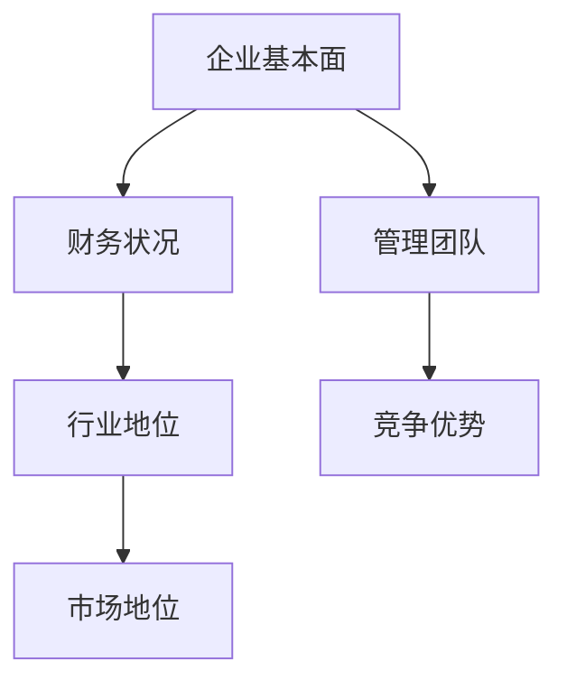
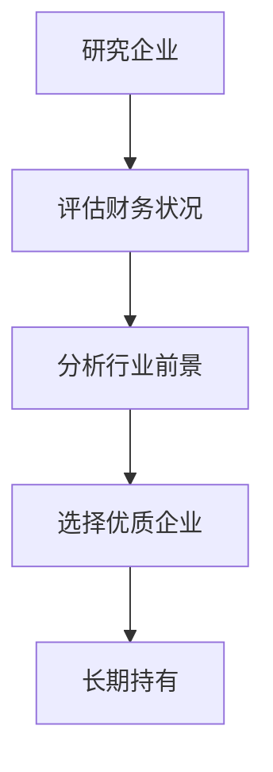
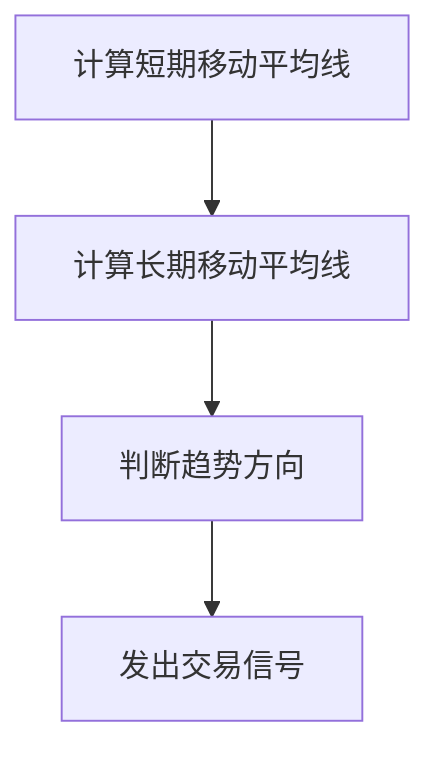
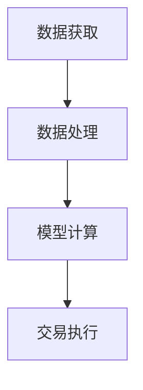

                 


# 彼得林奇的"常识投资"在量化交易时代的价值

> 关键词：常识投资，量化交易，彼得林奇，投资策略，算法交易

> 摘要：本文探讨了彼得林奇的“常识投资”理念在量化交易时代的价值。通过对常识投资与量化交易的结合、量化交易算法与数学模型的分析，以及系统设计与实战案例的深入探讨，展示了如何在现代投资环境中将传统投资策略与先进技术相结合，为投资者提供新的思路和方法。

---

## 第一部分：背景介绍

### 第1章：常识投资的核心理念

#### 1.1 常识投资的定义与特点

常识投资是一种基于基本面分析和市场常识的投资策略，强调通过研究企业的财务状况、行业地位、管理团队等因素，选择具有长期增长潜力的股票。其核心特点包括：

- **长期视角**：关注企业的内在价值，而非短期市场波动。
- **价值导向**：寻找被市场低估的企业，等待其价值回归。
- **分散投资**：通过投资多个行业和企业降低风险。

**图1-1：常识投资的核心要素**



#### 1.2 彼得林奇的常识投资方法

彼得林奇是常识投资的代表人物，他强调通过研究企业的基本面，寻找具有持续增长潜力的企业。以下是其投资方法的核心要素：

- **选股标准**：关注企业的盈利能力、成长性、财务健康状况。
- **行业选择**：倾向于投资于具有稳定增长前景的行业。
- **分散投资**：通过投资多个企业降低风险。

**图1-2：彼得林奇的投资流程**



### 第2章：量化交易的现状与趋势

#### 2.1 量化交易的定义与特点

量化交易是一种基于数学模型和算法的投资策略，通过计算机程序自动执行交易。其特点包括：

- **高速交易**：利用算法快速捕捉市场机会。
- **数据驱动**：依赖大量历史数据进行分析。
- **自动化操作**：从数据分析到交易执行均由计算机完成。

#### 2.2 量化交易的发展历程

量化交易起源于20世纪80年代，随着计算机技术的进步而迅速发展。以下是其发展历程的关键阶段：

- **早期阶段**：基于简单的技术指标，如移动平均线和RSI。
- **成熟阶段**：引入复杂的时间序列分析和机器学习模型。
- **现代阶段**：结合大数据和人工智能技术，实现更精准的交易策略。

---

## 第二部分：常识投资与量化交易的结合

### 第3章：常识投资在量化交易中的应用

#### 3.1 常识投资与量化交易的结合背景

随着市场复杂性的增加，单纯依靠传统投资策略或量化交易策略都难以应对市场变化。将常识投资与量化交易相结合，可以充分发挥两者的优点：

- **优势互补**：常识投资提供长期视角，量化交易提供短期机会。
- **风险控制**：通过量化模型优化投资组合的风险管理。

#### 3.2 常识投资与量化交易的优缺点对比

| **特点**       | **常识投资**                  | **量化交易**                  |
|----------------|-------------------------------|-----------------------------|
| 交易速度       | 较慢，依赖人工分析            | 高速，依赖算法                |
| 数据依赖       | 依赖基本面数据                | 依赖技术数据和历史数据        |
| 风险控制       | 通过分散投资降低风险         | 通过数学模型优化风险控制      |
| 交易成本       | 较高，涉及人工分析成本        | 较低，依赖自动化交易系统        |

### 第4章：常识投资与量化交易的结合策略

#### 4.1 常识投资与量化交易的结合方式

- **基于基本面的量化策略**：通过基本面指标（如市盈率、市净率）构建量化模型。
- **基于技术分析的量化策略**：结合技术指标（如RSI、布林带）进行交易。
- **基于市场情绪的量化策略**：通过情绪指标（如VIX指数）调整投资组合。

#### 4.2 实战案例分析

**案例分析：基于基本面的量化策略**

假设我们选择具有以下基本面特征的企业：

- **低市盈率**（低于市场平均水平）
- **高净利润率**（高于行业平均水平）
- **稳定的财务状况**（低债务、高现金流）

通过量化模型筛选出符合条件的企业，构建投资组合，并通过算法进行定期再平衡。

---

## 第三部分：量化交易中的算法与数学模型

### 第5章：量化交易的算法原理

#### 5.1 量化交易的核心算法

- **移动平均线算法**：通过计算短期和长期移动平均线，判断市场趋势。
- **布林带算法**：利用标准差指标判断市场的波动范围。
- **RSI算法**：通过相对强度指数判断市场的超买或超卖状态。

**图5-1：移动平均线算法流程**



#### 5.2 量化交易算法的实现

- **算法实现步骤**：
  1. 数据获取：从数据库中获取历史价格数据。
  2. 数据预处理：清洗数据，处理缺失值。
  3. 指标计算：计算移动平均线、RSI等指标。
  4. 信号生成：根据指标生成买入或卖出信号。
  5. 交易执行：根据信号执行交易。

- **代码示例**：

```python
import pandas as pd
import numpy as np

def calculate_ma(data, window):
    return data['close'].rolling(window).mean()

def calculate_rsi(data, window):
    diff = data['close'].diff()
    up = diff.where(diff > 0, 0)
    down = -diff.where(diff < 0, 0)
    rsi = (up.rolling(window).sum() / (up.rolling(window).sum() + down.rolling(window).sum())) * 100
    return rsi

data = pd.read_csv('stock_data.csv')
ma_20 = calculate_ma(data, 20)
ma_50 = calculate_ma(data, 50)
rsi = calculate_rsi(data, 14)

# 生成交易信号
signal = pd.DataFrame(index=data.index)
signal['ma_signal'] = (ma_20 > ma_50).astype(int)
signal['rsi_signal'] = (rsi > 70).astype(int)
signal['final_signal'] = (signal['ma_signal'] & signal['rsi_signal']).astype(int)
```

### 第6章：量化交易的数学模型与公式

#### 6.1 量化交易中的数学模型

- **时间序列分析模型**：用于预测未来的价格走势。
- **马尔可夫链模型**：用于分析市场的状态转移。
- **随机过程模型**：用于模拟市场的随机波动。

#### 6.2 量化交易中的数学公式

- **移动平均数公式**：
  $$MA_n = \frac{1}{n} \sum_{i=1}^{n} P_i$$
  其中，\(P_i\) 是第 \(i\) 天的价格，\(n\) 是窗口大小。

- **RSI公式**：
  $$RSI = \frac{100}{1 + \frac{D}{U}}$$
  其中，\(D\) 是一定周期内的平均下降幅度，\(U\) 是一定周期内的平均上升幅度。

---

## 第四部分：系统设计与架构

### 第7章：量化交易系统的架构设计

#### 7.1 系统架构概述

- **系统组成**：
  - 数据获取模块：从数据库获取历史数据。
  - 数据处理模块：清洗和预处理数据。
  - 模型计算模块：计算各项指标并生成信号。
  - 交易执行模块：根据信号执行交易。

**图7-1：量化交易系统架构**



### 第8章：系统接口与交互设计

#### 8.1 系统接口设计

- **接口设计原则**：
  - 明确接口的功能和输入输出。
  - 保证接口的可扩展性。
  - 提供详细的接口文档。

- **接口实现**：
  ```python
  class TradingSystem:
      def get_data(self, start, end):
          pass
      def calculate_signals(self, data):
          pass
      def execute_trade(self, signal):
          pass
  ```

---

## 第五部分：项目实战与总结

### 第9章：项目实战

#### 9.1 项目环境安装

- **开发环境**：Python 3.8及以上版本。
- **开发工具**：Jupyter Notebook、VS Code。
- **依赖库**：Pandas、NumPy、Matplotlib。

#### 9.2 项目核心实现

- **核心算法实现**：
  ```python
  def backtest(data, strategy):
      returns = []
      positions = []
      for i in range(len(data)):
          if i == 0:
              positions.append(0)
          else:
              positions.append(positions[i-1])
          returns.append(strategy(data.iloc[:i+1]))
      return returns, positions
  ```

#### 9.3 实战案例分析

- **案例分析**：
  通过实际数据测试基于基本面的量化策略，验证其在不同市场环境下的表现。

---

## 总结

彼得林奇的“常识投资”在量化交易时代仍然具有重要价值。通过将传统投资策略与现代技术相结合，投资者可以更好地应对市场变化，实现长期稳定的收益。未来，随着人工智能和大数据技术的进一步发展，常识投资与量化交易的结合将更加紧密，为投资者提供更多的机会和挑战。

