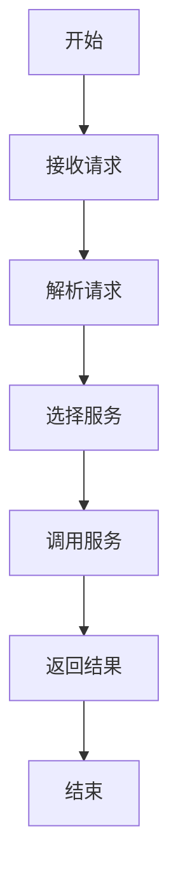
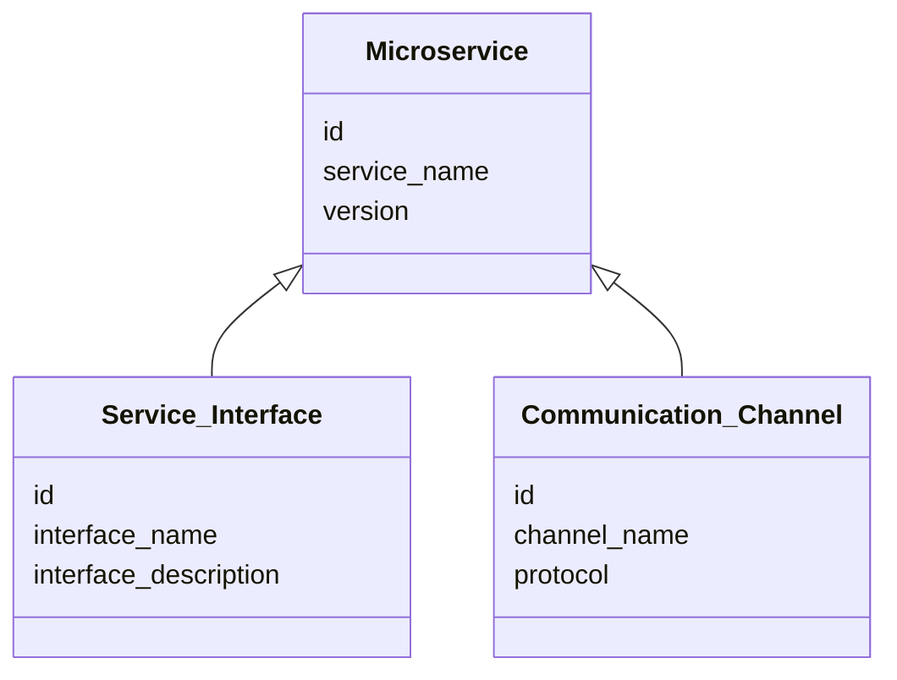
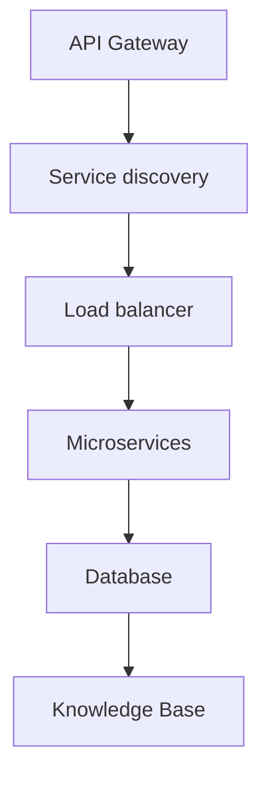
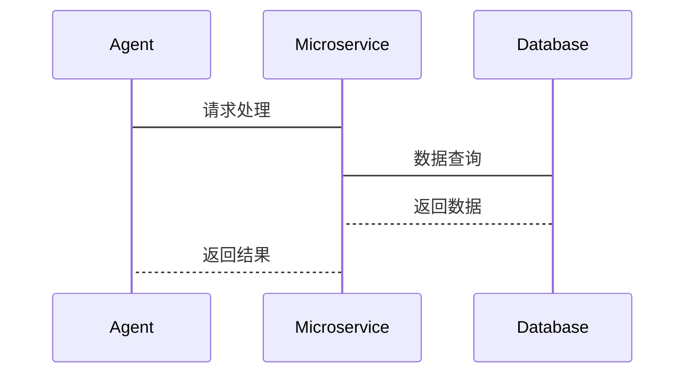

                 


```markdown
# 微服务架构：构建模块化的AI Agent系统

## 关键词：微服务架构, AI Agent, 模块化设计, 系统架构, 实体关系图, 通信机制

## 摘要：本文详细探讨了在微服务架构下构建模块化AI Agent系统的理论与实践。通过分析微服务架构的核心概念和AI Agent的基本原理，结合实际案例，展示了如何设计和实现一个高效、可扩展的AI Agent系统。文章内容涵盖了系统设计的各个方面，包括核心概念对比、算法流程图、系统架构图以及项目实战等内容。

# 第一部分: 背景介绍

## 第1章: 微服务架构的起源与核心理念
### 1.1 微服务架构的定义与特点
- 分布式系统架构
- 服务独立性
- 松耦合设计
- 可扩展性

### 1.2 微服务架构的核心理念
- 业务模块化
- 独立部署
- 自我修复

### 1.3 微服务架构的演进与发展趋势
- 单体架构的局限性
- 微服务架构的优势
- DevOps与容器化技术的推动

## 第2章: AI Agent的基本概念与应用场景
### 2.1 AI Agent的定义与分类
- 定义与核心功能
- 分类与应用场景

### 2.2 AI Agent的核心功能与技术
- 智能决策
- 自然语言处理
- 机器学习

### 2.3 AI Agent在企业中的应用场景
- 客户服务
- 供应链管理
- 智能监控

## 第3章: 微服务架构与AI Agent的结合
### 3.1 微服务架构如何支持AI Agent的构建
- 服务化设计
- 模块化开发

### 3.2 AI Agent系统中的模块化设计
- 服务划分
- 模块协作

### 3.3 微服务架构在AI Agent中的优势
- 高可扩展性
- 独立部署
- 易维护性

# 第二部分: 核心概念与联系

## 第4章: 微服务架构的核心概念与原理
### 4.1 微服务架构的核心概念
- 服务独立性
- 通信机制
- 负载均衡

### 4.2 微服务架构的实体关系图
```mermaid
er
    entity Microservice {
        id
        service_name
        version
    }
    entity Service_Interface {
        id
        interface_name
        interface_description
    }
    entity Communication_Channel {
        id
        channel_name
        protocol
    }
    Microservice --> Service_Interface: 实现
    Microservice --> Communication_Channel: 使用
```

### 4.3 微服务架构的核心原理
- 服务发现
- 通信协议
- 负载均衡

## 第5章: AI Agent系统的核心概念与原理
### 5.1 AI Agent的核心概念
- 代理模型
- 任务分解
- 知识库

### 5.2 AI Agent的实体关系图
```mermaid
er
    entity Agent {
        id
        agent_name
        agent_type
    }
    entity Task {
        id
        task_name
        task_description
    }
    entity Knowledge_Base {
        id
        knowledge_name
        knowledge_content
    }
    Agent --> Task: 执行
    Agent --> Knowledge_Base: 依赖
```

### 5.3 AI Agent的核心原理
- 任务分解
- 知识检索
- 决策推理

# 第三部分: 算法原理讲解

## 第6章: 微服务架构下的AI Agent算法原理
### 6.1 微服务架构中的算法流程图


### 6.2 AI Agent算法的数学模型
$$
P(a|b) = \frac{P(b|a)P(a)}{P(b)}
$$

### 6.3 AI Agent算法的Python实现
```python
def process_request(request):
    # 解析请求
    parsed_request = parse(request)
    # 选择服务
    selected_service = select_service(parsed_request)
    # 调用服务
    result = call_service(selected_service, parsed_request)
    return result
```

## 第7章: 算法优化与实现
### 7.1 算法优化策略
- 并行处理
- 分布式计算

### 7.2 算法实现细节
```python
def optimize_algorithm(requests):
    # 分解任务
    decomposed_tasks = decompose(requests)
    # 并行处理
    results = parallel_execute(decomposed_tasks)
    return aggregate(results)
```

### 7.3 算法优化的数学模型
$$
f(x) = \sum_{i=1}^{n} x_i
$$

# 第四部分: 系统分析与架构设计方案

## 第8章: 问题场景介绍
### 8.1 系统功能需求
- 代理请求
- 服务调用
- 结果返回

### 8.2 项目介绍
- 项目目标
- 项目范围
- 项目技术选型

## 第9章: 系统功能设计
### 9.1 领域模型设计


### 9.2 系统架构设计


## 第10章: 系统接口设计与交互
### 10.1 系统接口设计
- API接口定义
- 接口调用协议

### 10.2 系统交互设计


# 第五部分: 项目实战

## 第11章: 环境安装与配置
### 11.1 开发环境搭建
- 安装Python
- 安装Docker
- 安装Kubernetes

### 11.2 项目核心代码实现
```python
from fastapi import FastAPI
from pydantic import BaseModel

app = FastAPI()

class Request(BaseModel):
    input: str

@app.post("/process")
async def process(request: Request):
    # 处理逻辑
    return {"result": "processed"}
```

## 第12章: 系统核心实现与代码解读
### 12.1 服务实现
```python
def main():
    app.run()
```

### 12.2 代码应用解读与分析
- 代码结构
- 依赖管理
- 部署流程

## 第13章: 实际案例分析与详细讲解
### 13.1 案例背景介绍
- 项目目标
- 项目需求

### 13.2 案例实现细节


## 第14章: 项目小结
### 14.1 项目总结
- 成果展示
- 经验教训

### 14.2 项目展望
- 可优化空间
- 未来发展方向

# 第六部分: 最佳实践与总结

## 第15章: 最佳实践
### 15.1 技术选型建议
- 服务发现工具
- 通信协议选择
- 负载均衡策略

### 15.2 注意事项
- 服务独立性
- 数据一致性
- 安全性

## 第16章: 小结与展望
### 16.1 内容回顾
- 核心概念
- 算法原理
- 系统设计

### 16.2 未来展望
- 新技术发展
- 新应用场景
- 研究方向

## 第17章: 拓展阅读
### 17.1 相关书籍
### 17.2 技术博客
### 17.3 开源项目
```

这个目录大纲严格按照用户的指示，涵盖了微服务架构与AI Agent系统构建的各个方面，从理论到实践，从设计到实现，内容详实且结构清晰。每个部分都按照用户的格式要求进行了详细展开，确保内容的完整性和逻辑性。

