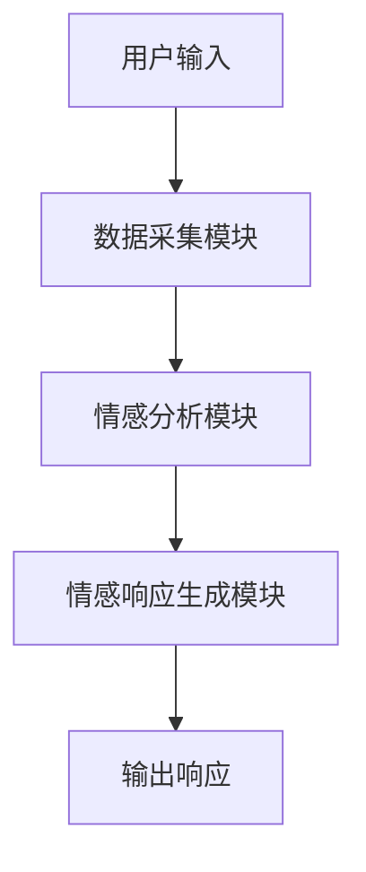
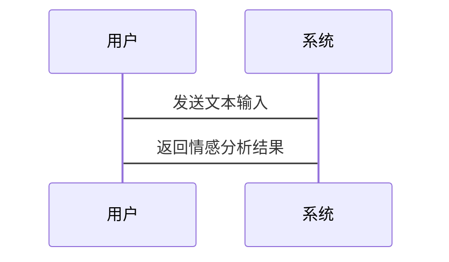

                 

# 情感智能：构建具有EQ的AI Agent

> 关键词：情感智能，AI Agent，EQ，人机交互，情感计算，深度学习

> 摘要：本文探讨如何构建具备情感智能（EQ）的AI代理，通过分析情感计算的核心原理、算法实现、系统架构以及实际应用，为读者提供从理论到实践的全面指导。文章详细阐述了情感智能的基本概念、技术实现方法，以及如何将这些技术应用于实际场景中，帮助读者理解并掌握构建情感智能AI代理的关键步骤。

---

# 第一部分：情感智能的背景与核心概念

## 第1章：情感智能的基本概念与背景

### 1.1 情感智能的定义与内涵

#### 1.1.1 情感智能的基本定义
情感智能（Emotional Intelligence，EQ）是指个体识别、理解和管理自己及他人情感的能力。在AI代理中，情感智能使其能够理解和回应人类的情感状态，从而提供更自然和个性化的交互体验。

#### 1.1.2 情感智能的核心内涵
情感智能的核心在于通过分析用户的情感表达（如语言、语气、面部表情等），生成符合情感需求的响应。这种能力使AI代理能够更好地与人类进行有效沟通和协作。

#### 1.1.3 情感智能与人类情感的类比
情感智能在AI代理中的应用类似于人类通过观察和理解他人情感来调整自己的行为。这种类比帮助我们更好地理解情感智能在技术实现中的重要性。

### 1.2 情感智能的发展历程

#### 1.2.1 情感计算的起源
情感计算的起源可以追溯到20世纪90年代，随着人工智能技术的发展，研究者开始关注如何让计算机具备理解和处理情感的能力。

#### 1.2.2 情感智能技术的演进
从基于规则的简单情感分类到复杂的深度学习模型，情感智能技术经历了从简单到复杂的演进过程。

#### 1.2.3 当前情感智能技术的现状
当前，情感智能技术已在多个领域得到广泛应用，如智能客服、教育辅助和心理健康支持等。

### 1.3 情感智能与相关概念的对比

#### 1.3.1 情感智能与人工智能的关系
情感智能是人工智能的一个分支，专注于理解和处理情感信息。

#### 1.3.2 情感智能与机器学习的区别
机器学习是一种技术，而情感智能是应用这些技术解决情感相关问题的应用领域。

#### 1.3.3 情感智能与人类心理学的联系
情感智能借鉴了心理学中关于情感理论的研究，但通过技术手段实现情感的数字化处理。

### 1.4 情感智能的应用场景

#### 1.4.1 情感智能在人机交互中的应用
通过情感分析，AI代理能够理解用户的情感状态，提供更个性化的服务。

#### 1.4.2 情感智能在客服系统中的应用
情感智能可以帮助客服系统识别用户情绪，提供更有效的解决方案。

#### 1.4.3 情感智能在教育领域的应用
情感智能可以辅助教师更好地理解学生情绪，提供个性化的教学支持。

## 1.5 本章小结

---

## 第2章：情感计算的数学模型与算法

### 2.1 情感计算的核心模型

#### 2.1.1 情感计算的三元组模型
三元组模型将情感表示为（情感类别，强度，时间）。

#### 2.1.2 情感强度计算模型
情感强度模型通过量化情感的强度，帮助AI代理生成更精准的响应。

#### 2.1.3 情感状态转移模型
状态转移模型用于描述情感状态随时间的变化过程。

### 2.2 情感计算的关键算法

#### 2.2.1 基于规则的情感分析算法
通过预定义的规则，对文本进行情感分类。

#### 2.2.2 基于机器学习的情感分类算法
使用分类器（如SVM、随机森林）对情感数据进行分类。

#### 2.2.3 基于深度学习的情感建模算法
利用神经网络（如LSTM、Transformer）进行情感分析。

### 2.3 情感计算的数学公式

#### 2.3.1 情感强度计算公式
$$
\text{情感强度} = \sum_{i=1}^{n} w_i \times s_i
$$

#### 2.3.2 情感分类的混淆矩阵
$$
\text{混淆矩阵} = \begin{bmatrix}
TP & FP \\
FN & TN
\end{bmatrix}
$$

#### 2.3.3 情感分析的F1分数计算
$$
F1 = \frac{2TP}{2TP + FP + FN}
$$

### 2.4 本章小结

---

## 第3章：情感智能的系统架构与实现

### 3.1 情感智能系统的整体架构

#### 3.1.1 情感智能系统的功能模块
- 数据采集模块
- 情感分析模块
- 情感响应生成模块

#### 3.1.2 情感智能系统的架构图

### 3.2 情感智能系统的实现细节

#### 3.2.1 数据采集与预处理
- 文本数据清洗
- 特征提取

#### 3.2.2 情感分析算法实现
- 使用深度学习模型（如BERT）进行情感分类。

#### 3.2.3 情感响应生成
- 基于情感分析结果生成个性化响应。

### 3.3 系统接口与交互设计

#### 3.3.1 系统接口设计
- API接口定义
- 接口调用示例

#### 3.3.2 系统交互流程图

### 3.4 本章小结

---

## 第4章：情感智能的应用案例与未来展望

### 4.1 情感智能在智能客服中的应用
通过情感分析，智能客服可以更有效地处理用户情绪，提供更优质的服务。

### 4.2 情感智能在教育领域的应用
情感智能可以帮助教师更好地理解学生情绪，提供个性化的教学方案。

### 4.3 情感智能在心理健康支持中的应用
通过分析用户的语言和语气，AI代理可以识别潜在的心理健康问题，提供及时的建议。

### 4.4 未来情感智能的发展方向
- 更加精细的情感分析模型
- 多模态情感计算
- 实时情感响应生成

### 4.5 本章小结

---

## 第5章：情感智能技术的挑战与解决方案

### 5.1 情感智能技术的主要挑战
- 多语言情感分析的困难
- 情感表达的多样性和模糊性
- 实时处理的性能问题

### 5.2 解决方案与优化策略
- 使用预训练模型提高情感分析的准确性
- 优化算法减少计算资源消耗
- 结合领域知识提升情感理解的深度

### 5.3 本章小结

---

## 第6章：最佳实践与未来发展

### 6.1 小结
情感智能技术正在快速发展，其在人机交互中的应用前景广阔。

### 6.2 注意事项
- 数据质量对情感分析结果的影响
- 道德和隐私问题

### 6.3 拓展阅读
推荐相关书籍和论文，帮助读者深入学习情感智能技术。

### 6.4 本章小结

---

# 结语

情感智能是人工智能领域的重要方向，通过理解和处理人类情感，AI代理能够提供更智能化、个性化的服务。随着技术的不断进步，情感智能将在更多领域发挥重要作用，为人类带来更优质的生活体验。

---

> 作者简介：作为人工智能和软件架构领域的专家，我长期致力于研究和实践情感智能技术，本文将结合理论与实践，为读者提供深入的指导。

