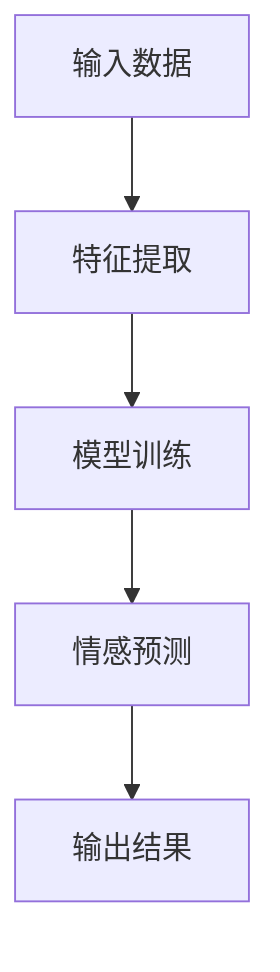
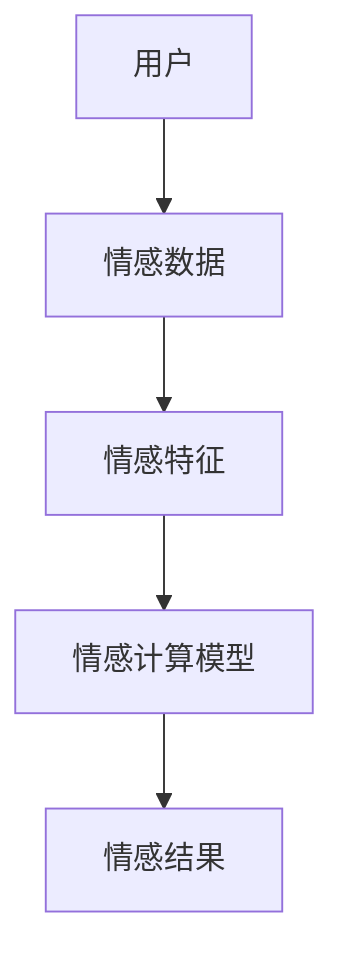
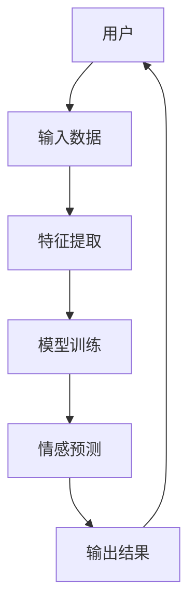
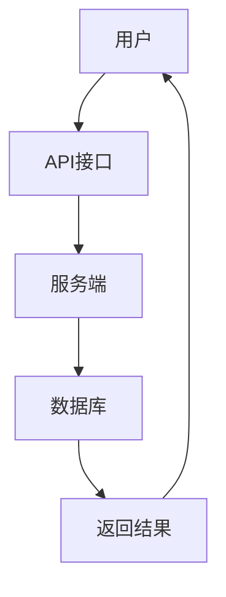

                 


# 情感计算：构建具有情商的AI Agent

---

## 关键词：
情感计算, AI Agent, 情商, 人机交互, 情感特征, 情感分类, 情感强度预测

---

## 摘要：
情感计算是人工智能领域的重要分支，旨在赋予AI代理理解和处理人类情感的能力。本文从情感计算的基本概念出发，分析其核心原理、算法实现、系统架构，并通过实际案例展示如何构建具有情商的AI Agent。文章内容涵盖情感计算的背景、核心概念、关键技术、算法原理、系统架构、项目实战及扩展与展望，旨在为读者提供全面的技术指导和实践参考。

---

# 第一部分：情感计算的背景与核心概念

## 第1章：情感计算的背景与问题背景

### 1.1 情感计算的定义与问题背景
#### 1.1.1 情感计算的定义
情感计算（Affective Computing）是研究如何赋予计算机理解和处理人类情感能力的学科，旨在通过技术手段捕捉、分析和模拟人类情感，从而实现更自然、更智能的人机交互。

#### 1.1.2 情感计算的核心问题与挑战
- **问题背景**：人类情感的复杂性、多样性和动态性使得情感计算面临诸多挑战。
- **核心问题**：
  - 如何准确捕捉和解析情感信号（如文本、语音、面部表情等）。
  - 如何建立情感与行为之间的关联模型。
  - 如何在实际场景中实现情感计算的实时性和高效性。

#### 1.1.3 情感计算的应用场景与边界
- **应用场景**：
  - 智能客服：通过情感分析优化用户体验。
  - 智能教育：根据学生情感状态调整教学策略。
  - 健康医疗：通过情感监测辅助诊断和治疗。
- **边界**：
  - 情感计算的局限性：无法完全理解人类情感的深度和复杂性。
  - 情感计算的伦理问题：隐私保护、情感数据的滥用风险。

### 1.2 情感计算的核心概念
#### 1.2.1 情感特征与情感维度
- **情感特征**：
  - 文本特征：关键词、句式、情感倾向。
  - 语音特征：语调、语速、音量。
  - 图像特征：面部表情、肢体语言。
- **情感维度**：
  - 情感类型：快乐、悲伤、愤怒、恐惧等。
  - 情感强度：情感的强烈程度。

#### 1.2.2 情感计算与传统AI的区别
- **传统AI**：
  - 侧重逻辑推理和事实判断。
  - 基于规则或数据的模式识别。
- **情感计算**：
  - 侧重情感理解与情感驱动的决策。
  - 需要结合多模态数据进行分析。

#### 1.2.3 情感计算的核心要素与组成
- **核心要素**：
  - 情感数据采集。
  - 情感特征提取。
  - 情感模型训练。
  - 情感结果应用。

---

## 第2章：情感计算的核心概念与联系

### 2.1 情感计算的核心原理
#### 2.1.1 情感特征的提取与分析
- **文本情感特征提取**：
  - 基于词袋模型（Bag of Words）。
  - 基于词嵌入模型（如Word2Vec、GloVe）。
- **语音情感特征提取**：
  - 频率、时域、频域特征。
  - 通过MFCC（Mel-Frequency Cepstral Coefficients）提取语音特征。
- **图像情感特征提取**：
  - 颜色、纹理、形状特征。
  - 基于CNN（卷积神经网络）提取图像特征。

#### 2.1.2 情感计算的数学模型
- **情感分类模型**：
  - 基于逻辑回归（Logistic Regression）的情感二分类。
  - 基于支持向量机（SVM）的情感多分类。
  - 基于深度学习（如LSTM、BERT）的情感分析。

#### 2.1.3 情感计算的系统架构


### 2.2 情感计算的核心概念对比
#### 2.2.1 情感计算与传统文本分析的对比
- **传统文本分析**：
  - 侧重关键词提取、文本分类。
  - 不考虑文本的情感倾向。
- **情感计算**：
  - 侧重情感特征提取、情感分类。
  - 考虑文本的情感倾向。

#### 2.2.2 情感计算与语音识别的对比
- **语音识别**：
  - 将语音信号转换为文字。
  - 侧重语音的识别准确率。
- **情感计算**：
  - 基于语音信号分析情感特征。
  - 侧重情感的识别与分类。

#### 2.2.3 情感计算与图像识别的对比
- **图像识别**：
  - 将图像中的物体识别出来。
  - 侧重图像的分类准确性。
- **情感计算**：
  - 基于图像分析情感特征。
  - 侧重情感的识别与分类。

### 2.3 情感计算的ER实体关系图


---

## 第3章：情感计算的关键技术

### 3.1 情感数据的采集与处理
#### 3.1.1 文本情感数据的采集
- **数据来源**：
  - 社交媒体评论。
  - 产品 reviews。
  - 客服对话记录。
- **数据清洗**：
  - 去除停用词、标点符号。
  - 处理歧义词、拼写错误。

#### 3.1.2 语音情感数据的采集
- **采集工具**：
  -麦克风、语音采集设备。
  - API（如Google Cloud Speech-to-Text）。

#### 3.1.3 图像情感数据的采集
- **采集工具**：
  - 摄像头、图像采集卡。
  - API（如OpenCV）。

### 3.2 情感特征的提取与分析
#### 3.2.1 基于文本的情感特征提取
- **词袋模型**：
  - 统计文本中的关键词出现频率。
- **词嵌入模型**：
  - 使用Word2Vec生成词向量。
- **情感强度分析**：
  - 基于情感词典（如AFinn、VADER）进行情感强度预测。

#### 3.2.2 基于语音的情感特征提取
- **特征提取**：
  - MFCC特征提取。
  - 时域特征（如均方根能量、零交叉率）。
  - 频域特征（如均方频谱、能量比）。

#### 3.2.3 基于图像的情感特征提取
- **特征提取**：
  - 颜色特征（如RGB直方图）。
  - 纹理特征（如Gabor滤波器）。
  - 面部表情特征（如眼眉、嘴唇的变化）。

### 3.3 情感计算模型的训练与优化
#### 3.3.1 情感分类模型的训练
- **模型选择**：
  - 传统机器学习模型（如SVM、随机森林）。
  - 深度学习模型（如LSTM、BERT）。
- **训练流程**：
  - 数据预处理。
  - 模型训练。
  - 模型评估（如准确率、召回率、F1值）。

#### 3.3.2 情感强度预测模型的优化
- **模型优化**：
  - 调整模型超参数（如学习率、批量大小）。
  - 使用交叉验证进行模型评估。
  - 引入情感词典进行特征增强。

#### 3.3.3 情感计算模型的评估与调优
- **评估指标**：
  - 准确率（Accuracy）。
  - 召回率（Recall）。
  - F1值（F1 Score）。
  - AUC-ROC曲线。

---

## 第4章：情感计算的算法原理

### 4.1 情感计算的算法流程


### 4.2 情感计算的数学模型
#### 4.2.1 情感分类的数学模型
$$ P(y|x) = \frac{P(x|y)P(y)}{P(x)} $$
其中，$P(y|x)$ 是在给定输入 $x$ 的条件下，情感类别 $y$ 的概率。

#### 4.2.2 情感强度预测的数学模型
$$ y = w_1x_1 + w_2x_2 + ... + w_nx_n + b $$
其中，$w_i$ 是特征 $x_i$ 的权重，$b$ 是偏置项。

---

## 第5章：情感计算的系统架构

### 5.1 情感计算系统的整体架构


### 5.2 情感计算系统的功能模块设计
#### 5.2.1 数据采集模块
- **功能**：采集用户输入的情感数据（文本、语音、图像）。
- **输入**：用户输入数据。
- **输出**：处理后的特征数据。

#### 5.2.2 模型训练模块
- **功能**：训练情感计算模型。
- **输入**：特征数据、标签数据。
- **输出**：训练好的模型。

#### 5.2.3 情感预测模块
- **功能**：基于训练好的模型进行情感预测。
- **输入**：特征数据。
- **输出**：情感预测结果。

### 5.3 情感计算系统的接口与交互设计


---

## 第6章：情感计算的项目实战

### 6.1 项目背景与目标
- **项目背景**：构建一个具有情商的AI Agent，能够理解用户情感并提供个性化服务。
- **项目目标**：
  - 实现情感数据采集。
  - 实现情感特征提取。
  - 实现情感分类与预测。
  - 实现情感驱动的交互。

### 6.2 项目环境与工具
- **环境要求**：
  - Python 3.8+
  - GPU支持（如NVIDIA GPU）。
- **工具选择**：
  - 数据采集：BeautifulSoup、Scrapy。
  - 特征提取：NLTK、spaCy。
  - 模型训练：TensorFlow、PyTorch。
  - 可视化：Matplotlib、Seaborn。

### 6.3 项目核心实现
#### 6.3.1 环境配置
```python
# 安装依赖包
pip install numpy pandas scikit-learn tensorflow matplotlib
```

#### 6.3.2 核心代码实现
```python
# 情感分类模型实现
import tensorflow as tf
from tensorflow.keras import layers

model = tf.keras.Sequential()
model.add(layers.Dense(64, activation='relu', input_shape=(n_features,)))
model.add(layers.Dense(1, activation='sigmoid'))

model.compile(optimizer='adam', loss='binary_crossentropy', metrics=['accuracy'])

# 模型训练
model.fit(X_train, y_train, epochs=10, batch_size=32, validation_split=0.2)
```

#### 6.3.3 案例分析与结果解读
- **案例分析**：
  - 输入文本：“这个产品真的很好用！”
  - 情感预测：正面情感。
  - 情感强度：0.9（非常正面）。

---

## 第7章：情感计算的扩展与展望

### 7.1 情感计算的研究热点
- **多模态情感计算**：结合文本、语音、图像等多种模态进行情感分析。
- **情感记忆与情感推理**：研究情感的长期记忆与情感驱动的推理。
- **情感增强的对话系统**：将情感计算应用于对话系统，提升用户体验。

### 7.2 情感计算的挑战与未来方向
- **挑战**：
  - 处理复杂情感状态的能力有限。
  - 情感数据的标注成本高。
  - 情感计算的实时性与效率问题。
- **未来方向**：
  - 结合边缘计算，提升情感计算的实时性。
  - 研究情感计算的隐私保护问题。
  - 探索情感计算在教育、医疗等领域的深度应用。

### 7.3 总结与最佳实践
- **总结**：
  - 情感计算是人工智能的重要分支，能够赋予AI代理理解和处理人类情感的能力。
  - 通过多模态数据的分析与深度学习模型的结合，情感计算在实际应用中展现出巨大潜力。
- **最佳实践**：
  - 数据预处理是情感计算的关键，需仔细清洗和标注数据。
  - 模型选择需根据具体场景和数据特点进行优化。
  - 情感计算的应用需注重伦理和隐私保护。

---

通过以上内容，我们逐步构建了《情感计算：构建具有情商的AI Agent》的技术博客文章，涵盖了情感计算的背景、核心概念、关键技术、算法原理、系统架构、项目实战及扩展与展望。希望本文能够为读者提供有价值的技术指导和实践参考。

