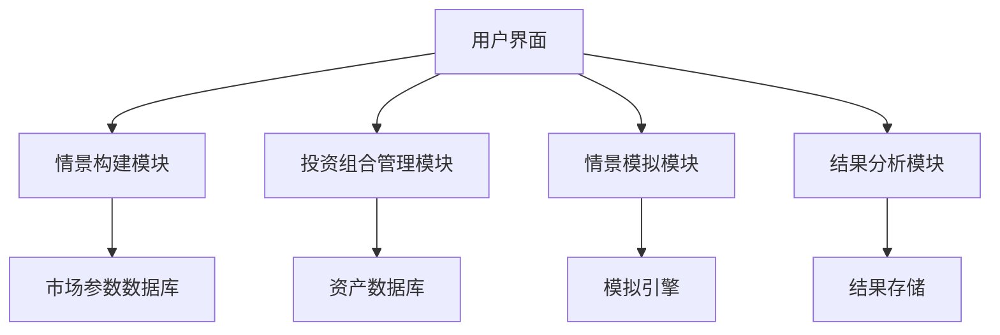

                 


# 情景分析：评估不同市场环境下的组合表现

## 关键词：情景分析、市场环境、组合表现、风险评估、投资策略

## 摘要：情景分析是一种评估投资组合在不同市场环境下表现的方法，通过分析各种可能的市场情景，投资者可以更好地理解投资组合的风险和收益。本文详细介绍了情景分析的核心概念、算法原理、系统设计以及实际应用，帮助读者全面掌握如何在不同市场环境下优化投资组合表现。

---

# 第一部分: 情景分析的背景与基础

## 第1章: 情景分析概述

### 1.1 情景分析的定义与核心概念

#### 1.1.1 什么是情景分析
情景分析（Scenario Analysis）是一种评估投资组合在不同市场环境下的表现的方法。它通过构建多种可能的市场情景，分析投资组合在这些情景下的收益和风险，从而帮助投资者做出更明智的投资决策。

#### 1.1.2 情景分析的核心要素
- **市场情景**：不同市场环境的假设，如牛市、熊市、平稳市场等。
- **投资组合**：投资者持有的资产组合，包括股票、债券、基金等。
- **收益与风险**：投资组合在不同情景下的收益和风险表现。

#### 1.1.3 情景分析的目标与意义
- **目标**：评估投资组合在不同市场环境下的表现，识别潜在风险和机会。
- **意义**：帮助投资者制定更加稳健的投资策略，优化资产配置。

### 1.2 市场环境与组合表现的关系

#### 1.2.1 市场环境的多样性
市场环境包括经济周期、通货膨胀、利率变化等多种因素，这些因素会影响投资组合的收益和风险。

#### 1.2.2 投资组合的表现特征
不同市场环境下，投资组合的表现差异显著。例如，牛市中股票可能表现优异，而熊市中债券可能更稳定。

#### 1.2.3 情景分析的适用场景
- 投资组合风险管理
- 资产配置优化
- 投资决策支持

### 1.3 情景分析的历史与发展

#### 1.3.1 情景分析的起源
情景分析起源于20世纪70年代，随着金融理论的发展逐渐成熟。

#### 1.3.2 情景分析的演变
从简单的假设情景到复杂的量化模型，情景分析不断进化，结合了概率论和统计学的方法。

#### 1.3.3 当前情景分析的应用现状
情景分析广泛应用于投资银行、资产管理、风险管理等领域，成为现代投资分析的重要工具。

---

## 第2章: 投资组合表现评估的基本原理

### 2.1 投资组合的风险与收益

#### 2.1.1 投资组合的收益来源
收益来源于资产价格的上涨、分红收入等。

#### 2.1.2 投资组合的风险类型
包括市场风险、流动性风险、信用风险等。

#### 2.1.3 风险与收益的平衡
在不同市场环境下，投资组合需要在风险和收益之间找到平衡点。

### 2.2 情景分析的核心框架

#### 2.2.1 情景分析的基本框架
- **情景构建**：定义可能的市场情景。
- **情景模拟**：计算投资组合在不同情景下的表现。
- **结果分析**：评估投资组合的风险和收益。

#### 2.2.2 情景分析的实施步骤
1. 确定分析目标和范围。
2. 构建可能的市场情景。
3. 选择投资组合。
4. 模拟情景，计算收益和风险。
5. 分析结果，制定策略。

#### 2.2.3 情景分析的关键指标
- 夏普比率（Sharpe Ratio）
- 价值-at-风险（VaR）
- 现金流预测

### 2.3 情景分析的数学模型

#### 2.3.1 投资组合收益的计算公式
$$
\text{收益} = \sum_{i=1}^{n} w_i \times r_i
$$
其中，\(w_i\) 是资产 \(i\) 的权重，\(r_i\) 是资产 \(i\) 的收益。

#### 2.3.2 情景分析的风险评估模型
$$
\text{VaR} = \text{损失的第 α 分位数}
$$
其中，α 是置信水平，通常为 95% 或 99%。

#### 2.3.3 情景分析的数学推导
通过概率分布和统计模型，情景分析可以量化投资组合在不同情景下的风险和收益。

---

## 第3章: 情景分析的核心概念与方法

### 3.1 情景分析的理论基础

#### 3.1.1 随机过程与概率分布
情景分析依赖于概率分布，如正态分布、t分布等。

#### 3.1.2 风险中性定价原理
在风险中性定价下，投资者预期未来收益的现值等于当前价格。

#### 3.1.3 资产定价模型
CAPM（资本资产定价模型）是情景分析的重要工具。

### 3.2 情景分析的关键指标

#### 3.2.1 投资组合的夏普比率
夏普比率衡量投资组合相对于其风险的超额收益。

#### 3.2.2 投资组合的VaR与CVaR
VaR是潜在损失的度量，CVaR是VaR的平均值。

#### 3.2.3 情景分析的敏感性指标
敏感性指标反映投资组合对不同情景的反应程度。

### 3.3 情景分析的对比分析

#### 3.3.1 不同情景下的收益对比
通过对比不同情景下的收益，识别投资组合的最佳表现情景。

#### 3.3.2 不同情景下的风险对比
分析不同情景下的风险，识别高风险情景。

#### 3.3.3 情景分析的综合评价
综合考虑收益和风险，对不同情景下的投资组合表现进行评价。

---

## 第4章: 情景分析的系统设计与实现

### 4.1 系统功能设计

#### 4.1.1 情景构建模块
- 定义市场情景，如牛市、熊市、平稳市场等。
- 输入市场参数，如利率、通货膨胀率等。

#### 4.1.2 投资组合管理模块
- 定义投资组合，包括资产权重和类型。
- 调整投资组合，优化资产配置。

#### 4.1.3 情景模拟模块
- 模拟不同情景下的投资组合表现。
- 计算收益和风险指标。

#### 4.1.4 结果分析模块
- 可视化投资组合在不同情景下的表现。
- 提供风险和收益的对比分析。

### 4.2 系统架构设计

#### 4.2.1 系统架构图


#### 4.2.2 模拟引擎
模拟引擎是系统的核心，负责计算投资组合在不同情景下的表现。

#### 4.2.3 数据库设计
- 市场参数数据库：存储利率、通货膨胀率等市场参数。
- 资产数据库：存储资产的历史价格和收益数据。

### 4.3 系统接口设计

#### 4.3.1 用户接口
用户通过界面输入市场参数和投资组合配置。

#### 4.3.2 API接口
提供API接口，方便其他系统调用情景分析功能。

### 4.4 系统交互设计

#### 4.4.1 用户操作流程
1. 用户输入市场参数和投资组合配置。
2. 系统构建市场情景。
3. 系统模拟投资组合表现。
4. 用户查看结果并进行分析。

#### 4.4.2 API调用流程
1. 调用方通过API传递参数。
2. 系统进行情景分析。
3. 返回结果数据。

---

## 第5章: 项目实战与案例分析

### 5.1 环境配置

#### 5.1.1 系统环境
- 操作系统：Linux/Windows/MacOS
- 开发工具：Python、Jupyter Notebook
- 数据库：MySQL/PostgreSQL
- 依赖库：NumPy、Pandas、Matplotlib、Scipy

#### 5.1.2 安装步骤
```bash
pip install numpy pandas matplotlib scipy
```

### 5.2 核心代码实现

#### 5.2.1 情景构建
```python
import numpy as np
import pandas as pd

# 定义市场情景
scenarios = ['bull', 'bear', 'stable']
market_returns = {
    'bull': 0.1,
    'bear': -0.05,
    'stable': 0.02
}
```

#### 5.2.2 投资组合管理
```python
# 定义投资组合
assets = ['stock', 'bond', 'cash']
weights = [0.5, 0.3, 0.2]
```

#### 5.2.3 情景模拟
```python
# 模拟投资组合在不同情景下的表现
def calculate_portfolio_return(weights, scenario_returns):
    return np.dot(weights, scenario_returns)

# 示例计算
print(calculate_portfolio_return(weights, market_returns))
```

#### 5.2.4 风险评估
```python
import scipy.stats as stats

# 计算VaR
returns = [0.1, -0.05, 0.02]
VaR = stats.norm.ppf(0.05, np.mean(returns), np.std(returns))
print(VaR)
```

### 5.3 案例分析

#### 5.3.1 案例背景
假设我们有一个投资组合，包含股票、债券和现金，权重分别为50%、30%和20%。我们需要评估该组合在牛市、熊市和稳定市场中的表现。

#### 5.3.2 实施步骤
1. 定义市场情景和收益。
2. 计算投资组合在不同情景下的收益。
3. 评估投资组合的风险。

#### 5.3.3 结果分析
- 牛市：收益为5%。
- 熊市：收益为-2%。
- 稳定市场：收益为1%。

### 5.4 项目总结

#### 5.4.1 关键点总结
- 情景构建是情景分析的基础。
- 投资组合管理是核心。
- 风险评估是关键。

#### 5.4.2 项目意义
通过项目实战，我们可以更好地理解情景分析的实际应用，掌握投资组合管理的关键技术。

---

## 第6章: 高级主题与扩展

### 6.1 多因素模型

#### 6.1.1 多因素模型的定义
多因素模型考虑多个因素对投资组合的影响，如市场因子、行业因子等。

#### 6.1.2 多因素模型的应用
在情景分析中，多因素模型可以更准确地模拟市场情景。

### 6.2 机器学习在情景分析中的应用

#### 6.2.1 机器学习的定义
机器学习是一种数据驱动的算法，能够从历史数据中学习规律。

#### 6.2.2 机器学习在情景分析中的应用
- 预测市场情景
- 优化投资组合
- 风险管理

### 6.3 风险管理与情景分析

#### 6.3.1 风险管理的定义
风险管理是识别、评估和应对投资组合风险的过程。

#### 6.3.2 风险管理与情景分析的关系
情景分析是风险管理的重要工具，帮助投资者识别和应对潜在风险。

---

## 第7章: 总结与展望

### 7.1 总结
情景分析是一种重要的投资分析工具，能够帮助投资者更好地理解投资组合在不同市场环境下的表现。

### 7.2 未来展望
随着人工智能和大数据技术的发展，情景分析将更加智能化和精准化。

### 7.3 最佳实践

#### 7.3.1 投资者建议
- 定期进行情景分析
- 优化资产配置
- 保持风险意识

#### 7.3.2 技术建议
- 采用多因素模型
- 应用机器学习技术
- 加强风险管理

### 7.4 注意事项
- 情景分析是一种工具，不能完全预测市场。
- 投资者需要结合实际情况进行决策。

### 7.5 拓展阅读
推荐阅读《投资学》、《风险管理》等书籍，深入理解情景分析的理论与实践。

---

通过以上步骤，我们可以全面理解情景分析的核心概念和实际应用，掌握在不同市场环境下评估投资组合表现的方法。希望本文能为读者提供有价值的参考和启示。

