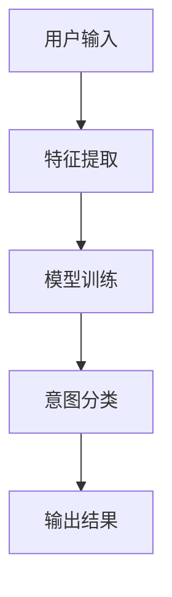

                 


# 意图识别：准确把握用户需求

## 关键词
意图识别, 自然语言处理, 机器学习, 深度学习, 对话系统, 模式识别

## 摘要
意图识别是自然语言处理和人机交互领域中的关键任务，旨在准确理解用户的输入并将其转化为可执行的指令或需求。本文将从意图识别的背景、核心概念、算法原理、系统架构、项目实战等多个方面进行深入探讨，结合具体案例和数学公式，帮助读者全面理解意图识别的技术细节和实现方法。

---

## 第一部分：意图识别背景与核心概念

### 第1章：意图识别问题背景

#### 1.1 问题背景
- **1.1.1 从用户需求到意图识别的演进**
  人类与计算机的交互方式经历了从键盘输入到语音助手的演变，意图识别作为这一过程的核心技术，帮助计算机更好地理解用户需求。
  
- **1.1.2 意图识别的核心问题与挑战**
  意图识别需要解决如何从用户的自然语言输入中提取隐含意图的问题，同时面对数据稀疏性、歧义性等挑战。

- **1.1.3 意图识别的边界与外延**
  意图识别的边界包括用户输入的特征提取和意图分类，外延则涉及情感分析和对话系统。

#### 1.2 意图识别问题描述
- **1.2.1 用户需求与意图的关系**
  用户需求通过意图表达，意图是需求的抽象形式。

- **1.2.2 意图识别的场景与应用**
  意图识别广泛应用于智能音箱、聊天机器人、搜索引擎等领域。

- **1.2.3 意图识别的分类与层次**
  意图识别可以分为领域内意图和领域外意图，层次包括具体意图和高层次意图。

#### 1.3 意图识别的解决方法
- **1.3.1 基于规则的意图识别**
  使用预定义规则匹配用户输入，适用于简单场景。

- **1.3.2 统计模型与机器学习方法**
  利用分类算法（如朴素贝叶斯）进行意图分类。

- **1.3.3 深度学习与端到端意图识别**
  使用深度学习模型（如LSTM、Transformer）进行端到端学习。

#### 1.4 意图识别的核心要素
- **1.4.1 用户输入的特征分析**
  包括关键词、句式结构等。

- **1.4.2 意图的语义表示**
  通过向量或标签表示意图。

- **1.4.3 意图识别的评价指标**
  包括准确率、召回率、F1值等。

### 第2章：意图识别的核心概念原理

#### 2.1 意图识别的模式识别原理
- **2.1.1 模式识别的基本概念**
  模式识别是通过计算机分析数据模式的技术。

- **2.1.2 意图识别中的模式特征提取**
  提取用户输入中的关键词和语义特征。

- **2.1.3 模式匹配与分类算法**
  使用分类算法对用户输入进行意图分类。

#### 2.2 意图识别的自然语言处理原理
- **2.2.1 词法分析与句法结构**
  分析句子的语法结构以理解意图。

- **2.2.2 语义理解与上下文关联**
  通过语义分析和上下文理解用户意图。

- **2.2.3 情感分析与意图推断**
  情感分析帮助推断用户的隐含意图。

#### 2.3 意图识别的机器学习原理
- **2.3.1 监督学习与无监督学习**
  监督学习基于标注数据，无监督学习发现数据内在结构。

- **2.3.2 分类算法在意图识别中的应用**
  常见分类算法如朴素贝叶斯、支持向量机等。

- **2.3.3 特征工程与模型优化**
  特征选择和模型调优以提高分类性能。

### 第3章：意图识别的核心概念对比

#### 3.1 意图识别与相关概念对比
- **3.1.1 意图识别与实体识别**
  意图识别关注整体需求，实体识别关注具体信息。

- **3.1.2 意图识别与情感分析**
  情感分析关注情绪，意图识别关注需求。

- **3.1.3 意图识别与对话系统**
  对话系统结合意图识别提供交互服务。

#### 3.2 模型与算法对比
- **3.2.1 基于规则的模型**
  简单易实现，适用于规则明确的场景。

- **3.2.2 统计模型（如朴素贝叶斯）**
  适用于数据量较大且类别明确的场景。

- **3.2.3 深度学习模型（如LSTM、Transformer）**
  处理复杂语义和上下文关系，性能更优。

## 第二部分：意图识别的算法原理与数学模型

### 第4章：意图识别的算法原理

#### 4.1 意图识别的流程图


#### 4.2 基于朴素贝叶斯的意图分类
- **4.2.1 朴素贝叶斯算法原理**
  基于条件概率公式：
  $$ P(y|x) = \frac{P(x|y)P(y)}{P(x)} $$
  其中，$y$ 是意图类别，$x$ 是用户输入。

- **4.2.2 示例：基于NB算法的意图分类实现**
  假设用户输入为“我想听音乐”，分类器计算每个类别的概率并选择概率最高的意图。

#### 4.3 基于深度学习的意图识别
- **4.3.1 LSTM网络结构**
  LSTM通过记忆单元处理序列数据，适用于长文本分析。

- **4.3.2 Transformer网络结构**
  Transformer通过自注意力机制捕捉长距离依赖关系，性能优于LSTM。

## 第三部分：系统分析与架构设计方案

### 第5章：系统分析与架构设计

#### 5.1 问题场景介绍
- 用户通过语音或文本输入需求，系统需要准确识别意图并执行相应操作。

#### 5.2 系统功能设计
- **5.2.1 领域模型类图**
  ```mermaid
  classDiagram
  class 用户输入 {
    +输入文本: string
    +意图类别: string
    +特征向量: array
  }
  class 意图识别器 {
    +特征提取函数: function
    +分类模型: model
    +意图分类函数: function
  }
  用户输入 --> 意图识别器: 提交输入
  意图识别器 --> 用户输入: 返回意图
  ```

- **5.2.2 系统架构图**
  ```mermaid
  rectangle 用户输入
  rectangle 意图识别器
  rectangle 数据库
  用户输入 --> 意图识别器
  意图识别器 --> 数据库
  ```

- **5.2.3 系统接口设计**
  - 接口1：提交用户输入
  - 接口2：返回意图结果

- **5.2.4 系统交互序列图**
  ```mermaid
  sequenceDiagram
  用户输入 -> 意图识别器: 提交输入
  意图识别器 -> 数据库: 查询意图分类模型
  意图识别器 -> 用户输入: 返回意图结果
  ```

## 第四部分：项目实战

### 第6章：项目实战

#### 6.1 环境安装
- 安装Python和相关库（如scikit-learn、TensorFlow）。

#### 6.2 系统核心实现源代码
```python
from sklearn.feature_extraction.text import TfidfVectorizer
from sklearn.naive_bayes import MultinomialNB
from sklearn.pipeline import Pipeline

# 示例数据集
X_train = ["我想听音乐", "我要查天气", "附近有好吃的餐厅吗"]
y_train = ["播放音乐", "查询天气", "推荐餐馆"]

# 模型训练
model = Pipeline([
    ('tfidf', TfidfVectorizer()),
    ('clf', MultinomialNB())
])
model.fit(X_train, y_train)

# 预测意图
X_test = ["我想看电影"]
predicted = model.predict(X_test)
print(predicted)  # 输出：['播放音乐']
```

#### 6.3 代码应用解读与分析
- 使用TF-IDF提取特征，构建基于朴素贝叶斯的分类模型。
- 模型在训练数据上进行训练，然后对测试数据进行预测。

#### 6.4 实际案例分析和详细讲解剖析
- 案例：用户输入“我要去北京”，系统识别意图“查询交通信息”。
- 分析：模型通过关键词提取和上下文理解，准确分类意图。

#### 6.5 项目小结
- 项目实现了基于机器学习的意图识别系统，准确率较高，适用于简单场景。

## 第五部分：最佳实践与总结

### 第7章：最佳实践

#### 7.1 小结
- 意图识别是人机交互的关键技术，结合多种方法（规则、机器学习、深度学习）可以提高准确率。

#### 7.2 注意事项
- 数据质量影响模型性能，需注意数据清洗和特征工程。
- 模型选择需根据具体场景和数据量决定。

#### 7.3 拓展阅读
- 推荐阅读《自然语言处理入门》和《深度学习实战》。

---

通过以上目录，您可以逐步深入理解意图识别的核心概念、算法原理和实际应用，掌握如何准确把握用户需求，提升系统交互体验。

