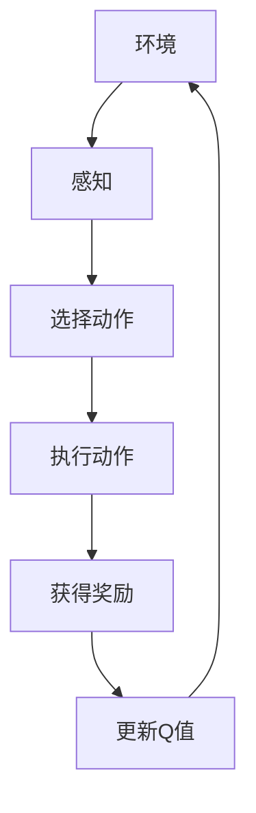
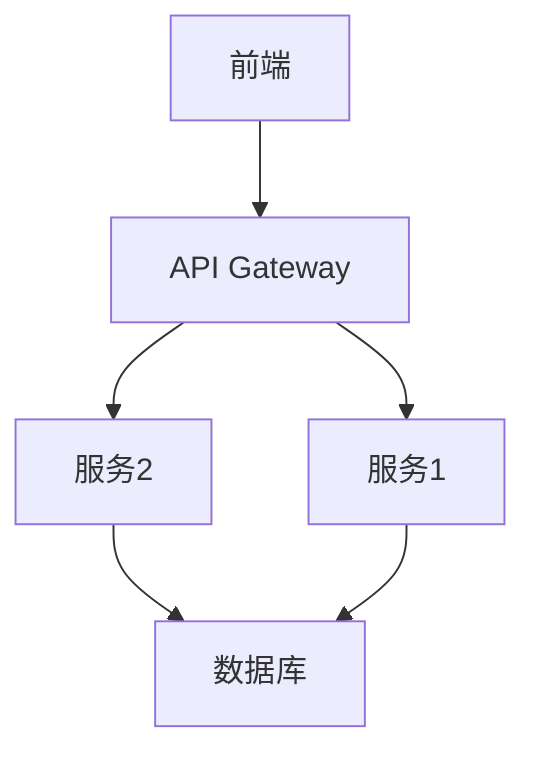
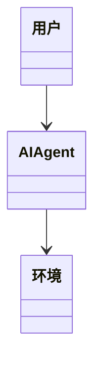
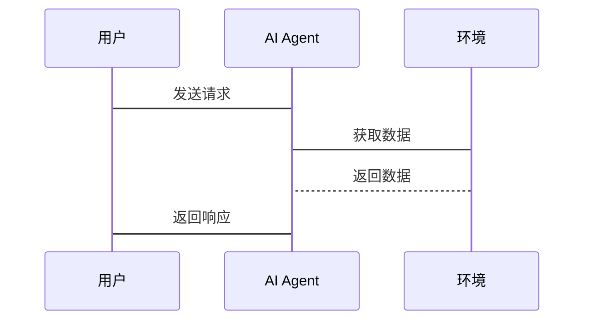

                 


# 成功企业级AI Agent应用案例分析

## 关键词
- 企业级AI Agent
- 成功案例
- 算法原理
- 系统架构
- 项目实战

## 摘要
企业级AI Agent作为人工智能领域的重要应用，正在改变各个行业的运作方式。本文将通过多个成功案例，详细分析AI Agent的核心技术、算法原理和系统架构，并结合实际项目实战，总结成功经验，为读者提供深入的技术见解和实践指导。

---

## 第1章: 引言

### 1.1 企业级AI Agent的背景与重要性

#### 1.1.1 什么是AI Agent？
AI Agent（人工智能代理）是指能够感知环境、自主决策并执行任务的智能体。它能够根据输入的信息做出响应，帮助用户完成特定任务。

#### 1.1.2 企业级AI Agent的定义与特点
企业级AI Agent是在企业环境中部署的AI代理，具有以下特点：
- 高可用性：支持7×24小时运行。
- 高可扩展性：能够处理大量数据和请求。
- 高安全性：确保数据和系统的安全。

#### 1.1.3 企业级AI Agent的应用背景
随着企业数字化转型的推进，AI Agent在客户服务、供应链管理、智能决策等领域发挥重要作用。

---

### 1.2 本书的目的与结构
本书旨在通过案例分析，深入探讨企业级AI Agent的技术实现和成功应用。结构安排如下：
1. 引言
2. 核心概念与技术
3. 算法原理
4. 成功案例分析
5. 系统架构与设计
6. 项目实战
7. 最佳实践
8. 结论

---

## 第2章: AI Agent的核心概念与技术

### 2.1 AI Agent的基本概念

#### 2.1.1 AI Agent的定义
AI Agent通过感知环境和执行动作来实现目标。

#### 2.1.2 AI Agent的类型
- **基于规则的AI Agent**：通过预定义规则进行决策。
- **基于模型的AI Agent**：使用领域知识进行推理。
- **基于学习的AI Agent**：通过机器学习模型进行决策。

#### 2.1.3 AI Agent的功能与特点
- **感知环境**：通过传感器或API获取数据。
- **自主决策**：基于数据做出决策。
- **执行任务**：通过执行器完成任务。

### 2.2 企业级AI Agent的关键技术

#### 2.2.1 自然语言处理（NLP）
NLP技术使AI Agent能够理解并生成自然语言文本。

#### 2.2.2 知识图谱与语义理解
知识图谱帮助AI Agent建立领域知识，并理解语义。

#### 2.2.3 强化学习与决策优化
强化学习用于优化AI Agent的决策策略。

### 2.3 AI Agent与相关技术的联系

#### 2.3.1 AI Agent与传统AI的区别
AI Agent具有自主性和目标性，而传统AI仅用于特定任务。

#### 2.3.2 AI Agent与机器学习的关系
AI Agent通常依赖机器学习模型进行决策。

#### 2.3.3 AI Agent与大数据分析的结合
大数据分析为AI Agent提供丰富的数据支持。

---

## 第3章: 企业级AI Agent的算法原理

### 3.1 AI Agent的核心算法

#### 3.1.1 基于规则的AI Agent
通过预定义规则进行决策，适用于简单场景。

#### 3.1.2 基于模型的AI Agent
基于领域知识进行推理，适用于复杂场景。

#### 3.1.3 基于深度学习的AI Agent
使用深度学习模型进行决策，适用于复杂任务。

### 3.2 AI Agent的数学模型与公式

#### 3.2.1 状态空间与动作空间的定义
- 状态空间：所有可能的状态集合。
- 动作空间：所有可能的动作集合。

#### 3.2.2 Q-learning算法的数学表达
$$ Q(s, a) = Q(s, a) + \alpha [r + \max_{a'} Q(s', a') - Q(s, a)] $$

#### 3.2.3 策略梯度方法的数学模型
$$ \nabla \theta J(\theta) = \mathbb{E}_{s,a}[ \nabla \log \pi_\theta(a|s) Q(s,a) ] $$

### 3.3 算法流程图
使用Mermaid绘制Q-learning算法流程图：



---

## 第4章: 成功企业级AI Agent的案例分析

### 4.1 零售行业的AI Agent应用

#### 4.1.1 案例背景与目标
某零售企业希望通过AI Agent优化客户服务。

#### 4.1.2 系统设计与实现
- **系统架构**：基于微服务架构。
- **技术选型**：使用NLP技术进行客户意图识别。

#### 4.1.3 成功经验与挑战
- 成功经验：实现了高效的客户交互。
- 挑战：需要持续优化模型。

### 4.2 金融行业的AI Agent应用

#### 4.2.1 案例背景与目标
某银行希望通过AI Agent提供智能客服。

#### 4.2.2 系统设计与实现
- **系统架构**：采用云原生架构。
- **技术选型**：使用强化学习进行决策优化。

#### 4.2.3 成功经验与挑战
- 成功经验：提高了客户满意度。
- 挑战：需要确保系统的安全性。

### 4.3 医疗行业的AI Agent应用

#### 4.3.1 案例背景与目标
某医院希望通过AI Agent辅助医生进行诊断。

#### 4.3.2 系统设计与实现
- **系统架构**：基于知识图谱构建医疗知识库。
- **技术选型**：使用深度学习进行诊断推理。

#### 4.3.3 成功经验与挑战
- 成功经验：提高了诊断效率。
- 挑战：需要处理大量医疗数据。

---

## 第5章: 系统架构与设计

### 5.1 系统架构设计

#### 5.1.1 系统架构图
使用Mermaid绘制系统架构图：



### 5.2 系统功能设计

#### 5.2.1 领域模型
使用Mermaid绘制领域模型类图：



### 5.3 系统接口设计

#### 5.3.1 接口设计
- **输入接口**：接收用户请求。
- **输出接口**：返回处理结果。

### 5.4 系统交互设计

#### 5.4.1 交互序列图
使用Mermaid绘制交互序列图：



---

## 第6章: 项目实战

### 6.1 环境安装

#### 6.1.1 安装Python
```bash
python --version
pip install --upgrade pip
```

#### 6.1.2 安装依赖
```bash
pip install numpy tensorflow
```

### 6.2 系统核心实现源代码

#### 6.2.1 AI Agent实现
```python
class AI-Agent:
    def __init__(self):
        self.model = self.build_model()

    def build_model(self):
        # 构建模型
        pass

    def perceive(self, input):
        # 感知环境
        pass

    def decide(self, state):
        # 决策
        pass
```

### 6.3 代码应用解读与分析
分析上述代码，AI Agent类初始化模型，并通过`perceive`和`decide`方法实现感知和决策。

### 6.4 实际案例分析
以某零售企业的AI Agent为例，分析其实现过程。

### 6.5 项目小结
总结项目实施的经验和教训。

---

## 第7章: 最佳实践

### 7.1 设计原则
- **模块化**：确保系统模块清晰。
- **可扩展性**：支持功能扩展。
- **安全性**：确保数据安全。

### 7.2 性能优化
- **缓存技术**：减少重复计算。
- **并行计算**：提高处理效率。

### 7.3 伦理与法律
- **数据隐私**：遵守相关法律法规。
- **伦理问题**：确保AI Agent的决策符合伦理。

### 7.4 未来趋势
- **AI Agent的智能化**：进一步提升智能水平。
- **多模态交互**：支持更多交互方式。

---

## 第8章: 结论

### 8.1 全文总结
企业级AI Agent在多个行业的成功应用，离不开核心技术的支持和系统的优化。

### 8.2 未来展望
未来，随着技术进步，AI Agent将在更多领域发挥重要作用。

---

通过以上章节，我们详细分析了企业级AI Agent的核心技术、成功案例和系统设计，为读者提供了全面的技术见解和实践指导。

