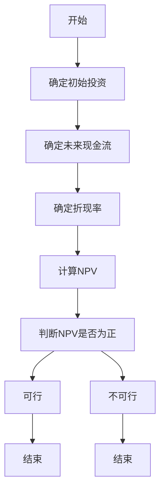

                 


# 成本效益分析

> 关键词：成本效益分析、净现值、内部收益率、成本计算、收益评估、经济效益最大化

> 摘要：成本效益分析是评估项目或决策经济性的核心方法，通过分析投入与收益的关系，优化资源配置，实现经济效益最大化。本文从基础概念、算法原理到系统架构，全面解析成本效益分析的核心思想，并结合实际案例，深入探讨其在IT项目中的应用。

---

## 第一部分: 成本效益分析基础

### 第1章: 成本效益分析的基本概念

#### 1.1 问题背景与问题描述

成本效益分析（Cost-Benefit Analysis，CBA）是一种评估项目或决策经济性的方法，通过比较投入与收益，判断某项决策是否具有可行性。在IT项目中，成本效益分析常用于评估新技术引入、系统优化等方案的经济效益。

- **问题背景**：企业在有限资源下，如何选择最优项目以实现最大收益？
- **问题描述**：成本效益分析帮助企业在多个项目中选择经济效益最佳的方案。

#### 1.2 成本效益分析的核心要素

- **成本**：项目的投入，包括直接成本（如开发费用）和间接成本（如维护费用）。
- **收益**：项目带来的经济回报，包括直接收益（如收入增长）和间接收益（如效率提升）。
- **净现值（NPV）**：收益现值减去成本现值，是评估项目可行性的关键指标。

---

### 第2章: 成本效益分析的核心概念与联系

#### 2.1 成本、收益与净现值的原理

- **成本的计算方法**：
  - 确定项目的初始投资、运营成本等。
  - 例如：开发新系统，初始投资为100万元，年运营成本为20万元。

- **收益的计算方法**：
  - 包括直接收益和间接收益。
  - 例如：新系统上线后，每年增加收入50万元，节省人工成本20万元。

- **净现值（NPV）的计算公式**：
  $$ NPV = \sum_{t=0}^{n} \frac{C_t}{(1+r)^t} $$
  其中，\( C_t \)为第t年的现金流，\( r \)为折现率。

#### 2.2 成本效益分析的对比分析

- **对比表格**：
  | 概念 | 定义 | 计算公式 |
  |------|------|----------|
  | 成本 | 投入 | \( C = \sum C_t \) |
  | 收益 | 回报 | \( R = \sum R_t \) |
  | 净现值 | 收益现值减去成本现值 | \( NPV = R - C \) |

- **ER实体关系图**：
  ```mermaid
  graph TD
      A[成本] --> B[收益]
      B --> C[净现值]
      A --> C
  ```

---

## 第二部分: 成本效益分析的算法原理

### 第3章: 成本效益分析的数学模型与公式

#### 3.1 成本效益分析的数学模型

- **净现值（NPV）公式**：
  $$ NPV = \sum_{t=0}^{n} \frac{C_t}{(1+r)^t} $$
  例如：初始投资100万元，年收益率为10%，折现率为8%。
  $$ NPV = -100 + \frac{50}{1.08} + \frac{50}{1.08^2} + \dots + \frac{50}{1.08^5} $$

- **内部收益率（IRR）公式**：
  $$ IRR = r \text{ 使得 } NPV = 0 $$

#### 3.2 成本效益分析的算法流程



---

### 第4章: 成本效益分析的系统架构设计

#### 4.1 问题场景介绍

假设某企业计划开发一个新系统，需评估其经济效益。系统功能包括成本计算、收益预测、净现值计算等。

#### 4.2 系统功能设计

- **领域模型（Mermaid类图）**：
  ```mermaid
  classDiagram
      class 成本计算 {
          计算初始投资
          计算运营成本
      }
      class 收益预测 {
          预测收入增长
          预测成本节约
      }
      class 净现值计算 {
          计算NPV
      }
      成本计算 --> 净现值计算
      收益预测 --> 净现值计算
  ```

- **系统架构设计（Mermaid架构图）**：
  ```mermaid
  architecture
      前端 --> 成本效益分析模块
      成本效益分析模块 --> 数据库
      数据库 --> 后端服务
  ```

---

## 第三部分: 成本效益分析的项目实战

### 第5章: 成本效益分析工具开发

#### 5.1 环境安装

- **工具安装**：安装Python、Jupyter Notebook、Mermaid工具。
- **依赖库安装**：安装numpy、pandas、matplotlib用于数据计算和可视化。

#### 5.2 核心代码实现

```python
import numpy as np

def calculate_npv(cash_flows, discount_rate):
    return np.npv(discount_rate, cash_flows)

# 示例数据
cash_flows = [-100, 50, 50, 50, 50, 50]
discount_rate = 0.08

npv = calculate_npv(cash_flows, discount_rate)
print(f"净现值为：{npv}")
```

---

### 第6章: 最佳实践与总结

#### 6.1 总结

- 成本效益分析是优化资源配置的重要工具。
- 准确的数据输入和合理的折现率选择直接影响结果。
- 在实际应用中，需结合企业战略目标，综合考虑风险因素。

#### 6.2 注意事项

- 确保数据的准确性和完整性。
- 合理选择折现率，避免高估或低估NPV。
- 结合定量分析与定性分析，全面评估项目可行性。

#### 6.3 拓展阅读

- 《Financial Analysis and Decision Making》
- 《Net Present Value and How to Use It in Making Investment Decisions》

---

通过本文的详细分析，读者可以系统地掌握成本效益分析的核心思想，并将其应用于实际项目中，从而做出科学的决策，实现经济效益的最大化。

