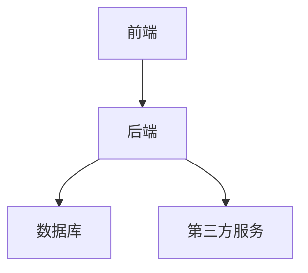

                 


# 打造用户友好的AI Agent交互界面

> 关键词：AI Agent，用户友好，交互界面，自然语言处理，系统架构，项目实战

> 摘要：随着人工智能技术的快速发展，AI Agent在各个领域的应用越来越广泛。然而，如何设计出用户友好的AI Agent交互界面，使其更符合人类的使用习惯和需求，是一个值得深入探讨的重要课题。本文将从AI Agent的核心概念、自然语言处理技术、系统架构设计、项目实战等多个方面进行详细分析，帮助读者理解如何打造用户友好的AI Agent交互界面。

---

## 第1章 背景与概念

### 1.1 AI Agent的基本概念

AI Agent（人工智能代理）是指能够感知环境并采取行动以实现目标的智能实体。它可以是一个软件程序、一个机器人，甚至是嵌入在设备中的算法。AI Agent的核心在于其自主性、反应性和目标导向性。

#### 1.1.1 什么是AI Agent
- **自主性**：AI Agent能够在没有外部干预的情况下独立运作。
- **反应性**：能够根据环境的变化调整自己的行为。
- **目标导向性**：通过实现特定目标来提供服务。

#### 1.1.2 AI Agent的类型
AI Agent可以分为以下几类：
1. **简单反射型Agent**：基于当前输入做出反应，不考虑长期目标。
2. **基于模型的反射型Agent**：利用内部模型来规划和推理。
3. **目标导向型Agent**：根据目标选择最优行动。
4. **实用导向型Agent**：通过最大化效用函数来优化决策。

#### 1.1.3 用户友好的交互界面的重要性
用户友好的交互界面是AI Agent成功的关键。复杂的界面会让用户感到困惑，而简洁直观的界面则能提升用户体验和满意度。

### 1.2 用户友好的交互界面的背景

#### 1.2.1 当前AI交互界面的痛点
- **复杂性**：许多AI交互界面功能繁多，操作复杂。
- **不一致性**：不同AI系统之间的交互方式不统一，增加了用户的学习成本。
- **反馈不足**：用户在与AI交互时，常常无法获得足够的反馈，导致体验不佳。

#### 1.2.2 用户友好的设计原则
- **简洁性**：界面设计简洁，功能一目了然。
- **一致性**：保持交互方式的一致性，减少用户的认知负担。
- **反馈及时性**：在用户操作后，及时提供明确的反馈。

#### 1.2.3 技术与用户需求的结合
AI Agent的交互界面设计需要结合技术实现和用户需求。技术方面包括自然语言处理、机器学习等，而用户需求则关注用户体验和易用性。

### 1.3 AI Agent交互界面的核心要素

#### 1.3.1 交互的定义与特点
- **交互性**：用户与AI Agent之间的双向通信。
- **实时性**：用户操作后，AI Agent能够立即响应。

#### 1.3.2 用户体验的核心要素
- **可用性**：界面是否易于使用。
- **可访问性**：是否适合所有用户，包括残障人士。
- **可学习性**：用户是否能够快速掌握界面的操作方法。

#### 1.3.3 界面设计的边界与外延
- **边界**：界面设计的范围，例如功能模块的划分。
- **外延**：界面设计对其他系统模块的影响，例如数据处理和存储。

## 第2章 AI Agent的核心概念与交互机制

### 2.1 AI Agent的定义与属性

#### 2.1.1 AI Agent的定义
AI Agent是一种能够感知环境并采取行动以实现目标的智能实体。它通过与环境的交互，不断优化自身的决策过程。

#### 2.1.2 AI Agent的属性对比
以下是一个对比表格，展示了AI Agent的主要属性：

| 属性 | 描述 |
|------|------|
| 自主性 | 能够独立运作 |
| 反应性 | 能够根据环境变化调整行为 |
| 目标导向性 | 以实现特定目标为导向 |
| 学习能力 | 能够通过经验改进性能 |

#### 2.1.3 核心概念的ER实体关系图
以下是AI Agent交互界面的核心概念ER实体关系图：

```mermaid
erDiagram
    actor 用户
    agent AI_Agent
    interaction 交互
    action 行动
    feedback 反馈

    用户 --> 交互 : 发起交互
    交互 --> AI_Agent : 传递请求
    AI_Agent --> action : 执行行动
    action --> 反馈 : 返回结果
    反馈 --> 用户 : 提供反馈
```

### 2.2 交互机制的原理

#### 2.2.1 交互模型的原理
AI Agent的交互模型通常包括以下步骤：
1. **用户发起请求**：用户通过界面输入需求。
2. **请求处理**：AI Agent解析请求并生成响应。
3. **反馈用户**：AI Agent将处理结果反馈给用户。

#### 2.2.2 交互机制的流程图
以下是交互机制的流程图：

```mermaid
graph TD
    A[用户] -> B[发起请求]
    B -> C[AI Agent处理请求]
    C -> D[生成反馈]
    D -> E[反馈给用户]
```

#### 2.2.3 交互过程中的关键环节
- **请求解析**：AI Agent需要准确理解用户的意图。
- **响应生成**：根据解析结果生成合适的反馈。
- **反馈优化**：通过用户反馈不断优化交互过程。

### 2.3 用户友好的设计原则

#### 2.3.1 设计原则的总结
- **简洁性**：界面设计简洁直观。
- **一致性**：保持交互方式的统一性。
- **可学习性**：用户能够快速掌握界面的操作方法。

#### 2.3.2 设计原则的对比表格
以下是一个设计原则对比表格：

| 原则 | 优点 | 缺点 |
|------|------|------|
| 简洁性 | 提高用户体验 | 可能忽略部分功能 |
| 一致性 | 减少用户学习成本 | 可能限制创新性 |
| 可学习性 | 用户易于上手 | 需要额外的时间和资源 |

#### 2.3.3 设计原则的实际应用
在实际应用中，设计原则需要根据具体场景进行调整。例如，在医疗AI Agent中，交互界面需要特别注重准确性和反馈及时性。

## 第3章 自然语言处理与对话系统

### 3.1 自然语言处理的基础

#### 3.1.1 NLP的基本概念
自然语言处理（NLP）是研究如何让计算机理解和生成人类语言的技术。

#### 3.1.2 NLP的核心算法
- **分词**：将文本分割成有意义的词语或短语。
- **句法分析**：分析句子的语法结构。
- **语义分析**：理解文本的语义含义。

#### 3.1.3 NLP在对话系统中的应用
NLP在对话系统中主要用于请求解析和响应生成。例如，当用户输入“我想听音乐”时，系统需要理解用户的意图并返回合适的音乐列表。

### 3.2 对话系统的架构设计

#### 3.2.1 对话系统的处理流程
1. **用户输入**：用户通过界面输入请求。
2. **请求解析**：NLP模块解析用户的意图。
3. **响应生成**：系统根据解析结果生成响应。
4. **反馈用户**：将响应返回给用户。

#### 3.2.2 对话系统的mermaid流程图
以下是对话系统的流程图：

```mermaid
graph TD
    A[用户输入] -> B[NLP解析] 
    B -> C[生成响应]
    C -> D[反馈给用户]
```

#### 3.2.3 对话系统中的情感理解
情感理解是对话系统的重要组成部分。通过分析用户的语言和语调，系统可以更好地理解用户的情感状态。

### 3.3 对话生成与优化

#### 3.3.1 对话生成的数学模型
对话生成通常基于概率模型。例如，生成一个响应的概率可以表示为：

$$ P(y|x) = \frac{1}{Z} \exp(\theta \cdot f(x,y)) $$

其中，$x$ 是输入，$y$ 是输出，$\theta$ 是模型参数，$f$ 是特征函数。

#### 3.3.2 对话生成的优化方法
- **基于强化学习的优化**：通过强化学习优化对话生成的策略。
- **基于对抗训练的优化**：通过生成对抗网络（GAN）优化对话生成的质量。

#### 3.3.3 对话生成的实际案例
例如，当用户输入“今天天气怎么样”，系统需要生成一个与天气相关的响应，如“今天天气晴朗，适合外出”。

## 第4章 系统架构与技术实现

### 4.1 系统架构设计

#### 4.1.1 整体架构
AI Agent交互界面的系统架构通常包括前端和后端两部分。前端负责用户界面的展示和交互，后端负责处理请求和生成响应。

#### 4.1.2 前端设计
前端设计需要注重用户体验，例如：
- 使用简洁的布局和一致的颜色 scheme。
- 提供清晰的导航和反馈机制。

#### 4.1.3 后端设计
后端设计需要注重系统的稳定性和扩展性，例如：
- 使用高效的API接口。
- 提供灵活的扩展接口。

#### 4.1.4 系统架构的mermaid图
以下是系统架构的mermaid图：



### 4.2 数据处理与存储

#### 4.2.1 数据处理流程
数据处理流程包括数据清洗、特征提取和数据存储。

#### 4.2.2 数据存储方案
常用的存储方案包括：
- **关系型数据库**：如MySQL、PostgreSQL。
- **非关系型数据库**：如MongoDB、Redis。

#### 4.2.3 数据处理的优化方法
- **并行处理**：利用多线程或分布式计算提高处理效率。
- **缓存优化**：通过缓存技术减少重复计算。

### 4.3 系统安全性设计

#### 4.3.1 安全性原则
- **最小权限原则**：用户权限最小化。
- **数据加密**：敏感数据加密存储和传输。

#### 4.3.2 安全性实现
- **身份验证**：通过OAuth、JWT等技术实现用户身份验证。
- **访问控制**：通过RBAC（基于角色的访问控制）实现权限管理。

#### 4.3.3 安全性测试
- **渗透测试**：模拟攻击测试系统漏洞。
- **代码审计**：审查代码发现潜在的安全问题。

## 第5章 项目实战

### 5.1 环境搭建

#### 5.1.1 开发环境
- **操作系统**：Windows、Linux、macOS。
- **开发工具**：IDE（如PyCharm、VS Code）。
- **编程语言**：Python。

#### 5.1.2 依赖安装
安装必要的依赖库，例如：
- `pip install numpy`
- `pip install pandas`
- `pip install matplotlib`

### 5.2 系统核心实现

#### 5.2.1 对话解析实现
实现一个简单的对话解析模块，例如：

```python
def parse_request(user_input):
    # 分词
    words = tokenize(user_input)
    # 实体识别
    entities = extract_entities(words)
    return entities
```

#### 5.2.2 反馈机制实现
实现一个简单的反馈机制，例如：

```python
def generate_response(entities):
    response = "请问您需要什么帮助？"
    return response
```

### 5.3 代码应用解读与分析

#### 5.3.1 代码解读
- `tokenize`：分词函数，将用户输入分割成词语。
- `extract_entities`：实体识别函数，提取关键实体。

#### 5.3.2 代码优化
- **性能优化**：使用缓存技术减少重复计算。
- **代码结构优化**：采用模块化设计，提高代码的可维护性。

### 5.4 实际案例分析

#### 5.4.1 案例背景
假设我们正在开发一个智能客服系统，用户输入“我需要帮助处理订单”。

#### 5.4.2 案例实现
通过对话解析模块，系统识别出用户的意图是处理订单，并生成相应的反馈。

## 第6章 优化与扩展

### 6.1 性能优化

#### 6.1.1 算法优化
- **模型优化**：通过减少参数数量或使用更高效的算法提高处理速度。
- **数据优化**：通过数据清洗和特征选择提高模型性能。

#### 6.1.2 系统优化
- **并行计算**：利用多核处理器提高计算速度。
- **分布式计算**：利用分布式系统处理大规模数据。

### 6.2 功能扩展

#### 6.2.1 多模态交互
- **视觉交互**：通过图像或视频提供交互界面。
- **语音交互**：通过语音识别和合成实现语音交互。

#### 6.2.2 智能推荐
- **基于协同过滤的推荐**：根据用户行为推荐相关内容。
- **基于内容的推荐**：根据内容相似性推荐相关内容。

### 6.3 安全性与隐私

#### 6.3.1 安全性优化
- **身份验证**：通过多因素认证提高安全性。
- **访问控制**：通过RBAC实现严格的访问控制。

#### 6.3.2 隐私保护
- **数据匿名化**：通过匿名化处理保护用户隐私。
- **数据加密**：通过加密技术保护数据安全。

## 第7章 总结与展望

### 7.1 总结
本文从AI Agent的核心概念、自然语言处理技术、系统架构设计、项目实战等多个方面进行了详细分析。通过理论与实践的结合，帮助读者理解如何打造用户友好的AI Agent交互界面。

### 7.2 展望
未来，随着AI技术的不断发展，AI Agent的交互界面将更加智能化和个性化。我们需要不断优化现有技术，探索新的交互方式，以满足用户日益增长的需求。

---

**结语**：打造用户友好的AI Agent交互界面是一个复杂而有趣的过程。通过深入理解用户需求，结合先进的技术手段，我们可以创造出更智能、更便捷的交互体验。希望本文能够为读者提供有价值的参考和启发。

