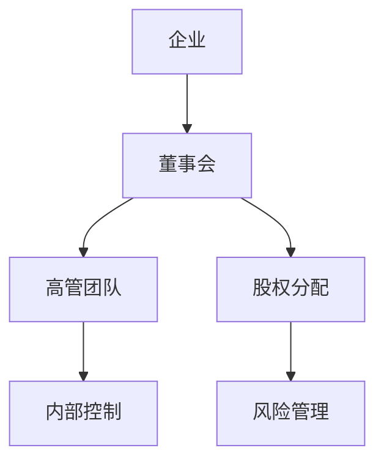
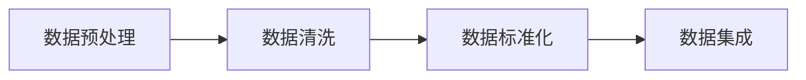
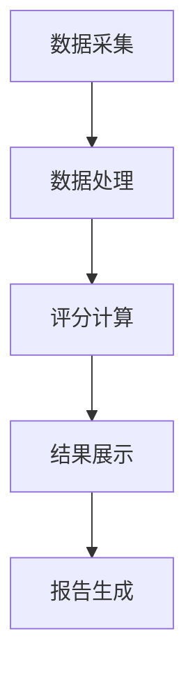
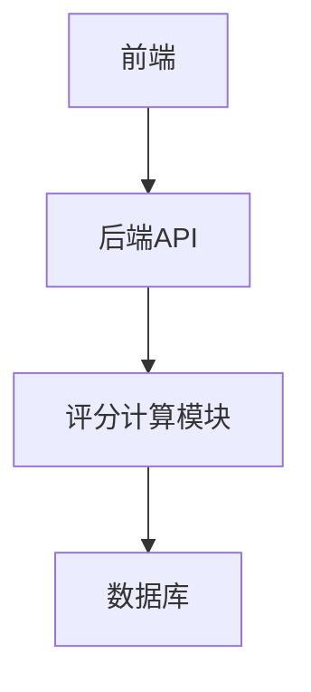

                 


# 托马斯·罗恩的公司治理评分系统

> 关键词：公司治理，评分系统，算法原理，系统架构，项目实战

> 摘要：本文详细介绍了托马斯·罗恩的公司治理评分系统，从背景、核心概念到算法原理、系统架构，再到项目实战，全面解析该系统的构建与应用。通过本文，读者可以深入了解如何通过评分系统量化公司治理，并在实际场景中应用该系统进行优化与改进。

---

# 第1章: 公司治理评分系统背景介绍

## 1.1 公司治理的基本概念

### 1.1.1 公司治理的定义与核心要素
公司治理是指对公司战略、组织结构、管理流程和决策机制等进行规划和优化的过程。其核心要素包括：董事会结构、高管团队、股权分配、内部控制、风险管理、透明度和合规性等。

### 1.1.2 公司治理的现状与挑战
随着全球化和数字化的快速发展，公司治理面临诸多挑战，如利益相关者多元化、信息不对称、决策透明度不足、风险控制难度增加等问题。传统公司治理模式难以适应现代企业的复杂需求。

### 1.1.3 托马斯·罗恩评分系统的研究背景
托马斯·罗恩（Thomas Rown）提出的公司治理评分系统，旨在通过量化评估企业治理的优劣，帮助企业识别问题、优化管理流程并提升整体治理水平。

---

## 1.2 托马斯·罗恩评分系统的提出

### 1.2.1 问题背景与问题描述
现有公司治理评估方法多为定性分析，难以量化比较。托马斯·罗恩评分系统通过构建量化指标，将公司治理的各项要素转化为可量化的分数，便于企业进行横向对比和纵向优化。

### 1.2.2 问题解决思路与目标
通过构建多维度的评分指标体系，结合数据分析技术，量化评估企业治理水平，帮助企业发现潜在问题，优化管理流程，提升治理效率。

### 1.2.3 系统的边界与外延
托马斯·罗恩评分系统主要关注公司治理的核心要素，包括董事会结构、高管团队、股权分配、内部控制和风险管理等。其外延可扩展至企业绩效、可持续发展和社会责任等领域。

---

# 第2章: 核心概念与联系

## 2.1 评分模型的原理与特征

### 2.1.1 评分模型的原理
托马斯·罗恩评分系统通过构建多维度的指标体系，结合权重分配和数据处理技术，计算出企业的治理评分。其核心原理包括：
1. 指标体系构建：选择关键治理要素，构建指标体系。
2. 数据采集与处理：收集企业治理相关的数据，进行清洗和预处理。
3. 权重分配：根据各治理要素的重要性，分配权重。
4. 评分计算：基于指标和权重，计算综合评分。

### 2.1.2 模型的特征与属性对比
| 特征 | 描述 |
|------|------|
| 多维性 | 包括董事会结构、高管团队等多个维度 |
| 定量性 | 通过量化指标评估治理水平 |
| 可扩展性 | 可根据需求扩展评估维度 |
| 实时性 | 支持实时数据更新与评分计算 |

### 2.1.3 模型的优缺点分析
- **优点**：量化评估，便于横向对比和纵向优化。
- **缺点**：依赖数据质量，模型的权重分配可能影响评分结果。

---

## 2.2 实体关系图展示

### 2.2.1 实体关系图的构建


### 2.2.2 实体关系图的分析
通过实体关系图可以看出，企业的治理结构由董事会、高管团队、股权分配等多个关键要素构成，各要素之间相互关联，共同影响企业的治理水平。

---

# 第3章: 算法原理讲解

## 3.1 评分计算的算法流程

### 3.1.1 数据预处理流程
1. 数据清洗：剔除无效数据，处理缺失值。
2. 数据标准化：将数据归一化，便于后续计算。
3. 数据集成：整合来自不同来源的数据。



### 3.1.2 评分计算的步骤
1. 指标权重分配：根据各治理要素的重要性，分配权重。
2. 计算各指标评分：基于权重和数据，计算各指标的评分。
3. 综合评分计算：将各指标评分加权求和，得到最终评分。

### 3.1.3 结果输出的处理
1. 评分结果展示：输出企业治理评分。
2. 分析报告生成：根据评分结果，生成分析报告。
3. 改进建议提出：基于报告，提出改进建议。

---

## 3.2 算法的数学模型与公式

### 3.2.1 模型的数学表达式
综合评分公式：
$$ S = \sum_{i=1}^{n} (w_i \times s_i) $$
其中，$S$ 为综合评分，$w_i$ 为第 $i$ 个指标的权重，$s_i$ 为第 $i$ 个指标的评分。

---

## 3.3 算法的代码实现

### 3.3.1 环境安装与配置
```bash
pip install numpy pandas scikit-learn
```

### 3.3.2 核心算法的Python代码
```python
import numpy as np
import pandas as pd

def governance_score(data, weights):
    # 数据预处理
    data = data.dropna()
    data = (data - data.min()) / (data.max() - data.min())
    
    # 计算各指标评分
    scores = data.dot(weights)
    
    return scores.mean()

# 示例数据
data = pd.DataFrame({
    'board_structure': [0.8, 0.7, 0.9],
    'executive_team': [0.6, 0.8, 0.7],
    'shareholding': [0.5, 0.6, 0.4],
    'internal_control': [0.7, 0.6, 0.8],
    'risk_management': [0.6, 0.7, 0.5]
})

# 权重分配
weights = np.array([0.2, 0.2, 0.2, 0.2, 0.2])

# 计算评分
score = governance_score(data, weights)
print(f"治理评分：{score}")
```

---

# 第4章: 系统分析与架构设计方案

## 4.1 系统应用场景与目标

### 4.1.1 应用场景的描述
托马斯·罗恩评分系统适用于企业自评、第三方评估、投资者决策支持等多种场景。

### 4.1.2 系统的目标与功能
系统目标：量化评估企业治理水平，提供改进建议。
系统功能：数据采集、评分计算、结果展示、报告生成。

---

## 4.2 系统功能设计

### 4.2.1 功能模块的划分


---

## 4.3 系统架构设计

### 4.3.1 系统架构的总体设计


---

# 第5章: 项目实战

## 5.1 项目环境的安装与配置
```bash
pip install flask numpy pandas
```

## 5.2 系统核心实现源代码
```python
from flask import Flask, request, jsonify

app = Flask(__name__)

@app.route('/api/governance_score', methods=['POST'])
def governance_score():
    data = request.json
    weights = np.array(data['weights'])
    scores = data['scores']
    
    # 计算评分
    score = np.dot(scores, weights)
    
    return jsonify({'result': score})

if __name__ == '__main__':
    app.run(debug=True)
```

---

## 5.3 案例分析与详细解读

### 5.3.1 案例背景
某企业希望对其治理水平进行评估，数据包括董事会结构、高管团队、股权分配等。

### 5.3.2 数据预处理
```python
data = pd.DataFrame({
    'board_structure': [0.8, 0.7, 0.9],
    'executive_team': [0.6, 0.8, 0.7],
    'shareholding': [0.5, 0.6, 0.4],
    'internal_control': [0.7, 0.6, 0.8],
    'risk_management': [0.6, 0.7, 0.5]
})

# 数据标准化
data = (data - data.min()) / (data.max() - data.min())
```

---

## 5.4 项目小结

### 5.4.1 系统实现的关键点
1. 数据预处理与标准化。
2. 指标权重分配与评分计算。
3. 结果展示与报告生成。

### 5.4.2 系统实现的意义
通过托马斯·罗恩评分系统，企业可以量化评估治理水平，发现潜在问题，并制定优化方案。

---

# 第6章: 最佳实践、小结与拓展阅读

## 6.1 最佳实践 tips
- 数据质量是评分系统的关键，需确保数据的准确性和完整性。
- 根据企业特点调整指标权重，以更贴合实际需求。

## 6.2 小结
通过本文的详细讲解，读者可以深入了解托马斯·罗恩公司治理评分系统的构建与应用。从背景到算法，从系统架构到项目实战，全面掌握该系统的实现方法。

## 6.3 注意事项
- 数据处理需谨慎，避免信息泄露。
- 指标权重的调整需结合企业实际情况。

## 6.4 拓展阅读
建议读者进一步阅读托马斯·罗恩的相关著作，深入了解评分系统在企业治理中的实际应用。

---

通过本文的学习与实践，读者可以掌握托马斯·罗恩公司治理评分系统的构建方法，并将其应用于实际的企业治理优化中。

