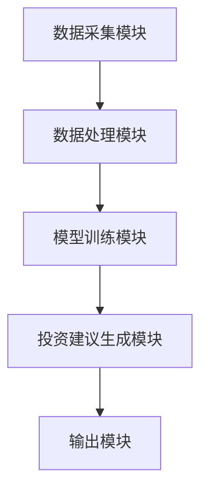

                 


# 投资建议生成与优化

---

## 关键词

- 投资建议生成
- 生成式AI
- 强化学习
- 投资优化
- 数据驱动决策

---

## 摘要

本文系统地探讨了投资建议生成与优化的核心概念、技术原理和实现方法。通过结合生成式AI和强化学习，本文提出了一种创新的投资建议生成框架，并详细分析了其在实际投资场景中的应用。文章从背景介绍、核心概念、算法原理、系统架构到项目实战，层层深入，为读者提供了全面的技术解读和实践指导。最后，本文总结了投资建议生成与优化的关键要点，并给出了未来研究的方向。

---

## 第1章: 投资建议生成的背景与问题定义

### 1.1 投资建议的基本概念

#### 1.1.1 投资建议的定义与分类

投资建议是指基于市场分析、数据分析和模型预测，为投资者提供买卖资产的具体指导。投资建议可以分为以下几类：

- **长期投资建议**：基于基本面分析，强调长期资产配置。
- **短期投资建议**：基于技术分析，强调短期交易策略。
- **组合投资建议**：基于风险分散原则，优化投资组合。

$$
\text{投资建议的目标是帮助投资者在不同市场条件下做出最优决策。}
$$

#### 1.1.2 投资建议的核心要素与属性

投资建议的核心要素包括：

- **市场数据**：历史价格、成交量、市场情绪等。
- **投资者风险偏好**：保守型、稳健型、激进型。
- **时间窗口**：短期、中期、长期。

投资建议的属性包括：

- **可解释性**：投资者需要理解建议的依据。
- **实时性**：建议需要基于最新的市场数据。
- **个性化**：根据投资者的特征定制建议。

#### 1.1.3 投资建议的生成场景与目标

投资建议的生成场景包括：

- **股票投资**：基于技术指标和市场情绪生成买卖信号。
- **基金投资**：基于基金评级和市场趋势推荐基金组合。
- **风险管理**：基于波动率和风险承受能力优化投资组合。

投资建议的目标包括：

- **收益最大化**：在风险可控的前提下实现最大收益。
- **风险最小化**：在收益目标下最小化投资风险。
- **个性化服务**：为不同投资者提供定制化建议。

---

### 1.2 投资建议生成的背景与现状

#### 1.2.1 传统投资建议生成方式的局限性

传统投资建议生成方式主要依赖于人工分析和经验判断，存在以下问题：

- **主观性**：依赖分析师的主观判断，缺乏客观性。
- **效率低下**：人工分析耗时耗力，难以应对海量数据。
- **可扩展性差**：难以满足大量投资者的需求。

#### 1.2.2 人工智能与大数据在投资建议生成中的应用

随着AI和大数据技术的发展，投资建议生成逐渐从人工化向自动化转变。以下是主要的应用方向：

- **数据驱动决策**：利用大数据分析市场趋势和投资者行为。
- **生成式AI**：通过自然语言处理生成个性化投资建议。
- **强化学习**：通过模拟市场环境优化投资策略。

#### 1.2.3 当前投资建议生成技术的挑战与机遇

当前投资建议生成技术面临以下挑战：

- **数据质量**：市场数据的噪声和缺失会影响模型的准确性。
- **模型可解释性**：复杂的模型难以向投资者解释建议的依据。
- **实时性要求**：高频交易需要模型具备极低的延迟。

同时，也存在以下机遇：

- **技术进步**：AI和大数据技术的快速发展为投资建议生成提供了新的工具。
- **市场需求**：投资者对个性化和实时化的投资建议需求日益增长。
- **监管合规**：通过技术手段实现合规性管理，降低风险。

---

### 1.3 问题定义与目标

#### 1.3.1 投资建议生成的核心问题

投资建议生成的核心问题可以总结为以下几点：

- **如何利用AI技术生成高质量的投资建议？**
- **如何优化投资建议以满足不同投资者的需求？**
- **如何确保投资建议的实时性和可解释性？**

#### 1.3.2 投资建议生成的目标与边界

投资建议生成的目标是为投资者提供个性化、实时且可解释的投资建议。其边界包括：

- **数据范围**：仅基于提供的市场数据和投资者信息。
- **模型能力**：受限于模型的训练数据和算法能力。
- **目标范围**：专注于投资建议生成，不涉及实际交易执行。

---

## 第2章: 生成式AI在投资建议中的应用

### 2.1 生成式AI的基本原理

#### 2.1.1 生成式AI的定义与特点

生成式AI是一种能够生成新内容的人工智能技术，其特点包括：

- **创造性**：能够生成新的数据或内容。
- **多样性**：能够生成多种不同的结果。
- **适应性**：能够根据输入条件生成相应的输出。

生成式AI的核心算法包括：

- **变分自编码器（VAE）**：通过编码和解码过程生成数据。
- **生成对抗网络（GAN）**：通过生成器和判别器的对抗训练生成数据。
- **Transformer模型**：通过自注意力机制生成序列数据。

#### 2.1.2 生成式AI在投资建议中的应用

生成式AI在投资建议中的应用主要体现在以下方面：

- **文本生成**：生成投资报告和市场分析。
- **策略生成**：生成交易策略和投资组合建议。
- **风险管理**：生成风险预警和应对方案。

---

### 2.2 强化学习在投资建议优化中的作用

#### 2.2.1 强化学习的基本概念与原理

强化学习是一种通过试错方式优化决策的算法，其核心要素包括：

- **状态（State）**：当前的市场环境和投资者信息。
- **动作（Action）**：投资建议的具体内容。
- **奖励（Reward）**：建议的效果反馈。

强化学习的训练过程包括：

1. **环境交互**：根据当前状态生成动作，并与环境交互。
2. **反馈接收**：根据动作的效果获得奖励或惩罚。
3. **策略优化**：根据反馈更新策略，优化未来决策。

#### 2.2.2 强化学习在投资建议优化中的应用

强化学习在投资建议优化中的应用主要体现在以下方面：

- **策略优化**：通过强化学习优化投资策略，提高收益和降低风险。
- **动态调整**：根据市场变化动态调整投资建议，适应复杂环境。
- **个性化服务**：根据投资者的个性化需求生成定制化建议。

---

## 第3章: 投资建议生成的数学模型与算法

### 3.1 投资建议生成的数学模型

#### 3.1.1 投资建议生成的数学公式

投资建议生成的数学模型可以表示为：

$$
P(\text{建议} | \text{数据}) = \text{模型}(数据)
$$

其中，数据包括市场数据和投资者信息，模型是生成式AI的核心算法。

---

### 3.2 生成式AI的数学基础

#### 3.2.1 变分自编码器（VAE）的数学推导

变分自编码器的目标是最大化数据的似然：

$$
\max_{\theta} \mathbb{E}_{x}[\log p_\theta(x)]
$$

通过引入潜变量$z$，我们可以将其分解为：

$$
\log p_\theta(x) = \log p_\theta(x|z) + \log p_\theta(z) - \log q_\phi(z|x)
$$

---

## 第4章: 投资建议生成系统的架构设计

### 4.1 系统功能模块设计

#### 4.1.1 数据采集模块

数据采集模块负责获取市场数据和投资者信息，主要包括：

- **市场数据**：股票价格、成交量、市场情绪等。
- **投资者信息**：投资者的资产规模、风险偏好等。

---

### 4.2 系统架构设计

#### 4.2.1 系统整体架构图



---

## 第5章: 投资建议生成系统的接口与交互设计

### 5.1 系统接口设计

#### 5.1.1 数据接口

数据接口负责与数据源对接，主要包括：

- **数据输入接口**：接收市场数据和投资者信息。
- **数据输出接口**：输出投资建议生成的结果。

---

## 第6章: 项目实战

### 6.1 环境安装

为了运行投资建议生成系统，需要安装以下环境：

- **Python**：3.8及以上版本。
- **TensorFlow**：2.0及以上版本。
- **PyTorch**：1.9及以上版本。
- **其他依赖库**：包括pandas、numpy、matplotlib等。

---

### 6.2 系统核心实现源代码

以下是投资建议生成系统的核心代码示例：

```python
import torch
import torch.nn as nn
import torch.optim as optim

class InvestmentAdvisor(nn.Module):
    def __init__(self, input_dim, hidden_dim, output_dim):
        super(InvestmentAdvisor, self).__init__()
        self.fc1 = nn.Linear(input_dim, hidden_dim)
        self.fc2 = nn.Linear(hidden_dim, output_dim)
    
    def forward(self, x):
        x = torch.relu(self.fc1(x))
        x = torch.sigmoid(self.fc2(x))
        return x

def train(model, criterion, optimizer, data):
    model.train()
    for inputs, labels in data:
        outputs = model(inputs)
        loss = criterion(outputs, labels)
        loss.backward()
        optimizer.step()
        optimizer.zero_grad()
    return model

# 示例数据
input_dim = 10
hidden_dim = 20
output_dim = 5
model = InvestmentAdvisor(input_dim, hidden_dim, output_dim)
criterion = nn.MSELoss()
optimizer = optim.Adam(model.parameters(), lr=0.001)
data = [...]  # 示例数据集
model = train(model, criterion, optimizer, data)
```

---

## 第7章: 最佳实践与总结

### 7.1 最佳实践

在投资建议生成与优化的过程中，需要注意以下几点：

- **数据质量**：确保数据的准确性和完整性。
- **模型可解释性**：避免使用过于复杂的模型，确保建议的可解释性。
- **模型优化**：定期更新模型，适应市场变化。

### 7.2 小结

本文系统地探讨了投资建议生成与优化的核心概念、技术原理和实现方法。通过结合生成式AI和强化学习，本文提出了一种创新的投资建议生成框架，并详细分析了其在实际投资场景中的应用。

---

## 第8章: 拓展阅读

### 8.1 拓展阅读推荐

以下是拓展阅读推荐的书籍和论文：

- **《深度学习》**：[周志华](https://github.com/zhouzhihua)
- **《生成式AI：原理与应用》**：[李开复](https://github.com/kaifu)
- **《强化学习：理论与实践》**：[ Sutton and Barto ]

---

## 结语

投资建议生成与优化是一个复杂而充满挑战的领域，但随着AI和大数据技术的快速发展，我们有理由相信，未来投资建议生成将更加智能化、个性化和实时化。希望本文能够为读者提供有价值的技术见解和实践指导，帮助他们在投资建议生成与优化的领域中取得更大的成功。

--- 

# END

