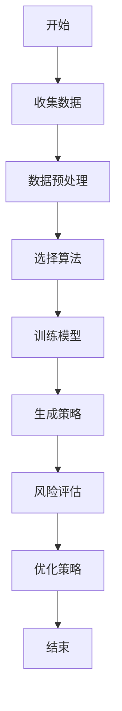
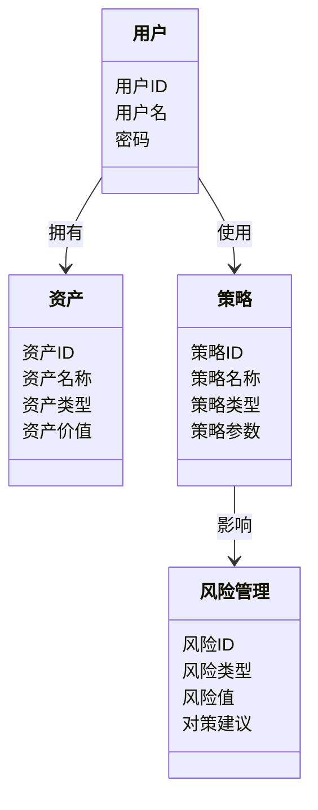
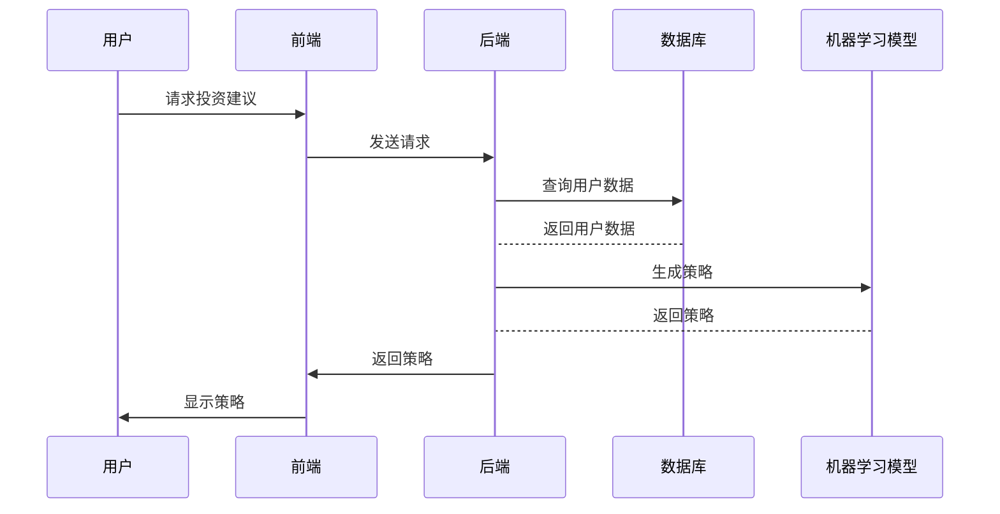

                 


# 投资理财智能助手的基本概念

## 关键词：投资理财、智能助手、人工智能、数据驱动、风险管理、个性化策略、系统架构

## 摘要：本文深入探讨了投资理财智能助手的基本概念，涵盖其背景、核心功能、算法原理、系统架构、项目实现及最佳实践。通过详细分析，读者将了解如何利用人工智能技术提升投资理财的效率和准确性。

---

## 第一部分：投资理财智能助手的背景介绍

### 第1章：问题背景与问题描述

#### 1.1 投资理财智能助手的背景

投资理财是个人和机构财务管理的重要组成部分，但传统的投资理财过程存在诸多痛点：

- **信息过载**：金融市场数据复杂且实时变化，普通投资者难以快速获取和处理有效信息。
- **决策困难**：投资决策需要考虑多种因素，如市场趋势、个人风险偏好等，传统方法难以高效整合这些信息。
- **个性化需求**：每个人的投资目标、风险承受能力和资金规模不同，传统的一-size-fits-all方法难以满足个性化需求。

随着人工智能技术的迅速发展，特别是在自然语言处理、机器学习和数据分析领域的突破，为投资理财智能助手的出现提供了技术基础。智能助手能够通过分析海量数据，提供实时的投资建议，帮助用户做出更明智的决策。

#### 1.2 问题描述

投资理财智能助手的目标是通过技术手段解决以下问题：

- **数据处理效率**：快速收集、整理和分析多源数据，为投资决策提供支持。
- **个性化投资策略**：根据用户的具体情况生成定制化的投资建议。
- **风险管理**：实时监控投资组合，识别潜在风险并提出应对策略。

#### 1.3 问题解决

投资理财智能助手通过以下方式解决问题：

- **数据驱动决策**：利用机器学习算法分析历史数据和市场趋势，预测未来走势。
- **个性化推荐**：基于用户的画像（如风险偏好、投资目标）生成定制化的投资策略。
- **实时监控与调整**：持续跟踪市场变化和用户资产情况，动态优化投资组合。

#### 1.4 边界与外延

- **边界**：投资理财智能助手的功能主要集中在数据分析、策略生成和风险管理，不直接进行实际交易操作。
- **外延**：相关领域包括金融数据分析、自然语言处理（NLP）和区块链技术，这些技术可以进一步增强智能助手的功能。

#### 1.5 概念结构与核心要素

投资理财智能助手的核心概念层次结构如下：

1. **数据源**：包括市场数据、用户数据和外部数据。
2. **用户画像**：基于用户数据构建的用户特征模型。
3. **投资策略**：根据用户画像生成的个性化投资建议。
4. **风险管理**：实时监控和风险控制机制。

核心要素之间的关系可以通过以下表格对比：

| 概念 | 属性 | 特征 |
|------|------|------|
| 数据源 | 类型 | 市场数据、用户数据、外部数据 |
| 用户画像 | 维度 | 风险偏好、投资目标、资金规模 |
| 投资策略 | 类型 | 股票、基金、债券、加密货币 |
| 风险管理 | 方法 | VaR、CVaR、波动率分析 |

---

## 第二部分：投资理财智能助手的核心概念与联系

### 第2章：核心概念与联系

#### 2.1 核心概念原理

投资理财智能助手的核心功能包括：

- **数据驱动决策**：利用机器学习模型分析数据，生成投资建议。
- **个性化投资策略生成**：基于用户画像构建定制化的投资组合。
- **风险管理与优化**：实时监控投资组合，动态调整以降低风险。

#### 2.2 概念属性特征对比

以下是核心概念的属性特征对比：

| 概念 | 属性 | 特征 |
|------|------|------|
| 数据源 | 类型 | 市场数据（股票价格、指数）、用户数据（交易记录、资产配置）、外部数据（新闻、社交媒体情绪） |
| 用户画像 | 维度 | 风险偏好（保守、均衡、激进）、投资目标（短期、中期、长期）、资金规模（小、中、大） |
| 投资策略 | 类型 | 股票策略（价值型、成长型）、基金策略（股票型、债券型）、债券策略（信用评级、期限） |
| 风险管理 | 方法 | Value at Risk (VaR)、Conditional Value at Risk (CVaR)、波动率分析 |

#### 2.3 ER实体关系图

以下是核心概念的ER实体关系图：

```mermaid
er
  actor(用户)
  asset(资产)
  strategy(策略)
  risk_management(风险管理)
  data_source(数据源)
  user_profile(用户画像)

  user -> user_profile: 属于
  user_profile -> strategy: 影响
  strategy -> risk_management: 影响
  risk_management -> asset: 监控
  data_source -> strategy: 支持
```

---

## 第三部分：投资理财智能助手的算法原理

### 第3章：算法原理讲解

#### 3.1 算法流程图

以下是投资理财智能助手的算法流程图：



#### 3.2 算法实现

以下是算法的Python源代码：

```python
import numpy as np
from sklearn.linear_model import LinearRegression
from sklearn.tree import DecisionTreeRegressor

# 示例数据
X = np.array([[1, 2], [3, 4], [5, 6]])
y = np.array([7, 8, 9])

# 线性回归模型
model_linear = LinearRegression()
model_linear.fit(X, y)

# 决策树模型
model_tree = DecisionTreeRegressor()
model_tree.fit(X, y)

# 预测
print("线性回归预测结果:", model_linear.predict(X))
print("决策树预测结果:", model_tree.predict(X))
```

#### 3.3 数学公式

以下是算法原理的数学公式：

- 线性回归模型：
  $$ y = \beta_0 + \beta_1 x_1 + \beta_2 x_2 + \epsilon $$
  其中，$\beta_0$ 是截距，$\beta_1$ 和 $\beta_2$ 是回归系数，$\epsilon$ 是误差项。

- 决策树模型：
  $$ f(x) = \text{sign}(\sum_{i} \alpha_i (x_j \leq t_j)) $$
  其中，$\alpha_i$ 是权重，$t_j$ 是决策树的分割点。

---

## 第四部分：投资理财智能助手的系统分析与架构设计

### 第4章：系统分析与架构设计方案

#### 4.1 问题场景介绍

投资理财智能助手需要解决的主要问题包括：

- 如何高效地收集和处理金融市场数据？
- 如何基于用户画像生成个性化的投资策略？
- 如何实时监控投资组合并进行风险评估？

#### 4.2 项目介绍

投资理财智能助手是一个基于人工智能技术的投资决策支持系统，旨在通过数据分析和机器学习算法，为用户提供个性化的投资建议。

#### 4.3 系统功能设计

以下是系统功能的领域模型：



#### 4.4 系统架构设计

以下是系统的架构设计：


#### 4.5 系统接口设计

以下是系统接口设计：

- 用户登录接口：
  ```http
  POST /api/login
  {
      "username": "user",
      "password": "pass"
  }
  ```

- 数据查询接口：
  ```http
  GET /api/data?type=stock&id=123
  ```

#### 4.6 系统交互流程图

以下是系统交互流程图：



---

## 第五部分：投资理财智能助手的项目实战

### 第5章：项目实战

#### 5.1 环境安装

以下是项目所需的环境和工具：

- **Python**：3.8+
- **TensorFlow**：2.0+
- **Pandas**：1.0+
- **Matplotlib**：3.0+
- **Jupyter Notebook**：6.0+

#### 5.2 系统核心实现

以下是核心代码实现：

```python
import pandas as pd
import numpy as np
from sklearn.preprocessing import MinMaxScaler
from tensorflow.keras.models import Sequential
from tensorflow.keras.layers import LSTM, Dense

# 数据加载
data = pd.read_csv('stock_data.csv')

# 数据预处理
scaler = MinMaxScaler()
scaled_data = scaler.fit_transform(data['price'].values.reshape(-1, 1))

# 模型构建
model = Sequential()
model.add(LSTM(128, return_sequences=True, input_shape=(1, 1)))
model.add(Dense(1))
model.compile(loss='mean_squared_error', optimizer='adam')

# 模型训练
model.fit(scaled_data[:-100], scaled_data[100:], epochs=100, batch_size=32)
```

#### 5.3 实际案例分析

以下是实际案例分析：

假设我们有一个包含股票价格数据的数据集，我们可以使用上述代码进行预测。训练完成后，我们可以用模型预测未来的价格走势。

#### 5.4 项目小结

投资理财智能助手的实现需要以下几个步骤：

1. 数据收集与预处理
2. 模型选择与训练
3. 策略生成与优化
4. 系统集成与测试

---

## 第六部分：投资理财智能助手的最佳实践

### 第6章：最佳实践

#### 6.1 小结

投资理财智能助手通过利用人工智能技术，能够帮助用户高效地进行投资理财。其核心功能包括数据驱动决策、个性化投资策略生成和风险管理。

#### 6.2 注意事项

- **数据质量**：确保数据的准确性和完整性。
- **模型选择**：根据具体需求选择合适的算法。
- **风险管理**：实时监控投资组合，动态调整策略。

#### 6.3 拓展阅读

- 《机器学习实战》
- 《Python金融大数据分析》
- 《投资学导论》

---

## 结语

投资理财智能助手是一个复杂但极具潜力的领域。通过本文的探讨，读者可以深入了解其基本概念、算法原理和系统架构。未来，随着人工智能技术的不断进步，投资理财智能助手将变得更加智能化和个性化，为用户带来更好的投资体验。

--- 

**全文完**

