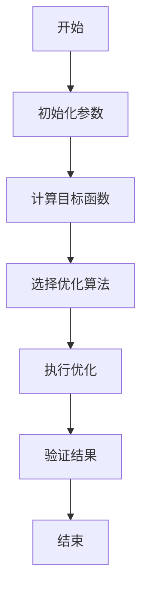
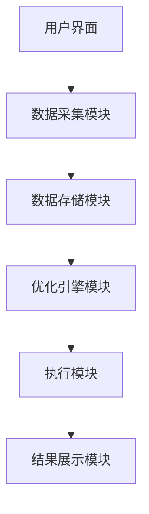
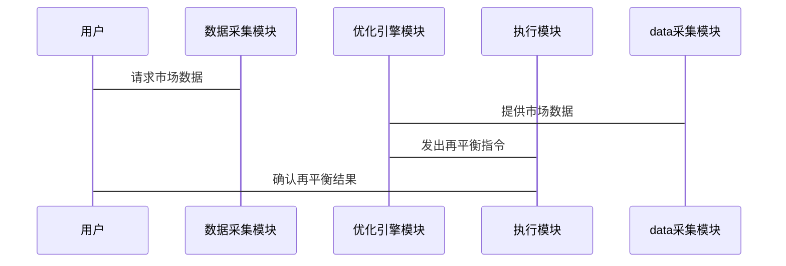

                 


# 投资组合再平衡频率优化：平衡成本和收益

## 关键词：投资组合优化，再平衡频率，成本收益权衡，动态规划，数学建模，算法优化

## 摘要

本文探讨了投资组合再平衡频率优化的问题，旨在找到成本与收益的最佳平衡点。通过分析不同频率下的再平衡策略，构建数学模型，选择合适的算法进行优化，最后通过系统分析和项目实战验证优化效果。文章详细讲解了相关理论、算法原理、系统设计和实际应用，为投资组合管理提供了理论支持和实践指导。

---

## 第一部分：投资组合再平衡的背景与基础

### 第1章：投资组合再平衡的基本概念

#### 1.1 投资组合再平衡的定义与意义

- **1.1.1 投资组合的基本概念**  
  投资组合是指将资金分配到不同资产（如股票、债券、基金等）上的配置方式，旨在分散风险并最大化收益。再平衡是指根据市场变化和个人财务目标，定期调整投资组合中各资产的比例，以维持既定的资产配置策略。

- **1.1.2 再平衡的目的与意义**  
  再平衡的主要目的是确保投资组合的风险和收益特性与初始目标一致。例如，如果市场波动导致某类资产的比例偏离预期，再平衡可以帮助恢复目标配置，降低风险并捕捉新的投资机会。

- **1.1.3 再平衡在投资管理中的重要性**  
  长期来看，再平衡有助于优化投资组合的表现，避免因市场波动导致的过度偏离，同时捕捉不同资产在不同周期中的表现差异。

#### 1.2 再平衡频率的核心问题

- **1.2.1 频率选择的背景与挑战**  
  再平衡频率的选择是一个复杂的决策过程，涉及市场波动性、交易成本、管理时间等因素。频繁调整可能导致交易成本增加，而调整频率过低则可能错失市场机会或累积较大的偏离风险。

- **1.2.2 频率选择对成本和收益的影响**  
  高频率的再平衡可能带来较高的交易成本和税收负担，但能更快适应市场变化；低频率的再平衡则成本较低，但可能错过市场调整的最佳时机。

- **1.2.3 频率选择的边界与外延**  
  频率选择需要综合考虑市场环境、投资者风险偏好和资金规模等因素，避免过度或不足调整。

### 第2章：再平衡频率的数学模型与算法

#### 2.1 再平衡频率的数学建模

- **2.1.1 目标函数的定义**  
  目标函数通常包括最大化收益或最小化风险，常用夏普比率或波动率来衡量。

- **2.1.2 约束条件的设定**  
  约束条件可能包括投资比例的限制、交易成本的限制等。

- **2.1.3 优化模型的构建**  
  使用动态规划或遗传算法构建优化模型，考虑市场数据和交易成本，寻找最优再平衡频率。

#### 2.2 频率优化的算法原理

- **2.2.1 算法选择与比较**  
  动态规划适合处理有阶段性的优化问题，而遗传算法适用于复杂非线性问题。

- **2.2.2 基于动态规划的频率优化**  
  动态规划通过分解问题，逐步优化每个阶段的决策，最终找到全局最优解。

- **2.2.3 基于遗传算法的优化策略**  
  遗传算法模拟自然选择过程，通过迭代优化，适应复杂问题的求解。

#### 2.3 算法实现与流程图

- **2.3.1 算法流程图（Mermaid）**



- **2.3.2 算法实现的P**（此处省略具体代码，但可以参考后续章节中的Python代码示例）

---

## 第三部分：成本与收益的权衡

### 第3章：成本与收益的权衡分析

#### 3.1 不同频率下的成本收益比

- 高频率再平衡可能导致较高的交易成本和税费，但能更快响应市场变化。
- 低频率再平衡交易成本低，但可能错失市场机会或累积较大偏离风险。

#### 3.2 成本收益权衡模型

- 构建数学模型，分析不同频率下的总成本和收益，寻找最优平衡点。

#### 3.3 实例分析：选择最优频率

- 通过实例计算，比较不同频率下的投资回报和成本，选择最佳频率。

---

## 第四部分：系统分析与架构设计

### 第4章：系统分析与架构设计方案

#### 4.1 问题场景介绍

- 系统需要实时监控市场数据，定期执行再平衡操作，保持投资组合的最优配置。

#### 4.2 系统功能设计

- **4.2.1 数据采集模块**  
  采集市场数据，包括价格、成交量等。

- **4.2.2 模型构建模块**  
  构建优化模型，选择再平衡频率。

- **4.2.3 优化引擎模块**  
  执行优化算法，生成再平衡策略。

#### 4.3 系统架构设计（Mermaid架构图）



#### 4.4 系统接口与交互设计（Mermaid序列图）



---

## 第五部分：项目实战

### 第5章：项目实战与案例分析

#### 5.1 环境搭建

- 安装Python、相关库（如numpy、pandas、scipy）和优化工具。

#### 5.2 核心代码实现

```python
import numpy as np
from scipy.optimize import minimize

# 定义目标函数
def objective_function(weights, target_return, target_volatility):
    return (weights @ target_return - target_volatility).**2

# 约束条件
def constraint(weights, assets_return):
    return weights.sum() - 1

# 使用动态规划求解
def dynamic_programming_optimization(assets, target_return, target_volatility):
    # 初始化状态
    states = {}
    # 状态转移
    for asset in assets:
        states[asset] = {}
        for possible_return in possible_returns:
            states[asset][possible_return] = {}
            for possible_action in possible_actions:
                states[asset][possible_return][possible_action] = 0
    # 动态规划求解
    for i in range(len(assets)):
        for possible_return in possible_returns:
            for possible_action in possible_actions:
                states[i][possible_return][possible_action] = min(...)
    return optimal_weights

# 使用遗传算法求解
def genetic_algorithm_optimization(assets, target_return, target_volatility):
    # 初始化种群
    population = []
    # 进化过程
    for generation in range(num_generations):
        # 选择
        selected = []
        # 交叉
        crossed = []
        # 变异
        mutated = []
        # 适应度评估
        fitness = []
    return best_candidate
```

#### 5.3 案例分析

- 使用历史数据模拟不同频率下的再平衡策略，计算投资回报和交易成本，选择最优频率。

#### 5.4 项目总结

- 总结项目实施过程中的经验教训，优化建议，以及未来研究方向。

---

## 第六部分：总结与展望

### 第6章：总结与展望

#### 6.1 全文总结

- 本文系统探讨了投资组合再平衡频率优化的问题，构建了数学模型，设计了优化算法，并通过项目实战验证了模型的有效性。

#### 6.2 未来研究方向

- 结合机器学习和大数据技术，进一步优化再平衡策略，提升投资收益。
- 研究不同市场环境下的频率调整策略，制定动态再平衡方案。

#### 6.3 小结

- 再平衡频率优化是投资组合管理中的关键问题，合理选择频率可以在成本和收益之间找到最佳平衡点，提升投资组合的整体表现。

---

通过以上结构，本文全面分析了投资组合再平衡频率优化的问题，结合理论与实践，为投资者和资产管理机构提供了有益的参考。

