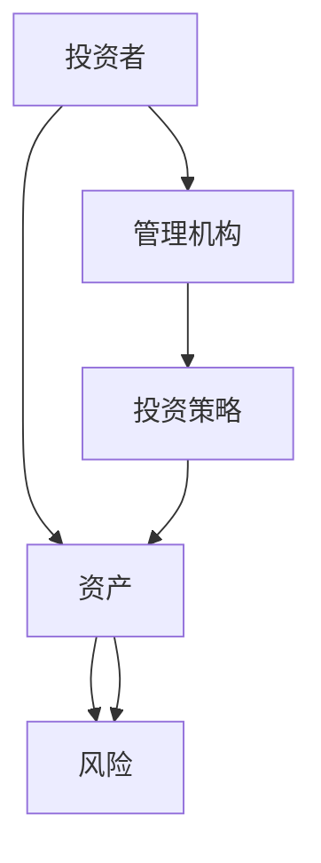
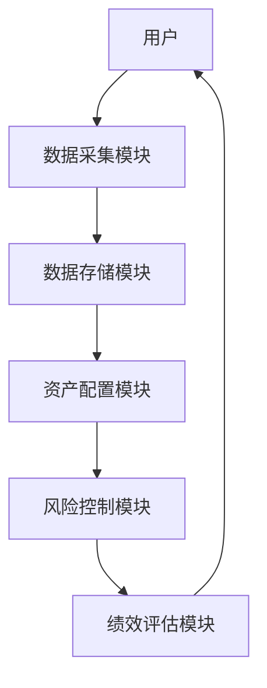

                 


# 《投资组合管理》

## 关键词：投资组合管理，资产配置，风险控制，现代投资组合理论，算法优化，金融建模

## 摘要：  
投资组合管理是金融领域的重要组成部分，旨在通过科学的资产配置和风险管理实现投资目标的最大化。本文从投资组合管理的基本概念出发，深入探讨其核心原理、算法优化方法、系统设计与实现，以及在实际投资中的应用。通过详细分析投资组合管理的数学模型、资产配置策略、风险控制方法，本文为读者提供了一套完整的投资组合管理框架，并结合实际案例，展示了如何将理论应用于实践。最后，本文还探讨了投资组合管理的未来趋势与挑战。

---

## 第一部分: 投资组合管理引言

### 第1章: 投资组合管理概述

#### 1.1 投资组合管理的背景与意义  
投资组合管理是一种通过科学配置不同资产来实现投资目标的管理方法。随着金融市场的发展，投资者面临的不确定性不断增加，如何在风险可控的前提下实现收益最大化，成为投资组合管理的核心问题。本文将从以下几个方面展开：  
- 投资组合管理的基本概念与目标；  
- 投资组合管理的核心原则与方法；  
- 投资组合管理在个人投资与机构投资中的应用。  

#### 1.2 投资组合管理的目标与原则  
投资组合管理的目标是通过资产配置和风险管理，在满足投资者风险承受能力的前提下，实现收益的最大化。其核心原则包括：  
1. **分散化原则**：通过配置不同类型的资产降低风险。  
2. **风险收益平衡原则**：在可接受的风险范围内追求最大收益。  
3. **长期投资原则**：避免短期波动对投资目标的影响。  

#### 1.3 投资组合管理的参与者与流程  
投资组合管理的参与者包括投资者、投资管理机构、托管银行等。其管理流程通常包括以下步骤：  
1. **设定投资目标**：明确投资目的、风险偏好和收益目标。  
2. **资产配置**：根据目标选择合适的资产类别和比例。  
3. **投资决策**：基于市场分析和模型预测进行投资。  
4. **风险控制**：实时监控并调整投资组合以控制风险。  
5. **绩效评估**：定期评估投资组合的表现并优化配置。  

---

## 第二部分: 投资组合管理的核心概念与联系

### 第2章: 投资组合管理的核心要素

#### 2.1 资产配置的类型与特点  
资产配置是投资组合管理的核心步骤，主要包括以下几种类型：  
1. **战略资产配置**：根据长期投资目标确定资产比例。  
2. **战术资产配置**：根据短期市场变化调整资产比例。  
3. **恒定混合资产配置**：保持资产比例不变。  

#### 2.2 风险与收益的数学模型  
风险和收益的量化是投资组合管理的重要基础。常用的量化方法包括：  
- **收益的度量**：夏普比率、特雷诺比率。  
- **风险的度量**：方差、标准差、VaR、CVaR。  

#### 2.3 投资组合的有效前沿  
有效前沿是指在给定风险水平下，能够提供最高收益的所有投资组合的集合。通过数学优化方法，可以找到有效前沿上的最优组合。  

#### 2.4 资产流动性与交易成本的影响  
流动性影响资产的买卖难度和交易成本。流动性越高，交易成本越低，反之亦然。  

#### 2.5 核心概念属性对比表  
| 要素 | 定义 | 属性 | 示例 |
|------|------|------|------|
| 资产 | 投资标的 | 流动性、风险、收益 | 股票、债券、基金 |
| 风险 | 损失的可能性 | 系统性风险、非系统性风险 | 市场风险、信用风险 |

#### 2.6 ER实体关系图  


---

## 第三部分: 投资组合管理的算法原理

### 第3章: 算法原理与实现

#### 3.1 均值-方差优化模型  
均值-方差优化是一种经典的资产配置方法，其目标是最小化投资组合的方差，同时满足收益目标。  

**数学模型**：  
$$ \text{minimize } \sigma^2 \quad \text{subject to } E[r] \geq \text{目标收益} $$  

#### 3.2 Black-Litterman 模型  
Black-Litterman 模型是一种基于投资者观点的资产配置方法，结合市场均衡与投资者预期。  

**数学模型**：  
$$ \mu = \alpha \cdot \mu_m + (1 - \alpha) \cdot \mu_f $$  

#### 3.3 算法实现  
以下为均值-方差优化的 Python 实现示例：  

```python
import numpy as np
from scipy.optimize import minimize

def portfolio_optimization(returns, weights):
    n = len(weights)
    # 定义目标函数
    def objective(weights):
        return np.dot(weights.T, np.dot(returns, weights))
    # 约束条件
    constraints = [
        {'type': 'eq', 'fun': lambda w: np.sum(w) - 1},
        {'type': 'eq', 'fun': lambda w: np.dot(returns, w) - target_return}
    ]
    # 求解
    result = minimize(objective, weights, constraints=constraints)
    return result.x
```

---

## 第四部分: 投资组合管理的系统分析与架构设计

### 第4章: 系统分析与架构设计

#### 4.1 投资组合管理系统概述  
投资组合管理系统包括数据采集、资产配置、风险控制、绩效评估等功能模块。  

#### 4.2 系统架构图  


---

## 第五部分: 投资组合管理的项目实战

### 第5章: 项目实战

#### 5.1 环境安装  
安装 Python 和相关库（如 numpy、pandas、scipy）。  

#### 5.2 核心实现  
以下为均值-方差优化的 Python 实现示例：  

```python
import numpy as np
from scipy.optimize import minimize

def portfolio_optimization(returns, weights):
    n = len(weights)
    # 定义目标函数
    def objective(weights):
        return np.dot(weights.T, np.dot(returns, weights))
    # 约束条件
    constraints = [
        {'type': 'eq', 'fun': lambda w: np.sum(w) - 1},
        {'type': 'eq', 'fun': lambda w: np.dot(returns, w) - target_return}
    ]
    # 求解
    result = minimize(objective, weights, constraints=constraints)
    return result.x
```

---

## 第六部分: 投资组合管理的评估与优化

### 第6章: 评估与优化

#### 6.1 投资组合绩效评估  
绩效评估包括收益实现、风险控制、超额收益等指标的分析。  

#### 6.2 优化建议  
根据评估结果优化资产配置和风险管理策略。  

---

## 第七部分: 投资组合管理的未来趋势与挑战

### 第7章: 未来趋势与挑战

#### 7.1 技术创新  
人工智能、大数据等技术在投资组合管理中的应用。  

#### 7.2 市场变化  
全球经济波动、政策变化对投资组合管理的影响。  

---

## 总结  
投资组合管理是一门结合金融理论与数学优化的学科。通过科学的资产配置和风险管理，投资者可以在复杂多变的市场中实现稳健的投资收益。本文从理论到实践，为读者提供了一套完整的投资组合管理框架，帮助投资者在实际操作中做出明智的投资决策。

