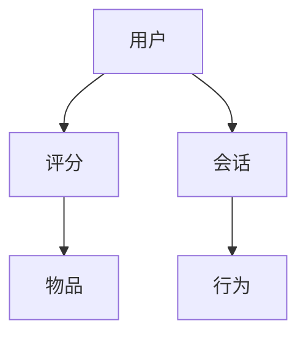
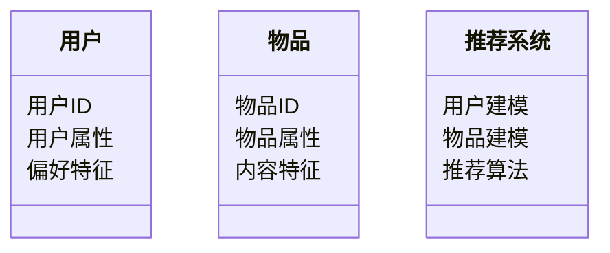
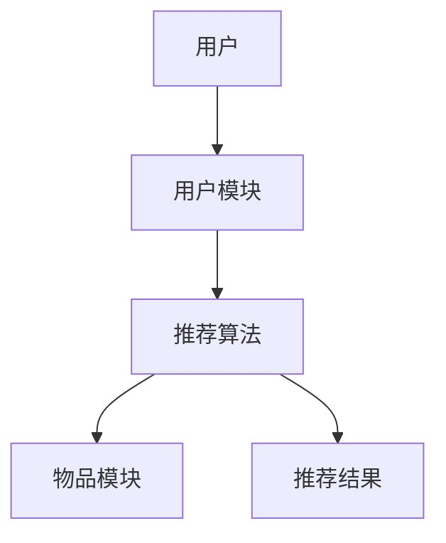
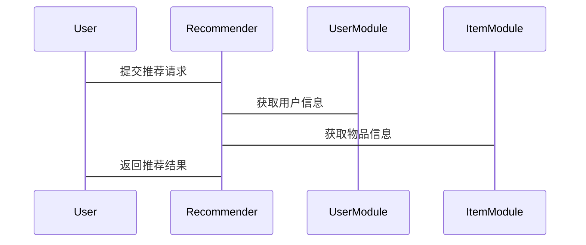

                 


# 推荐系统集成：个性化建议的AI Agent

## 关键词：推荐系统，AI Agent，个性化建议，协同过滤，矩阵分解，深度学习

## 摘要：  
推荐系统集成是通过AI Agent实现个性化建议的核心技术。本文将详细探讨推荐系统的核心概念、算法原理、系统架构设计及项目实战，帮助读者全面理解推荐系统的实现与优化。

---

# 第1章: 推荐系统集成的背景与问题定义

## 1.1 推荐系统的定义与特点

### 1.1.1 推荐系统的定义  
推荐系统是一种基于用户行为和偏好，利用技术手段为用户推荐相关内容或产品的系统。它广泛应用于电商、视频平台、音乐流媒体等领域。

### 1.1.2 推荐系统的核心特点  
- **个性化**：根据用户的历史行为和偏好，提供定制化的内容或产品。  
- **实时性**：能够快速响应用户需求，提供实时推荐。  
- **可扩展性**：支持大规模用户和数据的处理。  

### 1.1.3 推荐系统的主要应用场景  
- **电商推荐**：推荐商品给用户。  
- **视频推荐**：推荐电影、电视剧给用户。  
- **音乐推荐**：推荐歌曲或音乐人给用户。  

---

## 1.2 个性化建议的AI Agent

### 1.2.1 AI Agent的基本概念  
AI Agent是一种能够感知环境、执行任务并做出决策的智能体。在推荐系统中，AI Agent负责分析用户行为和数据，生成个性化建议。

### 1.2.2 个性化建议的核心要素  
- **用户建模**：分析用户的兴趣、行为和偏好。  
- **物品建模**：分析推荐内容的特征和属性。  
- **推荐算法**：根据用户和物品的特征，生成推荐结果。  

### 1.2.3 AI Agent在推荐系统中的作用  
AI Agent通过数据挖掘、机器学习等技术，实现从数据采集到推荐结果生成的全流程自动化。

---

## 1.3 推荐系统集成的背景与挑战

### 1.3.1 从简单推荐到复杂推荐的演进  
早期的推荐系统基于简单的规则或统计方法，随着AI和大数据技术的发展，推荐系统逐渐向深度学习和实时推荐方向演进。

### 1.3.2 个性化推荐的市场需求  
用户对个性化体验的需求日益增长，推荐系统成为提升用户体验的重要技术手段。

### 1.3.3 推荐系统集成的主要挑战  
- **数据稀疏性**：用户行为数据可能不足，导致推荐效果不佳。  
- **实时性要求**：需要快速响应用户的实时需求。  
- **模型复杂性**：复杂的推荐模型可能导致计算资源消耗过大。  

---

## 1.4 本章小结  
本章介绍了推荐系统的定义、特点及应用场景，并详细探讨了AI Agent在个性化推荐中的作用。同时，分析了推荐系统集成的主要挑战。

---

# 第2章: 推荐系统的核心概念与联系

## 2.1 用户建模

### 2.1.1 用户建模的基本概念  
用户建模是通过收集和分析用户的行为数据，构建用户画像的过程。  

### 2.1.2 用户建模的特征与属性  
- **用户ID**：唯一标识用户。  
- **用户属性**：性别、年龄、地理位置等。  
- **偏好特征**：用户的兴趣爱好和行为习惯。  

### 2.1.3 用户建模的实现方法  
- **基于行为的建模**：通过用户的行为数据（如点击、购买）分析用户的兴趣。  
- **基于内容的建模**：通过用户对内容的偏好，分析用户的兴趣领域。  

---

## 2.2 物品建模

### 2.2.1 物品建模的基本概念  
物品建模是通过分析推荐内容的特征和属性，构建物品画像的过程。  

### 2.2.2 物品建模的特征与属性  
- **物品ID**：唯一标识物品。  
- **物品属性**：如商品的类别、品牌、价格等。  
- **内容特征**：如文本、图像等。  

### 2.2.3 物品建模的实现方法  
- **基于内容的建模**：通过分析物品的内容特征，提取其关键词或主题。  
- **基于知识图谱的建模**：通过构建知识图谱，分析物品之间的关联关系。  

---

## 2.3 推荐系统的属性对比

### 2.3.1 用户特征对比表  

| 特征 | 描述 | 示例 |
|------|------|------|
| 年龄 | 用户的年龄 | 25-35岁 |
| 性别 | 用户的性别 | 男 |
| 兴趣 | 用户的兴趣领域 | 电影、音乐 |

### 2.3.2 物品特征对比表  

| 特征 | 描述 | 示例 |
|------|------|------|
| 类别 | 物品的类别 | 电影、音乐 |
| 品牌 | 物品的品牌 | 苹果、索尼 |

### 2.3.3 推荐系统属性对比表  

| 属性 | 描述 |
|------|------|
| 实时性 | 系统是否支持实时推荐 |
| 可扩展性 | 系统是否支持大规模数据处理 |

---

## 2.4 推荐系统的ER实体关系图



---

## 2.5 推荐系统的领域模型



---

# 第3章: 推荐系统的算法原理

## 3.1 协同过滤算法

### 3.1.1 协同过滤的基本原理  
协同过滤是一种基于用户相似性或物品相似性的推荐算法。  

#### 3.1.2 基于用户的协同过滤  
基于用户相似性，找到与目标用户相似的用户，推荐这些用户喜欢的物品。  

#### 3.1.3 基于物品的协同过滤  
基于物品相似性，找到与目标物品相似的物品，推荐给用户。  

### 3.1.4 协同过滤的数学模型  
基于用户的协同过滤公式：

$$
\hat{r}_{u,i} = \frac{\sum_{j} w_{u,i}}{\sum_{j} w_{u,i}}
$$

其中，$w_{u,i}$ 是用户u和用户j的相似性权重。  

---

## 3.2 矩阵分解算法

### 3.2.1 矩阵分解的基本原理  
矩阵分解是一种将用户-物品交互矩阵分解为用户特征矩阵和物品特征矩阵的技术。  

### 3.2.2 矩阵分解的步骤  
1. 初始化用户特征矩阵和物品特征矩阵。  
2. 迭代优化矩阵，使得矩阵乘积尽可能接近原始交互矩阵。  

### 3.2.3 矩阵分解的数学模型  
矩阵分解公式：

$$
R = U \times V^T
$$

其中，$R$ 是用户-物品交互矩阵，$U$ 和 $V$ 分别是用户和物品的特征矩阵。  

---

## 3.3 深度学习模型

### 3.3.1 基于神经网络的推荐系统  
神经网络通过非线性特征提取，提升推荐系统的推荐准确率。  

#### 3.3.2 协同过滤的神经网络实现  
通过神经网络对用户和物品的特征进行非线性变换，生成最终的推荐结果。  

### 3.3.3 深度学习模型的数学表达  
神经网络模型公式：

$$
y = f(x) + \epsilon
$$

其中，$f(x)$ 是神经网络的输出，$\epsilon$ 是噪声项。  

---

## 3.4 算法的优缺点对比

| 算法 | 优点 | 缺点 |
|------|------|------|
| 协同过滤 | 实现简单 | 对冷启动问题敏感 |
| 矩阵分解 | 推荐准确率高 | 计算复杂度高 |
| 深度学习 | 非线性特征提取能力强 | 需要大量数据训练 |

---

# 第4章: 推荐系统的系统架构设计

## 4.1 系统功能设计

### 4.1.1 用户模块  
- 用户注册与登录  
- 用户画像构建  

### 4.1.2 物品模块  
- 物品信息管理  
- 物品特征提取  

### 4.1.3 推荐模块  
- 推荐算法实现  
- 推荐结果展示  

---

## 4.2 系统架构设计

### 4.2.1 总体架构  



### 4.2.2 接口设计  
- 用户接口：提供推荐结果展示。  
- 管理接口：提供系统管理功能。  

### 4.2.3 交互流程  



---

## 4.3 本章小结  
本章详细探讨了推荐系统的系统功能设计和架构设计，包括模块划分、接口设计和交互流程。

---

# 第5章: 推荐系统的项目实战

## 5.1 项目背景与目标

### 5.1.1 项目背景  
本项目旨在实现一个基于协同过滤算法的电商推荐系统。  

### 5.1.2 项目目标  
- 实现用户建模和物品建模。  
- 实现协同过滤算法。  
- 验证推荐系统的性能。  

---

## 5.2 项目环境安装

### 5.2.1 安装Python环境  
```bash
pip install numpy
pip install scikit-learn
```

### 5.2.2 数据集准备  
使用公开的电商数据集（如MovieLens数据集）。  

---

## 5.3 系统核心实现

### 5.3.1 协同过滤算法实现  
```python
from sklearn.metrics.pairwise import cosine_similarity

# 计算用户相似性矩阵
user_similarity = cosine_similarity(user_features)
```

### 5.3.2 推荐结果生成  
```python
def get_recommendations(user_id, similarity_matrix):
    similar_users = similar_users[user_id]
    return top_k_items(similar_users)
```

---

## 5.4 项目小结  
本章通过一个电商推荐系统的案例，详细展示了推荐系统的实现过程，包括环境安装、数据处理和算法实现。

---

# 第6章: 推荐系统的最佳实践

## 6.1 小结与总结

### 6.1.1 小结  
推荐系统是一种重要的技术手段，能够提升用户体验和商业价值。  

### 6.1.2 总结  
本文详细探讨了推荐系统的核心概念、算法原理、系统架构设计及项目实战，为读者提供了全面的技术指导。

---

## 6.2 注意事项与建议

### 6.2.1 数据隐私问题  
在推荐系统中，需要注意用户数据的隐私保护。  

### 6.2.2 模型优化建议  
- 定期更新模型参数。  
- 结合多种推荐算法提升推荐效果。  

---

## 6.3 拓展阅读与学习资源

### 6.3.1 推荐书籍  
- 《推荐系统实践》  
- 《机器学习实战》  

### 6.3.2 在线资源  
- [MovieLens数据集](https://movielens.org/)  
- [推荐系统教程](https://www.tutorialspoint.com/recommendation_system/index.htm)  

---

# 附录: 推荐系统相关术语表

| 术语 | 定义 |
|------|------|
| 协同过滤 | 基于用户相似性或物品相似性的推荐算法。 |
| 矩阵分解 | 将用户-物品交互矩阵分解为用户特征矩阵和物品特征矩阵的技术。 |
| 深度学习 | 基于神经网络的推荐算法。 |

---

# 结语

推荐系统集成是个性化建议的核心技术，通过本文的学习，读者可以掌握推荐系统的核心概念、算法原理及系统架构设计。希望本文能够为读者在推荐系统领域的深入研究提供有价值的指导和参考。

