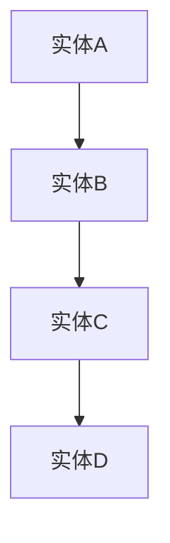
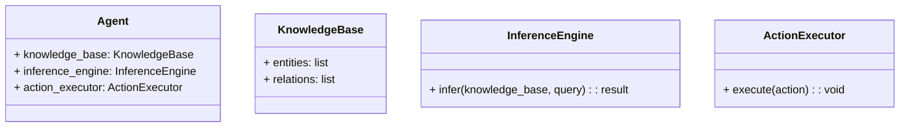

                 


# 提升AI Agent的推理能力：技巧与方法

## 关键词：AI Agent，推理能力，知识图谱，机器学习，深度学习，算法优化

## 摘要：  
AI Agent作为人工智能的核心组件，其推理能力是实现智能决策的关键。本文从理论到实践，系统性地探讨了提升AI Agent推理能力的技巧与方法。首先，介绍了AI Agent的基本概念和推理能力的重要性；接着，深入分析了知识表示与推理算法的基础理论；然后，详细讲解了基于知识图谱和机器学习的推理算法及其优化方法；最后，通过项目实战和系统架构设计，给出了提升推理能力的具体实现方案和优化建议。本文旨在帮助读者全面理解AI Agent的推理机制，并掌握实际应用中的技巧与方法。

---

# 第1章：提升AI Agent推理能力的背景与核心概念

## 1.1 AI Agent的定义与分类

### 1.1.1 AI Agent的基本定义  
AI Agent（人工智能代理）是指能够感知环境、自主决策并执行任务的智能实体。它能够根据输入的信息做出判断，并通过执行动作与环境交互。AI Agent的核心目标是通过智能化的处理，实现复杂任务的自动化和高效性。

### 1.1.2 AI Agent的分类与应用场景  
AI Agent可以根据功能、智能水平和应用场景进行分类：

1. **按功能分类**：
   - **工具型Agent**：专注于完成特定任务，如搜索引擎、推荐系统。
   - **社交型Agent**：用于人机交互，如智能音箱、虚拟助手。
   - **决策型Agent**：用于复杂决策场景，如自动驾驶、金融投资。

2. **按智能水平分类**：
   - **反应式Agent**：基于当前感知做出反应，不依赖历史信息。
   - **认知式Agent**：具备推理、规划和学习能力，能够处理复杂问题。

3. **按应用场景分类**：
   - **服务机器人**：如配送机器人、医疗机器人。
   - **智能系统**：如智能家居、智能安防。

### 1.1.3 推理能力在AI Agent中的重要性  
推理能力是AI Agent实现智能决策的核心，它决定了Agent能否根据已有信息推导出新的结论。强大的推理能力能够让AI Agent在复杂环境中自主解决问题，从而提升其智能化水平。

---

## 1.2 推理能力的核心概念

### 1.2.1 推理的基本定义  
推理是指从已知信息中推导出未知信息的过程。它是AI Agent实现智能决策的基础，主要分为逻辑推理、概率推理和启发式推理。

### 1.2.2 推理的类型与特点  
1. **逻辑推理**：基于逻辑规则进行推导，结果确定，适用于规则明确的场景。
2. **概率推理**：基于概率论进行推导，适用于不确定性较高的场景。
3. **启发式推理**：结合领域知识和经验，通过启发式规则进行推导，适用于复杂问题。

### 1.2.3 推理能力的评估指标  
1. **准确性**：推理结果与实际情况的吻合程度。
2. **效率性**：推理过程的时间复杂度。
3. **鲁棒性**：面对噪声或不完整信息时的推理能力。
4. **可解释性**：推理过程的透明性和可理解性。

---

## 1.3 AI Agent推理能力的现状与挑战

### 1.3.1 当前AI Agent推理技术的发展现状  
目前，AI Agent的推理技术主要基于知识图谱和机器学习。知识图谱提供了结构化的知识表示，而机器学习算法（如深度学习）则提供了强大的模式识别能力。然而，现有技术仍存在以下问题：

1. **知识表示的局限性**：知识图谱难以处理动态变化和多模态信息。
2. **推理能力的不足**：逻辑推理和概率推理的结合还不够紧密。
3. **计算效率问题**：大规模知识图谱的推理需要较高的计算资源。

### 1.3.2 推理能力提升的主要挑战  
1. **知识表示的复杂性**：如何高效地表示和组织多源异构数据是关键。
2. **推理算法的优化**：如何提升推理算法的效率和准确性。
3. **跨领域应用的适应性**：如何在不同领域中灵活应用推理技术。

### 1.3.3 未来研究方向与目标  
1. **多模态知识表示**：结合文本、图像等多种数据源，提升知识表示的丰富性。
2. **混合推理模型**：将逻辑推理和概率推理相结合，提升推理的全面性。
3. **边缘计算环境下的推理优化**：在资源受限的环境中实现高效的推理。

---

## 1.4 本章小结  
本章从AI Agent的基本概念出发，详细介绍了推理能力的核心概念、分类与应用场景，并分析了当前推理技术的现状与挑战。接下来的章节将围绕知识表示与推理算法展开深入探讨。

---

# 第2章：知识表示与推理基础

## 2.1 知识表示的基本概念

### 2.1.1 知识表示的定义与作用  
知识表示是将知识以某种形式表示出来，以便计算机能够理解和利用。它是推理的基础，决定了推理的效果。

### 2.1.2 知识表示的主要形式  
1. **符号逻辑表示**：通过符号和规则表示知识，如谓词逻辑。
2. **语义网络表示**：通过节点和边表示概念及其关系。
3. **图结构表示**：如知识图谱，通过实体和关系构建网络。

### 2.1.3 知识图谱的构建与应用  
知识图谱是一种大规模的图结构，能够表示实体之间的关系。其构建过程包括数据抽取、实体识别和关系抽取等步骤。

---

## 2.2 推理的基本原理

### 2.2.1 逻辑推理的基本原理  
逻辑推理是基于逻辑规则进行推导，结果具有确定性。常用的逻辑推理方法包括演绎推理和归纳推理。

### 2.2.2 概率推理的基本原理  
概率推理基于概率论，通过计算事件发生的概率来推导结论。贝叶斯网络是概率推理的经典方法。

### 2.2.3 启发式推理的基本原理  
启发式推理结合领域知识和启发式规则，通过启发式搜索（如A*算法）来找到最优解。

---

## 2.3 知识表示与推理的关系

### 2.3.1 知识表示对推理的影响  
知识表示的结构和形式直接影响推理的效率和准确性。例如，符号逻辑适合逻辑推理，而知识图谱适合图神经网络推理。

### 2.3.2 推理对知识表示的反哺作用  
推理过程可以发现知识图谱中的缺失或错误，从而反哺知识表示的优化。

### 2.3.3 知识表示与推理的结合案例  
例如，在医疗领域，知识图谱可以表示疾病、症状和药物之间的关系，推理算法可以用于疾病诊断。

---

## 2.4 本章小结  
本章重点介绍了知识表示与推理的基本概念和关系，为后续章节的推理算法奠定了基础。

---

# 第3章：基于知识图谱的推理算法

## 3.1 知识图谱的构建与优化

### 3.1.1 知识图谱的构建方法  
1. **数据抽取**：从结构化数据（如数据库）和非结构化数据（如文本）中抽取实体和关系。
2. **实体识别**：通过NLP技术识别文本中的实体。
3. **关系抽取**：通过模式匹配或深度学习提取实体之间的关系。

### 3.1.2 知识图谱的优化策略  
1. **消除冗余**：去除重复的实体和关系。
2. **增强语义**：通过合并相似实体或添加属性信息提升语义丰富性。
3. **质量评估**：通过评估指标（如完整性、准确性）优化知识图谱。

### 3.1.3 知识图谱的质量评估  
1. **完整性**：知识图谱覆盖的知识范围。
2. **准确性**：知识的正确性。
3. **一致性**：知识内部的逻辑一致性。

---

## 3.2 基于知识图谱的推理算法

### 3.2.1 基于路径的推理算法  
路径推理通过在知识图谱中寻找实体之间的路径来推导关系。例如，通过路径遍历算法找到两个实体之间的最短路径。



### 3.2.2 基于图神经网络的推理算法  
图神经网络通过节点和边的特征进行推理。例如，使用GCN（图卷积网络）进行实体分类。

```python
import torch
import torch.nn as nn

class GCN(nn.Module):
    def __init__(self, input_dim, hidden_dim, output_dim):
        super(GCN, self).__init__()
        self.fc1 = nn.Linear(input_dim, hidden_dim)
        self.fc2 = nn.Linear(hidden_dim, output_dim)
    
    def forward(self, x, adj):
        x = torch.relu(self.fc1(x))
        x = torch.relu(self.fc2(torch.matmul(adj, x)))
        return x
```

### 3.2.3 基于符号逻辑的推理算法  
符号逻辑推理通过谓词逻辑进行推导。例如，使用归结法（Resolution）解决逻辑问题。

---

## 3.3 知识图谱推理的实现案例

### 3.3.1 实例分析：疾病推理系统  
通过知识图谱推理，可以推断出疾病的症状和治疗方法。

### 3.3.2 实例分析：产品推荐系统  
基于知识图谱推理，可以推荐与用户兴趣相关的商品。

### 3.3.3 实例分析：智能问答系统  
通过知识图谱推理，可以回答复杂问题，如“什么是新冠疫苗的主要成分？”

---

## 3.4 本章小结  
本章详细介绍了基于知识图谱的推理算法，包括构建方法和优化策略，并通过实际案例展示了推理的应用场景。

---

# 第4章：基于机器学习的推理算法

## 4.1 机器学习在推理中的应用

### 4.1.1 监督学习在推理中的应用  
监督学习通过训练有标签的数据进行推理。例如，使用决策树进行分类。

### 4.1.2 无监督学习在推理中的应用  
无监督学习通过聚类等方法发现数据中的隐含结构。例如，使用聚类算法进行用户分群。

### 4.1.3 强化学习在推理中的应用  
强化学习通过与环境的交互优化推理策略。例如，使用深度强化学习进行游戏AI的推理。

---

## 4.2 基于深度学习的推理算法

### 4.2.1 基于卷积神经网络的推理  
CNN在图像识别任务中表现出色，可以用于图像分类和目标检测。

```python
import torch
import torch.nn as nn

class CNN(nn.Module):
    def __init__(self):
        super(CNN, self).__init__()
        self.conv1 = nn.Conv2d(3, 6, 5)
        self.pool = nn.MaxPool2d(2, 2)
        self.conv2 = nn.Conv2d(6, 16, 5)
        self.fc1 = nn.Linear(16 * 5 * 5, 120)
        self.fc2 = nn.Linear(120, 10)
    
    def forward(self, x):
        x = self.pool(torch.relu(self.conv1(x)))
        x = self.pool(torch.relu(self.conv2(x)))
        x = x.view(-1, 16 * 5 * 5)
        x = torch.relu(self.fc1(x))
        x = self.fc2(x)
        return x
```

### 4.2.2 基于循环神经网络的推理  
RNN在序列数据（如文本、时间序列）中表现出色，可以用于自然语言处理任务。

```python
class RNN(nn.Module):
    def __init__(self, input_size, hidden_size, output_size):
        super(RNN, self).__init__()
        self.hidden_size = hidden_size
        self.rnn = nn.RNN(input_size, hidden_size, batch_first=True)
        self.fc = nn.Linear(hidden_size, output_size)
    
    def forward(self, x):
        out, _ = self.rnn(x)
        out = self.fc(out[:, -1, :])
        return out
```

### 4.2.3 基于图神经网络的推理  
图神经网络在处理图结构数据时表现出色，可以用于社交网络分析和推荐系统。

---

## 4.3 基于机器学习的推理算法优化

### 4.3.1 数据增强  
通过增加训练数据的多样性和代表性，提升模型的泛化能力。

### 4.3.2 模型压缩  
通过剪枝、量化等技术减少模型的大小，提升推理效率。

### 4.3.3 模型融合  
通过集成学习（如投票、加权平均）提升模型的性能。

---

## 4.4 本章小结  
本章探讨了基于机器学习的推理算法，包括监督学习、无监督学习和强化学习，并介绍了深度学习在推理中的应用。

---

# 第5章：AI Agent推理系统的架构设计

## 5.1 系统功能设计

### 5.1.1 领域模型设计  
通过Mermaid类图展示系统中的实体和关系。



### 5.1.2 功能模块划分  
1. **知识表示模块**：负责知识的表示和存储。
2. **推理算法模块**：负责根据输入推理结果。
3. **结果解释模块**：将推理结果转换为可理解的形式。
4. **接口模块**：与外部系统进行交互。

---

## 5.2 系统架构设计

### 5.2.1 基于知识图谱的架构  
通过Mermaid架构图展示系统架构。


### 5.2.2 基于机器学习的架构  
通过Mermaid架构图展示系统架构。

---

## 5.3 系统接口设计

### 5.3.1 输入接口  
1. **知识输入接口**：用于加载知识图谱或训练数据。
2. **查询接口**：用于接收推理请求。

### 5.3.2 输出接口  
1. **结果输出接口**：返回推理结果。
2. **日志接口**：记录推理过程中的日志信息。

---

## 5.4 系统交互设计

### 5.4.1 推理流程  
通过Mermaid序列图展示系统交互流程。

```mermaid
sequenceDiagram
    participant Agent
    participant KnowledgeBase
    participant InferenceEngine
    participant ActionExecutor
    Agent -> KnowledgeBase: 获取知识库
    Agent -> InferenceEngine: 发起推理请求
    InferenceEngine -> KnowledgeBase: 查询知识
    InferenceEngine -> ActionExecutor: 执行动作
    Agent <-- InferenceEngine: 返回推理结果
```

---

## 5.5 本章小结  
本章详细设计了AI Agent推理系统的架构，包括功能模块划分和系统交互流程。

---

# 第6章：提升AI Agent推理能力的项目实战

## 6.1 环境安装与配置

### 6.1.1 环境要求  
1. **Python 3.8+**
2. **深度学习框架（如TensorFlow、PyTorch）**
3. **知识图谱构建工具（如NetworkX、Neo4j）**

### 6.1.2 安装依赖  
```bash
pip install numpy
pip install matplotlib
pip install torch
pip install networkx
```

---

## 6.2 项目核心实现

### 6.2.1 知识表示模块  
```python
import networkx as nx

def build_knowledge_graph():
    G = nx.Graph()
    G.add_nodes_from(['A', 'B', 'C'])
    G.add_edges_from([('A', 'B'), ('B', 'C')])
    return G
```

### 6.2.2 推理算法模块  
```python
def infer(G, start, end):
    if end in G.neighbors(start):
        return True
    return False
```

### 6.2.3 接口模块  
```python
def main():
    G = build_knowledge_graph()
    start = 'A'
    end = 'C'
    result = infer(G, start, end)
    print(f"推理结果：{result}")

if __name__ == '__main__':
    main()
```

---

## 6.3 项目小结  
本章通过一个简单的项目实战，展示了AI Agent推理系统的实现过程，包括环境配置、核心模块实现和系统测试。

---

# 第7章：提升AI Agent推理能力的技巧与注意事项

## 7.1 数据预处理技巧

### 7.1.1 数据清洗  
通过去除噪声数据和冗余数据，提升数据质量。

### 7.1.2 数据增强  
通过数据扩展（如旋转、翻转）提升数据多样性。

---

## 7.2 模型优化技巧

### 7.2.1 参数调优  
通过网格搜索或随机搜索找到最优参数。

### 7.2.2 模型压缩  
通过剪枝、量化等技术减少模型大小，提升推理效率。

---

## 7.3 系统优化技巧

### 7.3.1 并行计算  
通过多线程或多进程提升计算效率。

### 7.3.2 分布式计算  
通过分布式计算框架（如Spark、Flink）处理大规模数据。

---

## 7.4 本章小结  
本章总结了提升AI Agent推理能力的技巧，包括数据预处理、模型优化和系统优化。

---

# 第8章：总结与展望

## 8.1 本章总结  
本文系统性地探讨了提升AI Agent推理能力的技巧与方法，包括知识表示、推理算法、系统架构和项目实战。

## 8.2 未来展望  
1. **可解释性推理**：提升推理的透明性和可解释性。
2. **多模态推理**：结合文本、图像等多种数据源，提升推理能力。
3. **边缘计算中的推理优化**：在资源受限的环境中实现高效的推理。

---

# 参考文献  
1. 书籍名：《人工智能：一种现代方法》  
2. 论文名：《基于知识图谱的推理算法研究》  
3. 网站：[机器学习入门](https://www.yiibai.com)  

---

以上是《提升AI Agent的推理能力：技巧与方法》的完整目录和内容框架。通过理论与实践的结合，本文为读者提供了全面的提升AI Agent推理能力的方法和技巧。

