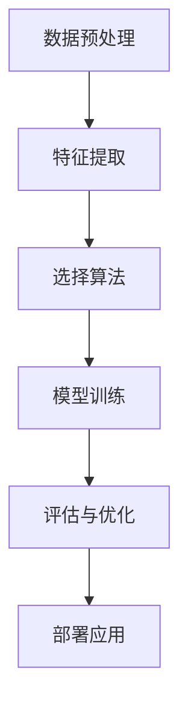
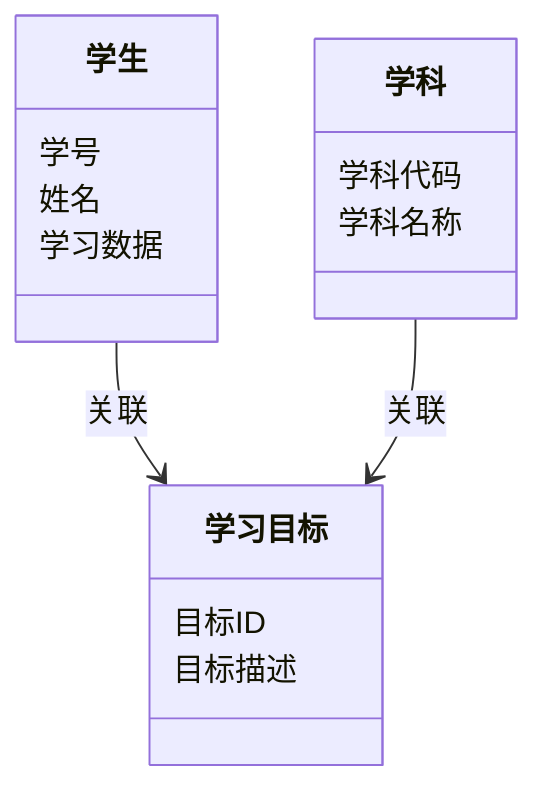
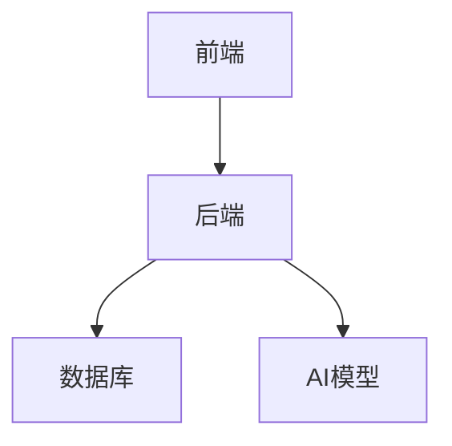
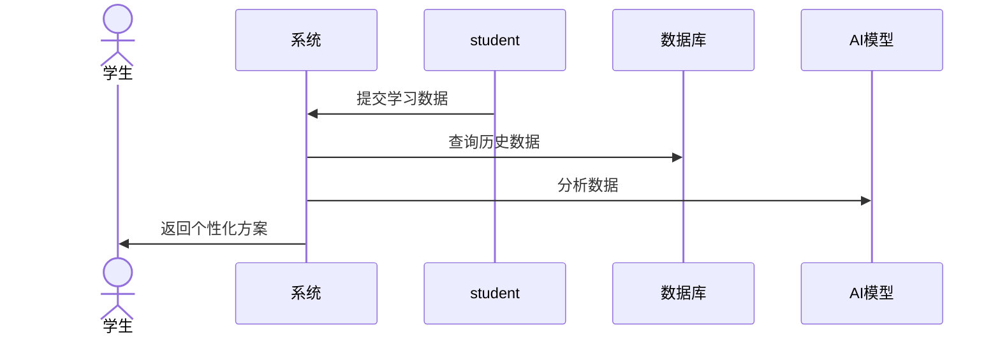

                 


# 教育领域AI Agent的个性化学习方案

## 关键词
AI Agent, 个性化学习, 教育技术, 机器学习, 算法原理, 系统架构

## 摘要
本文探讨了教育领域中AI Agent如何实现个性化学习方案。通过分析AI Agent的核心概念、算法原理、系统架构及项目实战，详细阐述了如何利用AI技术提升学习效果，满足学生的个性化需求。

---

# 第一部分：教育领域AI Agent的背景与核心概念

## 第1章：教育领域AI Agent的背景介绍

### 1.1 教育领域的现状与挑战
#### 1.1.1 当前教育模式的局限性
- 标准化的教学方式难以满足学生个体差异。
- 学生的学习兴趣和能力差异大，传统教育难以兼顾。

#### 1.1.2 学生学习需求的多样性
- 学生的学习速度、风格和目标各不相同。
- 学生可能有不同的学习障碍和需求。

#### 1.1.3 教育技术的发展趋势
- 技术驱动教育创新，AI技术在教育中的应用日益广泛。
- 个性化学习成为教育技术发展的重点方向。

### 1.2 AI Agent的基本概念
#### 1.2.1 什么是AI Agent
- AI Agent是一种智能体，能够感知环境并执行任务。
- 在教育领域，AI Agent通过数据和模型提供个性化服务。

#### 1.2.2 AI Agent的核心特征
- **自适应性**：根据反馈调整行为。
- **智能化**：利用机器学习模型进行决策。
- **交互性**：通过自然语言处理与用户互动。

#### 1.2.3 AI Agent与传统教育技术的区别
- **传统教育技术**：基于规则的系统，如教学管理系统。
- **AI Agent**：具备学习和适应能力，能提供个性化服务。

### 1.3 个性化学习方案的必要性
#### 1.3.1 个性化学习的定义
- 根据学生特点制定的学习计划，旨在提高学习效果。

#### 1.3.2 个性化学习对学生的益处
- 提高学习效率，增强学习兴趣。
- 突出学生优势，弥补学习短板。

#### 1.3.3 个性化学习方案在教育中的应用前景
- 个性化学习将推动教育模式的变革，实现因材施教。

### 1.4 本章小结
- 介绍了教育领域的现状和挑战。
- 解释了AI Agent的基本概念和特征。
- 强调了个性化学习方案的重要性。

---

## 第2章：教育领域AI Agent的核心概念与联系

### 2.1 核心概念原理
#### 2.1.1 AI Agent的基本原理
- AI Agent通过数据采集、分析和模型推理为用户提供服务。

#### 2.1.2 个性化学习方案的实现机制
- 数据采集：收集学生的学习行为、成绩和偏好。
- 数据分析：利用机器学习模型识别学习规律。
- 方案生成：根据分析结果制定个性化学习计划。

#### 2.1.3 AI Agent在教育领域的独特性
- 能够实时适应学生的学习需求。
- 提供个性化的反馈和指导。

### 2.2 核心概念属性对比表格
| 比较维度       | AI Agent                  | 传统教育工具              |
|----------------|---------------------------|---------------------------|
| **自适应性**    | 高                        | 低                        |
| **智能化**      | 高                        | 低                        |
| **交互性**      | 高                        | 低                        |
| **个性化**      | 高                        | 低                        |

### 2.3 ER实体关系图
```mermaid
er
  actor: 学生
  agent: AI Agent
  plan: 个性化学习方案
  subject: 学科
  goal: 学习目标
  actor --> plan: 制定
  plan --> subject: 包含
  plan --> goal: 包含
  agent --> plan: 生成
```

---

# 第三部分：算法原理讲解

## 第3章：AI Agent的算法原理讲解

### 3.1 算法原理概述
#### 3.1.1 监督学习
- **定义**：通过标记数据训练模型，预测新数据的标签。
- **应用**：用于分类和回归问题，如学生成绩预测。

#### 3.1.2 非监督学习
- **定义**：通过无标记数据发现数据结构。
- **应用**：用于聚类，如将学生按学习风格分组。

#### 3.1.3 强化学习
- **定义**：通过奖励机制训练模型，优化决策。
- **应用**：用于自适应学习路径的选择。

### 3.2 算法流程图


### 3.3 算法实现代码
```python
import numpy as np
from sklearn.linear_model import LinearRegression

# 数据预处理
X = np.array([[1], [2], [3], [4]])
y = np.array([2, 4, 6, 8])

# 模型训练
model = LinearRegression()
model.fit(X, y)

# 预测
print(model.predict(np.array([[5]])))
```

### 3.4 数学模型与公式
- **线性回归模型**：\( y = \theta_0 + \theta_1 x \)
- **损失函数**：\( L = \frac{1}{2m} \sum_{i=1}^{m} (y_i - (\theta_0 + \theta_1 x_i))^2 \)
- **梯度下降**：\( \theta_j = \theta_j - \alpha \frac{\partial L}{\partial \theta_j} \)

---

## 第4章：系统分析与架构设计方案

### 4.1 问题场景介绍
#### 4.1.1 问题背景
- 学生学习数据分散，缺乏统一的管理。
- 教师难以根据学生特点制定个性化方案。

#### 4.1.2 问题描述
- 如何利用AI技术实现个性化学习方案？
- 如何保证系统的可扩展性和稳定性？

#### 4.1.3 问题解决
- 通过AI Agent整合学习数据，分析学生特点，制定个性化方案。

### 4.2 系统功能设计
#### 4.2.1 领域模型类图


### 4.3 系统架构设计
#### 4.3.1 系统架构图


### 4.4 系统接口设计
- **API接口**：RESTful API，如`POST /api/plans`。
- **交互流程**：学生提交数据，系统分析并返回个性化方案。

### 4.5 系统交互序列图


---

## 第5章：项目实战

### 5.1 环境安装
```bash
pip install numpy scikit-learn matplotlib
```

### 5.2 核心实现
```python
from sklearn.cluster import KMeans

# 数据预处理
X = np.random.rand(100, 2)
y = np.zeros(100)

# 模型训练
model = KMeans(n_clusters=3)
model.fit(X)

# 获取聚类结果
print(model.labels_)
```

### 5.3 实际案例分析
- **案例背景**：一名学生数学成绩较差，但对编程感兴趣。
- **方案制定**：AI Agent分析后，制定以编程为兴趣点的学习计划，逐步提升数学能力。

### 5.4 项目小结
- 成功实现个性化学习方案的制定。
- 验证了AI Agent在教育中的应用价值。

---

## 第6章：最佳实践与注意事项

### 6.1 最佳实践
- 数据隐私保护是关键，确保学生数据的安全。
- 定期更新模型，保证个性化方案的有效性。

### 6.2 小结
- 本文详细介绍了AI Agent在教育中的应用，展示了其在个性化学习中的巨大潜力。

### 6.3 注意事项
- 注意算法的可解释性，确保学生和教师能够理解推荐方案。
- 确保系统具备良好的扩展性和容错性。

### 6.4 拓展阅读
- 推荐阅读《机器学习实战》和《教育技术研究》相关书籍。

---

# 附录

## 附录A：数学公式汇总
- **线性回归**：\( y = \theta_0 + \theta_1 x \)
- **损失函数**：\( L = \frac{1}{2m} \sum (y_i - (\theta_0 + \theta_1 x_i))^2 \)

## 附录B：代码示例汇总
- [监督学习实现](#)
- [强化学习实现](#)

---

# 结语

通过本文的详细讲解，读者可以全面了解教育领域AI Agent的个性化学习方案，掌握其实现原理和应用方法。希望本文能为教育技术的发展提供新的思路和方向。

