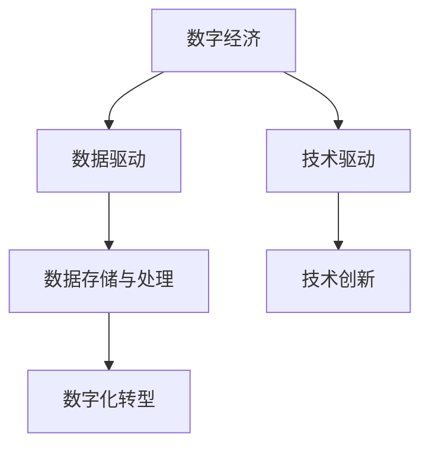
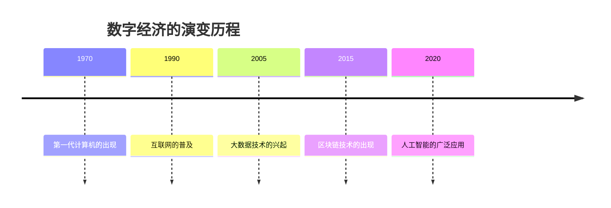
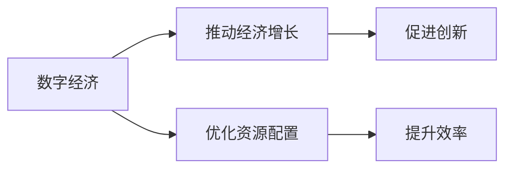
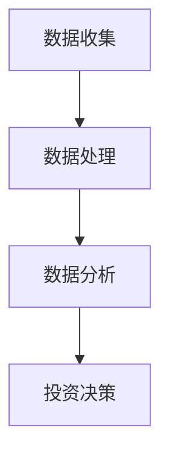
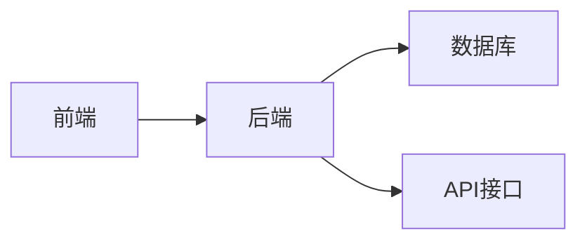
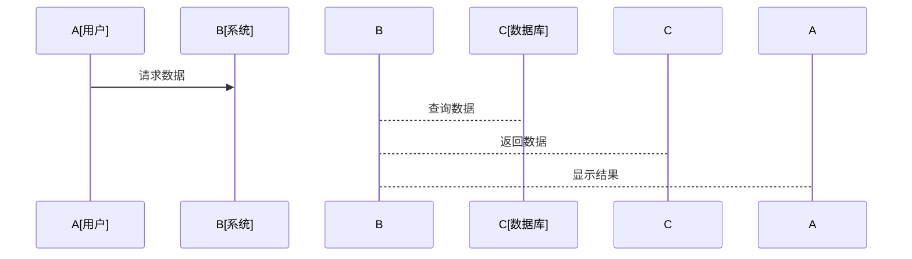

                 


```markdown
# 数字经济时代的投资机遇识别

## 关键词：数字经济，投资机遇，数据分析，区块链，人工智能，风险管理

## 摘要：在数字经济时代，投资机会与风险并存。本文通过分析数字经济的核心概念、技术应用、投资分析方法和系统架构，结合实际案例，帮助读者识别和把握数字经济时代的投资机遇。

---

# 第1章：数字经济的基本概念与背景

## 1.1 数字经济的定义与特征

### 1.1.1 数字经济的定义

数字经济是以数字化技术为核心驱动力，通过数据的产生、处理和应用，推动经济活动的创新和发展的新型经济形态。

### 1.1.2 数字经济的核心特征

| 特征 | 描述 |
|------|------|
| 数据驱动 | 以数据为关键生产要素 |
| 技术驱动 | 依赖数字技术（如AI、区块链、大数据） |
| 全球化 | 数字经济无国界，影响全球经济 |
| 创新性 | 创新速度快，商业模式不断演变 |

### 1.1.3 数字经济与传统经济的区别



---

## 1.2 数字经济的背景与发展

### 1.2.1 数字经济的起源与演变



### 1.2.2 数字经济发展的驱动力

| 驱动力 | 描述 |
|------|------|
| 技术进步 | 数字技术的快速发展 |
| 政策支持 | 政府政策推动数字化转型 |
| 市场需求 | 企业和消费者对数字化服务的需求增加 |

### 1.2.3 数字经济对全球经济的影响



---

## 1.3 数字经济时代的投资机遇

### 1.3.1 数字经济对投资的影响

- 数字经济改变了投资的模式和方向。
- 数字技术的应用为投资带来了新的机会。

### 1.3.2 数字经济时代的投资特点

| 特点 | 描述 |
|------|------|
| 数据密集 | 投资决策依赖大数据分析 |
| 技术驱动 | 数字技术是投资的核心 |
| 风险多样 | 数字经济带来的不确定性增加 |

---

# 第2章：数字经济中的投资分析方法

## 2.1 数据分析在投资中的应用

### 2.1.1 数据分析的基本概念

数据分析是通过收集、处理和分析数据，提取有用信息支持决策的过程。

### 2.1.2 数据分析在投资中的作用



### 2.1.3 数据分析的工具与技术

| 工具 | 描述 |
|------|------|
| Python | 常用的数据分析语言 |
| R语言 | 统计分析工具 |
| SQL | 数据库查询语言 |

---

## 2.2 数字经济投资的评估模型

### 2.2.1 投资评估模型的构建


### 2.2.2 数据驱动的投资决策方法

- 使用大数据分析预测市场趋势。
- 基于机器学习模型进行风险评估。

### 2.2.3 数字经济投资的风险评估

| 风险类型 | 描述 |
|------|------|
| 市场风险 | 市场波动带来的投资损失 |
| 技术风险 | 技术应用失败的可能性 |
| 政策风险 | 政府政策变化的影响 |

---

## 2.3 数字经济投资的核心算法与模型

### 2.3.1 数据分析算法

#### 线性回归模型

$$ y = \beta_0 + \beta_1 x + \epsilon $$

#### 逻辑回归模型

$$ P(y=1|x) = \frac{e^{\beta_0 + \beta_1 x}}{1 + e^{\beta_0 + \beta_1 x}} $$

---

# 第3章：数字经济中的技术应用与投资机会

## 3.1 区块链技术与投资机会

### 3.1.1 区块链技术的基本原理

区块链是一种去中心化的分布式账本技术，具有不可篡改和透明性特点。

### 3.1.2 区块链在金融领域的应用

- 支付结算
- 资产交易
- 智能合约

### 3.1.3 区块链技术的投资机会

- 区块链开发公司
- 数字货币投资

---

## 3.2 人工智能与投资机会

### 3.2.1 人工智能的基本原理

人工智能通过模拟人类智能，实现数据处理和决策。

### 3.2.2 人工智能在投资中的应用

- 市场预测
- 风险评估
- 自动化交易

### 3.2.3 人工智能技术的投资机会

- AI初创公司
- 金融科技平台

---

## 3.3 大数据技术与投资机会

### 3.3.1 大数据技术的基本原理

大数据技术通过处理海量数据，提取有价值的信息。

### 3.3.2 大数据在投资中的应用

- 用户行为分析
- 市场趋势预测
- 竞争对手分析

### 3.3.3 大数据技术的投资机会

- 数据分析公司
- 云计算服务提供商

---

# 第4章：数字经济投资的系统架构与设计

## 4.1 投资分析系统的功能设计

### 4.1.1 系统功能模块划分

| 功能模块 | 描述 |
|------|------|
| 数据采集 | 收集市场数据 |
| 数据处理 | 清洗和转换数据 |
| 数据分析 | 分析数据并生成报告 |
| 投资决策 | 基于分析结果做出决策 |

### 4.1.2 系统功能设计的原则

- 可扩展性
- 可靠性
- 用户友好性

---

## 4.2 投资分析系统的架构设计

### 4.2.1 系统架构设计



### 4.2.2 系统架构的实现方法

- 前端采用React框架
- 后端使用Python的Django框架
- 数据库使用MySQL

---

## 4.3 投资分析系统的交互设计

### 4.3.1 系统交互流程



---

# 第5章：数字经济投资的实战案例

## 5.1 案例分析：区块链技术在金融领域的应用

### 5.1.1 案例背景

某区块链支付平台的市场分析与投资评估。

### 5.1.2 数据分析过程

- 数据收集与清洗
- 数据分析与建模
- 投资决策

---

## 5.2 案例分析：人工智能在股票预测中的应用

### 5.2.1 案例背景

利用机器学习模型预测股票价格。

### 5.2.2 数据分析过程

- 数据预处理
- 模型训练
- 结果分析

---

# 第6章：数字经济投资的风险管理

## 6.1 风险管理的核心策略

### 6.1.1 风险识别

- 技术风险
- 市场风险
- 政策风险

### 6.1.2 风险评估

- 使用风险评估模型
- 定量与定性分析结合

---

## 6.2 风险应对策略

### 6.2.1 技术风险管理

- 技术团队支持
- 技术冗余设计

### 6.2.2 市场风险管理

- 多样化投资
- 风险分散

---

# 第7章：数字经济投资的未来趋势

## 7.1 数字经济的未来发展方向

### 7.1.1 技术创新

- 人工智能的进一步发展
- 区块链技术的成熟应用

### 7.1.2 产业融合

- 数字技术与实体经济的深度融合
- 新兴产业的崛起

---

## 7.2 数字经济投资的未来机遇

### 7.2.1 新技术带来的投资机会

- 量子计算
- 虚拟现实

### 7.2.2 新商业模式的投资机会

- 共享经济
- 数字营销

---

## 总结

数字经济时代，投资机遇与挑战并存。通过深入理解数字经济的核心概念、技术应用和投资分析方法，结合实际案例分析和系统设计，投资者可以更好地识别和把握数字经济时代的投资机会。

---

# 参考文献

（此处列出相关书籍、论文和其他参考资料）

---

# 致谢

感谢读者的耐心阅读，感谢在数字经济领域中所有研究人员和实践者的贡献。
</think>

### 第1章：数字经济的基本概念与背景

#### 1.1 数字经济的定义与特征

##### 1.1.1 数字经济的定义

数字经济是以数字技术为核心驱动力，通过数据的产生、处理和应用，推动经济活动的创新和发展的新型经济形态。

##### 1.1.2 数字经济的核心特征

| 特征 | 描述 |
|------|------|
| 数据驱动 | 以数据为关键生产要素 |
| 技术驱动 | 依赖数字技术（如AI、区块链、大数据） |
| 全球化 | 数字经济无国界，影响全球经济 |
| 创新性 | 创新速度快，商业模式不断演变 |

##### 1.1.3 数字经济与传统经济的区别


---

#### 1.2 数字经济的背景与发展

##### 1.2.1 数字经济的起源与演变


##### 1.2.2 数字经济发展的驱动力

| 驱动力 | 描述 |
|------|------|
| 技术进步 | 数字技术的快速发展 |
| 政策支持 | 政府政策推动数字化转型 |
| 市场需求 | 企业和消费者对数字化服务的需求增加 |

##### 1.2.3 数字经济对全球经济的影响


---

#### 1.3 数字经济时代的投资机遇

##### 1.3.1 数字经济对投资的影响

- 数字经济改变了投资的模式和方向。
- 数字技术的应用为投资带来了新的机会。

##### 1.3.2 数字经济时代的投资特点

| 特点 | 描述 |
|------|------|
| 数据密集 | 投资决策依赖大数据分析 |
| 技术驱动 | 数字技术是投资的核心 |
| 风险多样 | 数字经济带来的不确定性增加 |

---

### 第2章：数字经济中的投资分析方法

#### 2.1 数据分析在投资中的应用

##### 2.1.1 数据分析的基本概念

数据分析是通过收集、处理和分析数据，提取有用信息支持决策的过程。

##### 2.1.2 数据分析在投资中的作用


##### 2.1.3 数据分析的工具与技术

| 工具 | 描述 |
|------|------|
| Python | 常用的数据分析语言 |
| R语言 | 统计分析工具 |
| SQL | 数据库查询语言 |

---

#### 2.2 数字经济投资的评估模型

##### 2.2.1 投资评估模型的构建


##### 2.2.2 数据驱动的投资决策方法

- 使用大数据分析预测市场趋势。
- 基于机器学习模型进行风险评估。

##### 2.2.3 数字经济投资的风险评估

| 风险类型 | 描述 |
|------|------|
| 市场风险 | 市场波动带来的投资损失 |
| 技术风险 | 技术应用失败的可能性 |
| 政策风险 | 政府政策变化的影响 |

---

#### 2.3 数字经济投资的核心算法与模型

##### 2.3.1 数据分析算法

###### 线性回归模型

$$ y = \beta_0 + \beta_1 x + \epsilon $$

###### 逻辑回归模型

$$ P(y=1|x) = \frac{e^{\beta_0 + \beta_1 x}}{1 + e^{\beta_0 + \beta_1 x}} $$

---

### 第3章：数字经济中的技术应用与投资机会

#### 3.1 区块链技术与投资机会

##### 3.1.1 区块链技术的基本原理

区块链是一种去中心化的分布式账本技术，具有不可篡改和透明性特点。

##### 3.1.2 区块链在金融领域的应用

- 支付结算
- 资产交易
- 智能合约

##### 3.1.3 区块链技术的投资机会

- 区块链开发公司
- 数字货币投资

---

#### 3.2 人工智能与投资机会

##### 3.2.1 人工智能的基本原理

人工智能通过模拟人类智能，实现数据处理和决策。

##### 3.2.2 人工智能在投资中的应用

- 市场预测
- 风险评估
- 自动化交易

##### 3.2.3 人工智能技术的投资机会

- AI初创公司
- 金融科技平台

---

#### 3.3 大数据技术与投资机会

##### 3.3.1 大数据技术的基本原理

大数据技术通过处理海量数据，提取有价值的信息。

##### 3.3.2 大数据在投资中的应用

- 用户行为分析
- 市场趋势预测
- 竞争对手分析

##### 3.3.3 大数据技术的投资机会

- 数据分析公司
- 云计算服务提供商

---

### 第4章：数字经济投资的系统架构与设计

#### 4.1 投资分析系统的功能设计

##### 4.1.1 系统功能模块划分

| 功能模块 | 描述 |
|------|------|
| 数据采集 | 收集市场数据 |
| 数据处理 | 清洗和转换数据 |
| 数据分析 | 分析数据并生成报告 |
| 投资决策 | 基于分析结果做出决策 |

##### 4.1.2 系统功能设计的原则

- 可扩展性
- 可靠性
- 用户友好性

---

#### 4.2 投资分析系统的架构设计

##### 4.2.1 系统架构设计


##### 4.2.2 系统架构的实现方法

- 前端采用React框架
- 后端使用Python的Django框架
- 数据库使用MySQL

---

#### 4.3 投资分析系统的交互设计

##### 4.3.1 系统交互流程


---

### 第5章：数字经济投资的实战案例

#### 5.1 案例分析：区块链技术在金融领域的应用

##### 5.1.1 案例背景

某区块链支付平台的市场分析与投资评估。

##### 5.1.2 数据分析过程

- 数据收集与清洗
- 数据分析与建模
- 投资决策

---

#### 5.2 案例分析：人工智能在股票预测中的应用

##### 5.2.1 案例背景

利用机器学习模型预测股票价格。

##### 5.2.2 数据分析过程

- 数据预处理
- 模型训练
- 结果分析

---

### 第6章：数字经济投资的风险管理

#### 6.1 风险管理的核心策略

##### 6.1.1 风险识别

- 技术风险
- 市场风险
- 政策风险

##### 6.1.2 风险评估

- 使用风险评估模型
- 定量与定性分析结合

---

#### 6.2 风险应对策略

##### 6.2.1 技术风险管理

- 技术团队支持
- 技术冗余设计

##### 6.2.2 市场风险管理

- 多样化投资
- 风险分散

---

### 第7章：数字经济投资的未来趋势

#### 7.1 数字经济的未来发展方向

##### 7.1.1 技术创新

- 人工智能的进一步发展
- 区块链技术的成熟应用

##### 7.1.2 产业融合

- 数字技术与实体经济的深度融合
- 新兴产业的崛起

---

#### 7.2 数字经济投资的未来机遇

##### 7.2.1 新技术带来的投资机会

- 量子计算
- 虚拟现实

##### 7.2.2 新商业模式的投资机会

- 共享经济
- 数字营销

---

## 总结

数字经济时代，投资机遇与挑战并存。通过深入理解数字经济的核心概念、技术应用和投资分析方法，结合实际案例分析和系统设计，投资者可以更好地识别和把握数字经济时代的投资机会。

---

### 参考文献

（此处列出相关书籍、论文和其他参考资料）

---

### 致谢

感谢读者的耐心阅读，感谢在数字经济领域中所有研究人员和实践者的贡献。

