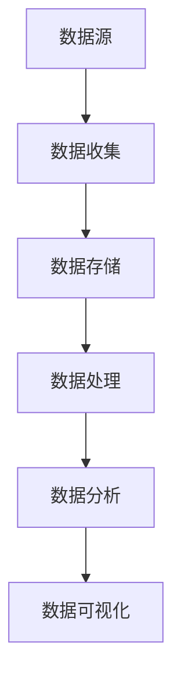
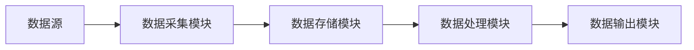
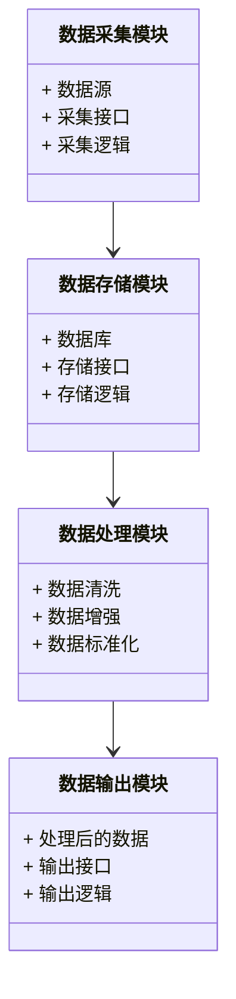

                 


# 数据收集与预处理：为AI Agent准备高质量训练集

> 关键词：数据收集、数据预处理、AI Agent、训练集、数据质量

> 摘要：  
数据是人工智能（AI）系统的核心，而数据收集与预处理是构建高质量训练集的关键步骤。本文将系统地介绍数据收集的核心方法、数据预处理的关键技术、数据质量的评估与优化策略，以及如何为AI Agent准备高质量的训练数据集。通过详细的理论分析、实际案例和代码实现，帮助读者全面掌握数据处理的各个环节，为AI模型的训练打下坚实的基础。

---

# 第一部分: 数据收集与预处理概述

## 第1章: 数据收集的核心概念与方法

### 1.1 数据的分类与属性
#### 1.1.1 数据的类型
- **结构化数据**：表格形式，如CSV、数据库中的数据。
- **非结构化数据**：文本、图像、音频等。
- **半结构化数据**：JSON、XML等格式，介于结构化与非结构化之间。

#### 1.1.2 数据的特征对比
| 特性       | 结构化数据         | 非结构化数据       | 半结构化数据       |
|------------|--------------------|--------------------|--------------------|
| 示例       | 用户ID、年龄       | 文本、图像          | JSON、XML          |
| 处理难度     | 较低               | 较高               | 中等               |

#### 1.1.3 数据生命周期模型


### 1.2 数据收集的来源与方法
#### 1.2.1 数据库中的结构化数据收集
- **关系型数据库**：MySQL、PostgreSQL。
- **NoSQL数据库**：MongoDB、Redis。
- **数据抽取工具**：Sqoop、DataGrip。

#### 1.2.2 网络爬取与API接口数据获取
- **网络爬虫**：BeautifulSoup、Scrapy。
- **API接口**：REST API、GraphQL。
- **注意事项**：遵守网站的robots.txt规则，避免被封禁。

#### 1.2.3 传感器与日志数据的采集
- **传感器数据**：温度、湿度等环境数据。
- **日志数据**：服务器日志、用户行为日志。
- **采集工具**：Flume、Kafka、InfluxDB。

#### 1.2.4 用户输入与交互数据的收集
- **用户行为数据**：点击、滑动、输入等。
- **数据收集工具**：Google Analytics、Mixpanel。

## 第2章: 数据预处理的核心技术与流程

### 2.1 数据清洗与修复
#### 2.1.1 数据清洗的目标与步骤
- **目标**：去除噪声数据、填补缺失值、删除重复数据。
- **步骤**：识别异常值、处理缺失值、标准化格式。

#### 2.1.2 处理缺失值的方法
- **插值法**：线性插值、多项式插值。
- **删除法**：直接删除缺失值较多的行或列。
- **均值填充法**：适用于数值型数据，使用均值或中位数填充。

#### 2.1.3 处理异常值的策略
- **统计方法**：Z-score、IQR（四分位数间距）。
- **机器学习方法**：使用孤立森林算法检测异常值。

### 2.2 数据增强与扩展
#### 2.2.1 数据增强的定义与应用场景
- **定义**：通过技术手段增加数据的多样性。
- **应用场景**：图像识别、自然语言处理。

#### 2.2.2 文本数据的增强方法
- **同义词替换**：使用WordNet进行替换。
- **句式变化**：改变句子的结构，如主动被动转换。

#### 2.2.3 图像数据的增强技术
- **旋转**：随机旋转图像。
- **翻转**：水平或垂直翻转。
- **裁剪**：随机裁剪图像的一部分。

### 2.3 数据标准化与归一化
#### 2.3.1 数据标准化的定义与数学公式
- **标准化**：将数据按比例缩放到相同的标准范围内。
- **公式**：$$ z = \frac{x - \mu}{\sigma} $$
  其中，$\mu$ 是均值，$\sigma$ 是标准差。

#### 2.3.2 数据归一化的实现方法
- **归一化**：将数据缩放到[0,1]范围。
- **公式**：$$ x' = \frac{x - \min(x)}{\max(x) - \min(x)} $$

#### 2.3.3 标准化与归一化的应用场景对比
| 情况             | 标准化         | 归一化         |
|------------------|---------------|---------------|
| 数据分布         | 数据分布保持   | 数据压缩       |
| 适用场景         | 新数据可能偏离均值 | 数据范围固定     |

## 第3章: 数据预处理的系统架构与设计

### 3.1 数据处理系统架构


### 3.2 数据处理模块的核心功能
- **数据清洗**：去除噪声数据。
- **数据增强**：增加数据多样性。
- **数据标准化**：统一数据格式。

### 3.3 数据处理的算法实现

#### 3.3.1 数据清洗算法
```python
import pandas as pd

# 示例数据
data = {'age': [25, 30, None, 40, 50],
        'name': ['Alice', 'Bob', 'Charlie', 'David', 'Eva']}
df = pd.DataFrame(data)

# 处理缺失值：使用均值填充
df['age'].fillna(df['age'].mean(), inplace=True)
print(df)
```

#### 3.3.2 数据增强算法
```python
import cv2
import numpy as np

# 示例图像数据
img = cv2.imread('image.jpg')

# 随机旋转
def random_rotate(img):
    angle = np.random.randint(-30, 30)
    h, w = img.shape[:2]
    M = cv2.getRotationMatrix2D((w/2, h/2), angle, 1)
    return cv2.warpAffine(img, M, (w, h))

enhanced_img = random_rotate(img)
cv2.imwrite('enhanced_image.jpg', enhanced_img)
```

---

# 第二部分: 数据质量评估与优化

## 第4章: 数据质量评估与优化方法

### 4.1 数据质量评估指标
#### 4.1.1 数据完整性评估
- **指标**：字段缺失率、记录完整性。
- **方法**：检查每个字段的缺失值比例。

#### 4.1.2 数据准确性评估
- **指标**：数据与真实值的偏差率。
- **方法**：对比数据来源的准确性。

#### 4.1.3 数据一致性评估
- **指标**：数据格式一致性、数据范围一致性。
- **方法**：检查数据格式是否统一，值域是否合理。

### 4.2 数据质量优化的工具与技术
#### 4.2.1 数据清洗工具
- **Pandas**：数据处理库。
- **DataCleaner**：数据清洗工具。

#### 4.2.2 数据增强框架
- **Augmentor**：图像数据增强框架。
- **imgaug**：支持多种数据增强技术的库。

## 第5章: 数据倾斜与不平衡数据处理

### 5.1 数据倾斜的定义与表现
- **定义**：数据分布不均，某些类别或特征占据绝对优势。
- **表现**：如分类问题中的类别不平衡。

### 5.2 数据平衡技术
#### 5.2.1 过采样技术
- **随机过采样**：简单随机采样。
- **SMOTE（Synthetic Minority Oversampling Technique）**：生成合成样本。

#### 5.2.2 欠采样技术
- **随机欠采样**：随机删除多数类样本。
- **Tomek邻近**：删除边界样本。

#### 5.2.3 综合采样技术
- **方法**：结合过采样和欠采样，优化样本分布。

---

# 第三部分: 为AI Agent准备高质量训练集

## 第6章: 为AI Agent准备高质量训练集

### 6.1 数据标注与特征工程
#### 6.1.1 数据标注
- **文本标注**：标记情感、实体。
- **图像标注**：标记目标物体的边界框。

#### 6.1.2 特征工程
- **特征提取**：从数据中提取有用的特征。
- **特征选择**：选择重要的特征。

### 6.2 数据增强与特征工程的结合
#### 6.2.1 文本数据增强
- **同义词替换**：丰富文本多样性。
- **句式变化**：增加文本的复杂性。

#### 6.2.2 图像数据增强
- **随机裁剪**：改变图像内容。
- **颜色调整**：改变图像的颜色分布。

## 第7章: 数据处理的系统架构与实现

### 7.1 系统功能设计


### 7.2 数据处理的算法实现

#### 7.2.1 数据清洗算法
```python
def data_cleaning(dataframe):
    # 处理缺失值
    dataframe.dropna(inplace=True)
    # 处理重复值
    dataframe.drop_duplicates(inplace=True)
    return dataframe
```

#### 7.2.2 数据增强算法
```python
def data_augmentation(image):
    # 随机裁剪
    x = np.random.randint(0, image.shape[1] - 100)
    y = np.random.randint(0, image.shape[0] - 100)
    image = image[y:y+100, x:x+100]
    return image
```

---

# 第四部分: 项目实战与总结

## 第8章: 项目实战

### 8.1 项目背景与目标
- **背景**：为一个AI Agent准备高质量的训练数据集。
- **目标**：收集、预处理并优化数据，使其适合AI Agent的训练。

### 8.2 数据收集与预处理
#### 8.2.1 数据收集
- **数据来源**：公开数据集、API接口。
- **工具**：使用爬虫、数据库连接工具。

#### 8.2.2 数据预处理
- **步骤**：清洗、增强、标准化。
- **工具**：Pandas、OpenCV、TensorFlow。

### 8.3 数据质量评估
- **评估指标**：完整性、准确性、一致性。
- **优化措施**：填补缺失值、删除异常值、平衡数据分布。

## 第9章: 总结与展望

### 9.1 总结
- 数据收集与预处理是AI Agent训练的关键步骤。
- 高质量的训练数据集能够显著提升AI模型的性能。

### 9.2 展望
- 数据处理技术的自动化与智能化。
- 更多数据增强方法的研究与应用。

---

通过以上内容，读者可以系统地掌握数据收集与预处理的全过程，并能够为AI Agent准备高质量的训练集。

