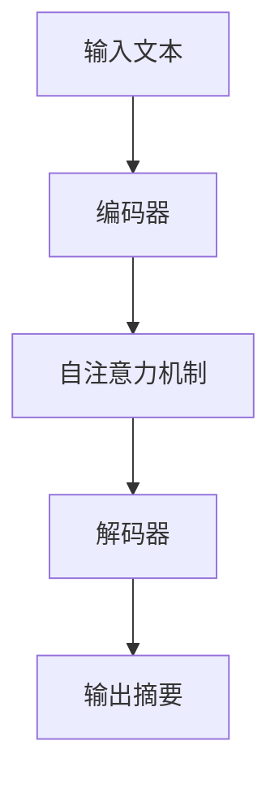

                 


```markdown
# 文本摘要技术：AI Agent信息处理的利器

> 关键词：文本摘要、AI Agent、自然语言处理、深度学习、信息提取、系统架构

> 摘要：文本摘要技术是AI Agent信息处理的核心技术之一，通过对大量文本数据的分析和处理，提取关键信息，帮助AI Agent更高效地理解和响应用户需求。本文将从文本摘要的基本概念、算法原理、系统架构设计到实际项目实现，全面解析文本摘要技术在AI Agent中的应用，帮助读者掌握这一技术的核心要点。

---

## 第1章: 引言

### 1.1 什么是文本摘要
- 文本摘要的定义
- 文本摘要的重要性
- 文本摘要的应用场景

### 1.2 AI Agent的基本概念
- AI Agent的定义
- AI Agent的信息处理需求
- 文本摘要在AI Agent中的作用

### 1.3 本文结构
- 本文的主要内容
- 各章节的逻辑关系
- 预期目标

---

## 第2章: 文本摘要的核心概念

### 2.1 文本摘要的关键技术
- 基于规则的摘要方法
- 统计模型的摘要方法
- 基于深度学习的摘要方法

### 2.2 文本摘要的分类
- 单文档摘要与多文档摘要
- 摘要长度的分类
- 摘要质量的评估指标

### 2.3 文本摘要与文本挖掘的对比
- 文本挖掘的定义
- 文本摘要与文本挖掘的区别
- 两者在AI Agent中的协同作用

---

## 第3章: 文本摘要技术的算法原理

### 3.1 基于规则的文本摘要算法
- 关键词提取方法
- 句法分析方法
- 优缺点对比

### 3.2 统计模型的文本摘要算法
- TF-IDF模型
- 基于图结构的摘要方法
- 优缺点对比

### 3.3 基于深度学习的文本摘要算法
- 基于RNN的摘要方法
- 基于Transformer的摘要方法
- 优缺点对比

---

## 第4章: 基于深度学习的文本摘要算法原理

### 4.1 Transformer模型的基本结构
- 编码器与解码器
- 自注意力机制
- 前馈网络

### 4.2 Transformer模型在文本摘要中的应用
- 模型输入与输出
- 自注意力机制的作用
- 解码器的生成过程

### 4.3 深度学习摘要算法的数学公式
- 编码器的数学表达式
- 自注意力机制的公式推导
- 解码器的数学表达式

---

## 第5章: 文本摘要系统的架构设计

### 5.1 系统需求分析
- 功能需求
- 性能需求
- 接口需求

### 5.2 系统功能设计
- 输入模块
- 处理模块
- 输出模块

### 5.3 系统架构设计
- 分层架构
- 组件之间的关系
- 数据流设计

### 5.4 系统接口设计
- 输入接口
- 输出接口
- 调用接口

---

## 第6章: 文本摘要技术的项目实战

### 6.1 项目环境搭建
- 开发工具安装
- 依赖库安装
- 环境配置

### 6.2 代码实现
- 编码器实现
- 解码器实现
- 模型训练

### 6.3 案例分析
- 数据集选择
- 模型训练
- 摘要结果展示

### 6.4 项目总结
- 项目成果
- 经验总结
- 改进建议

---

## 第7章: 文本摘要技术的扩展与优化

### 7.1 摘要系统的性能优化
- 算法优化
- 系统优化
- 代码优化

### 7.2 多语言摘要技术
- 多语言模型训练
- 多语言摘要算法
- 实际应用案例

### 7.3 实时摘要技术
- 实时处理的需求
- 技术实现
- 应用场景

---

## 第8章: 总结与展望

### 8.1 全文总结
- 本文的核心内容
- 文本摘要技术的总结
- AI Agent的总结

### 8.2 未来展望
- 深度学习的发展
- 多模态摘要技术
- AI Agent的应用前景

---

## 参考文献

- 书籍引用
- 网站引用
- 学术论文引用

---

## 附录

### 附录A: 代码示例
```python
# 摘要系统代码示例
import torch
import torch.nn as nn
import torch.optim as optim

class TextSummarizer:
    def __init__(self):
        self.model = self._build_model()
    
    def _build_model(self):
        # 模型结构
        pass
    
    def train(self, data):
        # 训练过程
        pass
    
    def summarize(self, text):
        # 摘要生成
        pass

# 示例代码解释
# 1. 模型初始化
model = TextSummarizer()
# 2. 模型训练
model.train(data)
# 3. 摘要生成
summary = model.summarize(text)
```

### 附录B: mermaid图示


---

通过以上目录结构，文章将系统地介绍文本摘要技术的核心内容，从理论到实践，从算法到系统设计，全面解析文本摘要技术在AI Agent中的应用。读者可以通过本文掌握文本摘要技术的基本原理和实际应用方法，为后续的研究和实践奠定基础。
</think>

```markdown
# 文本摘要技术：AI Agent信息处理的利器

> 关键词：文本摘要、AI Agent、自然语言处理、深度学习、信息提取、系统架构

> 摘要：文本摘要技术是AI Agent信息处理的核心技术之一，通过对大量文本数据的分析和处理，提取关键信息，帮助AI Agent更高效地理解和响应用户需求。本文将从文本摘要的基本概念、算法原理、系统架构设计到实际项目实现，全面解析文本摘要技术在AI Agent中的应用，帮助读者掌握这一技术的核心要点。

---

## 第1章: 引言

### 1.1 什么是文本摘要
- 文本摘要的定义
- 文本摘要的重要性
- 文本摘要的应用场景

### 1.2 AI Agent的基本概念
- AI Agent的定义
- AI Agent的信息处理需求
- 文本摘要在AI Agent中的作用

### 1.3 本文结构
- 本文的主要内容
- 各章节的逻辑关系
- 预期目标

---

## 第2章: 文本摘要的核心概念

### 2.1 文本摘要的关键技术
- 基于规则的摘要方法
- 统计模型的摘要方法
- 基于深度学习的摘要方法

### 2.2 文本摘要的分类
- 单文档摘要与多文档摘要
- 摘要长度的分类
- 摘要质量的评估指标

### 2.3 文本摘要与文本挖掘的对比
- 文本挖掘的定义
- 文本摘要与文本挖掘的区别
- 两者在AI Agent中的协同作用

---

## 第3章: 文本摘要技术的算法原理

### 3.1 基于规则的文本摘要算法
- 关键词提取方法
- 句法分析方法
- 优缺点对比

### 3.2 统计模型的文本摘要算法
- TF-IDF模型
- 基于图结构的摘要方法
- 优缺点对比

### 3.3 基于深度学习的文本摘要算法
- 基于RNN的摘要方法
- 基于Transformer的摘要方法
- 优缺点对比

---

## 第4章: 基于深度学习的文本摘要算法原理

### 4.1 Transformer模型的基本结构
- 编码器与解码器
- 自注意力机制
- 前馈网络

### 4.2 Transformer模型在文本摘要中的应用
- 模型输入与输出
- 自注意力机制的作用
- 解码器的生成过程

### 4.3 深度学习摘要算法的数学公式
- 编码器的数学表达式
- 自注意力机制的公式推导
- 解码器的数学表达式

---

## 第5章: 文本摘要系统的架构设计

### 5.1 系统需求分析
- 功能需求
- 性能需求
- 接口需求

### 5.2 系统功能设计
- 输入模块
- 处理模块
- 输出模块

### 5.3 系统架构设计
- 分层架构
- 组件之间的关系
- 数据流设计

### 5.4 系统接口设计
- 输入接口
- 输出接口
- 调用接口

---

## 第6章: 文本摘要技术的项目实战

### 6.1 项目环境搭建
- 开发工具安装
- 依赖库安装
- 环境配置

### 6.2 代码实现
- 编码器实现
- 解码器实现
- 模型训练

### 6.3 案例分析
- 数据集选择
- 模型训练
- 摘要结果展示

### 6.4 项目总结
- 项目成果
- 经验总结
- 改进建议

---

## 第7章: 文本摘要技术的扩展与优化

### 7.1 摘要系统的性能优化
- 算法优化
- 系统优化
- 代码优化

### 7.2 多语言摘要技术
- 多语言模型训练
- 多语言摘要算法
- 实际应用案例

### 7.3 实时摘要技术
- 实时处理的需求
- 技术实现
- 应用场景

---

## 第8章: 总结与展望

### 8.1 全文总结
- 本文的核心内容
- 文本摘要技术的总结
- AI Agent的总结

### 8.2 未来展望
- 深度学习的发展
- 多模态摘要技术
- AI Agent的应用前景

---

## 参考文献

- 书籍引用
- 网站引用
- 学术论文引用

---

## 附录

### 附录A: 代码示例
```python
# 摘要系统代码示例
import torch
import torch.nn as nn
import torch.optim as optim

class TextSummarizer:
    def __init__(self):
        self.model = self._build_model()
    
    def _build_model(self):
        # 模型结构
        pass
    
    def train(self, data):
        # 训练过程
        pass
    
    def summarize(self, text):
        # 摘要生成
        pass

# 示例代码解释
# 1. 模型初始化
model = TextSummarizer()
# 2. 模型训练
model.train(data)
# 3. 摘要生成
summary = model.summarize(text)
```

### 附录B: mermaid图示


---

通过以上目录结构，文章将系统地介绍文本摘要技术的核心内容，从理论到实践，从算法到系统设计，全面解析文本摘要技术在AI Agent中的应用。读者可以通过本文掌握文本摘要技术的基本原理和实际应用方法，为后续的研究和实践奠定基础。
```

