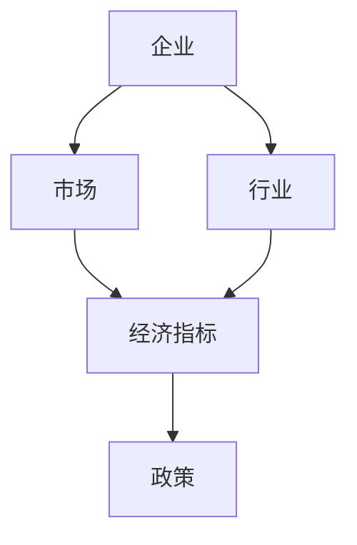
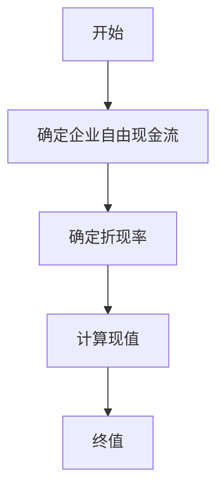
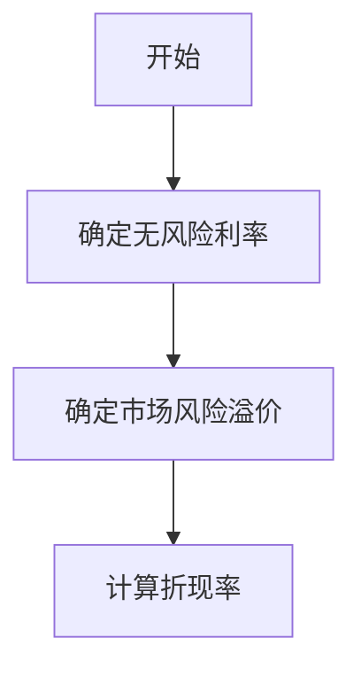

                 


# 《新兴市场企业估值的特殊考虑》

---

## 关键词：
- 新兴市场
- 企业估值
- 财务模型
- 数据分析
- 金融市场

---

## 摘要：
新兴市场的崛起在全球经济中占据了重要地位，但其企业估值却面临独特挑战。本文系统探讨新兴市场企业估值的核心概念、算法原理、系统架构及实战案例，分析其特殊性及应对策略。通过深入剖析DCF模型、相对估值法等方法的适用性，结合实际案例，提出优化建议，并总结最佳实践，为读者提供全面的指导。

---

# 第1章: 新兴市场企业估值的背景与问题概述

## 1.1 新兴市场企业估值的背景

### 1.1.1 经济全球化与新兴市场的崛起
随着全球化进程加速，新兴市场如中国、印度、东南亚国家等逐渐成为全球经济的重要驱动力。这些市场具有高增长潜力，吸引了大量投资者的关注。

### 1.1.2 新兴市场的定义与特点
新兴市场通常指那些经济快速发展但尚未完全工业化的国家。其特点包括：经济波动较大、政策环境复杂、金融市场不完善、数据获取难度高等。

### 1.1.3 企业估值的核心概念与问题背景
企业估值是评估企业内在价值的过程，通常基于财务指标、市场表现和行业趋势。在新兴市场中，由于信息不对称和数据稀缺性，估值过程更具挑战性。

---

## 1.2 新兴市场企业估值的特殊性

### 1.2.1 新兴市场的经济波动与不确定性
新兴市场的经济受外部环境影响较大，如汇率波动、贸易政策变化等，导致企业估值的波动性增加。

### 1.2.2 政策环境的复杂性与变化
新兴市场国家的政策环境往往不够稳定，政府可能频繁调整货币政策、行业监管政策等，这对企业估值模型的假设提出了更高要求。

### 1.2.3 信息不对称与数据获取难度
在新兴市场中，企业财务数据的透明度较低，投资者难以获取准确的财务信息，导致估值过程中的信息不对称问题。

---

## 1.3 新兴市场企业估值的现状与挑战

### 1.3.1 现有估值方法的局限性
传统的估值方法如DCF模型、相对估值法在新兴市场中可能面临数据不足或不准确的问题，导致估值结果偏差较大。

### 1.3.2 新兴市场中的行业特殊性
不同行业在新兴市场中的表现差异显著，例如科技行业可能受益于政策支持，而传统制造业可能面临成本上升的压力。

### 1.3.3 估值模型的适用性与调整需求
新兴市场的特殊性要求估值模型需要进行调整，例如调整折现率、引入行业特定的假设等。

---

## 1.4 新兴市场企业估值的边界与外延

### 1.4.1 估值范围的界定
新兴市场企业估值的范围可能包括母公司、子公司及关联方，需明确估值边界以避免遗漏或重复。

### 1.4.2 估值方法的适用场景
不同的估值方法适用于不同的市场环境和企业类型，需根据实际情况选择合适的估值方法。

### 1.4.3 估值结果的解释与应用
新兴市场企业估值结果的应用需结合市场环境和企业战略，避免机械地使用估值结果。

---

## 1.5 本章小结
本章从背景、特殊性、现状与挑战、边界与外延等方面全面介绍了新兴市场企业估值的基本概念和问题。通过分析新兴市场的特殊性，为后续章节的深入探讨奠定了基础。

---

# 第2章: 新兴市场企业估值的核心概念与联系

## 2.1 核心概念原理

### 2.1.1 企业价值的定义与计算
企业价值（Enterprise Value，EV）是企业整体价值的度量，包括股权价值和债权价值。计算公式为：
$$ EV = EBITDA \times 倍数 $$

### 2.1.2 股东自由现金流的计算方法
股东自由现金流（Free Cash Flow to Equity，FCFE）是企业归还所有债权人之后剩余可用于股东的现金流。计算公式为：
$$ FCFE = EBIT \times (1 - 税率) + 折旧和摊销 - 资本支出 $$

### 2.1.3 折现率的确定与调整
折现率反映了资金的时间价值和风险溢价。在新兴市场中，折现率通常需要考虑市场风险、行业风险和企业特有风险。

---

## 2.2 核心概念属性对比表

| 概念       | 属性             | 新兴市场特点       | 成熟市场特点       |
|------------|------------------|-------------------|-------------------|
| 企业价值   | 数据透明度       | 低                | 高                |
| 自由现金流 | 预测难度         | 高                | 中                |
| 折现率     | 市场风险因素     | 多样且不稳定       | 少且相对稳定       |

---

## 2.3 ER实体关系图



---

## 2.4 本章小结
本章通过对比分析和实体关系图，展示了新兴市场企业估值的核心概念及其相互联系。这些概念为企业估值提供了理论基础和分析框架。

---

# 第3章: 新兴市场企业估值的算法原理与数学模型

## 3.1 算法原理

### 3.1.1 现金流折现法（DCF模型）



#### 3.1.1.1 现金流折现法公式
企业价值（EV）的计算公式为：
$$ EV = \sum_{t=1}^{n} \frac{CF_t}{(1 + r)^t} + \frac{TV}{(1 + r)^n} $$
其中，\( CF_t \) 是第t年的自由现金流，\( r \) 是折现率，\( TV \) 是终值。

#### 3.1.1.2 代码实现
```python
def discounted_cash_flow(fcf, wacc, horizon, terminal_value):
    # 计算现值
    present_value = 0
    for t in range(1, horizon + 1):
        present_value += fcf / (1 + wacc) ** t
    # 计算终值现值
    present_value += terminal_value / (1 + wacc) ** horizon
    return present_value

# 示例数据
fcf = 100  # 自由现金流
wacc = 0.10  # 加权平均资本成本
horizon = 5  # 期限
terminal_value = 500  # 终值

ev = discounted_cash_flow(fcf, wacc, horizon, terminal_value)
print(f"企业价值 (EV): {ev}")
```

---

## 3.2 算法原理

### 3.2.2 相对估值法（可比公司分析）
相对估值法通过比较可比公司的估值倍数（如市盈率、市净率）来确定目标公司的估值。

#### 3.2.2.1 可比公司分析公式
目标公司估值公式为：
$$ EV_{target} = EV_{comparable} \times \frac{R_{target}}{R_{comparable}} $$
其中，\( R_{target} \) 和 \( R_{comparable} \) 分别为目标公司和可比公司的估值倍数。

---

## 3.3 算法原理

### 3.3.3 股权资本定价模型（CAPM）



#### 3.3.3.1 CAPM公式
折现率（\( r \)）的计算公式为：
$$ r = r_f + \beta \times (r_m - r_f) $$
其中，\( r_f \) 是无风险利率，\( \beta \) 是贝塔系数，\( r_m \) 是市场平均回报率。

---

## 3.4 本章小结
本章详细介绍了现金流折现法、相对估值法和CAPM模型的算法原理，并通过代码示例展示了DCF模型的应用。这些方法为新兴市场企业估值提供了理论支持和实践指导。

---

接下来的内容将围绕系统分析与架构设计、项目实战、最佳实践等展开，为您提供更全面的分析和指导。

