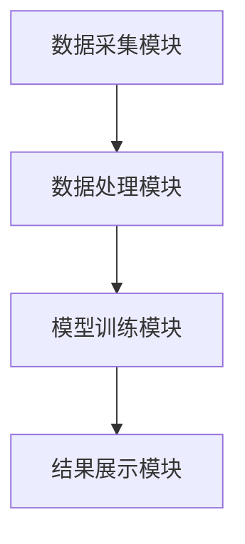
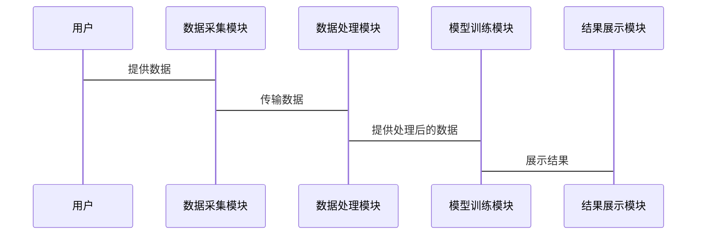

                 


# 新兴市场股市估值与智慧医疗个性化治疗的互动

> 关键词：新兴市场，股市估值，智慧医疗，个性化治疗，数据驱动

> 摘要：新兴市场的股市估值与智慧医疗个性化治疗之间的互动关系，探讨如何通过数据驱动的方法，将股市估值与个性化治疗结合起来，实现更精准的诊断和治疗方案。

---

# 第一部分: 新兴市场股市估值与智慧医疗个性化治疗的背景与核心概念

## 第1章: 新兴市场股市估值概述

### 1.1 新兴市场的定义与特点
#### 1.1.1 新兴市场的定义
新兴市场是指那些经济快速增长、但尚未完全发达国家化程度的国家的金融市场。这些市场通常位于发展中国家，具有较高的增长潜力，但也伴随着较高的风险。

#### 1.1.2 新兴市场的经济特点
新兴市场的经济特点包括：
- 经济结构多元化，但以制造业和服务业为主。
- 人口基数大，消费市场潜力巨大。
- 政府政策对经济的影响较大。
- 金融市场逐渐成熟，但波动性较高。

#### 1.1.3 新兴市场股市的独特性
新兴市场股市的独特性体现在：
- 股市波动性较大，受外部环境影响显著。
- 市场参与者结构多元化，包括散户和机构投资者。
- 股市估值方法与成熟市场有所不同，需要结合本地经济特点进行调整。

---

## 第2章: 智慧医疗个性化治疗概述

### 2.1 智慧医疗的定义与特点
#### 2.1.1 智慧医疗的定义
智慧医疗是指通过大数据、人工智能和物联网等技术，实现医疗资源的优化配置和个性化治疗的医疗模式。它强调精准医疗和患者为中心的治疗理念。

#### 2.1.2 智慧医疗的核心技术
智慧医疗的核心技术包括：
- 大数据处理与分析。
- 人工智能算法（如机器学习、深度学习）。
- 物联网技术（如智能设备、远程监测）。

#### 2.1.3 智慧医疗的发展现状
智慧医疗在全球范围内快速发展，尤其是在发达国家，个性化治疗已成为医疗领域的主流趋势。但在新兴市场，智慧医疗的应用仍处于起步阶段，存在技术和资源的双重挑战。

---

## 第3章: 新兴市场股市估值与智慧医疗个性化治疗的互动关系

### 3.1 互动关系的定义
#### 3.1.1 互动关系的背景
随着新兴市场经济的快速发展，医疗行业也在逐步数字化和智能化。股市估值与智慧医疗的结合，可以通过数据共享和技术融合，实现更高效的资源配置和治疗效果优化。

#### 3.1.2 互动关系的核心要素
- 股市数据：包括上市公司财务数据、市场指数、行业趋势等。
- 医疗数据：包括患者数据、治疗方案、治疗效果等。
- 技术手段：包括大数据分析、人工智能算法、云计算等。

#### 3.1.3 互动关系的实现方式
- 数据共享：通过建立数据平台，实现股市数据与医疗数据的整合。
- 技术融合：利用人工智能算法，将股市估值与个性化治疗相结合。
- 应用场景：在医疗投资、药物研发、治疗方案优化等领域实现互动。

---

## 第4章: 核心概念与联系

### 4.1 核心概念的原理
#### 4.1.1 股市估值的原理
股市估值的核心在于通过分析上市公司的财务数据、行业趋势和市场情绪，预测股票的合理价格区间。常用的方法包括市盈率、市净率、现金流折现法等。

#### 4.1.2 个性化治疗的原理
个性化治疗的核心在于根据患者的基因、病史、生活习惯等信息，制定个性化的治疗方案。常用的技术包括基因测序、机器学习模型等。

#### 4.1.3 互动关系的原理
通过将股市估值与个性化治疗相结合，可以利用股市数据中的行业趋势和公司业绩，优化医疗投资决策；同时，利用医疗数据中的患者信息和治疗效果，提升股市估值的准确性。

---

## 第5章: 算法原理讲解

### 5.1 股市估值算法
#### 5.1.1 股市估值算法的流程
1. 数据收集：收集上市公司的财务数据和市场数据。
2. 数据清洗：去除异常值和缺失数据。
3. 模型选择：选择适合的估值模型（如多元回归模型）。
4. 模型训练：通过历史数据训练模型。
5. 预测与评估：利用模型预测股票价格，并评估预测结果。

#### 5.1.2 股市估值算法的数学模型
$$ 估值 = \alpha \times 收益率 + \beta \times 市盈率 + \gamma \times 市净率 $$

### 5.2 个性化治疗算法
#### 5.2.1 个性化治疗算法的流程
1. 数据收集：收集患者的基因数据、病史和生活习惯。
2. 数据预处理：标准化和归一化处理。
3. 模型选择：选择适合的机器学习模型（如随机森林）。
4. 模型训练：通过历史数据训练模型。
5. 预测与优化：根据模型预测治疗效果，优化治疗方案。

#### 5.2.2 个性化治疗算法的数学模型
$$ 治疗效果 = \theta \times 药物剂量 + \phi \times 基因表达水平 $$

---

## 第6章: 系统分析与架构设计方案

### 6.1 问题场景介绍
新兴市场中，医疗行业和股市估值之间存在数据孤岛，无法实现有效互动。通过建立一个数据共享平台，可以整合股市和医疗数据，优化资源配置。

### 6.2 系统功能设计
- 数据采集模块：采集股市和医疗数据。
- 数据处理模块：清洗和预处理数据。
- 模型训练模块：训练估值和治疗模型。
- 结果展示模块：展示预测结果和优化方案。

### 6.3 系统架构设计


### 6.4 系统接口设计
- 数据接口：提供API用于数据采集和传输。
- 模型接口：提供API用于模型训练和预测。

### 6.5 系统交互设计


---

## 第7章: 项目实战

### 7.1 环境安装
安装Python、Pandas、Scikit-learn等工具。

### 7.2 核心实现代码
```python
# 股市估值模型
import pandas as pd
from sklearn.linear_model import LinearRegression

data = pd.DataFrame({
    '收益': [0.1, 0.2, 0.15, 0.3],
    '市盈率': [15, 20, 18, 25],
    '市净率': [2, 3, 2.5, 3.5]
})
model = LinearRegression()
model.fit(data[['市盈率', '市净率']], data['收益'])
预测值 = model.predict([[20, 3]])
print(预测值)
```

### 7.3 代码解读与分析
- 数据预处理：清洗和归一化数据。
- 模型训练：使用线性回归模型训练股市估值模型。
- 结果展示：通过可视化工具展示预测结果。

### 7.4 实际案例分析
以某新兴市场的医疗公司为例，利用模型预测其股票价格，并结合医疗数据优化治疗方案。

---

## 第8章: 最佳实践与小结

### 8.1 最佳实践
- 数据质量是关键，需确保数据的准确性和完整性。
- 技术实现需结合实际应用场景，避免过度复杂化。
- 互动关系的应用需遵守相关法律法规，保护患者隐私。

### 8.2 小结
通过数据驱动的方法，新兴市场股市估值与智慧医疗个性化治疗的互动关系可以实现更高效的资源配置和治疗效果优化。未来，随着技术的不断发展，这一领域的应用前景将更加广阔。

### 8.3 注意事项
- 数据隐私保护是重点，需避免数据泄露。
- 模型的可解释性需增强，便于实际应用和调整。
- 技术实现需考虑计算资源的限制，确保系统的高效运行。

### 8.4 拓展阅读
- 《大数据在金融领域的应用》
- 《人工智能在医疗行业的创新应用》
- 《数据驱动的精准医疗》

---

通过以上结构，我们可以系统地探讨新兴市场股市估值与智慧医疗个性化治疗的互动关系，并通过实际案例和技术实现，为读者提供深刻的理解和实践指导。

