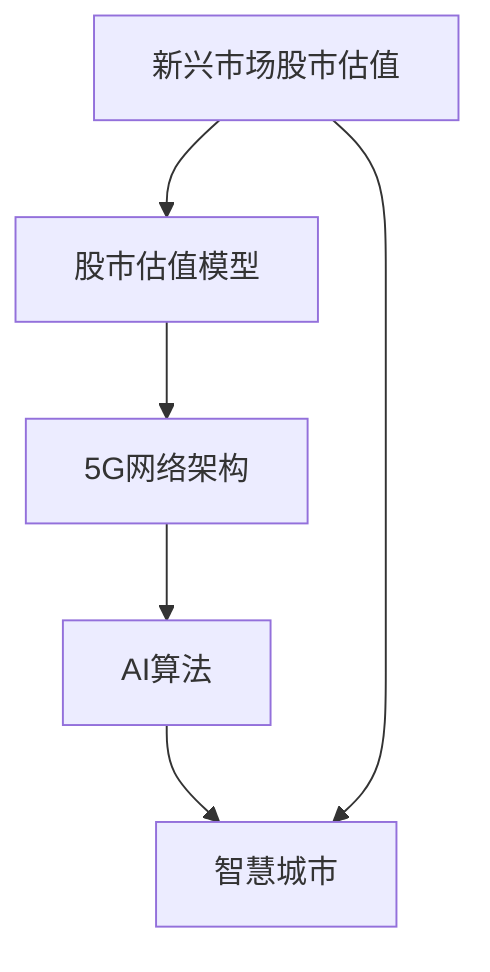

                 


# 第一部分: 新兴市场股市估值与智慧城市5G+AI应用的互动概述

## 第1章: 背景介绍

### 1.1 问题背景

#### 1.1.1 新兴市场的定义与特点
新兴市场通常指的是那些经济发展迅速、市场机制逐步完善但尚未完全成熟的国家或地区的金融市场。这些市场通常具有以下特点：
- 市场规模较小，但增长潜力巨大。
- 市场波动性较高，受外部经济环境影响较大。
- 投资者结构较为单一，散户占比高，机构投资者较少。
- 市场信息不透明，数据获取难度较大。

#### 1.1.2 智慧城市的发展现状
智慧城市是指利用信息技术、数据科学和互联网技术，将城市的各个系统（如交通、能源、医疗、教育等）进行智能化整合，以提高城市管理效率和居民生活质量。目前，全球范围内许多城市都在积极推进智慧城市建设，尤其是在新兴市场国家，智慧城市建设已经成为推动经济转型和提升城市竞争力的重要手段。

#### 1.1.3 5G与AI技术的融合趋势
5G技术的高速度、低延迟和大连接数的特点为AI技术的应用提供了良好的网络基础。同时，AI技术的进步也为5G网络的优化和智能化管理提供了技术支持。两者的结合使得智慧城市中的数据采集、处理和决策过程更加高效和智能化。

### 1.2 问题描述

#### 1.2.1 新兴市场股市估值的复杂性
新兴市场的股市估值受到多种因素的影响，包括经济政策、国际贸易关系、市场情绪等。由于市场信息不透明和数据获取难度大，传统的估值方法在新兴市场中往往效果不佳。

#### 1.2.2 智慧城市中的5G+AI应用挑战
在智慧城市建设中，5G和AI技术的应用面临诸多挑战，包括数据隐私问题、技术整合难度大、资金投入高等。此外，如何将5G和AI技术有效地结合，发挥其协同效应，也是需要解决的关键问题。

#### 1.2.3 两者的互动关系与潜在影响
新兴市场股市估值的变化可能会影响智慧城市建设的资金来源，而智慧城市建设中的5G+AI应用又可能反过来影响股市的表现。两者之间的互动关系需要进一步研究和分析。

### 1.3 问题解决

#### 1.3.1 新兴市场股市估值的方法论
为了提高新兴市场股市估值的准确性，可以采用多种方法的结合，例如：
- 使用大数据技术对市场情绪进行分析。
- 建立基于机器学习的预测模型。
- 结合宏观经济指标进行综合评估。

#### 1.3.2 智慧城市5G+AI应用的解决方案
针对智慧城市建设中的挑战，可以采取以下措施：
- 加强数据隐私保护，建立数据共享机制。
- 推动5G和AI技术的标准化研究，降低技术整合难度。
- 加大资金投入，吸引更多的机构投资者参与智慧城市建设。

#### 1.3.3 互动机制的构建与优化
为了实现新兴市场股市估值与智慧城市建设的互动，可以构建以下机制：
- 建立信息共享平台，促进市场信息的透明化。
- 加强政策引导，推动5G和AI技术在股市估值中的应用。
- 定期发布研究报告，分析两者互动的潜在影响。

### 1.4 边界与外延

#### 1.4.1 新兴市场股市估值的边界条件
在进行新兴市场股市估值时，需要考虑以下边界条件：
- 数据获取的限制。
- 市场波动性的影响。
- 政治经济环境的变化。

#### 1.4.2 智慧城市5G+AI应用的适用范围
5G和AI技术在智慧城市建设中的应用范围包括：
- 智慧交通。
- 智慧能源。
- 智慧医疗。
- 智慧教育。

#### 1.4.3 互动关系的外延与扩展
新兴市场股市估值与智慧城市建设的互动关系可以扩展到以下几个方面：
- 投资者行为的变化。
- 市场情绪的波动。
- 技术进步对股市的推动作用。

### 1.5 概念结构与核心要素

#### 1.5.1 核心概念的构成
新兴市场股市估值与智慧城市5G+AI应用的互动关系由以下核心要素构成：
- 股市估值模型。
- 5G网络架构。
- AI算法。
- 市场数据。

#### 1.5.2 核心要素的对比分析
以下是核心要素的对比分析表：

| 对比维度 | 股市估值 | 智慧城市5G+AI应用 |
|----------|----------|------------------|
| 输入数据 | 股价、财务数据 | 5G网络数据、AI算法 |
| 输出结果 | 估值、投资建议 | 智能决策、优化方案 |
| 主要影响 | 投资者决策 | 城市管理效率 |

#### 1.5.3 概念结构图
以下是概念结构图的mermaid表示：



---

## 第2章: 核心概念与联系

### 2.1 股市估值的核心原理

#### 2.1.1 市盈率与市净率的计算方法
市盈率（P/E）= 股价 / 每股净利润  
市净率（P/B）= 股价 / 每股净资产  

#### 2.1.2 股票价格与市场情绪的关系
股票价格受市场情绪影响较大，可以通过分析社交媒体、新闻媒体等渠道的数据来判断市场情绪。

#### 2.1.3 股市估值的数学模型
以下是一个简单的股市估值模型：

$$ \text{股票价值} = \text{未来现金流的现值} $$

### 2.2 智慧城市5G+AI应用的核心原理

#### 2.2.1 5G网络的特性与优势
5G网络具有高速度、低延迟和大连接数的特点，为AI技术的应用提供了良好的网络基础。

#### 2.2.2 AI在智慧城市中的应用场景
AI可以应用于智能交通管理、环境监测、公共安全等领域。

#### 2.2.3 5G与AI的协同效应
5G网络为AI技术提供了快速的数据传输通道，而AI技术则可以帮助优化5G网络的资源配置。

### 2.3 核心概念对比与ER实体关系图

#### 2.3.1 核心概念属性特征对比表
以下是核心概念属性特征对比表：

| 对比维度 | 股市估值 | 智慧城市5G+AI应用 |
|----------|----------|------------------|
| 输入数据 | 股价、财务数据 | 5G网络数据、AI算法 |
| 输出结果 | 估值、投资建议 | 智能决策、优化方案 |
| 主要影响 | 投资者决策 | 城市管理效率 |

#### 2.3.2 ER实体关系图
以下是ER实体关系图的mermaid表示：

```mermaid
erd
  entity 股市估值 {
    <属性> 股价
    <属性> 市盈率
    <关系> 投资者
  }
  entity 智慧城市5G+AI应用 {
    <属性> 5G网络
    <属性> AI算法
    <关系> 城市管理者
  }
```

---

## 第3章: 核心概念与联系

### 3.1 股市估值与智慧城市5G+AI应用的联系

#### 3.1.1 数据共享与整合
新兴市场股市估值与智慧城市5G+AI应用可以通过数据共享实现资源整合，提高估值的准确性。

#### 3.1.2 技术协同效应
5G网络为AI技术提供了良好的网络环境，而AI技术则可以优化5G网络的资源分配。

#### 3.1.3 市场互动机制
新兴市场股市估值的变化可能会影响智慧城市建设的资金来源，而智慧城市建设中的5G+AI应用又可能反过来影响股市的表现。

### 3.2 股市估值与智慧城市5G+AI应用的对比分析

#### 3.2.1 技术特点对比
以下是技术特点对比表：

| 对比维度 | 股市估值 | 智慧城市5G+AI应用 |
|----------|----------|------------------|
| 技术基础 | 金融学、统计学 | 通信技术、人工智能 |
| 应用场景 | 股票交易、投资决策 | 智慧交通、智能城市 |
| 主要目标 | 估值准确、投资收益 | 提高城市管理效率 |

### 3.3 概念结构图

以下是概念结构图的mermaid表示：


---

## 第4章: 核心概念与联系

### 4.1 核心概念与联系的总结

#### 4.1.1 核心概念的联系
新兴市场股市估值与智慧城市5G+AI应用之间存在密切的联系，主要体现在数据共享、技术协同和市场互动三个方面。

#### 4.1.2 核心概念的对比
通过对比分析可以看出，两者在技术基础、应用场景和主要目标上存在显著差异，但也有一些共同点，如数据驱动和技术创新。

---

## 第5章: 结论

### 5.1 总结

#### 5.1.1 核心概念的总结
新兴市场股市估值与智慧城市5G+AI应用的互动关系是一个复杂但具有重要研究意义的课题。

#### 5.1.2 研究意义
本研究为新兴市场股市估值和智慧城市建设提供了理论支持和实践指导，有助于推动技术进步和经济发展。

### 5.2 展望

#### 5.2.1 研究方向
未来可以进一步研究新兴市场股市估值与智慧城市5G+AI应用的互动机制，探索更多的应用场景和技术协同的可能性。

#### 5.2.2 实际应用
本研究的成果可以应用于智慧城市建设中的投资决策和风险评估，为投资者和城市管理者提供科学依据。

---

通过以上章节的详细分析，我们可以得出结论：新兴市场股市估值与智慧城市5G+AI应用的互动关系是一个复杂但具有重要研究意义的课题。本研究为新兴市场股市估值和智慧城市建设提供了理论支持和实践指导，有助于推动技术进步和经济发展。

