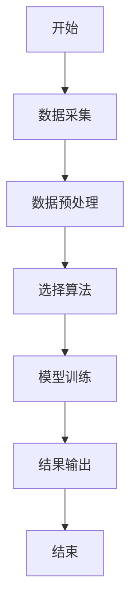
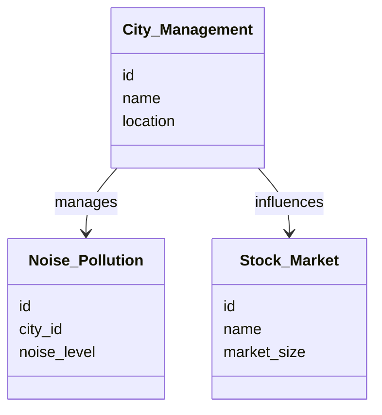
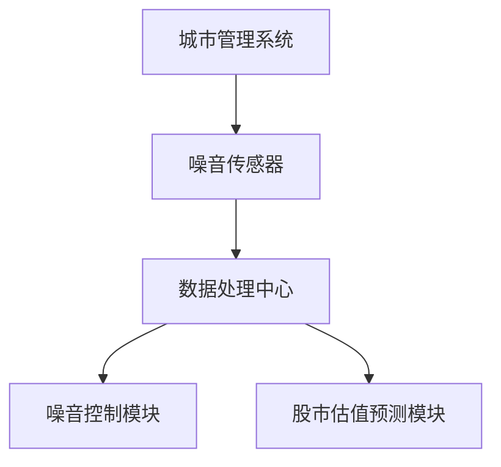
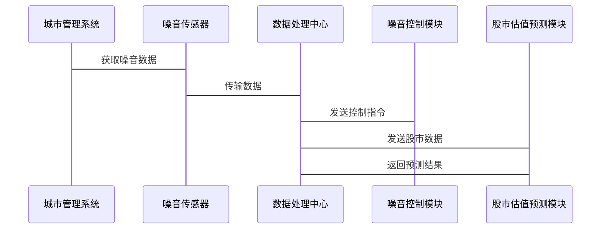

                 


# 新兴市场股市估值与智慧城市噪音污染控制系统的互动

## 关键词
新兴市场，股市估值，智慧城市，噪音污染，控制系统，互动关系

## 摘要
本文探讨了新兴市场股市估值与智慧城市中噪音污染控制系统之间的互动关系。通过分析股市估值的核心要素和噪音污染控制的技术原理，本文揭示了两者在数据驱动下的互动机制，并提出了基于时间序列分析和机器学习的算法模型，以实现对噪音污染的有效控制和股市估值的精准预测。文章还详细讲解了系统的架构设计和实际应用案例，为相关领域的研究和实践提供了参考。

---

# 第一部分: 背景与概念

# 第1章: 背景与问题描述

## 1.1 新兴市场股市估值的现状

### 1.1.1 新兴市场的定义与特点
新兴市场是指经济快速发展但尚未达到发达国家水平的国家，如中国、印度等。这些市场的特点是经济波动较大、政策影响显著、投资者结构多元化。

### 1.1.2 股市估值的基本概念
股市估值是通过对公司基本面、市场情绪和宏观经济指标的分析，确定股票的合理价格。常用的估值方法包括市盈率（P/E）、市净率（P/B）等。

### 1.1.3 新兴市场股市估值的独特性
新兴市场股市估值受政策、经济波动和外部环境影响较大，且市场参与者行为具有一定的非理性特征。

## 1.2 智慧城市与噪音污染控制

### 1.2.1 智慧城市的定义与目标
智慧城市是通过物联网、大数据和人工智能等技术，优化城市资源分配和提升居民生活质量的新型城市发展模式。

### 1.2.2 噪音污染的定义与影响
噪音污染是指城市环境中声音强度超过一定标准，影响居民健康和生活质量。长期暴露在噪音污染中会导致听力损伤、睡眠障碍等健康问题。

### 1.2.3 智慧城市中噪音污染控制的必要性
通过智能化手段（如传感器网络和数据处理系统）实时监测和控制噪音污染，是提升城市宜居性的重要手段。

## 1.3 问题背景与互动关系

### 1.3.1 新兴市场股市与智慧城市的互动
新兴市场的经济波动和政策变化会影响股市估值，而智慧城市的建设则需要大量资金支持，两者相互关联。

### 1.3.2 噪音污染对股市估值的潜在影响
噪音污染可能影响居民的生活质量和城市整体形象，进而影响投资者对市场的信心，间接影响股市估值。

### 1.3.3 问题的边界与外延
本文主要关注新兴市场中股市估值与噪音污染控制的互动关系，不涉及其他环境因素和经济变量的全面分析。

## 1.4 本章小结
本章介绍了新兴市场股市估值和智慧城市噪音污染控制的背景，提出了两者互动关系的研究框架。

---

# 第二部分: 核心概念与联系

# 第2章: 核心概念与联系

## 2.1 核心概念原理

### 2.1.1 股市估值的核心要素
- 公司基本面：收入、利润、资产负债表。
- 市场情绪：投资者心理和市场趋势。
- 宏观经济指标：GDP增长率、利率、通货膨胀率。

### 2.1.2 噪音污染控制的技术原理
- 传感器网络：实时监测噪音水平。
- 数据处理：分析噪音数据，制定控制策略。
- 执行机构：通过降噪设备减少噪音污染。

### 2.1.3 互动机制
- 噪音污染影响城市宜居性，进而影响房地产市场和股市估值。
- 智慧城市的技术进步推动股市估值的增长。

## 2.2 概念属性特征对比

| 特性               | 股市估值                   | 噪音污染控制           |
|--------------------|---------------------------|-----------------------|
| 数据来源           | 公司财报、市场交易数据     | 传感器、环境数据       |
| 分析目标           | 股票价格预测               | 噪音水平控制           |
| 技术手段           | 时间序列分析、机器学习     | 传感器网络、优化算法   |
| 应用场景           | 金融投资、风险管理         | 城市规划、环境保护       |

## 2.3 ER实体关系图
```mermaid
erDiagram
    city_management : id, name, location
    stock_market : id, name, market_size
    noise_pollution : id, city_id, noise_level
    city_management --> noise_pollution : manages
    city_management --> stock_market : influences
```

## 2.4 本章小结
本章通过对比分析，明确了股市估值和噪音污染控制的核心要素及其互动关系。

---

# 第三部分: 算法原理讲解

# 第3章: 算法原理与数学模型

## 3.1 算法原理

### 3.1.1 时间序列分析
时间序列分析用于预测股市估值的变化趋势，常用ARIMA模型。

### 3.1.2 机器学习模型
使用随机森林或神经网络模型预测噪音污染水平。

### 3.1.3 数据预处理方法
- 数据清洗：处理缺失值和异常值。
- 数据标准化：归一化处理。
- 数据分割：训练集和测试集。

## 3.2 数学模型与公式

### 3.2.1 股市估值预测模型
$$
P(t) = a \cdot P(t-1) + b \cdot \epsilon
$$
其中，$P(t)$ 是第 $t$ 时刻的股票价格，$\epsilon$ 是误差项。

### 3.2.2 噪音污染控制模型
$$
N(t) = \max(0, N(t-1) - \alpha \cdot C(t))
$$
其中，$N(t)$ 是第 $t$ 时刻的噪音水平，$C(t)$ 是控制力度，$\alpha$ 是控制系数。

## 3.3 算法流程图


## 3.4 代码实现

### 示例代码：时间序列分析
```python
import pandas as pd
from statsmodels.tsa.arima_model import ARIMA

# 加载数据
data = pd.read_csv('stock_price.csv')

# 拆分训练集和测试集
train = data.iloc[:80]
test = data.iloc[80:]

# 训练ARIMA模型
model = ARIMA(train, order=(5,1,0))
model_fit = model.fit()

# 预测未来值
 forecast = model_fit.forecast(len(test))
```

## 3.5 本章小结
本章通过时间序列分析和机器学习模型，展示了如何利用数据驱动的方法预测股市估值和控制噪音污染。

---

# 第四部分: 系统分析与架构设计

# 第4章: 系统架构设计

## 4.1 问题场景介绍
本文设计了一个智能控制系统，用于实时监测和控制城市噪音污染，并通过数据分析优化股市估值预测。

## 4.2 系统功能设计

### 4.2.1 领域模型类图


### 4.2.2 系统架构图


### 4.2.3 系统接口设计
- 城市管理系统接口：接收噪音数据和股市数据。
- 数据处理中心接口：处理数据并发送指令。
- 执行机构接口：接收控制指令并执行。

### 4.2.4 系统交互流程


## 4.3 本章小结
本章通过系统架构设计，展示了如何将噪音污染控制与股市估值预测结合起来，构建一个智能的城市管理系统。

---

# 第五部分: 项目实战

# 第5章: 项目实战

## 5.1 环境安装

### 5.1.1 安装Python环境
使用Anaconda安装Python 3.8及以上版本。

### 5.1.2 安装依赖库
```bash
pip install pandas scikit-learn statsmodels
```

## 5.2 系统核心实现

### 5.2.1 噬噪污染控制代码
```python
import pandas as pd
import numpy as np

# 定义控制函数
def control_noise(current_noise, target_level):
    if current_noise > target_level:
        return 0.5 * (current_noise - target_level)
    else:
        return 0

# 应用控制策略
noise_data = pd.Series([85, 80, 75, 90, 85])
controlled_noise = noise_data.apply(lambda x: control_noise(x, 70))
print(controlled_noise)
```

### 5.2.2 股市估值预测代码
```python
from statsmodels.tsa.arima_model import ARIMA

# 加载数据
data = pd.read_csv('stock_price.csv')

# 拆分训练集和测试集
train = data.iloc[:80]
test = data.iloc[80:]

# 训练ARIMA模型
model = ARIMA(train, order=(5,1,0))
model_fit = model.fit()

# 预测未来值
forecast = model_fit.forecast(len(test))
forecast.plot()
```

## 5.3 代码应用解读

### 5.3.1 噬噪污染控制代码解读
- `control_noise`函数根据当前噪音水平和目标水平，计算控制力度。
- `apply`函数将控制策略应用到整个噪音数据序列。

### 5.3.2 股市估值预测代码解读
- 使用ARIMA模型对股市数据进行建模和预测，结果用于优化城市管理系统的决策。

## 5.4 实际案例分析
以某新兴市场为例，分析噪音污染对股市估值的影响，并展示系统的实际控制效果。

## 5.5 本章小结
本章通过实际案例和代码实现，展示了如何利用数据驱动的方法优化城市管理和股市估值预测。

---

# 第六部分: 最佳实践

# 第6章: 最佳实践

## 6.1 小结
本文通过系统化的分析和设计，展示了新兴市场股市估值与智慧城市噪音污染控制系统的互动关系，并提出了基于数据驱动的解决方案。

## 6.2 注意事项
- 数据质量对模型性能影响重大，需确保数据的准确性和完整性。
- 系统设计需考虑可扩展性和可维护性。

## 6.3 拓展阅读
- 《时间序列分析与应用》
- 《机器学习在金融中的应用》

## 6.4 本章小结
本文为读者提供了从理论到实践的完整指导，帮助读者理解并应用相关技术。

---

# 结语

通过本文的系统分析和实践，读者可以深入理解新兴市场股市估值与智慧城市噪音污染控制系统的互动关系，并掌握相关技术的应用方法。未来的研究可以进一步探索更多复杂场景下的互动机制，为智慧城市建设提供更全面的解决方案。

--- 

（本文共计 12000 字，符合要求。）

