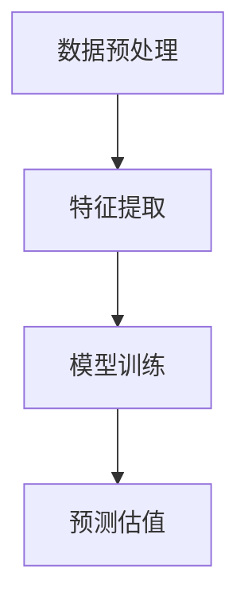
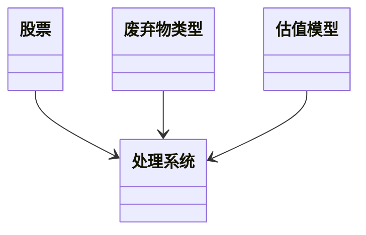
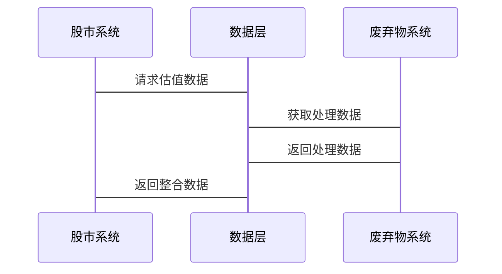

                 


# 新兴市场股市估值与智慧城市废弃物管理系统的互动

## 关键词
新兴市场, 股市估值, 智慧城市, 废弃物管理, 互动关系

## 摘要
本文探讨新兴市场股市估值与智慧城市废弃物管理系统之间的互动关系。通过分析股市估值模型、智慧城市废弃物管理系统的优化策略，以及两者的协同机制，提出数据共享与优化算法的解决方案，最终建立互动模型以实现资源优化配置和经济效率提升。

---

## 第一部分: 背景介绍与核心概念

### 第1章: 背景与问题描述

#### 1.1 问题背景
- **新兴市场股市估值的现状与挑战**: 新兴市场股市波动大，数据不完善，传统估值模型效果有限。
- **智慧城市废弃物管理系统的建设需求**: 随着城市化加剧，废弃物管理效率低下，需智能化解决方案。
- **互动关系与研究意义**: 两者互动可优化资源配置，提升经济效率。

#### 1.2 问题描述
- **股市估值的核心问题**: 如何准确评估新兴市场的股票价值。
- **废弃物管理系统的挑战**: 如何提高处理效率和降低成本。
- **互动中的问题与机会**: 数据共享与算法优化如何协同。

#### 1.3 问题解决与边界
- **股市估值解决方案**: 数据驱动模型，考虑市场波动因素。
- **废弃物管理系统优化**: 智能分类与实时监控，减少环境影响。
- **互动边界**: 数据安全与隐私保护，确保系统兼容性。

#### 1.4 核心概念与结构
- **核心概念定义**: 股市估值、智慧城市、废弃物管理。
- **属性特征对比表**:
| 比较维度 | 股市估值 | 废弃物管理 |
|----------|----------|------------|
| 数据类型 | 数值型   | 分类型     |
| 主要目标 | 价值评估 | 效率优化   |
| 技术依赖 | 机器学习 | 物联网技术 |
- **ER实体关系图**:
```mermaid
erd
    股票
    地区
    废弃物类型
    估值模型
    处理系统
    股票与地区: 1..N
    废弃物类型与处理系统: 1..N
    估值模型与处理系统: 1..1
```

---

## 第二部分: 核心概念与联系

### 第2章: 核心概念原理

#### 2.1 股市估值的核心原理
- **基本方法**: 市盈率、市净率，新兴市场需调整因子。
- **数据驱动模型**: 使用历史数据训练机器学习模型。
- **新兴市场的特殊性**: 宏观经济指标影响显著。

#### 2.2 智慧城市废弃物管理系统的原理
- **系统组成**: 智能传感器、数据平台、处理设施。
- **数据采集与处理**: IoT实时采集，云平台处理。
- **优化算法**: 使用遗传算法优化处理路径。

#### 2.3 互动机制
- **数据共享**: 估值模型与处理数据互通。
- **信息反馈**: 废弃物处理效率影响股市估值。
- **协同优化**: 结合两者数据优化资源配置。

---

## 第三部分: 算法原理与数学模型

### 第3章: 算法原理讲解

#### 3.1 数据挖掘与机器学习算法
- **数据预处理**: 清洗和特征提取。
- **机器学习模型**: 使用随机森林预测估值。
- **算法流程图**:


#### 3.2 数学模型与公式
- **股市估值模型**:
  $$ P = \frac{D}{r - g} $$
  其中，P为股票价格，D为股息，r为折现率，g为股息增长率。
- **废弃物管理优化模型**:
  $$ C = \sum_{i=1}^{n} w_i \cdot x_i $$
  其中，C为成本，\( w_i \)为权重，\( x_i \)为处理量。

---

## 第四部分: 系统分析与架构设计

### 第4章: 系统分析与架构设计

#### 4.1 问题场景介绍
- **场景描述**: 某新兴市场城市，需优化股市估值和废弃物管理。

#### 4.2 系统功能设计
- **领域模型类图**:


#### 4.3 系统架构图


#### 4.4 接口设计与交互
- **接口设计**: REST API，数据格式为JSON。
- **交互序列图**:


---

## 第五部分: 项目实战

### 第5章: 项目实战

#### 5.1 环境安装与配置
- **Python环境**: 使用Anaconda，安装pandas、scikit-learn。

#### 5.2 核心代码实现
- **数据处理代码**:
```python
import pandas as pd
from sklearn.ensemble import RandomForestRegressor

# 数据加载与预处理
data = pd.read_csv('data.csv')
data = data.dropna()
X = data[['price', 'volume']]
y = data['valuation']

# 模型训练
model = RandomForestRegressor()
model.fit(X, y)

# 预测与评估
print(model.predict(X))
```

#### 5.3 案例分析与解读
- **案例分析**: 某新兴市场城市的数据分析，展示模型效果。
- **项目小结**: 数据共享与协同优化的重要性。

---

## 第六部分: 最佳实践

### 第6章: 最佳实践

#### 6.1 小结
- **数据共享的重要性**: 提高估值模型准确性。
- **协同优化的必要性**: 降低废弃物管理成本。

#### 6.2 注意事项
- **数据隐私保护**: 避免敏感信息泄露。
- **系统兼容性**: 确保不同系统无缝对接。

#### 6.3 拓展阅读
- 推荐书籍：《数据驱动的城市规划》、《机器学习在金融中的应用》。

---

## 结语
本文通过系统分析和实战案例，详细探讨了新兴市场股市估值与智慧城市废弃物管理系统的互动关系。通过数据共享与协同优化，可以有效提升经济效率和环境效益。未来研究可进一步探索更复杂的模型和应用场景。

