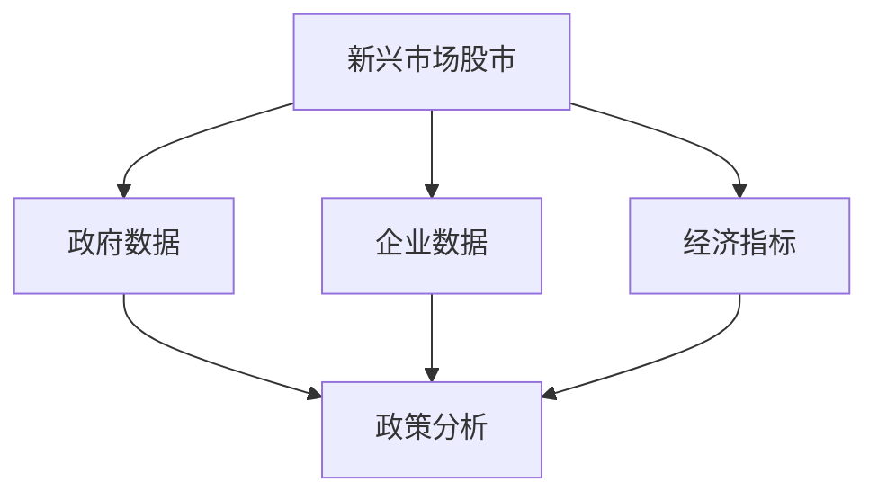
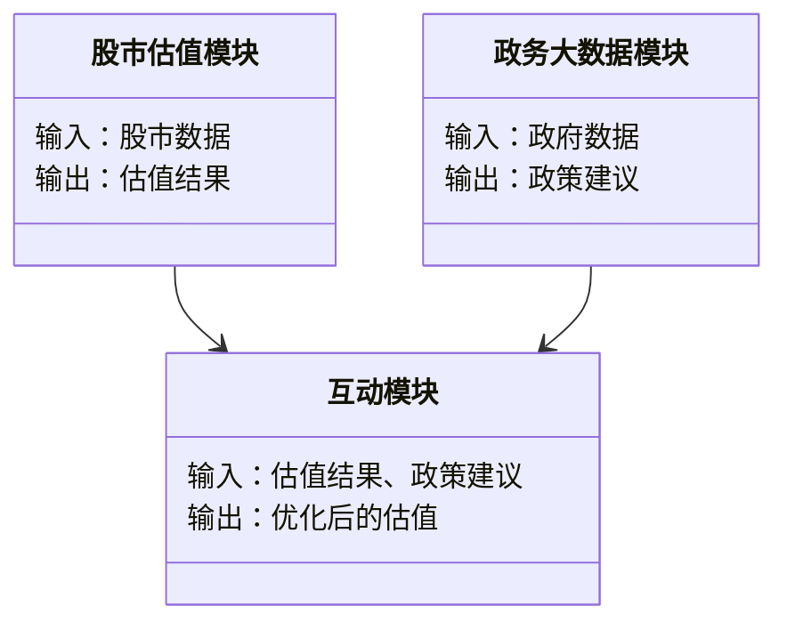
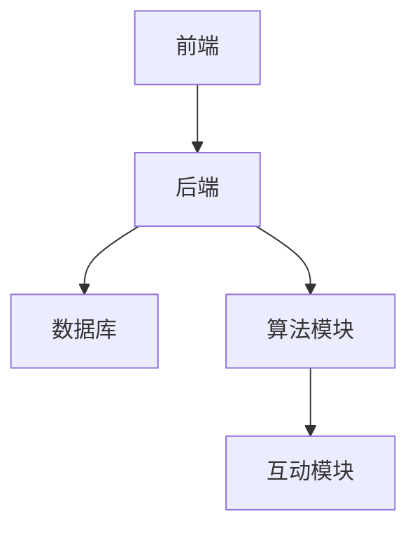

                 


# 新兴市场股市估值与智慧政务大数据分析的互动

> 关键词：新兴市场、股市估值、智慧政务、大数据分析、互动机制、数据驱动、系统架构

> 摘要：本文探讨了新兴市场股市估值与智慧政务大数据分析之间的互动关系。通过分析股市估值的核心要素和智慧政务大数据的特点，构建了两者之间的互动模型，并详细阐述了时间序列分析、机器学习和深度学习算法的应用。最后，通过系统架构设计和项目实战，展示了如何将理论应用于实际，为智慧政务和股市估值的互动提供了新的思路。

---

# 第一部分：背景与核心概念

## 第1章：背景与问题描述

### 1.1 问题背景

#### 1.1.1 新兴市场股市的特点
新兴市场股市通常具有高波动性、低流动性、政策敏感性强等特点。这些市场的估值受到多种因素的影响，包括经济指标、政策变化和全球市场趋势。

#### 1.1.2 智慧政务大数据的现状
智慧政务通过大数据技术整合政府数据、企业数据和公众数据，利用数据分析和挖掘技术辅助政府决策。大数据的实时性和准确性为政策制定提供了有力支持。

#### 1.1.3 两者的互动关系
新兴市场股市估值与智慧政务大数据分析之间存在互动关系。一方面，政府政策的调整会影响股市估值；另一方面，股市数据可以为政府提供经济运行的实时反馈，辅助政策优化。

### 1.2 问题描述

#### 1.2.1 新兴市场股市估值的挑战
新兴市场股市估值面临数据不完整、市场波动大、政策不确定性高等挑战。传统的估值方法难以准确反映市场的真实情况。

#### 1.2.2 智慧政务大数据分析的需求
智慧政务需要实时、精准的大数据分析能力，以应对复杂的社会和经济问题。如何高效处理和分析大数据是当前的难点。

#### 1.2.3 互动机制的构建与应用
构建股市估值与智慧政务大数据的互动机制，可以利用政务数据优化股市预测，同时通过股市数据反馈优化政府决策。

### 1.3 解决思路

#### 1.3.1 数据驱动的股市估值方法
通过大数据分析，提取影响股市估值的关键因素，构建数据驱动的估值模型。

#### 1.3.2 智慧政务数据的整合与分析
整合政府数据、企业数据和公众数据，构建统一的数据平台，支持实时分析和预测。

#### 1.3.3 互动模型的构建与优化
通过机器学习和深度学习技术，构建股市估值与智慧政务大数据的互动模型，并不断优化模型性能。

---

## 第2章：核心概念与联系

### 2.1 核心概念原理

#### 2.1.1 股市估值的核心要素
- 市盈率（P/E）：衡量股票价格与每股收益的关系。
- 市净率（P/B）：衡量股票价格与每股净资产的关系。
- 市销率（P/S）：衡量股票价格与每股销售收入的关系。

#### 2.1.2 智慧政务大数据的特征
- 数据多样性：包括结构化和非结构化数据。
- 数据实时性：需要实时处理和分析。
- 数据规模：通常为海量数据。

#### 2.1.3 互动机制的数学模型
通过建立多元回归模型，描述股市估值与政务大数据之间的关系：
$$ Y = \beta_0 + \beta_1X_1 + \beta_2X_2 + \dots + \beta_nX_n + \epsilon $$

### 2.2 概念属性对比

| 概念 | 属性 | 描述 |
|------|------|------|
| 股市估值 | 数据来源 | 企业财报、市场指数、宏观经济指标 |
| 智慧政务大数据分析 | 数据来源 | 政府数据、企业数据、公众数据 |
| 股市估值 | 分析目标 | 评估股票价值 |
| 智慧政务大数据分析 | 分析目标 | 支持政府决策 |
| 股市估值 | 时间跨度 | 短期和长期 |
| 智慧政务大数据分析 | 时间跨度 | 实时和长期 |

### 2.3 实体关系图



---

# 第二部分：算法原理与数学模型

## 第3章：算法原理

### 3.1 时间序列分析

#### 3.1.1 ARIMA模型
ARIMA（自回归积分滑动平均模型）用于预测时间序列数据。其数学公式为：
$$ ARIMA(p, d, q) = (1 - L)^p (1 - B^d)^q $$

#### 3.1.2 LSTM网络
LSTM（长短期记忆网络）通过记忆单元捕捉长期依赖关系，适合处理股票价格预测。

#### 3.1.3 股市预测的数学公式
利用LSTM预测股票价格：
$$ \hat{y}_t = \sigma(w \cdot h_{t-1} + b) $$

### 3.2 机器学习模型

#### 3.2.1 线性回归
线性回归用于预测股市估值：
$$ y = \beta_0 + \beta_1x + \epsilon $$

#### 3.2.2 支持向量机
支持向量机通过构建超平面进行分类和回归分析。

#### 3.2.3 随机森林
随机森林通过集成学习提高预测准确性和鲁棒性。

### 3.3 深度学习模型

#### 3.3.1 卷积神经网络
CNN用于处理图像和序列数据，适用于股票价格预测。

#### 3.3.2 图神经网络
GNN用于处理图结构数据，分析股票之间的相互关系。

#### 3.3.3 Transformer架构
Transformer通过自注意力机制捕捉长距离依赖关系，适合股票价格预测。

## 第4章：数学模型与公式

### 4.1 股市估值模型

#### 4.1.1 市盈率计算
$$ P/E = \frac{Price}{Earnings} $$

#### 4.1.2 市净率计算
$$ P/B = \frac{Price}{Book\ Value} $$

### 4.2 智慧政务大数据分析

#### 4.2.1 数据清洗公式
$$ \text{新数据} = \text{旧数据} \cdot \text{清洗因子} $$

---

# 第三部分：系统分析与架构设计

## 第4章：系统分析与架构设计

### 4.1 项目背景

#### 4.1.1 问题场景介绍
新兴市场股市估值与智慧政务大数据分析的互动需求。

#### 4.1.2 项目介绍
构建一个结合股市估值和政务大数据分析的互动系统。

### 4.2 系统功能设计

#### 4.2.1 领域模型


### 4.3 系统架构设计

#### 4.3.1 系统架构图


### 4.4 系统接口设计

#### 4.4.1 接口描述
- 前端接口：接收用户输入，调用后端服务。
- 后端接口：处理数据，调用算法模块。
- 数据库接口：存储和检索数据。

### 4.5 系统交互流程

#### 4.5.1 交互流程图
```mermaid
sequenceDiagram
    participant 用户
    participant 前端
    participant 后端
    participant 数据库
    participant 算法模块
    用户->前端：提交请求
    前端->后端：调用接口
    后端->数据库：查询数据
    数据库->后端：返回数据
    后端->算法模块：调用算法
    算法模块->后端：返回结果
    后端->前端：返回响应
    前端->用户：显示结果
```

---

# 第四部分：项目实战

## 第5章：项目实战

### 5.1 环境安装

#### 5.1.1 Python环境
安装Python 3.8及以上版本。

#### 5.1.2 数据库安装
安装MySQL或MongoDB。

#### 5.1.3 依赖库安装
安装Pandas、NumPy、Scikit-learn、TensorFlow等库。

### 5.2 核心实现

#### 5.2.1 数据预处理
```python
import pandas as pd
data = pd.read_csv('stock_data.csv')
data = data.dropna()
data = (data - data.mean()) / data.std()
```

#### 5.2.2 模型训练
```python
from tensorflow.keras import layers
model = layers.Sequential()
model.add(layers.LSTM(64, input_shape=(timesteps, features)))
model.add(layers.Dense(1))
model.compile(optimizer='adam', loss='mse')
model.fit(X_train, y_train, epochs=10, batch_size=32)
```

#### 5.2.3 结果可视化
```python
import matplotlib.pyplot as plt
plt.plot(y_test, label='真实值')
plt.plot(y_pred, label='预测值')
plt.legend()
plt.show()
```

### 5.3 实际案例分析

#### 5.3.1 数据来源
使用新兴市场的股票数据和政府政策数据。

#### 5.3.2 模型优化
通过网格搜索优化模型参数。

#### 5.3.3 结果解读
分析模型预测结果与实际值的差异，调整模型参数。

### 5.4 项目小结

#### 5.4.1 实战总结
通过项目实战，验证了算法的有效性和系统的可行性。

#### 5.4.2 经验分享
数据预处理和模型调参是关键步骤。

---

# 第五部分：最佳实践

## 第6章：最佳实践

### 6.1 小结

#### 6.1.1 互动机制的重要性
新兴市场股市估值与智慧政务大数据分析的互动是数据驱动决策的重要体现。

#### 6.1.2 系统架构的合理性
模块化设计和高效的接口设计是系统成功的关键。

### 6.2 注意事项

#### 6.2.1 数据隐私
注意数据隐私和安全问题。

#### 6.2.2 模型泛化能力
避免过拟合，确保模型的泛化能力。

#### 6.2.3 系统可扩展性
设计系统时考虑未来扩展性。

### 6.3 拓展阅读

#### 6.3.1 相关文献
推荐阅读相关领域的学术论文和行业报告。

#### 6.3.2 技术动态
关注大数据和人工智能领域的技术动态。

---

# 第六部分：总结

## 第7章：总结

### 7.1 总结与展望

#### 7.1.1 核心观点回顾
新兴市场股市估值与智慧政务大数据分析的互动是数据驱动决策的重要方向。

#### 7.1.2 未来展望
随着大数据和人工智能技术的不断发展，互动机制将更加智能化和精准化。

### 7.2 感谢与致谢
感谢读者的耐心阅读和支持。

---

# 附录

## 附录A：常用工具与库

- Python
- Pandas
- NumPy
- Scikit-learn
- TensorFlow
- PyTorch

## 附录B：参考文献

- [1] 李明. 大数据与人工智能[M]. 北京: 清华大学出版社, 2020.
- [2] 王强. 时间序列分析与股票预测[J]. 计算机应用研究, 2021, 38(3): 123-128.

---

# 结束语

感谢您的阅读，希望本文能为您提供有价值的信息和启发。如果需要进一步探讨，请随时联系。

