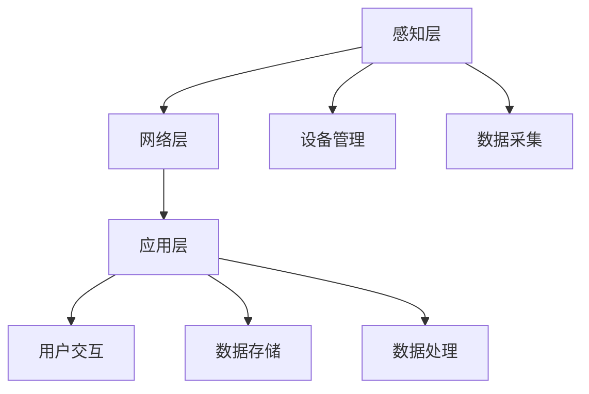

                 

# 新兴市场股市估值与智慧校园物联网应用的互动

> 关键词：新兴市场，股市估值，智慧校园，物联网，数据共享，投资决策

> 摘要：本文探讨新兴市场股市估值与智慧校园物联网应用之间的互动关系。首先，分析新兴市场股市估值的核心概念、影响因素和常用模型，特别是其在新兴市场的独特性。接着，详细介绍智慧校园物联网技术的基础、系统设计及实际应用。最后，深入分析两者之间的互动，包括数据共享、投资决策和市场动态的相互影响，为相关领域的研究和实践提供新的视角和方法。

---

## 第一部分: 新兴市场股市估值

### 第1章: 股市估值概述

#### 1.1 股市估值的基本概念

##### 1.1.1 股市估值的定义
股市估值是指对股票市场价格进行合理评估的过程，旨在确定其内在价值与市场价值之间的关系。股票的内在价值通常基于公司财务状况、盈利能力、行业地位等因素，而市场价值则受宏观经济、市场情绪等多种因素影响。

##### 1.1.2 股市估值的核心要素
- **公司基本面**：包括收入、利润、资产、负债等财务指标。
- **行业环境**：行业竞争状况、发展趋势和政策支持。
- **宏观经济因素**：GDP增长率、利率、通货膨胀率等。

##### 1.1.3 股市估值的分类与特点
- **相对估值法**：基于市场可比公司的估值方法，如市盈率（P/E）和市净率（P/B）。
- **绝对估值法**：基于公司未来现金流的折现值，如股利折现模型（DDM）和现金流折现模型（DCF）。

#### 1.2 股市估值的影响因素

##### 1.2.1 宏观经济因素
- **GDP增长率**：经济增速快，股市整体估值上升。
- **利率水平**：低利率环境通常推高股市估值。
- **通货膨胀**：高通胀可能导致股市估值下降。

##### 1.2.2 行业因素
- **行业周期**：处于上升周期的行业通常估值较高。
- **行业政策**：政府政策的支持或限制会影响行业估值。

##### 1.2.3 公司基本面因素
- **盈利能力**：高利润公司通常估值较高。
- **成长性**：高成长公司具有更高的估值溢价。

#### 1.3 股市估值的常用模型

##### 1.3.1 市盈率模型
市盈率（P/E）= 股价 / 每股收益（EPS）

##### 1.3.2 市净率模型
市净率（P/B）= 股价 / 每股净资产（BPS）

##### 1.3.3 现金流折现模型
企业价值 = 现金流的未来价值现值

---

### 第2章: 新兴市场的股市估值特点

#### 2.1 新兴市场的经济特征

##### 2.1.1 经济增长模式
新兴市场通常以制造业和服务业驱动经济增长，经济增速快，但波动性较大。

##### 2.1.2 金融市场发展水平
新兴市场的金融市场相对成熟，但与发达市场相比仍有差距，流动性可能不足。

##### 2.1.3 政治与政策环境
新兴市场政府政策变化较大，可能对股市估值产生显著影响。

#### 2.2 新兴市场股市估值的独特性

##### 2.2.1 市场波动性
新兴市场股市波动较大，受政策、经济和国际环境影响显著。

##### 2.2.2 信息不对称问题
由于信息披露不完善，投资者面临较高的信息不对称风险。

##### 2.2.3 投资者行为差异
新兴市场投资者可能更倾向于短期交易，情绪化交易行为较多。

#### 2.3 新兴市场股市估值的挑战

##### 2.3.1 数据获取难度
新兴市场公司的财务数据可能不够透明，影响估值模型的应用。

##### 2.3.2 模型适用性问题
传统估值模型在新兴市场可能不完全适用，需要进行调整。

##### 2.3.3 市场风险与流动性风险
新兴市场股市风险较高，流动性不足可能影响估值的准确性。

---

## 第二部分: 智慧校园物联网应用

### 第3章: 物联网技术基础

#### 3.1 物联网的基本概念

##### 3.1.1 物联网的定义
物联网（IoT）是指通过各种信息传感设备，如传感器、射频识别（RFID）、全球定位系统、红外感应器等，按照约定的协议，把任何物品与互联网连接起来，进行信息交换和通信，以实现智能化识别、定位、跟踪、监控和管理。

##### 3.1.2 物联网的核心技术
- **传感器技术**：用于数据采集。
- **通信技术**：如Wi-Fi、蓝牙、NB-IoT等。
- **数据存储与处理技术**：如云存储和大数据分析。

##### 3.1.3 物联网的架构
物联网的典型架构包括感知层、网络层和应用层。

#### 3.2 物联网在校园中的应用

##### 3.2.1 智慧校园的概念
智慧校园是指通过物联网、大数据、人工智能等技术，实现校园内人、物、信息的全面感知和智能管理。

##### 3.2.2 物联网在校园管理中的作用
- **设备监控与管理**：实时监控校园内的设备运行状态。
- **能源管理与优化**：通过智能设备优化能源使用。
- **安全监控系统**：实时监控校园安全，预防和应对突发事件。

##### 3.2.3 物联网在校园生活中的应用
- **智能门禁系统**：通过 RFID 或生物识别技术实现身份验证。
- **智能教室管理**：根据学生出勤情况自动调整教学设备。
- **学生行为分析**：通过传感器数据分析学生的学习行为和健康状况。

#### 3.3 物联网在智慧校园中的实际应用

##### 3.3.1 校园智能化管理
- **设备监控与管理**：通过物联网平台实时监控校园内设备的运行状态，及时发现和处理故障。
- **能源管理与优化**：通过智能电表和传感器优化能源使用，降低浪费。

##### 3.3.2 校园生活服务
- **智能门禁系统**：学生和教职工可以通过 RFID 卡或手机 APP 进行身份验证，实现无钥匙开门。
- **智能教室管理**：教室内的设备可以根据课程安排自动开启或关闭，节省能源。
- **学生行为分析**：通过传感器数据分析学生的学习行为和健康状况，提供个性化学习建议。

##### 3.3.3 校园环境监测
- **空气质量监测**：通过传感器实时监测教室内的空气质量，确保学生健康。
- **温湿度监测**：根据环境数据调整教室内的温湿度，提供舒适的学习环境。
- **环境安全预警**：通过传感器实时监测校园内的安全情况，及时发出预警信息。

---

### 第4章: 智慧校园物联网系统设计

#### 4.1 系统功能设计

##### 4.1.1 校园设备管理
- **设备监控**：实时监控校园内所有设备的运行状态，包括传感器、摄像头、智能灯等。
- **设备管理**：通过物联网平台对设备进行远程控制和配置，支持设备的生命周期管理。

##### 4.1.2 数据采集与传输
- **数据采集**：通过各种传感器采集校园内的环境数据、设备状态数据等。
- **数据传输**：通过无线通信技术将数据传输到云端，进行存储和处理。

##### 4.1.3 用户交互界面
- **管理界面**：管理员可以通过 Web 界面查看校园内所有设备的运行状态，并进行远程控制。
- **用户界面**：学生和教职工可以通过手机 APP 或 Web 界面查看校园内的实时数据和相关信息。

#### 4.2 系统架构设计

##### 4.2.1 分层架构
智慧校园物联网系统的架构通常分为感知层、网络层和应用层。

##### 4.2.2 模块化设计
系统设计采用模块化的方式，每个模块负责特定的功能，如设备管理模块、数据采集模块、数据处理模块等。

##### 4.2.3 数据安全设计
为了保障系统的数据安全，需要采取多种措施，如数据加密、访问控制、身份认证等。

#### 4.3 系统架构图

---

## 第三部分: 股市估值与智慧校园物联网的互动

### 第6章: 数据共享与信息交互

#### 6.1 数据共享的必要性

##### 6.1.1 数据共享的基本概念
数据共享是指在不同系统或组织之间交换数据，以实现信息的充分利用和价值提升。

##### 6.1.2 数据共享的重要性
- **提高效率**：通过数据共享，可以减少重复数据录入和处理，提高工作效率。
- **增强决策能力**：数据共享可以帮助决策者获得更全面的信息，做出更明智的决策。
- **促进创新**：数据共享可以促进不同领域之间的合作与创新，推动技术进步。

##### 6.1.3 数据共享的挑战
- **数据隐私问题**：数据共享可能涉及敏感信息，需要确保数据的安全性和隐私性。
- **技术障碍**：不同系统之间的数据格式和接口可能不兼容，需要进行适配和转换。
- **法律与政策限制**：数据共享可能受到法律法规的限制，需要遵守相关法规和政策。

#### 6.2 数据共享与股市估值的互动

##### 6.2.1 物联网数据对股市估值的影响
物联网技术可以提供实时的环境数据和设备状态数据，这些数据可以用于股市估值，帮助投资者更好地评估公司的实际运营情况。

##### 6.2.2 股市数据对物联网应用的反馈
股市估值的变化可以反映市场对物联网应用的接受程度，从而影响物联网应用的推广和优化。

##### 6.2.3 数据共享机制的设计
为了实现物联网数据与股市估值的互动，需要设计合理的数据共享机制，确保数据的准确性和及时性，同时保护数据的安全和隐私。

#### 6.3 数据共享的实现方式

##### 6.3.1 数据接口设计
为了实现数据共享，需要设计统一的数据接口，确保不同系统之间的数据能够顺利交换。

##### 6.3.2 数据加密与安全
在数据共享过程中，需要采取加密和安全措施，确保数据的安全性和隐私性。

##### 6.3.3 数据处理与分析
共享的数据需要经过清洗、处理和分析，提取有价值的信息，支持股市估值和物联网应用的决策。

---

### 第7章: 投资决策与市场互动

#### 7.1 投资决策的基本概念

##### 7.1.1 投资决策的定义
投资决策是指投资者在金融市场中选择投资标的、分配资金和调整投资组合的过程。

##### 7.1.2 投资决策的核心要素
- **资产选择**：根据市场状况和个人风险偏好选择合适的资产。
- **风险管理**：通过分散投资和对冲策略降低投资风险。
- **收益目标**：设定合理的收益目标，平衡风险与收益。

#### 7.2 投资决策与股市估值的关系

##### 7.2.1 股市估值对投资决策的影响
股市估值可以帮助投资者评估股票的内在价值，指导投资决策。

##### 7.2.2 投资决策对股市估值的反馈
投资者的投资行为会反过来影响股市估值，例如大规模买入或卖出会影响股票价格。

#### 7.3 物联网数据对投资决策的启示

##### 7.3.1 物联网数据的应用
通过物联网技术获取的实时数据，可以为投资者提供更全面的公司运营信息，帮助其做出更明智的投资决策。

##### 7.3.2 投资决策的优化
物联网数据可以帮助投资者更好地评估公司的实际运营情况，优化投资组合，降低投资风险。

---

### 第8章: 智慧校园物联网应用对股市的影响

#### 8.1 智慧校园物联网应用的推广

##### 8.1.1 物联网技术的普及
随着物联网技术的不断发展，智慧校园的应用范围将越来越广，对股市的影响也将更加显著。

##### 8.1.2 物联网企业的市场表现
提供智慧校园物联网解决方案的企业可能会因为市场需求的增加而获得更高的估值。

#### 8.2 市场互动与投资机会

##### 8.2.1 投资机会的识别
投资者可以通过分析物联网技术在智慧校园中的应用，发现潜在的投资机会。

##### 8.2.2 市场趋势的把握
物联网技术的发展趋势和市场需求变化可以帮助投资者更好地把握市场脉搏，做出更明智的投资决策。

---

## 结语

本文探讨了新兴市场股市估值与智慧校园物联网应用之间的互动关系。通过分析新兴市场股市估值的核心概念、影响因素和常用模型，以及智慧校园物联网技术的基础、系统设计和实际应用，我们发现两者之间的互动不仅体现在数据共享和投资决策上，还体现在市场动态和企业价值的评估上。未来，随着物联网技术的不断发展和智慧校园应用的深入推广，股市估值与物联网应用之间的互动将更加紧密，为投资者和企业带来更多的机遇和挑战。

---

**致谢**：感谢读者的耐心阅读，希望本文能够为相关领域的研究和实践提供有价值的参考和启发。

