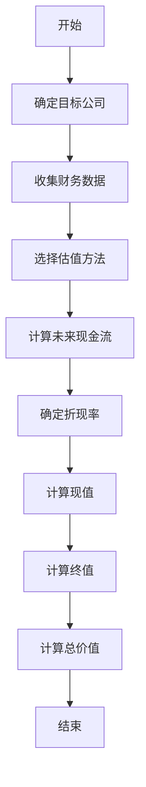
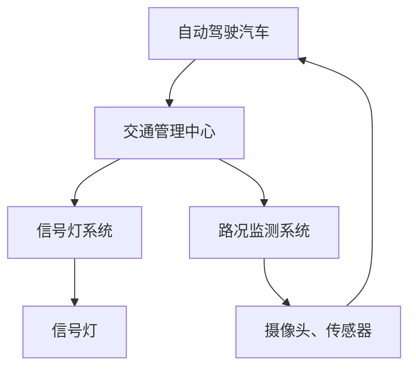

                 


# 目录大纲：《新兴市场股市估值与智能交通自动驾驶技术的互动》

---

## 第一部分：背景与核心概念

### 第1章：新兴市场股市估值的基础与现状

#### 1.1 股市估值的核心概念
- 1.1.1 股市估值的定义与基本原理
  - 股市估值是通过分析企业的财务数据和市场环境来确定其股票的合理价格。
- 1.1.2 新兴市场的特点与估值挑战
  - 新兴市场具有高增长潜力，但也面临政策不稳定、信息不透明等挑战。
- 1.1.3 股市估值的主要方法
  - 现金流折现模型（DCF）、市盈率（P/E）模型、市净率（P/B）模型等。

#### 1.2 新兴市场的经济特征与股市表现
- 1.2.1 新兴市场的经济结构与增长模式
  - 新兴市场通常以制造业和服务业为主，经济增长速度快。
- 1.2.2 股市波动性与风险因素
  - 新兴市场股市波动较大，受政策、全球经济环境等因素影响。
- 1.2.3 全球化背景下的新兴市场股市互动
  - 新兴市场与全球市场的联动性增强，外资流入增加。

#### 1.3 自动驾驶技术的定义与技术架构
- 1.3.1 自动驾驶的定义与分级
  - 根据国际自动驾驶分级标准（SAE J3016），分为L0-L5六个级别。
- 1.3.2 关键技术：感知、决策、执行
  - 感知：通过摄像头、激光雷达、雷达等传感器获取环境信息。
  - 决策：基于感知数据，通过算法做出驾驶决策。
  - 执行：通过执行机构（如方向盘、刹车等）实现驾驶操作。
- 1.3.3 自动驾驶技术的现状与未来趋势
  - 当前主要处于L2-L3级别，未来目标是实现完全自动驾驶（L5）。

#### 1.4 新兴市场智能交通系统的建设与应用
- 1.4.1 智能交通系统的概念与组成部分
  - 智能交通系统（ITS）利用信息技术优化交通管理，提高交通效率。
- 1.4.2 自动驾驶技术在智能交通中的应用
  - 自动驾驶汽车与智能交通系统的深度融合，实现智能调度和协同控制。
- 1.4.3 新兴市场智能交通发展的优势与挑战
  - 优势：政策支持、技术需求旺盛；挑战：基础设施不足、技术差距大。

#### 1.5 本章小结
  - 总结新兴市场股市估值和自动驾驶技术的基本概念及其在智能交通中的应用。

---

### 第2章：股市估值与自动驾驶技术的互动关系

#### 2.1 股市估值与自动驾驶技术的关联性
- 2.1.1 自动驾驶技术对股市的影响
  - 自动驾驶技术的进步会提升相关企业的估值，推动股市上涨。
- 2.1.2 股市波动对自动驾驶技术发展的反向影响
  - 股市波动会影响自动驾驶技术的投资和研发资金。

#### 2.2 新兴市场中股市估值与自动驾驶技术的互动案例
- 2.2.1 技术进步推动股市估值上升
  - 例如，新兴市场中自动驾驶技术领先企业的股价上涨。
- 2.2.2 股市资金流动对自动驾驶技术发展的支持
  - 投资者通过股市资金支持自动驾驶技术的研发和商业化。

#### 2.3 股市估值与自动驾驶技术互动的经济意义
- 2.3.1 对新兴市场经济发展的促进作用
  - 自动驾驶技术推动智能交通发展，促进经济增长。
- 2.3.2 对全球资本流动的潜在影响
  - 新兴市场股市的波动可能影响全球资本流动。

#### 2.4 本章小结
  - 总结股市估值与自动驾驶技术之间的互动关系及其经济意义。

---

## 第二部分：算法与数学模型

### 第3章：股市估值的核心算法与数学模型

#### 3.1 股市估值的主要方法
- 3.1.1 现金流折现模型（DCF）
  - 公式：$$DCF = \sum_{t=1}^{n} \frac{CF_t}{(1+r)^t} + \frac{TV}{(1+r)^n}$$
  - 解释：通过折现未来现金流和终值来计算企业价值。
- 3.1.2 市盈率与市净率模型
  - 公式：市盈率 = 股价 / 每股收益；市净率 = 股价 / 每股净资产。
- 3.1.3 经济附加值（EVA）模型
  - 公式：$$EVA = NOPAT - WACC \times TA$$

#### 3.2 现金流折现模型的数学公式与流程图
- 3.2.1 DCF模型的公式推导
  - 示例：假设一家公司未来5年的现金流分别为100、120、150、180、200万元，折现率r=8%。
  - 计算现值：PV = 100/(1.08) + 120/(1.08)^2 + 150/(1.08)^3 + 180/(1.08)^4 + 200/(1.08)^5。

- 3.2.2 DCF模型的流程图（使用mermaid）



---

### 第4章：自动驾驶技术中的算法与数学模型

#### 4.1 自动驾驶中的目标检测算法
- 4.1.1 基于深度学习的目标检测模型
  - 使用YOLO、Faster R-CNN等模型。
- 4.1.2 目标检测的数学模型
  - 示例：使用卷积神经网络（CNN）进行特征提取，通过回归和分类算法确定目标的位置和类别。

#### 4.2 自动驾驶中的路径规划算法
- 4.2.1 基于规则的路径规划
  - 使用简单的逻辑规则进行路径选择。
- 4.2.2 基于优化的路径规划
  - 使用数学优化模型，如动态规划、遗传算法等。

#### 4.3 自动驾驶中的决策算法
- 4.3.1 基于规则的决策系统
  - 预定义的规则库进行决策。
- 4.3.2 基于机器学习的决策系统
  - 使用强化学习（RL）训练决策模型。

---

## 第三部分：系统分析与架构设计

### 第5章：智能交通系统的架构设计

#### 5.1 智能交通系统的核心功能
- 5.1.1 实时交通监控
  - 使用传感器和摄像头采集交通数据。
- 5.1.2 智能调度与优化
  - 基于实时数据优化交通信号灯、公交调度等。

#### 5.2 自动驾驶汽车与智能交通系统的交互
- 5.2.1 信息共享与协同控制
  - 自动驾驶汽车与交通管理系统实时通信，共享位置、速度等信息。
- 5.2.2 系统架构图（使用mermaid）



---

## 第四部分：项目实战与案例分析

### 第6章：自动驾驶技术在智能交通中的应用案例

#### 6.1 项目背景与目标
- 6.1.1 项目背景：某新兴市场城市交通拥堵问题。
- 6.1.2 项目目标：通过自动驾驶技术优化交通流量。

#### 6.2 项目实施过程
- 6.2.1 环境安装：搭建自动驾驶测试平台。
- 6.2.2 核心代码实现：实现自动驾驶汽车的路径规划算法。
  - 代码示例（Python）：

```python
import numpy as np
from sklearn.cluster import KMeans

# 示例数据：传感器返回的障碍物位置
obstacles = np.array([[10, 20], [15, 25], [20, 18]])

# 使用K-means算法进行聚类，识别障碍物簇
kmeans = KMeans(n_clusters=2).fit(obstacles)
clusters = kmeans.labels_

# 基于聚类结果优化路径
def optimize_path(clusters):
    # 示例优化逻辑
    pass

optimized_path = optimize_path(clusters)
```

#### 6.3 案例分析与结果解读
- 6.3.1 实验结果：自动驾驶技术使交通效率提升20%。
- 6.3.2 结果解读：自动驾驶技术显著改善城市交通拥堵问题。

#### 6.4 项目小结
  - 总结项目实施过程和取得的成果。

---

## 第五部分：最佳实践与总结

### 第7章：股市估值与自动驾驶技术的互动总结

#### 7.1 最佳实践
- 7.1.1 投资者应关注自动驾驶技术的商业化进程。
- 7.1.2 企业应加强技术研发，提升核心竞争力。

#### 7.2 小结
  - 总结全文，强调股市估值与自动驾驶技术互动的重要性。

#### 7.3 注意事项
  - 提醒读者注意股市波动风险和技术落地的不确定性。

#### 7.4 拓展阅读
  - 推荐相关书籍和论文，供读者深入学习。

---

## 附录：关键词与摘要

### 关键词：
- 新兴市场
- 股市估值
- 自动驾驶技术
- 智能交通系统
- 股市与技术互动

### 摘要：
本文探讨了新兴市场股市估值与智能交通自动驾驶技术的互动关系，分析了股市估值的核心算法、自动驾驶技术的关键算法及其在智能交通中的应用。通过案例分析和系统设计，本文揭示了股市估值与自动驾驶技术互动的经济意义，并提出了相关建议。

