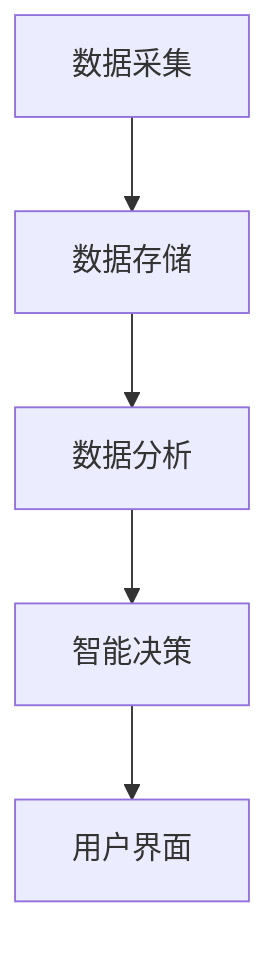
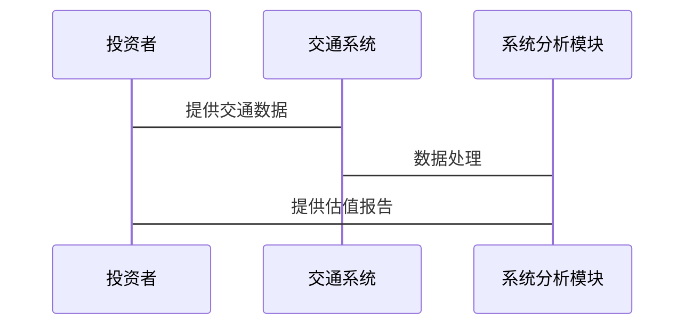

                 


# 目录大纲：《新兴市场股市估值与智能交通车联网技术的互动》

---

## 第一部分: 背景与核心概念

### 第1章: 新兴市场股市估值与智能交通车联网技术的互动背景

#### 1.1 新兴市场的定义与特点
- 新兴市场的经济特征
- 新兴市场的股市特点
- 新兴市场的智能交通发展现状

#### 1.2 股市估值的核心概念
- 股市估值的基本原理
- 新兴市场股市估值的独特性
- 股市估值与经济发展的关系

#### 1.3 智能交通与车联网技术的定义
- 智能交通系统的概念
- 车联网技术的核心功能
- 车联网与智能交通的融合

#### 1.4 本章小结
- 新兴市场股市估值与智能交通车联网技术的互动背景总结

---

## 第二部分: 核心概念与联系

### 第2章: 新兴市场股市估值与智能交通车联网技术的核心概念

#### 2.1 股市估值的关键指标
- 市盈率（P/E Ratio）
- 市净率（P/B Ratio）
- 股息率（Dividend Yield）

#### 2.2 智能交通与车联网技术的核心要素
- 车联网的通信技术（如5G、V2X）
- 智能交通的算法模型（如AI、大数据分析）

#### 2.3 股市估值与智能交通车联网技术的联系
- 股市估值对智能交通技术发展的促进作用
- 智能交通技术对股市估值的影响

#### 2.4 概念属性对比表格
| 概念       | 股市估值 | 智能交通车联网技术 |
|------------|----------|---------------------|
| 核心目标    | 评估企业价值 | 提升交通效率与安全性 |
| 技术基础    | 金融模型与数据分析 | 通信技术与AI算法 |
| 应用场景    | 投资决策 | 智能驾驶与交通管理 |

#### 2.5 ER实体关系图（Mermaid）

```mermaid
erDiagram
    actor 投资者 {
        <属性> 资金
        <属性> 投资目标
    }
    actor 交通管理部门 {
        <属性> 交通数据
        <属性> 管理政策
    }
    entity 股市估值 {
        <属性> 股价
        <属性> 市盈率
        <属性> 市净率
    }
```

---

## 第三部分: 互动机制与影响

### 第3章: 新兴市场股市估值与智能交通车联网技术的互动机制

#### 3.1 数据共享与融合
- 股市数据与交通数据的整合
- 数据共享的技术挑战与解决方案

#### 3.2 技术融合与创新
- 车联网技术对股市估值的影响
- 人工智能在交通与股市分析中的应用

#### 3.3 市场反馈与调整
- 投资者行为对智能交通技术的影响
- 智能交通技术发展对股市估值的反馈机制

#### 3.4 案例分析
- 新兴市场中某智能交通项目的股市估值变化
- 技术进步如何影响企业的市场表现

---

## 第四部分: 技术实现与系统架构

### 第4章: 新兴市场股市估值与智能交通车联网技术的系统架构

#### 4.1 系统功能设计
- 数据采集模块
- 数据分析模块
- 智能决策模块

#### 4.2 系统架构设计（Mermaid）



#### 4.3 接口设计
- 数据接口规范
- API调用流程

#### 4.4 交互设计（Mermaid）



---

## 第五部分: 项目实战与案例分析

### 第5章: 新兴市场股市估值与智能交通车联网技术的项目实战

#### 5.1 项目环境配置
- 技术栈选择
- 开发工具安装

#### 5.2 核心代码实现
- 数据采集与处理代码
- AI算法实现代码
- 系统交互代码

#### 5.3 案例分析
- 具体项目实施过程
- 成果展示与经验总结

#### 5.4 项目总结
- 项目成功的关键因素
- 可能遇到的挑战与解决方案

---

## 第六部分: 结论与展望

### 第6章: 新兴市场股市估值与智能交通车联网技术的互动总结

#### 6.1 核心发现
- 互动关系的总结
- 关键技术的突破

#### 6.2 未来展望
- 新兴市场的发展趋势
- 智能交通与车联网技术的未来方向
- 股市估值与技术互动的潜在机会

#### 6.3 最佳实践 tips
- 投资者如何利用技术进步优化估值
- 企业如何通过技术创新提升市场竞争力

#### 6.4 本章小结
- 全文总结与读者思考引导

---

## 关键词：
新兴市场，股市估值，智能交通，车联网技术，互动机制，数据共享，技术融合，系统架构，投资机会

## 摘要：
本文探讨新兴市场中股市估值与智能交通车联网技术的互动关系，通过分析数据共享、技术融合与市场反馈机制，揭示两者如何相互影响，并通过系统架构与案例分析，提供实践指导与未来展望。

