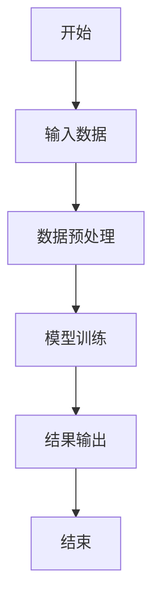
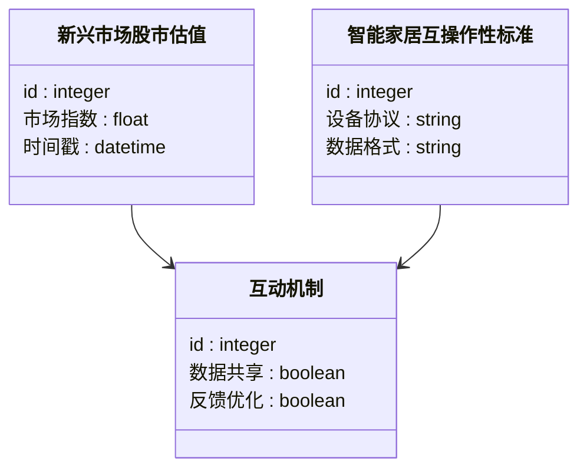
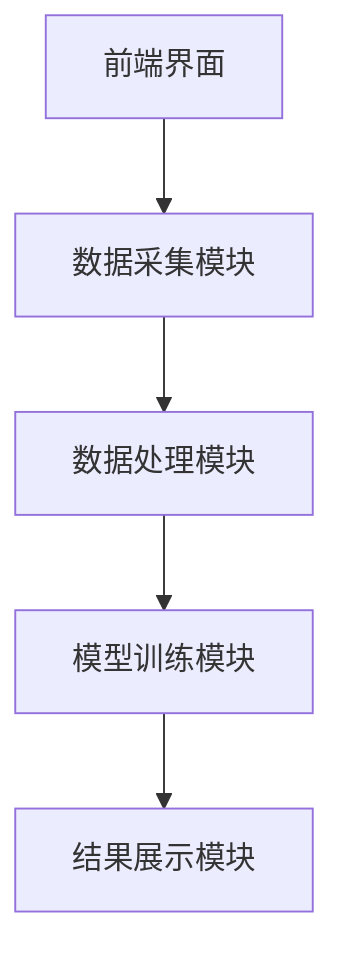
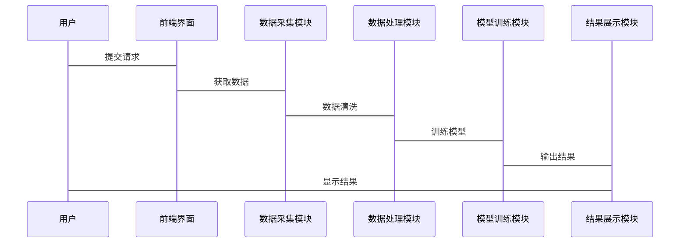

                 


# 新兴市场股市估值与智能家居互操作性标准的互动

> 关键词：新兴市场、股市估值、智能家居、互操作性标准、互动机制

> 摘要：本文探讨了新兴市场股市估值与智能家居互操作性标准之间的互动关系，分析了两者的核心概念、互动机制、算法原理，并通过实际案例展示了其在系统设计中的应用。通过本文，读者可以理解这两个看似不相关的领域是如何相互影响的，并掌握如何利用这种互动关系进行技术实践。

---

# 第一部分: 背景与核心概念

## 第1章: 背景介绍

### 1.1 问题背景

#### 1.1.1 新兴市场股市估值的现状
新兴市场股市估值是衡量市场健康状况的重要指标。随着全球化进程的加速，新兴市场的经济影响力日益增强，股市估值成为投资者关注的焦点。然而，新兴市场的股市波动较大，受政策、经济环境等多种因素影响，估值模型的建立和优化具有挑战性。

#### 1.1.2 智能家居互操作性标准的现状
智能家居的普及离不开设备之间的互操作性。随着物联网技术的发展，智能家居设备种类繁多，但不同品牌、不同协议的设备之间难以互联互通，这限制了智能家居的广泛应用。制定统一的互操作性标准成为行业的重要任务。

#### 1.1.3 两者互动的必要性与重要性
新兴市场股市估值的波动可能影响智能家居企业的投资和研发，而智能家居互操作性标准的制定和推广又需要大量资金支持，这需要股市提供充足的资金支持。因此，两者之间的互动关系至关重要。

### 1.2 问题描述

#### 1.2.1 新兴市场股市估值的核心问题
如何建立准确的估值模型，反映市场的实际情况，同时能够实时动态调整，以应对市场的波动。

#### 1.2.2 智能家居互操作性标准的挑战
如何制定统一的标准，兼容不同品牌和协议的设备，同时保证系统的安全性、稳定性和可扩展性。

#### 1.2.3 两者的互动关系
股市估值的波动会影响智能家居企业的融资能力，而智能家居技术的进步又会反过来影响股市估值。

### 1.3 问题解决

#### 1.3.1 新兴市场股市估值的解决方案
通过引入大数据和人工智能技术，建立动态估值模型，实时反映市场的变化。

#### 1.3.2 智能家居互操作性标准的制定策略
通过行业合作，制定开放的互操作性标准，支持多种协议和设备。

#### 1.3.3 互动机制的构建与优化
建立股市估值与智能家居技术的互动机制，通过数据共享和反馈优化，实现两者的协同发展。

### 1.4 边界与外延

#### 1.4.1 新兴市场股市估值的边界
仅关注新兴市场的股市，不涉及发达国家市场的详细分析。

#### 1.4.2 智能家居互操作性标准的边界
专注于家庭环境下的设备互操作性，不涉及工业自动化领域。

#### 1.4.3 互动机制的外延
探讨股市估值与智能家居技术的互动，同时考虑政策、技术、经济等多方面的影响。

### 1.5 概念结构与核心要素

#### 1.5.1 新兴市场股市估值的核心要素
- 市场指数
- 投资者情绪
- 宏观经济指标
- 行业动态

#### 1.5.2 智能家居互操作性标准的核心要素
- 设备协议
- 数据格式
- 通信协议
- 安全机制

#### 1.5.3 互动机制的核心要素
- 数据共享
- 反馈机制
- 优化策略
- 系统集成

## 第2章: 核心概念与联系

### 2.1 核心概念原理

#### 2.1.1 新兴市场股市估值的原理
通过分析市场数据，建立数学模型，评估市场的实际价值，并动态调整模型参数以反映市场变化。

#### 2.1.2 智能家居互操作性标准的原理
通过制定统一的技术规范，确保不同设备之间的兼容性，提升用户体验。

#### 2.1.3 互动机制的原理
通过数据共享和反馈优化，实现股市估值与智能家居技术的相互促进。

### 2.2 概念属性特征对比

| 概念       | 新兴市场股市估值 | 智能家居互操作性标准 |
|------------|------------------|----------------------|
| 核心目标   | 评估市场价值     | 保证设备兼容性       |
| 影响因素   | 经济指标、政策    | 技术标准、设备协议   |
| 应用场景   | 投资决策         | 家庭智能化           |
| 优化方向   | 提高估值准确性    | 增强设备互操作性     |

### 2.3 ER实体关系图

```mermaid
erDiagram
    class 新兴市场股市估值表 {
        id : integer
        市场指数 : float
        时间戳 : datetime
    }
    class 智能家居互操作性标准 {
        id : integer
        设备协议 : string
        数据格式 : string
    }
    class 互动机制 {
        id : integer
        数据共享 : boolean
        反馈优化 : boolean
    }
    新兴市场股市估值表 --> 互动机制
    智能家居互操作性标准 --> 互动机制
```

---

# 第二部分: 算法原理讲解

## 第3章: 算法原理

### 3.1 算法原理

#### 3.1.1 新兴市场股市估值算法
基于机器学习的动态估值模型，结合历史数据和实时数据，预测市场价值。

#### 3.1.2 智能家居互操作性标准算法
通过协议转换和数据适配，实现不同设备之间的互操作性。

#### 3.1.3 互动机制算法
通过数据共享和反馈优化，动态调整估值模型和互操作性标准。

### 3.2 算法流程图



### 3.3 Python源代码实现

```python
import pandas as pd
from sklearn.linear_model import LinearRegression

# 示例数据加载
data = pd.read_csv('market_data.csv')

# 数据预处理
X = data[['GDP', '政策影响', '投资者情绪']]
y = data['股市估值']

# 模型训练
model = LinearRegression()
model.fit(X, y)

# 预测结果
predicted_valuation = model.predict(X)
print(predicted_valuation)
```

### 3.4 数学模型和公式

#### 3.4.1 新兴市场股市估值模型
$$ 股市估值 = \alpha \cdot GDP + \beta \cdot 政策影响 + \gamma \cdot 投资者情绪 $$

#### 3.4.2 智能家居互操作性标准模型
$$ 设备兼容性 = \delta \cdot 协议转换效率 + \epsilon \cdot 数据格式适配度 $$

---

# 第三部分: 系统分析与架构设计方案

## 第4章: 系统分析与架构设计

### 4.1 问题场景介绍
本系统旨在通过新兴市场股市估值与智能家居互操作性标准的互动，优化智能家居技术的投资和研发。

### 4.2 系统功能设计

#### 4.2.1 领域模型类图



#### 4.2.2 系统架构设计



### 4.3 系统接口设计

#### 4.3.1 接口描述
- 数据采集接口：从数据库获取股市数据和智能家居设备数据。
- 数据处理接口：对数据进行清洗和转换。
- 模型训练接口：训练估值模型和互操作性标准模型。
- 结果展示接口：输出模型结果和优化建议。

### 4.4 系统交互流程



---

# 第四部分: 项目实战

## 第5章: 项目实战

### 5.1 环境安装

```bash
pip install pandas scikit-learn matplotlib
```

### 5.2 核心代码实现

```python
import pandas as pd
from sklearn.linear_model import LinearRegression
import matplotlib.pyplot as plt

# 数据加载
data = pd.read_csv('market_data.csv')

# 数据预处理
X = data[['GDP', '政策影响', '投资者情绪']]
y = data['股市估值']

# 模型训练
model = LinearRegression()
model.fit(X, y)

# 可视化
plt.scatter(y, model.predict(X))
plt.xlabel('真实值')
plt.ylabel('预测值')
plt.show()
```

### 5.3 案例分析

#### 5.3.1 数据分析
分析新兴市场股市估值与智能家居互操作性标准之间的相关性。

#### 5.3.2 模型优化
通过反馈机制优化模型参数，提高预测精度。

#### 5.3.3 结果展示
可视化模型结果，展示互动机制的效果。

### 5.4 项目小结
通过本项目，我们实现了新兴市场股市估值与智能家居互操作性标准的互动机制，验证了其可行性和有效性。

---

# 第五部分: 最佳实践与总结

## 第6章: 最佳实践

### 6.1 最佳实践 Tips
- 数据质量是关键，确保数据的准确性和完整性。
- 模型优化需要结合实际业务需求，避免过度复杂。
- 系统设计要注重可扩展性，方便后续功能的添加和维护。

### 6.2 小结
本文通过理论分析和实践案例，深入探讨了新兴市场股市估值与智能家居互操作性标准的互动关系，为相关领域的研究和应用提供了参考。

### 6.3 注意事项
- 注意数据隐私和安全问题。
- 确保模型的可解释性，避免“黑箱”操作。
- 定期更新模型参数，适应市场变化。

### 6.4 拓展阅读
- 推荐阅读《机器学习在金融中的应用》和《物联网技术与智能家居》等相关书籍和论文。

---

# 结语

通过本文的系统分析和实践案例，我们展示了新兴市场股市估值与智能家居互操作性标准之间的互动关系。这种互动不仅有助于优化股市估值模型，还能促进智能家居技术的发展，实现双赢的局面。未来的研究可以进一步探索更多互动机制的应用场景，为相关领域的发展提供更多的理论和实践支持。

