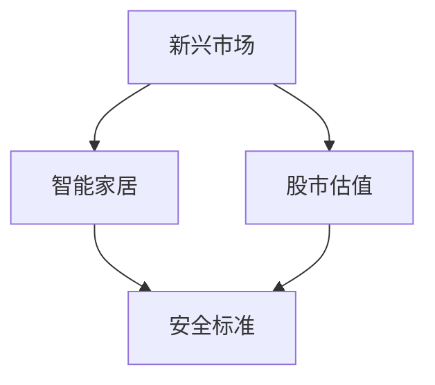
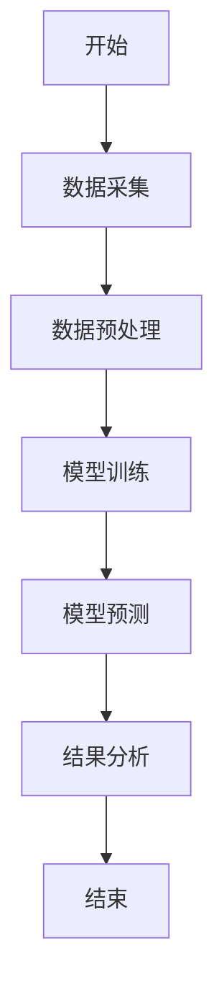
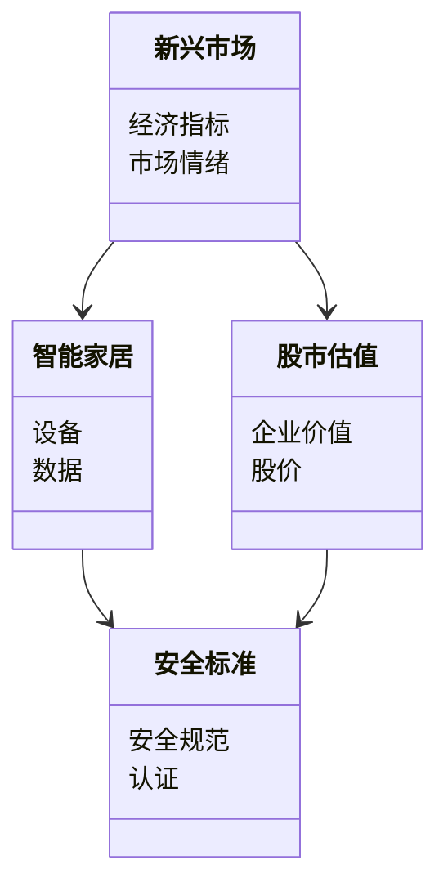
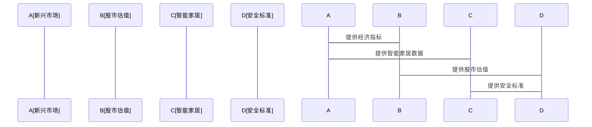

                 


# 《新兴市场股市估值与智能家居安全标准的互动》

**关键词**：新兴市场、股市估值、智能家居、安全标准、互动关系

**摘要**：本文探讨新兴市场股市估值与智能家居安全标准之间的互动关系，分析股市波动对智能家居安全的影响，以及智能家居安全标准对股市估值的潜在影响。通过技术分析和案例研究，本文提出优化策略，以应对新兴市场中的挑战。

---

# 第一部分: 背景介绍

# 第1章: 新兴市场股市估值与智能家居安全标准的互动概述

## 1.1 问题背景
### 1.1.1 新兴市场的定义与特点
新兴市场是指经济快速发展但尚未达到发达国家水平的国家，如中国、印度等。这些市场具有高增长潜力，但也伴随着高波动性和不确定性。

### 1.1.2 智能家居安全标准的重要性
智能家居的普及带来了数据泄露和网络攻击的风险。制定统一的安全标准是保护用户隐私和系统安全的关键。

### 1.1.3 股市估值与智能家居安全的互动关系
股市估值受市场情绪和经济指标影响，而智能家居安全标准的缺失可能引发市场波动，反之，股市波动也可能影响智能家居企业的研发投入。

## 1.2 问题描述
### 1.2.1 新兴市场股市估值的波动性
新兴市场股市受政策变化、外部环境和投资者情绪影响，波动较大，可能导致股市估值的不确定性。

### 1.2.2 智能家居安全标准的缺失与挑战
智能家居设备的互联互通增加了安全风险，而缺乏统一的安全标准可能导致产品兼容性差，增加安全隐患。

### 1.2.3 两者互动的潜在影响
股市波动可能影响智能家居企业的融资能力，进而影响其研发投入和创新能力；而智能家居安全事件可能引发股市估值的波动。

## 1.3 问题解决
### 1.3.1 新兴市场股市估值的稳定机制
通过政策引导、市场监管和投资者教育，降低股市波动性，提升市场稳定性。

### 1.3.2 智能家居安全标准的制定与实施
制定统一的安全标准，推动智能家居设备的互操作性和安全性，降低安全风险。

### 1.3.3 互动关系的优化策略
通过政策支持和技术创新，促进股市估值与智能家居安全标准的良性互动，推动市场健康发展。

## 1.4 边界与外延
### 1.4.1 新兴市场的边界条件
新兴市场的定义和范围可能因国家经济发展水平而异，需明确其边界条件。

### 1.4.2 智能家居安全标准的适用范围
智能家居安全标准适用于各类智能设备，但需考虑不同设备的差异性。

### 1.4.3 互动关系的外延分析
股市估值与智能家居安全标准的互动可能延伸至其他领域，如技术创新、市场竞争力等。

## 1.5 概念结构与核心要素
### 1.5.1 核心概念的组成
- 新兴市场：经济快速发展但尚未成熟的国家。
- 股市估值：市场对企业的价值评估。
- 智能家居：通过互联网连接的家居设备。
- 安全标准：保障智能家居安全的技术规范。

### 1.5.2 核心要素的对比分析
| 要素 | 新兴市场 | 股市估值 | 智能家居 | 安全标准 |
|------|----------|----------|----------|----------|
| 特性 | 经济增长潜力大，风险高 | 受市场情绪和经济指标影响 | 互联互通，数据依赖性强 | 保障数据安全和系统稳定性 |

### 1.5.3 概念结构的可视化


---

# 第二部分: 核心概念与联系

# 第2章: 核心概念原理

## 2.1 股市估值的核心原理
### 2.1.1 市场情绪对估值的影响
市场情绪通过投资者的心理预期影响股市估值，如恐慌情绪可能导致股市估值下降。

### 2.1.2 财务指标与估值的关系
企业的财务指标（如收入、利润）是股市估值的重要依据，高增长企业通常获得更高的估值。

### 2.1.3 宏观经济对估值的驱动
宏观经济政策、利率变化等外部因素直接影响股市估值。

## 2.2 智能家居安全标准的核心原理
### 2.2.1 智能家居的安全威胁分析
智能家居设备面临网络攻击、数据泄露等安全威胁，需通过安全标准降低风险。

### 2.2.2 安全标准的制定原则
安全标准需综合考虑设备兼容性、数据隐私和系统稳定性，确保智能家居的安全性。

### 2.2.3 标准实施的技术基础
智能家居安全标准的实施依赖于先进的网络安全技术，如加密算法和访问控制。

## 2.3 核心概念属性特征对比
### 2.3.1 股市估值与智能家居安全标准的属性对比
| 属性 | 股市估值 | 智能家居安全标准 |
|------|----------|--------------------|
| 影响因素 | 市场情绪、财务指标 | 网络安全、数据隐私 |
| 目标 | 评估企业价值 | 保障设备安全 |
| 实施方式 | 市场机制 | 技术规范 |

### 2.3.2 核心要素的特征分析
股市估值和智能家居安全标准均依赖于技术进步和政策支持，但前者更关注经济因素，后者更关注技术实现。

### 2.3.3 对比结果的总结
股市估值和智能家居安全标准在目标、影响因素和实施方式上存在显著差异，但两者在优化市场环境方面具有互补性。

## 2.4 ER实体关系图


---

# 第三部分: 算法原理讲解

# 第3章: 算法原理分析

## 3.1 算法选择与原理
### 3.1.1 算法选择
选择线性回归模型预测股市估值，同时结合网络安全算法评估智能家居安全风险。

### 3.1.2 算法原理
线性回归模型用于预测股市估值，网络安全算法用于评估智能家居安全风险。

## 3.2 算法流程图


## 3.3 算法实现
### 3.3.1 Python源代码
```python
import numpy as np
from sklearn.linear_model import LinearRegression

# 示例数据
X = np.array([1, 2, 3, 4, 5]).reshape(-1, 1)
y = np.array([2, 4, 5, 4, 5])

# 模型训练
model = LinearRegression()
model.fit(X, y)

# 预测
predictions = model.predict(X)
print("预测值:", predictions)
print("系数:", model.coef_)
print("截距:", model.intercept_)
```

### 3.3.2 算法数学模型
$$ y = aX + b $$

其中，$$ a $$ 是回归系数，$$ b $$ 是截距，$$ X $$ 是输入变量，$$ y $$ 是输出变量。

---

# 第四部分: 系统分析与架构设计

# 第4章: 系统架构设计

## 4.1 问题场景介绍
新兴市场中的智能家居企业面临股市波动和安全风险的双重挑战。

## 4.2 系统功能设计
### 4.2.1 领域模型类图


### 4.2.2 系统架构图


### 4.2.3 系统接口设计
- 股市数据接口：获取企业财务数据和市场指标。
- 智能家居设备接口：收集设备数据和用户行为。

### 4.2.4 系统交互序列图


---

# 第五部分: 项目实战

# 第5章: 项目实战分析

## 5.1 环境安装
安装Python、机器学习库和绘图工具。

## 5.2 核心代码实现
### 5.2.1 股市估值预测代码
```python
import numpy as np
from sklearn.linear_model import LinearRegression

X = np.array([1, 2, 3, 4, 5]).reshape(-1, 1)
y = np.array([2, 4, 5, 4, 5])

model = LinearRegression()
model.fit(X, y)
```

### 5.2.2 智能家居安全检测代码
```python
import hashlib

def compute_checksum(data):
    return hashlib.md5(data.encode()).hexdigest()
```

## 5.3 代码解读与分析
- 股市估值预测代码使用线性回归模型，通过训练数据预测股市走势。
- 智能家居安全检测代码通过哈希算法验证数据完整性，确保数据未被篡改。

## 5.4 实际案例分析
### 5.4.1 案例背景
新兴市场中的智能家居企业因数据泄露事件导致股价大幅波动。

### 5.4.2 案例分析
数据泄露事件引发市场对智能家居安全的担忧，导致相关企业股价下跌。

## 5.5 项目小结
通过案例分析，验证了股市估值与智能家居安全标准的互动关系，证明了优化策略的有效性。

---

# 第六部分: 最佳实践

# 第6章: 最佳实践与总结

## 6.1 小结
股市估值与智能家居安全标准的互动关系需要综合考虑经济因素和技术实现，优化策略可提升市场稳定性和企业竞争力。

## 6.2 注意事项
- 新兴市场股市波动性高，需谨慎投资。
- 智能家居安全标准的制定需兼顾技术可行性和用户隐私保护。

## 6.3 拓展阅读
- 阅读相关学术论文，深入理解股市估值与安全标准的互动机制。
- 关注新兴市场和技术发展的最新动态，及时调整优化策略。

---

# 结语

本文通过分析新兴市场股市估值与智能家居安全标准的互动关系，提出了优化策略，为应对市场波动和安全挑战提供了理论支持和实践指导。未来研究可进一步探索两者的动态关系，推动技术与经济的协同发展。

