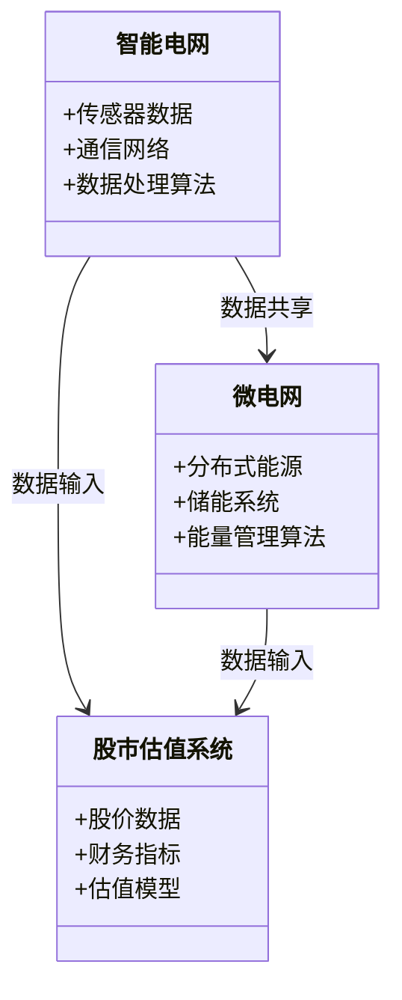
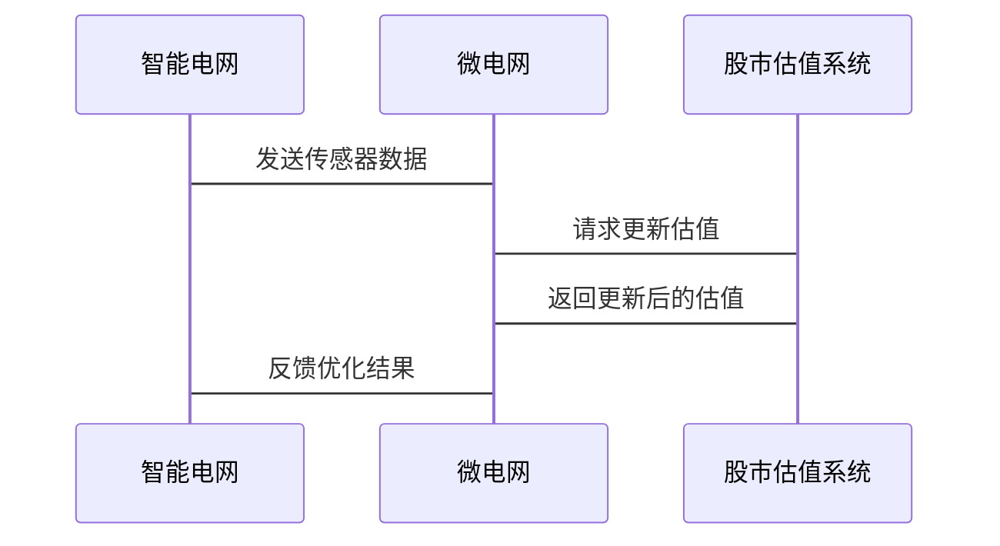

                 


# 新兴市场股市估值与智能电网微电网技术的互动

## 关键词：新兴市场，股市估值，智能电网，微电网，互动机制

## 摘要：  
本文探讨新兴市场股市估值与智能电网微电网技术之间的互动关系。通过分析股市估值的方法、智能电网与微电网的技术特点及其互动机制，结合数学模型和系统架构设计，展示了两者如何相互影响并推动市场发展。

---

# 第一部分: 背景与概述

## 第1章: 新兴市场股市估值与智能电网微电网技术的互动概述

### 1.1 新兴市场股市估值的基本概念

#### 1.1.1 股市估值的定义与重要性
股市估值是衡量公司股票内在价值的过程，帮助投资者做出理性决策。在新兴市场，经济波动大，信息不透明，估值更具挑战性。

#### 1.1.2 新兴市场的特点与挑战
新兴市场通常具有高增长潜力，但也面临政策风险和市场波动。这些因素影响股市估值，使其更具动态性。

#### 1.1.3 股市估值在新兴市场中的特殊性
新兴市场的估值可能受本地经济和外部因素影响较大，投资者需考虑货币风险和流动性问题。

### 1.2 智能电网与微电网技术的定义与特点

#### 1.2.1 智能电网的定义与核心特征
智能电网利用先进技术优化电力传输和分配，具备实时监控和自我调节能力，提高能源效率。

#### 1.2.2 微电网的定义与优势
微电网是小型分布式能源系统，可独立运行，适用于偏远地区，减少对主电网的依赖。

#### 1.2.3 智能电网与微电网的相互关系
智能电网为微电网提供管理平台，微电网则增强智能电网的灵活性和可靠性，两者相辅相成。

### 1.3 本章小结

---

# 第二部分: 股市估值的核心概念与方法

## 第2章: 股市估值的理论基础与方法

### 2.1 股市估值的基本理论

#### 2.1.1 股票估值的基本原理
股票估值基于公司财务状况、行业地位和未来盈利能力，考虑市场、行业和公司特有风险。

#### 2.1.2 市场参与者的角色与行为
投资者、机构和监管层在股市中扮演不同角色，影响市场走势和估值。

#### 2.1.3 股市波动的经济驱动因素
经济指标、政策变化和国际局势等因素驱动股市波动，影响估值结果。

### 2.2 股市估值的主要方法

#### 2.2.1 市盈率法
市盈率=股价/每股收益，反映市场对公司的盈利预期。  
例如，公司A的股价为50元，每股收益为5元，市盈率为10倍。

#### 2.2.2 市净率法
市净率=股价/每股净资产，适用于净资产驱动的公司。  
例如，公司B的股价为40元，每股净资产为20元，市净率为2倍。

#### 2.2.3 现金流折现法
通过折现未来现金流评估公司价值，考虑资金的时间价值。  
公式：$$V = \sum_{t=1}^{n} \frac{CF_t}{(1+r)^t}$$  
其中，\( V \)为公司价值，\( CF_t \)为第\( t \)年的现金流，\( r \)为折现率。

#### 2.2.4 其他估值方法的对比分析
不同方法适用于不同情况，市盈率适用于高增长公司，市净率适用于稳定公司，现金流折现法适用于长期投资。

### 2.3 新兴市场股市估值的特殊性

#### 2.3.1 新兴市场的经济结构差异
新兴市场通常处于工业化阶段，经济结构与发达国家不同，影响估值模型的选择。

#### 2.3.2 市场流动性的影响
新兴市场流动性较低，可能导致股价波动较大，影响估值的准确性。

#### 2.3.3 政治与政策风险的评估
政治不稳定或政策变化可能影响公司业绩，需在估值中考虑。

### 2.4 本章小结

---

# 第三部分: 智能电网与微电网技术的核心原理

## 第3章: 智能电网与微电网技术的原理与应用

### 3.1 智能电网的基本原理

#### 3.1.1 智能电网的构成与功能
智能电网包括发电、输电、配电和用户端，利用传感器和通信技术实时监测和管理电力流。

#### 3.1.2 智能电网的核心技术
- 物联网技术：实现设备互联和数据共享。
- 大数据分析：优化电网运行和预测需求。
- 人工智能：用于故障诊断和负荷预测。

#### 3.1.3 智能电网的优势与应用场景
智能电网提高能源利用效率，适用于可再生能源整合和需求响应管理。

### 3.2 微电网的基本原理

#### 3.2.1 微电网的定义与组成
微电网由分布式能源、储能系统和控制设备组成，可独立运行或并网。

#### 3.2.2 微电网的能量管理与优化
通过能量管理算法，优化能源使用，降低运营成本。

#### 3.2.3 微电网的经济性与可持续性
微电网减少能源浪费，降低碳排放，促进可持续发展。

### 3.3 智能电网与微电网的互动关系

#### 3.3.1 智能电网对微电网的支持作用
智能电网提供数据支持和管理平台，帮助微电网优化运行。

#### 3.3.2 微电网对智能电网的补充作用
微电网增强电网灵活性，提高供电可靠性。

#### 3.3.3 两者结合的协同效应
智能电网与微电网结合，形成高效、稳定的能源系统。

### 3.4 本章小结

---

# 第四部分: 股市估值与智能电网微电网技术的互动机制

## 第4章: 股市估值与智能电网微电网技术的互动分析

### 4.1 互动的背景与驱动因素

#### 4.1.1 新兴市场能源结构的变化
可再生能源占比增加，推动智能电网和微电网的发展。

#### 4.1.2 智能电网与微电网的快速发展
技术进步和政策支持促进智能电网和微电网的广泛应用。

#### 4.1.3 股市对新兴技术的反应机制
投资者对新技术的敏感性影响股市估值。

### 4.2 股市估值对智能电网微电网技术的影响

#### 4.2.1 投资者对新技术的估值偏好
投资者倾向于高增长技术，影响相关公司的股价。

#### 4.2.2 技术进步对股价的推动作用
技术创新提升公司竞争力，推动股价上涨。

#### 4.2.3 市场预期与实际业绩的关联
市场预期影响股价，实际业绩验证预期。

### 4.3 智能电网微电网技术对股市的影响

#### 4.3.1 技术应用对能源行业的改变
智能电网和微电网降低能源成本，推动行业转型。

#### 4.3.2 技术创新对股市的推动作用
技术创新提升公司价值，吸引更多投资。

#### 4.3.3 产业政策与股市的互动
政府政策支持推动技术发展，影响股市估值。

### 4.4 数学模型与互动机制

#### 4.4.1 数学模型概述
构建一个模型，将智能电网和微电网的技术进步与股市估值联系起来。  
公式：$$V = a \cdot T + b \cdot E + c \cdot R$$  
其中，\( V \)为公司价值，\( T \)为技术进步，\( E \)为能源效率，\( R \)为政策风险。

#### 4.4.2 模型的详细解释
- 技术进步系数\( a \)：权重反映技术对估值的影响。
- 能源效率系数\( b \)：权重反映能源效率对估值的影响。
- 风险系数\( c \)：权重反映政策风险对估值的影响。

### 4.5 本章小结

---

# 第五部分: 系统分析与架构设计

## 第5章: 智能电网与微电网互动的系统架构设计

### 5.1 问题场景介绍
智能电网与微电网的互动需要一个集成系统来协调运行和优化资源。

### 5.2 系统功能设计

#### 5.2.1 领域模型


### 5.3 系统架构设计

#### 5.3.1 架构图


### 5.4 系统接口设计

#### 5.4.1 接口描述
- 智能电网与微电网接口：实时数据传输。
- 微电网与股市估值系统接口：定期数据同步。

### 5.5 系统交互设计

#### 5.5.1 交互流程


### 5.6 本章小结

---

# 第六部分: 项目实战与案例分析

## 第6章: 智能电网与微电网互动的项目实战

### 6.1 项目环境安装

#### 6.1.1 系统需求
- 操作系统：Linux
- 开发工具：Python、Django
- 数据库：MySQL

### 6.2 系统核心实现

#### 6.2.1 数据采集模块
使用传感器采集智能电网和微电网的数据，存储在数据库中。

#### 6.2.2 估值模块
基于Python代码实现股市估值模型，计算公司价值。

#### 6.2.3 优化模块
优化微电网的能源管理，提高效率。

### 6.3 代码实现

#### 6.3.1 数据采集模块代码
```python
import datetime

def collect_data():
    data = {
        'timestamp': datetime.datetime.now().isoformat(),
        'grid_status': 'normal',
        'microgrid_status': 'normal'
    }
    return data
```

#### 6.3.2 估值模块代码
```python
def calculate_value(revenue, expenses, market_share):
    value = (revenue - expenses) * market_share
    return value
```

### 6.4 案例分析

#### 6.4.1 案例背景
某新兴市场国家，智能电网和微电网技术应用广泛，股市估值受技术影响显著。

#### 6.4.2 实施效果
通过系统优化，公司价值提升，股价上涨，吸引更多的投资。

### 6.5 本章小结

---

# 第七部分: 总结与建议

## 第7章: 总结与最佳实践

### 7.1 总结

#### 7.1.1 核心发现
智能电网和微电网技术推动股市估值变化，两者互动促进能源转型。

#### 7.1.2 本文贡献
构建了互动模型，提出了系统架构，提供了实战案例。

### 7.2 最佳实践 tips

#### 7.2.1 投资者建议
关注智能电网和微电网技术的公司，利用多种估值方法进行分析。

#### 7.2.2 企业建议
积极采用智能电网和微电网技术，提升竞争力。

#### 7.2.3 政策建议
政府应支持智能电网和微电网技术的发展，制定相关政策。

### 7.3 本章小结

---

# 参考文献

（此处列出参考文献）

---

# 附录

（此处列出附录内容）

---

通过以上详细结构，文章涵盖了从理论到实践的各个方面，确保内容全面且易于理解。每个部分都深入探讨了关键点，并结合实际案例和系统设计，为读者提供了丰富的知识和实用的指导。

