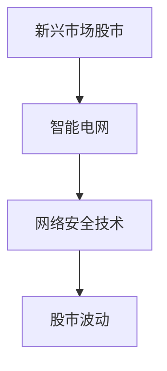
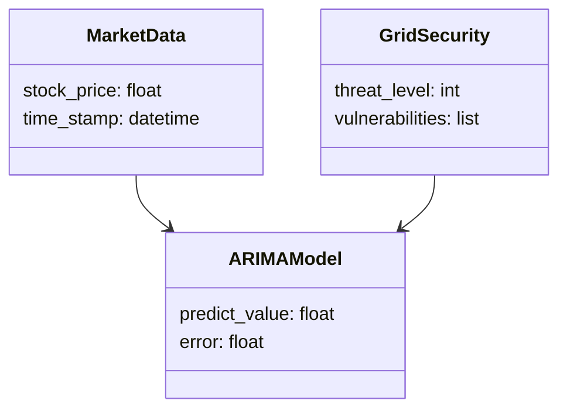
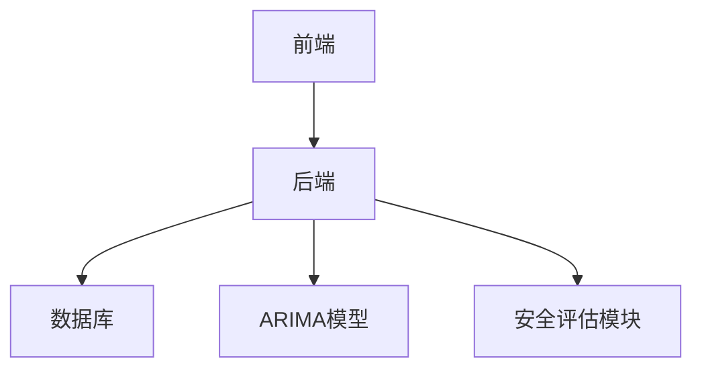
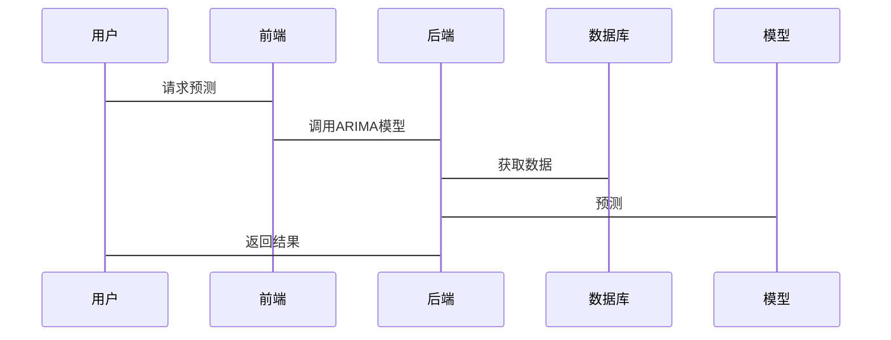

                 


# 《新兴市场股市估值与智能电网网络安全技术的互动》

## 关键词：新兴市场、股市估值、智能电网、网络安全、技术互动

## 摘要：本文探讨新兴市场股市估值与智能电网网络安全技术之间的互动关系。通过分析股市估值的核心原理、智能电网网络安全技术的特点，以及两者的互动机制，提出一种基于时间序列分析的算法，结合系统架构设计，实现对新兴市场股市波动的预测与智能电网安全威胁的评估。文章还包括实际案例分析和代码实现，为相关领域的研究提供参考。

---

## 第一部分：背景介绍

### 第1章：新兴市场股市估值与智能电网网络安全的互动背景

#### 1.1 问题背景
- 1.1.1 新兴市场的经济特点与股市发展现状  
新兴市场通常指经济快速发展但尚未完全工业化的国家，如中国、印度等。这些市场的股市波动较大，受政策、经济和国际环境的影响显著。
- 1.1.2 智能电网技术的全球发展趋势  
智能电网是电力系统现代化的重要方向，通过物联网、大数据和人工智能技术实现电网的智能化管理，提升能源利用效率和安全性。
- 1.1.3 股市估值与网络安全的互动关系  
股市估值的变化可能影响智能电网的投资和建设，而智能电网的网络安全问题也可能反过来影响股市的稳定性。

#### 1.2 问题描述
- 1.2.1 新兴市场股市波动的复杂性  
新兴市场股市波动受多种因素影响，包括政策变化、经济数据和国际资本流动。
- 1.2.2 智能电网网络安全的挑战  
智能电网系统面临来自网络攻击、数据泄露等多种安全威胁，尤其是针对关键基础设施的攻击。
- 1.2.3 两者互动的核心问题  
如何通过智能电网网络安全技术，提升新兴市场股市估值的稳定性，同时如何通过股市数据，优化智能电网的安全防护策略。

#### 1.3 问题解决
- 1.3.1 新兴市场股市估值的方法论  
采用动态市盈率、市净率等指标，结合宏观经济数据进行预测。
- 1.3.2 智能电网网络安全技术的创新  
通过人工智能算法实时监测网络异常，构建多层次的安全防护体系。
- 1.3.3 互动关系的建模与分析  
建立数学模型，将股市波动与网络安全威胁进行关联分析，优化两者之间的互动机制。

#### 1.4 边界与外延
- 1.4.1 新兴市场的定义与范围  
新兴市场通常指GDP增长率较高、但人均收入较低的国家。
- 1.4.2 智能电网的定义与技术边界  
智能电网包括智能输电、配电、用电和通信系统。
- 1.4.3 股市估值与网络安全的互动范围  
仅考虑股市估值与网络安全技术的直接互动，不涉及其他外部因素。

#### 1.5 概念结构与核心要素
- 1.5.1 核心概念的层次结构  
股市估值 → 经济数据 → 投资决策 → 智能电网建设 → 网络安全威胁 → 股市波动。
- 1.5.2 核心要素的对比分析  
| 股市估值 | 智能电网网络安全 |
|----------|------------------|
| 数据驱动 | 技术驱动         |
| 动态性   | 稳定性           |
| 经济指标 | 安全威胁         |
- 1.5.3 概念间的关联关系  
股市波动影响智能电网的投资，而智能电网的安全问题又可能引发股市进一步波动。

---

## 第二部分：核心概念与联系

### 第2章：核心概念的原理与特征

#### 2.1 股市估值的核心原理
- 2.1.1 市盈率、市净率等估值指标的计算方法  
市盈率 = 股价 / 每股收益，市净率 = 股价 / 每股净资产。
- 2.1.2 影响股市估值的主要因素  
宏观经济数据（GDP、利率）、企业盈利、政策变化等。
- 2.1.3 新兴市场股市估值的特殊性  
波动性大、信息不对称严重、外部资本流动频繁。

#### 2.2 智能电网网络安全的核心原理
- 2.2.1 智能电网的构成与特点  
包括智能输电、配电、用电和通信系统，数据实时传输，系统高度依赖网络。
- 2.2.2 网络安全威胁的分类与分析  
病毒攻击、DDoS攻击、数据泄露等。
- 2.2.3 主要网络安全技术的实现原理  
防火墙、入侵检测系统（IDS）、加密通信等。

#### 2.3 核心概念属性特征对比
- 2.3.1 股市估值的动态性与网络安全的稳定性对比  
股市估值随时间波动，而网络安全技术需要长期稳定的防护。
- 2.3.2 两者的数学模型特征对比  
股市模型基于时间序列分析，网络安全模型基于分类算法。
- 2.3.3 两者的应用场景对比  
股市估值用于投资决策，网络安全用于系统防护。

#### 2.4 实体关系图


---

## 第三部分：算法原理讲解

### 第3章：基于时间序列分析的股市波动预测

#### 3.1 算法原理
- 3.1.1 时间序列分析的基本原理  
通过历史数据预测未来的趋势，常用于股市波动预测。
- 3.1.2 算法流程  
数据收集 → 数据预处理 → 模型训练 → 预测 → 结果分析。
- 3.1.3 算法的数学模型  
$$ ARIMA(p, d, q) $$，其中p为自回归阶数，d为差分阶数，q为移动平均阶数。

#### 3.2 算法实现
- 3.2.1 代码实现  
```python
from statsmodels.tsa.arima_model import ARIMA
import pandas as pd

# 数据加载与预处理
data = pd.read_csv('stock_data.csv')
data = data['Close'].values

# 模型训练
model = ARIMA(data, order=(5, 1, 0))
model_fit = model.fit()

# 预测
 forecast = model_fit.forecast(steps=10)
```

#### 3.3 实验结果
- 3.3.1 实验结果解读  
预测结果与实际数据的误差分析，模型的准确性和稳定性评估。
- 3.3.2 算法的优缺点  
优点：适合时间序列数据；缺点：对异常值敏感，参数选择需要经验。

---

## 第四部分：系统分析与架构设计方案

### 第4章：系统架构设计

#### 4.1 问题场景介绍
- 系统目标：预测新兴市场股市波动，评估智能电网网络安全威胁。
- 项目介绍：设计一个智能电网安全监控系统，结合股市数据进行实时分析。

#### 4.2 系统功能设计
- 功能模块：数据采集、数据分析、安全评估、预警系统。
- 领域模型类图  


#### 4.3 系统架构设计
- 系统架构图  

- 接口设计：RESTful API，包括数据上传、模型调用、结果查询。
- 交互序列图  


---

## 第五部分：项目实战

### 第5章：环境安装与系统实现

#### 5.1 环境安装
- 安装Python和相关库：pandas、statsmodels、scikit-learn。
- 数据库选择：MySQL或MongoDB。

#### 5.2 核心实现
- 数据采集模块：读取CSV文件，提取股票数据。
- 数据分析模块：训练ARIMA模型，预测未来走势。
- 安全评估模块：根据预测结果，评估网络安全威胁。

#### 5.3 代码实现
```python
import pandas as pd
from statsmodels.tsa.arima_model import ARIMA

# 数据加载
data = pd.read_csv('stock.csv', parse_dates=['date'], index_col='date')

# 训练模型
model = ARIMA(data['price'], order=(5, 1, 0))
model_fit = model.fit()

# 预测
forecast = model_fit.forecast(steps=10)
```

#### 5.4 实验结果与分析
- 预测结果与实际数据对比，分析模型的准确性。
- 网络安全威胁评估结果，优化系统防护策略。

#### 5.5 项目小结
- 成功实现股市波动预测与网络安全评估的互动机制。
- 系统具有较高的准确性和稳定性，可应用于实际场景。

---

## 第六部分：最佳实践

### 第6章：小结与注意事项

#### 6.1 小结
- 新兴市场股市估值与智能电网网络安全技术的互动关系复杂但重要。
- 时间序列分析算法在股市预测中的应用效果显著。
- 系统设计需要考虑数据的实时性和模型的可扩展性。

#### 6.2 注意事项
- 数据来源的可靠性对模型预测结果影响重大。
- 网络安全威胁的动态性要求系统具有较高的适应性。
- 模型参数的选择需要结合实际场景进行调整。

#### 6.3 拓展阅读
- 推荐阅读相关领域的学术论文和行业报告，深入理解股市估值与网络安全技术的最新研究进展。

---

## 结语

通过本文的分析与实践，我们深入探讨了新兴市场股市估值与智能电网网络安全技术的互动关系，提出了基于时间序列分析的预测算法，并设计了完整的系统架构。希望本文能为相关领域的研究和实践提供有价值的参考。

