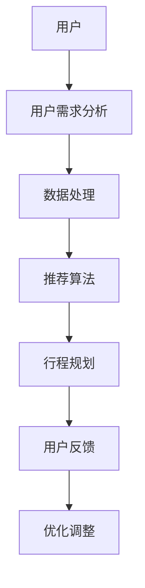

                 


# 旅游业AI Agent：个性化行程规划

> 关键词：人工智能、行程规划、个性化推荐、自然语言处理、知识图谱、协同过滤、深度学习

> 摘要：本文深入探讨了AI Agent在旅游业中的应用，特别是个性化行程规划的实现。从背景分析到技术实现，结合实际案例，详细阐述了如何利用AI技术提升用户体验和效率。

---

## 第一部分：旅游业AI Agent的背景与需求

### 第1章：旅游业的现状与挑战

#### 1.1 旅游业的发展趋势

- 1.1.1 全球旅游业的增长概况  
  旅游业是全球经济增长的重要驱动力，近年来年均增长率为5%以上，特别是在亚洲地区，旅游业发展迅速。

- 1.1.2 旅游业面临的痛点与挑战  
  - 旅游产品同质化严重，缺乏差异化竞争。  
  - 用户需求多样化，传统的一-size-fits-all模式难以满足个性化需求。  
  - 信息过载，用户难以快速获取适合自己的旅游方案。

- 1.1.3 用户需求的多样化与个性化  
  用户不仅关注价格，还注重体验、行程安排、个性化服务等。

#### 1.2 AI Agent在旅游业中的应用价值

- 1.2.1 AI Agent的基本概念与特点  
  - AI Agent是一种能够理解用户需求并主动提供服务的智能系统。  
  - 具有学习能力，能够通过数据优化推荐结果。

- 1.2.2 AI Agent与传统旅游预订系统的主要区别  
  - 传统系统：基于规则的查询，无法深度学习用户需求。  
  - AI Agent：通过机器学习和自然语言处理，提供个性化服务。

- 1.2.3 AI Agent的优势与应用场景  
  - 提供个性化推荐，提升用户体验。  
  - 优化行程安排，提高效率。  
  - 实时数据分析，提供动态建议。

---

## 第二部分：核心概念与技术基础

### 第2章：AI Agent的核心原理

#### 2.1 AI Agent的基本原理

- AI Agent通过收集用户数据（如历史行为、偏好），利用机器学习模型生成个性化推荐。  
- 核心技术包括：  
  - 自然语言处理（NLP）：解析用户需求。  
  - 机器学习：生成个性化推荐。  
  - 知识图谱：构建旅游信息网络。

#### 2.2 推荐算法与个性化行程规划

- 协同过滤推荐算法：基于用户行为相似性推荐。  
- 基于内容的推荐算法：分析产品特征进行推荐。  
- 混合推荐算法：结合多种方法提升推荐准确性。

---

## 第三部分：算法原理

### 第3章：协同过滤推荐算法

#### 3.1 协同过滤推荐算法的实现

- 算法步骤：  
  1. 收集用户行为数据。  
  2. 计算用户相似度或物品相似度。  
  3. 生成推荐列表。  

- 数学公式：  
  $$ sim(u, v) = \frac{\sum_{i=1}^{n} (r_{ui} - \bar{r}_u)(r_{vi} - \bar{r}_v)}{\sqrt{\sum_{i=1}^{n} (r_{ui} - \bar{r}_u)^2} \cdot \sqrt{\sum_{i=1}^{n} (r_{vi} - \bar{r}_v)^2}} $$  

#### 3.2 深度学习推荐模型

- 基于神经网络的推荐系统：  
  - 输入层：用户特征和历史行为。  
  - 隐层：提取特征表示。  
  - 输出层：生成推荐结果。

---

## 第四部分：系统架构与设计

### 第4章：系统架构设计

#### 4.1 系统功能模块设计

- 用户需求分析模块：解析用户输入。  
- 数据收集与处理模块：整合多源数据。  
- 行程规划与推荐模块：生成个性化行程。  
- 用户反馈与优化模块：根据反馈调整推荐策略。

#### 4.2 系统架构图



---

## 第五部分：项目实战

### 第5章：项目实战与实现

#### 5.1 环境搭建

- 安装Python和必要的库（如Scikit-learn、TensorFlow）。  
- 数据集获取：爬取旅游景点数据。

#### 5.2 核心算法实现

- 协同过滤算法代码示例：

```python
import numpy as np
from sklearn.metrics.pairwise import cosine_similarity

# 用户-物品矩阵
X = np.array([[1, 0, 1],
              [0, 1, 1],
              [1, 1, 0]])

# 计算余弦相似度
similarity = cosine_similarity(X)
print(similarity)
```

#### 5.3 实际案例分析

- 案例：用户输入偏好后，系统生成推荐行程，实时优化。

---

## 第六部分：总结与展望

### 第6章：最佳实践与总结

#### 6.1 最佳实践

- 数据质量：确保数据准确性和完整性。  
- 模型优化：定期更新模型，提升推荐准确率。  
- 用户隐私：保护用户数据，确保合规性。

#### 6.2 未来展望

- 更智能的AI Agent，结合更多传感器数据，提供实时行程调整。  
- 更个性化的服务，利用增强学习进一步优化推荐。  
- 更广泛的应用场景，如跨国旅行、医疗旅游等。

---

### 小结

通过本文的详细讲解，读者可以全面了解AI Agent在旅游业中的应用，从理论到实践，掌握个性化行程规划的核心技术。未来，随着技术进步，AI Agent将为旅游业带来更多创新和价值。

