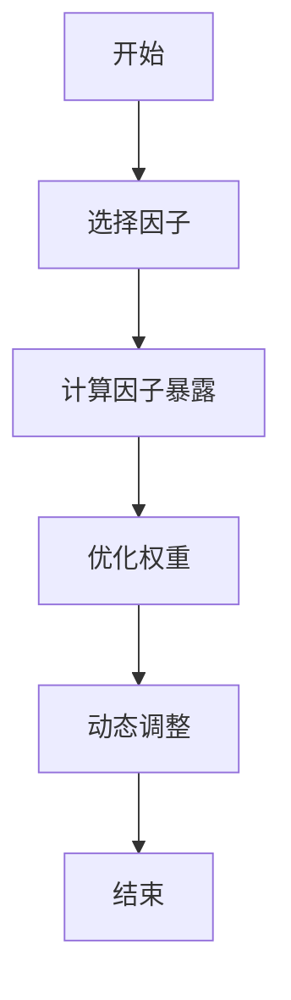
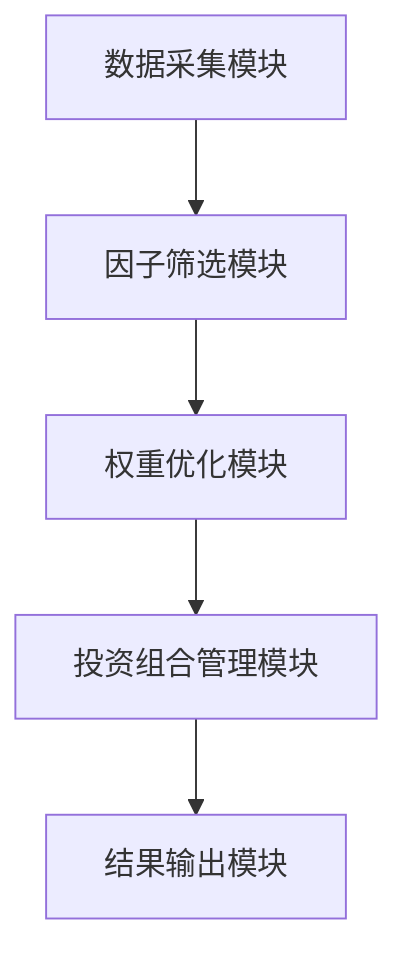

                 


# 智能Beta策略：结合被动和主动投资的优势

> 关键词：智能Beta策略、被动投资、主动投资、投资组合优化、金融建模、风险管理

> 摘要：智能Beta策略是一种结合被动投资和主动投资的新兴策略，通过动态调整投资组合中的资产权重，利用因子模型和数学优化方法，在风险可控的前提下实现收益最大化。本文将深入探讨智能Beta策略的核心概念、算法原理、系统架构设计及实际应用案例，为读者提供全面的理论和实践指导。

---

## 第1章：智能Beta策略的基本概念

### 1.1 智能Beta策略的定义与背景

智能Beta策略是一种结合被动投资和主动投资的策略，它通过动态调整投资组合中资产的权重，以在风险可控的前提下实现收益的最大化。传统的被动投资以指数投资为主，而主动投资则依赖于基金经理的主动选股和择时能力。然而，被动投资的收益受限于市场指数表现，而主动投资则面临高昂的交易成本和不确定性。

智能Beta策略通过引入因子模型和数学优化方法，将被动投资的低成本和分散化优势与主动投资的灵活性相结合，为投资者提供了一种更为高效的投资方式。

### 1.2 智能Beta策略的核心理念

智能Beta策略的核心理念在于动态调整投资组合的Beta（系统性风险）和Alpha（超额收益）。通过因子模型筛选具有高收益潜力的资产，并根据市场环境动态调整这些资产的权重，从而在控制整体风险的同时，捕捉市场中的超额收益机会。

### 1.3 智能Beta策略与传统投资策略的对比

| 对比维度 | 被动投资 | 主动投资 | 智能Beta策略 |
|----------|----------|----------|--------------|
| 成本      | 低       | 高       | 中等         |
| 风险      | 高       | 高       | 中等         |
| 收益      | 稳定     | 波动大   | 稳定且有超额 |
| 操作      | 被动跟踪 | 主动选股 | 动态调整     |

---

## 第2章：智能Beta策略的核心原理

### 2.1 智能Beta策略的理论基础

智能Beta策略的理论基础主要来源于资本资产定价模型（CAPM）和因子模型。CAPM指出，资产的预期收益与其系统性风险（Beta）成正比。因子模型则将资产收益分解为多个因子的线性组合，从而实现对资产收益的有效预测。

#### 2.1.1 资本资产定价模型（CAPM）

CAPM公式为：
$$
E(R_i) = R_f + \beta_i (E(R_m) - R_f)
$$
其中，$E(R_i)$ 是资产 $i$ 的预期收益率，$R_f$ 是无风险利率，$\beta_i$ 是资产 $i$ 的Beta系数，$E(R_m)$ 是市场预期收益率。

#### 2.1.2 因子模型

因子模型将资产收益分解为多个因子的线性组合：
$$
R_i = \alpha_i + \beta_{i1}F_1 + \beta_{i2}F_2 + \dots + \beta_{ik}F_k + \epsilon_i
$$
其中，$F_j$ 是第 $j$ 个因子，$\beta_{ij}$ 是资产 $i$ 对因子 $j$ 的敏感度，$\epsilon_i$ 是残差项。

### 2.2 智能Beta策略的核心算法

智能Beta策略的核心算法是基于因子模型的投资组合优化。通过动态调整资产权重，使得投资组合的Beta系数与目标Beta系数相匹配，同时最大化超额收益。

#### 2.2.1 动态Beta调整算法

以下是动态Beta调整算法的流程：



算法步骤如下：

1. **选择因子**：根据市场环境选择具有高收益潜力的因子，例如市值、价值、动量等。
2. **计算因子暴露**：计算每个资产在各因子上的暴露程度。
3. **优化权重**：使用优化算法（如均值-方差优化）调整资产权重，使得组合的Beta系数与目标Beta系数相匹配。
4. **动态调整**：定期重新计算因子暴露和调整权重，以适应市场变化。

### 2.3 智能Beta策略的实现步骤

1. **数据收集与处理**：收集历史数据，包括资产收益、因子数据等。
2. **因子筛选与权重计算**：通过因子模型筛选具有高收益潜力的资产，并计算各资产的权重。
3. **投资组合构建与优化**：基于优化算法构建投资组合，并动态调整权重。

---

## 第3章：智能Beta策略的算法原理

### 3.1 智能Beta策略的数学模型

智能Beta策略的数学模型基于因子模型和投资组合优化理论。目标是最小化投资组合的风险，同时最大化超额收益。

#### 3.1.1 因子模型的构建

因子模型可以表示为：
$$
R_i = X_i \beta + \epsilon_i
$$
其中，$X_i$ 是因子载荷矩阵，$\beta$ 是因子系数，$\epsilon_i$ 是残差项。

#### 3.1.2 投资组合优化的数学表达

投资组合优化的目标是最小化风险（方差）或最大化收益（Alpha）：
$$
\min_w \sigma^2 \quad \text{subject to} \quad w^T X \beta = \beta_{\text{target}}
$$
其中，$w$ 是权重向量，$X$ 是因子载荷矩阵，$\beta_{\text{target}}$ 是目标Beta系数。

### 3.2 智能Beta策略的关键公式

#### 3.2.1 方差最小化模型

$$
\min_w w^T \Sigma w \quad \text{subject to} \quad w^T X = \beta_{\text{target}}
$$
其中，$\Sigma$ 是协方差矩阵。

#### 3.2.2 Alpha最大化模型

$$
\min_w w^T \Sigma w \quad \text{subject to} \quad w^T X = \beta_{\text{target}} \quad \text{和} \quad 1^T w = 1
$$

---

## 第4章：智能Beta策略的系统架构设计

### 4.1 系统功能设计

智能Beta策略的系统功能设计包括数据采集、因子筛选、权重优化、投资组合管理等功能。

#### 4.1.1 数据采集模块

数据采集模块负责收集历史数据，包括资产收益、因子数据等。

#### 4.1.2 因子筛选模块

因子筛选模块通过因子模型筛选具有高收益潜力的资产。

#### 4.1.3 权重优化模块

权重优化模块使用优化算法调整资产权重，使得组合的Beta系数与目标Beta系数相匹配。

### 4.2 系统架构设计

以下是智能Beta策略系统的架构图：



### 4.3 系统接口设计

系统接口设计包括数据输入接口、优化算法接口和结果输出接口。

---

## 第5章：智能Beta策略的项目实战

### 5.1 环境配置

安装必要的Python库：
```bash
pip install numpy pandas scipy matplotlib
```

### 5.2 核心实现代码

以下是智能Beta策略的核心实现代码：

```python
import numpy as np
from scipy.optimize import minimize

def optimize_weights(X, target_beta):
    # 定义目标函数
    def objective(w):
        return np.dot(w.T, np.dot(X.T @ X, w))

    # 定义约束条件
    constraint = {
        'type': 'eq',
        'fun': lambda w: np.dot(w.T, X) - target_beta
    }

    # 使用SLSQP求解器
    result = minimize(objective, np.ones(X.shape[1]) / X.shape[1], 
                      method='SLSQP', constraints=[constraint])
    return result.x

# 示例数据
X = np.array([[1, 2], [3, 4]])
target_beta = 1.5

# 调用优化函数
weights = optimize_weights(X, target_beta)
print(weights)
```

### 5.3 实际案例分析

以沪深300指数为例，构建一个基于市值因子的智能Beta投资组合。

---

## 第6章：智能Beta策略的总结与展望

### 6.1 总结

智能Beta策略通过动态调整投资组合的Beta系数，实现了被动投资和主动投资的结合，为投资者提供了一种高效的投资方式。

### 6.2 展望

未来的研究方向包括引入更多的因子模型、优化算法的改进以及实证分析的深入。

---

## 附录

### 附录A：术语表

- **Beta系数**：衡量资产系统性风险的指标。
- **因子模型**：将资产收益分解为多个因子的线性组合。

### 附录B：参考文献

- [1] Fama, E. F., & French, K. R. (1993). Common risk factors in returns on stocks and bonds.
- [2] Sharpe, W. F. (1964). Capital asset prices: A theory of market equilibrium under conditions of risk.

---

通过以上内容，我们全面探讨了智能Beta策略的核心概念、算法原理和实际应用，为投资者提供了一种高效的投资策略。

