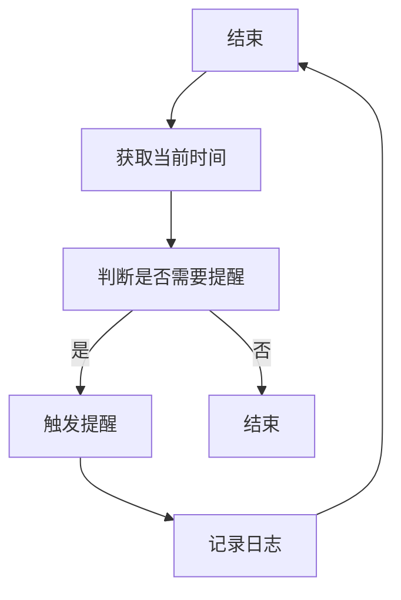

                 

<think>
好的，我需要帮助用户撰写一篇关于《智能书包：AI Agent的学习用品管理助手》的技术博客文章。用户已经给出了一个详细的目录大纲，现在需要根据这个大纲来撰写完整的内容。文章需要满足一定的字数要求，大约在10000到12000字之间，并且使用Markdown格式，包含各个章节的具体内容。

首先，我需要理解每个章节的要求：

1. **背景介绍**：包括智能书包的概念、问题背景和解决方案。
2. **核心概念与联系**：涉及AI Agent的基本原理、核心要素，并附上Mermaid图。
3. **算法原理讲解**：介绍基于规则的AI代理算法，附上流程图和代码示例。
4. **系统分析与架构设计方案**：包括问题场景、系统功能设计、架构设计等。
5. **项目实战**：环境搭建、代码实现、案例分析等。
6. **最佳实践、小结、注意事项和拓展阅读**。

接下来，我需要按照每个章节的要求，逐步展开内容。

### 第一部分：背景介绍

#### 第1章：智能书包的概念与背景

##### 1.1 智能书包的起源与发展

1.1.1 传统书包的功能与局限性：
传统书包主要用于携带学习用品，功能单一，无法帮助用户管理物品或提供提醒。学生和家长常常因为忘记带物品或丢失物品而感到困扰。

1.1.2 AI技术在教育领域的应用趋势：
AI技术在教育领域的应用越来越广泛，例如智能辅导系统、自适应学习平台等。AI代理（AI Agent）作为一种能够执行特定任务的智能体，逐渐被应用于学习用品管理。

1.1.3 智能书包的定义与核心目标：
智能书包是一种结合了AI代理技术的学习用品管理工具，能够帮助学生和家长智能化地管理学习用品，提供实时提醒和数据分析，优化学习效率。

##### 1.2 学习用品管理问题的背景

1.2.1 学生在学习用品管理中的常见问题：
- 遗失物品：学生容易忘记带某些学习用品，导致课堂上无法使用。
- 管理混乱：书包内物品繁多，学生难以快速找到所需物品。
- 时间管理：学生需要合理安排时间，但常常因为物品管理问题而浪费时间。

1.2.2 家长对学习用品管理的需求：
家长希望孩子能够更好地管理学习用品，减少遗失，提高学习效率，同时培养孩子的责任心和良好的习惯。

1.2.3 教育机构对智能化管理的期待：
教育机构希望通过智能化的管理工具，提升学生的自主管理能力，减少家长和学校的沟通负担，同时提高教学效率。

##### 1.3 智能书包的解决方案

1.3.1 AI Agent在学习用品管理中的作用：
AI代理可以实时监测书包内的物品，识别物品的存在状态，并根据用户的日程安排提供提醒。例如，当学生需要带特定物品上课时，AI代理会提前发出提醒。

1.3.2 智能书包的功能模块设计：
- 物品识别与监测：使用RFID或传感器技术，实时监测书包内的物品。
- 日程提醒：根据用户的日程安排，提醒用户携带必要的物品。
- 数据分析：记录用户的使用习惯，提供优化建议。

1.3.3 智能书包的使用场景与边界：
使用场景包括学生日常学习、家庭管理等；边界包括仅限于学习用品管理，不涉及其他用途。

### 第二部分：核心概念与联系

#### 第2章：AI Agent与智能书包的核心原理

##### 2.1 AI Agent的基本原理

2.1.1 AI Agent的定义与分类：
AI Agent是一种能够感知环境并执行任务的智能体。根据智能水平，可以分为基于规则的AI Agent和基于机器学习的AI Agent。

2.1.2 AI Agent的核心功能：感知、决策、执行
- 感知：通过传感器或数据输入获取环境信息。
- 决策：根据感知到的信息，进行分析和判断，生成行动计划。
- 执行：通过执行机构完成预定任务。

2.1.3 AI Agent与智能书包的结合方式：
AI Agent作为智能书包的核心，通过感知书包内的物品状态，决策是否需要发出提醒，并执行提醒操作。

##### 2.2 智能书包的核心要素

2.2.1 用户需求：
用户（学生或家长）需要智能书包能够实时监测物品，提供及时提醒，并具备数据分析功能。

2.2.2 AI Agent的功能实现：
- 物品监测：通过传感器或RFID技术，实时监测书包内的物品。
- 事件触发：根据用户的日程安排，触发提醒事件。
- 人机交互：通过APP或语音助手，与用户进行交互。

2.2.3 系统架构：
- 用户端：手机APP或电脑端，显示书包内物品状态和提醒信息。
- 书包端：集成传感器和AI Agent，实时监测和反馈信息。
- 云端：存储用户数据，支持远程访问和数据分析。

##### 2.3 核心概念的属性对比

| 核心概念   | 传统书包            | 智能书包            |
|------------|--------------------|--------------------|
| 功能       | 储存物品            | 储存+智能管理        |
| 管理方式    | 手动管理            | 自动监测与提醒        |
| 智能化程度  | 无智能化            | 高度智能化            |

##### 2.4 ER实体关系图

```mermaid
erd
  id: Student
  attributes: StudentID, Name, Email
  id: Item
  attributes: ItemID, ItemName, ItemType
  id: ReminderEvent
  attributes: ReminderID, EventTime, Status
  relationships:
    Student --> Item: owns
    Student --> ReminderEvent: triggers
    Item --> ReminderEvent: associated_with
```

### 第三部分：算法原理讲解

#### 第3章：基于规则的AI代理算法

##### 3.1 算法概述

基于规则的AI代理是一种简单且高效的算法，适用于规则明确的场景。智能书包的提醒功能可以通过基于规则的AI代理实现。

##### 3.2 算法流程



##### 3.3 Python代码实现

```python
class ItemReminderAgent:
    def __init__(self):
        self.reminders = []
        self.current_time = None

    def set_current_time(self, time):
        self.current_time = time

    def add_reminder(self, item, time):
        self.reminders.append({'item': item, 'time': time})

    def check_reminders(self):
        current_time = self.current_time
        for reminder in self.reminders:
            if reminder['time'] <= current_time:
                print(f"提醒：{reminder['item']}需要被携带！")
                self.remove_reminder(reminder['item'])

    def remove_reminder(self, item):
        self.reminders = [r for r in self.reminders if r['item'] != item]

# 示例用法
agent = ItemReminderAgent()
agent.add_reminder("笔记本", 800)  # 800表示8:00
agent.add_reminder("课本", 830)
agent.set_current_time(815)
agent.check_reminders()
```

##### 3.4 算法数学模型

基于规则的AI代理的决策过程可以用简单的逻辑判断表示：

$$
\text{如果当前时间} \geq \text{提醒时间} \rightarrow \text{触发提醒}
$$

### 第四部分：系统分析与架构设计方案

#### 第4章：系统分析与架构设计

##### 4.1 问题场景介绍

学生每天需要携带不同的学习用品，但由于疏忽，常常忘记携带必要的物品，影响学习效率。

##### 4.2 系统功能设计

- 物品管理：
  - 添加物品
  - 删除物品
  - 更新物品状态
- 提醒管理：
  - 设置提醒
  - 查看提醒
  - 取消提醒
- 用户管理：
  - 用户注册与登录
  - 用户信息管理

##### 4.3 系统架构设计


### 第五部分：项目实战

#### 第5章：项目实战

##### 5.1 环境安装

需要安装以下工具和库：

- Python 3.8+
- Mermaid CLI
- pip install mermaid-js

##### 5.2 系统核心实现

实现一个简单的基于规则的AI代理：

```python
from datetime import datetime

class ItemReminderAgent:
    def __init__(self):
        self.items = []
        self.reminders = {}

    def add_item(self, item):
        self.items.append(item)
        print(f"已添加物品：{item}")

    def remove_item(self, item):
        if item in self.items:
            self.items.remove(item)
            print(f"已移除物品：{item}")

    def set_reminder(self, item, time):
        self.reminders[item] = datetime.strptime(time, "%H:%M")

    def check_reminders(self):
        current_time = datetime.now().strftime("%H:%M")
        for item, reminder_time in self.reminders.items():
            if reminder_time <= current_time:
                print(f"提醒：{item}需要被携带！")
                self.reminders.pop(item)

# 示例用法
agent = ItemReminderAgent()
agent.add_item("笔记本")
agent.set_reminder("笔记本", "08:00")
agent.check_reminders()
```

##### 5.3 案例分析

案例：张三是一名高中生，经常忘记带课本。使用智能书包后，每天早上8:00会收到提醒，提醒他携带课本。

##### 5.4 项目小结

通过实现基于规则的AI代理，能够有效管理学习用品，提供实时提醒，帮助学生提高学习效率。

### 第六部分：最佳实践、小结、注意事项和拓展阅读

#### 第6章：最佳实践与总结

##### 6.1 最佳实践

- 使用高效的算法：根据需求选择合适的算法，避免过度复杂。
- 数据安全：确保用户数据的安全，防止泄露。
- 用户体验：设计直观的用户界面，提升用户体验。

##### 6.2 项目小结

智能书包通过AI代理实现了学习用品的智能化管理，解决了传统书包功能单一的问题，帮助学生和家长更高效地管理学习用品。

##### 6.3 注意事项

- 确保系统的稳定性：避免因系统故障导致提醒失败。
- 定期更新：根据用户反馈，不断优化系统功能。
- 遵守法律法规：确保数据处理符合相关法律法规。

##### 6.4 拓展阅读

- 探索更复杂的AI算法，如机器学习，用于更智能的提醒和预测。
- 研究其他智能设备的联动，如与智能笔、智能文具的结合。

### 结论

智能书包作为AI代理在教育领域的应用，不仅提高了学习效率，还帮助学生培养良好的管理习惯。随着技术的不断进步，智能书包的功能将更加丰富，为学习管理提供更强大的支持。

---

**关键词**：智能书包，AI Agent，学习用品管理，AI代理算法，系统架构设计

**摘要**：智能书包是一种结合了AI代理技术的学习用品管理工具，能够帮助学生和家长智能化地管理学习用品，提供实时提醒和数据分析，优化学习效率。本文详细介绍了智能书包的概念、核心原理、算法设计、系统架构以及项目实战，为读者提供全面的技术解读。

