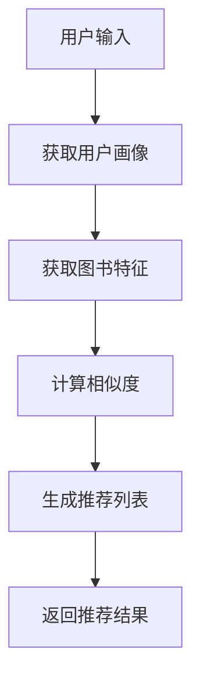
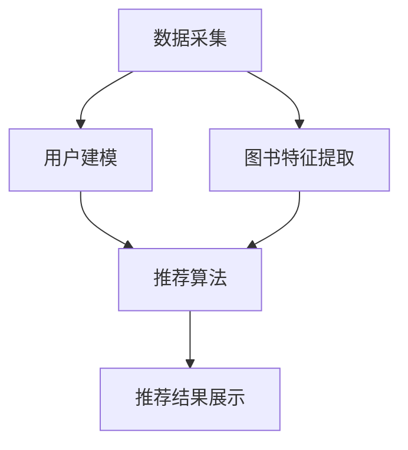
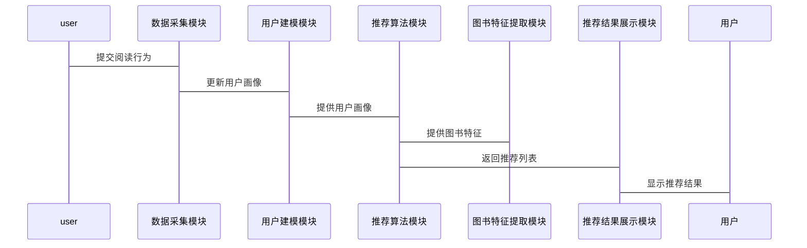

                 


# 智能书架：AI Agent的图书推荐系统

**关键词：** 智能书架、AI Agent、图书推荐系统、协同过滤、推荐算法、系统架构

**摘要：**  
智能书架是一种结合了人工智能代理的图书推荐系统，旨在通过智能化的推荐算法，为用户提供精准的图书推荐服务。本文从背景、原理、系统架构到项目实现，全面解析智能书架的核心技术与实现细节，探讨其在实际应用中的优势与挑战。

---

## 第1章 背景与问题背景

### 1.1 智能书架的概念与目标

#### 1.1.1 智能书架的定义  
智能书架是一种基于人工智能技术的图书推荐系统，通过分析用户的阅读偏好和行为数据，结合图书的特征信息，为用户提供个性化、精准的图书推荐服务。

#### 1.1.2 智能书架的核心目标  
- 提供个性化推荐：根据用户的阅读历史、偏好和行为数据，推荐符合用户兴趣的图书。  
- 提高推荐效率：通过AI代理快速分析海量数据，缩短推荐响应时间。  
- 增强用户体验：通过精准推荐减少用户选择成本，提升用户满意度。

#### 1.1.3 智能书架的应用场景  
- 在线图书平台：如当当网、京东阅读等。  
- 图书馆管理系统：帮助用户快速找到感兴趣书籍。  
- 移动阅读应用：为用户提供个性化阅读建议。

### 1.2 AI Agent在图书推荐中的作用

#### 1.2.1 AI Agent的基本概念  
AI Agent（人工智能代理）是一种智能软件实体，能够感知环境、自主决策并执行任务。在图书推荐系统中，AI Agent负责数据采集、分析和推荐生成。

#### 1.2.2 AI Agent在图书推荐中的优势  
- 数据处理能力：AI Agent能够快速分析大量用户数据和图书信息。  
- 自适应能力：AI Agent可以根据用户反馈动态调整推荐策略。  
- 多任务处理：AI Agent可以同时处理多个用户的推荐请求。

#### 1.2.3 图书推荐系统的发展历程  
从基于规则的传统推荐系统，到协同过滤、基于内容的推荐，再到深度学习驱动的推荐算法，AI Agent的引入进一步提升了推荐系统的智能化水平。

### 1.3 问题背景与问题描述

#### 1.3.1 当前图书推荐系统的痛点  
- 数据稀疏性：用户数据不足导致推荐精度下降。  
- 单一化推荐：传统推荐系统难以兼顾多样性和个性化。  
- 计算效率：处理海量数据时，推荐系统性能下降。

#### 1.3.2 智能书架的目标与边界  
- 目标：构建一个高效、智能的图书推荐系统。  
- 边界：聚焦于图书推荐，不涉及图书借阅、购买等其他功能。

#### 1.3.3 智能书架的核心要素与组成  
- 用户画像：用户的阅读历史、偏好、行为数据。  
- 图书特征：图书的主题、作者、出版时间、评分等。  
- 推荐算法：协同过滤、基于内容的推荐、混合推荐。

---

## 第2章 核心概念与联系

### 2.1 核心概念原理

#### 2.1.1 用户画像的构建  
用户画像是通过收集用户的行为数据（如点击、收藏、购买）和阅读数据（如阅读时长、阅读深度）构建的用户兴趣模型。  
- 行为数据：用户的点击、收藏、购买记录。  
- 阅读数据：用户的阅读时长、阅读深度、阅读偏好。

#### 2.1.2 图书特征的提取  
图书特征是通过文本挖掘、主题分析等技术提取的图书属性。  
- 文本特征：图书标题、摘要、关键词的文本特征。  
- 其他特征：图书类别、作者声誉、出版时间。

#### 2.1.3 推荐算法的原理  
推荐算法的核心是根据用户画像和图书特征，计算用户与图书的相似度，生成推荐结果。  

### 2.2 核心概念对比表

| 概念       | 属性             | 描述                                                                 |
|------------|------------------|----------------------------------------------------------------------|
| 用户画像   | 行为数据         | 用户的点击、收藏、购买记录                                         |
|            | 阅读数据         | 用户的阅读时长、深度、偏好                                         |
| 图书特征   | 文本特征         | 图书标题、摘要、关键词                                             |
|            | 其他特征         | 图书类别、作者声誉、出版时间                                       |

### 2.3 ER实体关系图

```mermaid
erd
  user
  book
  recommendation
  user userId, username, preferences
  book ISBN, title, author, publish_time, score
  recommendation userId, ISBN, recommendation_score, recommendation_time
  user --|> recommendation
  book --|> recommendation
```

---

## 第3章 算法原理与数学模型

### 3.1 推荐算法原理

#### 3.1.1 协同过滤算法  
协同过滤是一种基于用户相似性计算的推荐算法。  
- 用户-用户协同过滤：根据用户之间的相似性推荐图书。  
- 物品-物品协同过滤：根据图书之间的相似性推荐用户可能感兴趣的图书。

#### 3.1.2 基于内容的推荐  
基于内容的推荐算法通过分析图书的特征，计算用户与图书的匹配程度。  
- 文本特征提取：使用TF-IDF或Word2Vec提取图书的文本特征。  
- 相似度计算：使用余弦相似度计算用户与图书的匹配程度。

#### 3.1.3 混合推荐算法  
混合推荐算法结合协同过滤和基于内容的推荐，通过加权融合两种方法的结果，提升推荐精度。

### 3.2 算法流程图



### 3.3 数学模型与公式

#### 协同过滤算法  
$$ \text{相似度} = \frac{\sum_{i=1}^{n}(u_i - \bar{u})(v_i - \bar{v})}{\sqrt{\sum_{i=1}^{n}(u_i - \bar{u})^2} \cdot \sqrt{\sum_{i=1}^{n}(v_i - \bar{v})^2}} $$

#### 基于内容的推荐  
$$ \text{相似度} = \frac{\sum_{i=1}^{n} w_i \cdot (t_i \cdot t_j)}{\sum_{i=1}^{n} w_i} $$  
其中，$w_i$ 是特征 $i$ 的权重，$t_i$ 和 $t_j$ 是图书 $i$ 和图书 $j$ 的特征向量。

---

## 第4章 系统分析与架构设计

### 4.1 问题场景分析

#### 4.1.1 用户需求分析  
- 用户希望快速找到感兴趣图书。  
- 用户希望推荐结果具有多样性。  
- 用户希望推荐结果具有可解释性。

#### 4.1.2 系统功能需求  
- 用户画像构建：收集用户行为数据。  
- 图书特征提取：分析图书文本和属性。  
- 推荐算法实现：协同过滤、基于内容的推荐。  
- 推荐结果展示：生成推荐列表并展示。

#### 4.1.3 系统性能需求  
- 响应时间：推荐结果的生成时间需在秒级以内。  
- 处理能力：支持海量用户和图书数据的处理。  
- 可扩展性：支持用户和图书数据的动态增长。

### 4.2 系统架构设计

#### 4.2.1 系统模块划分  
- 数据采集模块：收集用户行为数据和图书数据。  
- 用户建模模块：构建用户画像。  
- 图书特征提取模块：提取图书文本和属性特征。  
- 推荐算法模块：实现协同过滤和基于内容的推荐。  
- 推荐结果展示模块：生成并展示推荐列表。

#### 4.2.2 系统架构图



#### 4.2.3 系统接口设计  
- 数据接口：与数据库或API接口对接，获取用户和图书数据。  
- 推荐接口：暴露RESTful API，供前端调用推荐结果。  
- 展示接口：将推荐结果展示给用户。

### 4.3 系统交互流程图



---

## 第5章 项目实战

### 5.1 环境搭建与数据准备

#### 5.1.1 开发环境安装  
- 安装Python、Jupyter Notebook、pip。  
- 安装依赖库：`pandas`、`numpy`、`scikit-learn`、`gensim`。

#### 5.1.2 数据集获取与预处理  
- 数据来源：公开数据集（如Kaggle的图书推荐数据集）。  
- 数据清洗：处理缺失值、异常值。  
- 数据格式化：将用户行为数据和图书数据结构化。

### 5.2 系统核心实现

#### 5.2.1 推荐算法的Python代码实现

```python
import pandas as pd
from sklearn.metrics.pairwise import cosine_similarity

# 用户-图书评分矩阵
users = ['u1', 'u2', 'u3']
books = ['b1', 'b2', 'b3']
scores = {
    'u1': {'b1': 5, 'b2': 4, 'b3': 3},
    'u2': {'b1': 3, 'b2': 5, 'b3': 4},
    'u3': {'b1': 4, 'b2': 3, 'b3': 5}
}

# 转换为评分矩阵
rating_matrix = pd.DataFrame(scores).T

# 协同过滤算法实现
def collaborative_filtering(user, ratings, k=2):
    # 计算相似度
    similarity = cosine_similarity(ratings)
    # 获取目标用户的相似用户
    similar_users = similarity[user].argsort()[::-1][:k]
    # 计算推荐分数
   推荐分数 = ratings.loc[similar_users].sum(axis=0) / k
    return 推荐分数

# 生成推荐结果
recommendations = collaborative_filtering('u1', rating_matrix)
print(recommendations)
```

#### 5.2.2 系统功能模块的代码实现  
- 用户建模模块：`user_model.py`  
- 图书特征提取模块：`book_feature.py`  
- 推荐算法模块：`recommendation.py`  

### 5.3 代码解读与分析

#### 5.3.1 代码结构分析  
- `user_model.py`：处理用户数据，构建用户画像。  
- `book_feature.py`：提取图书特征，生成文本向量。  
- `recommendation.py`：实现推荐算法，生成推荐结果。  

#### 5.3.2 核心算法的实现细节  
- 协同过滤算法：计算用户相似度，生成推荐列表。  
- 基于内容的推荐：提取图书特征，计算相似度。  

### 5.4 实际案例分析

#### 5.4.1 案例背景介绍  
假设我们有一个包含1000用户的图书推荐系统，用户的行为数据包括点击、收藏和评分。

#### 5.4.2 案例详细分析  
通过协同过滤算法，为用户u1推荐图书。  
- 用户u1的评分：b1=5，b2=4，b3=3。  
- 相似度计算：用户u1与u2相似度最高，u3次之。  
- 推荐结果：基于u2和u3的评分，推荐图书b4和b5。

#### 5.4.3 案例结果展示  
推荐列表：b4（评分4.5）、b5（评分4.2）。  

---

## 第6章 最佳实践与总结

### 6.1 最佳实践Tips

#### 6.1.1 系统优化建议  
- 使用分布式计算优化推荐性能。  
- 引入实时数据流处理提升推荐实时性。  

#### 6.1.2 开发注意事项  
- 数据隐私保护：确保用户数据的安全性。  
- 算法可解释性：提供推荐理由，增强用户体验。  

#### 6.1.3 部署与维护建议  
- 使用容器化技术（如Docker）部署系统。  
- 定期更新模型，保持推荐精度。  

### 6.2 项目小结

#### 6.2.1 项目目标回顾  
构建一个高效、智能的图书推荐系统，为用户提供精准的推荐服务。

#### 6.2.2 项目成果总结  
通过AI Agent和推荐算法的结合，实现了智能化的图书推荐系统，显著提升了推荐精度和用户体验。

#### 6.2.3 项目经验分享  
- 理论与实践结合：推荐算法的实现需要结合实际场景进行优化。  
- 数据的重要性：高质量的数据是推荐系统的核心。  
- 系统架构设计：模块化设计有助于系统的扩展和维护。

### 6.3 未来展望

#### 6.3.1 技术发展趋势  
- 深度学习在推荐系统中的应用越来越广泛。  
- 联合推荐：结合协同过滤和深度学习的混合推荐算法。  

#### 6.3.2 应用场景扩展  
- 多模态推荐：结合图像、视频等多种数据形式进行推荐。  
- 动态推荐：根据用户的实时行为动态调整推荐结果。  

#### 6.3.3 挑战与机遇  
- 挑战：数据隐私、计算效率、模型解释性。  
- 机遇：AI技术的进步为推荐系统提供了更多可能性。

---

## 附录: 拓展阅读与参考资料

- 《推荐系统实践》  
- 《深度学习推荐系统》  
- 《人工智能：现代方法》  
- 《自然语言处理实战》  

---

以上是《智能书架：AI Agent的图书推荐系统》的技术博客文章的完整内容，涵盖了从背景介绍到系统实现的完整流程，结合了理论与实践，适合对推荐系统和人工智能技术感兴趣的读者阅读。

