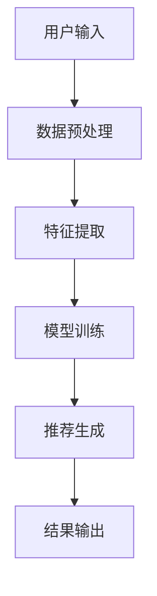
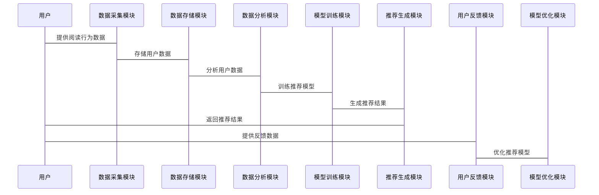

                 


# 智能书架：AI Agent的阅读习惯分析

## 关键词：智能书架、AI Agent、阅读习惯、推荐系统、机器学习、自然语言处理

## 摘要：本文详细探讨了基于AI Agent的智能书架在阅读习惯分析中的应用，从问题背景、核心算法到系统架构，再到项目实战，全面剖析了智能书架的设计与实现过程。文章通过详细的算法原理、系统架构设计和实际案例分析，为读者提供了一套完整的智能书架解决方案，并总结了相关的最佳实践和未来发展方向。

---

## # 第一部分：智能书架与AI Agent概述

### ## 第1章：智能书架与AI Agent的背景介绍

#### ### 1.1 问题背景与问题描述
- **问题背景**：传统阅读习惯分析方法存在数据碎片化、个性化不足、推荐精度低等问题。随着AI技术的发展，基于AI Agent的智能书架可以通过实时数据分析和个性化推荐，解决这些问题。
- **问题描述**：用户在阅读过程中产生的数据（如阅读时间、阅读速度、停顿次数等）可以被AI Agent实时捕获并分析，从而实现个性化阅读习惯的识别和优化。
- **解决思路**：通过AI Agent收集和分析用户的阅读数据，构建用户画像，进而实现精准的阅读习惯分析和个性化推荐。

#### ### 1.2 问题解决思路与边界定义
- **问题解决思路**：
  1. 数据采集：通过传感器或阅读软件采集用户的阅读行为数据。
  2. 数据分析：利用机器学习算法对数据进行建模和分析，识别用户的阅读习惯。
  3. 个性化推荐：基于分析结果，为用户提供个性化的阅读建议。
- **边界与外延**：智能书架的核心功能是阅读习惯分析，边界包括数据采集、分析和推荐，外延则扩展到阅读习惯优化、阅读效率提升等领域。

#### ### 1.3 核心概念与联系
- **核心概念**：
  - **AI Agent**：智能体，能够感知环境、执行任务并做出决策。
  - **阅读习惯**：用户在阅读过程中表现出的稳定行为模式。
  - **推荐系统**：基于用户行为数据，推荐相关内容的技术。
- **概念对比分析表**：

| 对比维度 | 传统推荐系统 | 基于AI Agent的推荐系统 |
|----------|--------------|-----------------------|
| 数据来源 | 离线数据     | 实时行为数据         |
| 推荐依据 | 用户偏好     | 用户行为与环境特征   |
| 精度     | 较低         | 较高                 |
| 适用场景 | 静态数据     | 动态场景             |

- **ER实体关系图**：

```mermaid
erd
    user: 用户
    reading_behavior: 阅读行为
    book: 书籍
    recommendation: 推荐结果
    user --|{N:1}> reading_behavior: 用户有多个阅读行为
    reading_behavior --|{N:1}> book: 每个阅读行为对应一本书
    user --|{N:1}> recommendation: 用户有多个推荐结果
```

---

## # 第二部分：AI Agent的阅读习惯分析原理

### ## 第2章：阅读习惯分析的核心算法原理

#### ### 2.1 算法原理概述
- **协同过滤**：基于用户行为的相似性进行推荐，分为基于用户的协同过滤和基于物品的协同过滤。
- **基于内容的推荐**：通过分析书籍内容（如主题、关键词）进行推荐。
- **混合推荐**：结合协同过滤和内容推荐的优点，提高推荐精度。

#### ### 2.2 算法流程图（Mermaid）


#### ### 2.3 数学模型与公式
- **协同过滤算法的数学模型**：
  $$ sim(i,j) = \frac{\sum_{k} r_{ik} r_{jk}}{\sqrt{\sum_{k} r_{ik}^2} \sqrt{\sum_{k} r_{jk}^2}} $$
  其中，$sim(i,j)$ 表示用户 $i$ 和用户 $j$ 的相似度，$r_{ik}$ 和 $r_{jk}$ 分别表示用户 $i$ 和 $j$ 对物品 $k$ 的评分。
- **基于内容的推荐算法**：
  $$ score(i,j) = \sum_{k} w_k \cdot f_k(i,j) $$
  其中，$score(i,j)$ 表示物品 $j$ 对用户 $i$ 的推荐评分，$w_k$ 是特征 $k$ 的权重，$f_k(i,j)$ 是特征 $k$ 的计算值。

---

## # 第三部分：系统分析与架构设计

### ## 第3章：智能书架系统分析

#### ### 3.1 问题场景介绍
- 数据采集场景：用户阅读行为数据的采集，包括时间、位置、阅读速度等。
- 系统功能设计：
  1. 数据采集模块：负责采集用户的阅读行为数据。
  2. 数据分析模块：对采集的数据进行预处理和特征提取。
  3. 推荐生成模块：基于算法模型生成个性化推荐结果。
  4. 用户反馈模块：收集用户的反馈数据，优化推荐模型。

#### ### 3.2 系统架构设计


#### ### 3.3 系统接口设计
- **数据采集接口**：定义用户行为数据的采集格式和接口。
- **推荐接口**：定义推荐结果的返回格式和调用方式。
- **用户反馈接口**：定义用户反馈数据的采集方式。

#### ### 3.4 系统交互流程图（Mermaid）


---

## # 第四部分：项目实战

### ## 第4章：智能书架项目实战

#### ### 4.1 环境安装与配置
- **Python环境**：安装Python 3.8+
- **依赖库安装**：
  ```bash
  pip install numpy pandas scikit-learn jieba
  ```

#### ### 4.2 系统核心实现

##### 核心代码示例
```python
import numpy as np
from sklearn.metrics.pairwise import cosine_similarity

# 示例数据：用户-书籍评分矩阵
ratings = np.array([
    [4, 3, 0, 0],
    [3, 4, 2, 0],
    [0, 2, 4, 5],
    [0, 0, 3, 4],
])

# 计算相似度矩阵
similarity = cosine_similarity(ratings)

# 找出与用户1（索引0）相似度最高的用户
def find_similar_users(similarity_matrix, user_id, top_n=3):
    similar_users = []
    for i in range(len(similarity_matrix[user_id])):
        if i != user_id:
            similar_users.append((i, similarity_matrix[user_id][i]))
    similar_users.sort(key=lambda x: x[1], reverse=True)
    return similar_users[:top_n]

# 示例结果
similar_users = find_similar_users(similarity, 0)
print(similar_users)
```

#### ### 4.3 实际案例分析
- **案例背景**：某用户经常阅读科技类书籍，但偶尔也会阅读文学类书籍。
- **分析过程**：
  1. 通过协同过滤算法，找到与该用户相似的其他用户。
  2. 基于相似用户的阅读行为，推荐科技类书籍。
  3. 如果用户表现出对文学类书籍的兴趣，进一步推荐相关书籍。

#### ### 4.4 项目小结
- 通过实际案例分析，验证了基于AI Agent的推荐算法的有效性。
- 强调了数据质量和模型优化对推荐精度的重要影响。

---

## # 第五部分：最佳实践与总结

### ## 第5章：最佳实践与总结

#### ### 5.1 小结
- 智能书架通过AI Agent实现了阅读习惯的实时分析和个性化推荐，显著提升了用户体验。
- 本文详细介绍了算法原理、系统架构和项目实现，为后续研究提供了参考。

#### ### 5.2 注意事项
- 数据隐私保护：确保用户数据的安全性和隐私性。
- 模型优化：定期更新模型，保持推荐的准确性。
- 多模态数据融合：结合文本、图像等多种数据源，提升推荐效果。

#### ### 5.3 拓展阅读
- 推荐系统领域的经典书籍：《推荐系统实战：方法、案例与Python实现》。
- 相关技术博客：[推荐系统技术博客链接]。

---

## 结语
通过本文的详细讲解，读者可以深入了解基于AI Agent的智能书架的设计与实现过程，并能够根据实际需求进行扩展和优化。未来，随着AI技术的不断发展，智能书架将更加智能化和个性化，为用户提供更优质的阅读体验。

