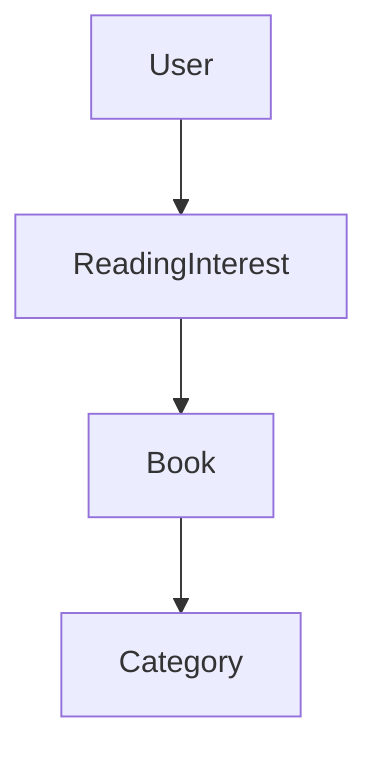
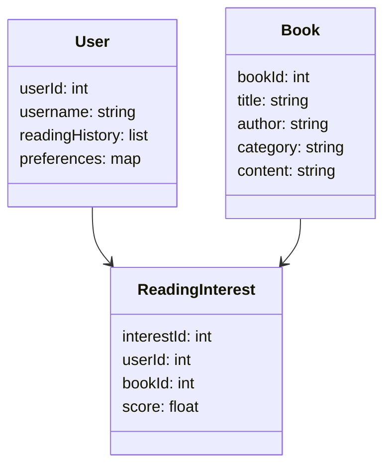

                 


# 智能书架：AI Agent的阅读兴趣拓展系统

## 关键词：智能书架、AI Agent、阅读推荐、推荐算法、知识图谱、用户画像

## 摘要：  
本文介绍了一种基于AI Agent的智能书架系统，该系统能够根据用户的阅读历史、兴趣偏好和行为数据，实时拓展用户的阅读兴趣。通过分析用户的阅读行为，构建用户画像，结合知识图谱技术，实现精准的个性化推荐。本文详细探讨了系统的背景、核心概念、推荐算法、系统架构，并通过项目实战展示了如何实现智能书架。最后，总结了系统的优势和未来的发展方向。

---

## 第一部分：智能书架的背景与核心概念

### 第1章：智能书架的背景与问题背景

#### 1.1 问题背景
##### 1.1.1 阅读兴趣拓展的痛点
随着信息爆炸的时代到来，用户每天面临海量的信息和内容，如何从大量书籍中筛选出符合自己兴趣的读物成为一个难题。传统的阅读推荐系统往往基于简单的标签匹配或协同过滤，难以满足用户多样化的阅读需求。

##### 1.1.2 AI Agent在阅读推荐中的作用
AI Agent（智能体）可以通过分析用户的阅读历史、行为数据和偏好，实时生成个性化的阅读推荐，帮助用户发现新的阅读兴趣领域。AI Agent能够动态调整推荐策略，提供更精准的推荐结果。

##### 1.1.3 当前阅读推荐系统的局限性
现有的阅读推荐系统通常基于协同过滤或基于内容的推荐算法，存在以下问题：
- 数据稀疏性问题：用户数量和书籍数量庞大，导致推荐系统的冷启动问题。
- 单一性：推荐系统通常仅基于书籍的标签或用户的行为数据，缺乏对书籍内容的深度分析。
- 鲸鱼效应：热门书籍往往占据推荐列表的大部分位置，忽视长尾书籍的推荐。

#### 1.2 问题描述
##### 1.2.1 阅读兴趣拓展的需求分析
用户在阅读过程中，可能会产生新的阅读兴趣，但缺乏工具帮助其发现和拓展这些兴趣。例如，用户阅读了一本小说后，可能对同一作者的其他作品感兴趣，或者对小说中的某个主题产生兴趣。

##### 1.2.2 用户阅读行为的多样性
用户的阅读行为受到多种因素的影响，包括阅读时间、地点、心情等。这些行为数据可以用来分析用户的阅读偏好，进一步优化推荐算法。

##### 1.2.3 现有推荐系统的不足
现有的推荐系统在面对用户阅读兴趣的动态变化时，往往无法及时调整推荐策略，导致推荐结果与用户实际需求存在偏差。

#### 1.3 问题解决
##### 1.3.1 AI Agent的核心优势
AI Agent能够实时分析用户的阅读行为和偏好，结合知识图谱技术，动态调整推荐策略，提供更精准的推荐结果。

##### 1.3.2 智能书架的解决方案
智能书架通过AI Agent和知识图谱技术，构建用户画像，分析用户的阅读行为，推荐符合用户兴趣的书籍。

##### 1.3.3 阅读兴趣拓展的实现路径
- 数据收集：收集用户的阅读历史、行为数据和偏好信息。
- 数据分析：通过数据分析技术，构建用户画像和知识图谱。
- 推荐生成：基于分析结果，生成个性化的阅读推荐。

#### 1.4 边界与外延
##### 1.4.1 智能书架的功能边界
智能书架的核心功能包括阅读推荐、阅读记录管理、用户画像构建和知识图谱分析。

##### 1.4.2 系统的外延与扩展性
智能书架可以通过与其他系统的集成，扩展其功能，例如与电子书平台、图书馆系统等进行对接。

##### 1.4.3 与其他推荐系统的区别
智能书架的核心区别在于其动态性和个性化推荐能力，能够根据用户的实时行为和偏好调整推荐策略。

#### 1.5 概念结构与核心要素
##### 1.5.1 智能书架的核心要素
- 用户画像：基于用户阅读历史、行为数据构建的用户模型。
- 知识图谱：用于表示书籍、作者、主题等信息的语义网络。
- AI Agent：用于实时分析用户行为和数据，生成推荐结果。

##### 1.5.2 系统的组成模块
- 数据采集模块：负责收集用户的阅读数据。
- 数据分析模块：构建用户画像和知识图谱。
- 推荐生成模块：基于分析结果生成推荐列表。
- 用户交互模块：提供用户与系统交互的界面。

##### 1.5.3 各模块之间的关系
- 数据采集模块向数据分析模块提供数据。
- 数据分析模块构建用户画像和知识图谱，供推荐生成模块使用。
- 推荐生成模块将推荐结果通过用户交互模块反馈给用户。

### 第2章：AI Agent与阅读推荐的核心概念

#### 2.1 AI Agent的基本原理
##### 2.1.1 AI Agent的定义与特点
AI Agent是一种能够感知环境、自主决策并执行任务的智能实体。其特点包括自主性、反应性、社会性和学习能力。

##### 2.1.2 AI Agent的核心算法
AI Agent的核心算法包括：
- 机器学习算法：用于模式识别和分类。
- 自然语言处理算法：用于文本理解和生成。
- 知识图谱构建算法：用于构建语义网络。

##### 2.1.3 AI Agent的应用场景
AI Agent在阅读推荐中的应用场景包括：
- 实时推荐：根据用户的阅读行为实时生成推荐结果。
- 动态调整：根据用户的反馈动态调整推荐策略。

#### 2.2 阅读推荐系统的原理
##### 2.2.1 阅读推荐的基本原理
阅读推荐系统通过分析用户的阅读数据，构建用户模型和内容模型，生成推荐列表。

##### 2.2.2 基于用户的推荐
基于用户的推荐算法通过分析用户的行为数据，找到与目标用户相似的用户群体，推荐这些用户喜欢的内容。

##### 2.2.3 基于内容的推荐
基于内容的推荐算法通过分析内容的特征，找到与目标用户兴趣相似的内容进行推荐。

#### 2.3 智能书架的核心概念
##### 2.3.1 智能书架的定义
智能书架是一种基于AI Agent的阅读推荐系统，能够根据用户的阅读行为和偏好，动态调整推荐策略，拓展用户的阅读兴趣。

##### 2.3.2 AI Agent在智能书架中的作用
AI Agent负责实时分析用户的阅读行为，构建用户画像和知识图谱，生成个性化的推荐结果。

##### 2.3.3 智能书架的推荐机制
智能书架的推荐机制结合了基于用户和基于内容的推荐算法，同时利用知识图谱技术，提供更精准的推荐结果。

### 第3章：智能书架的核心概念与联系

#### 3.1 核心概念的原理
##### 3.1.1 AI Agent的推荐算法
AI Agent的推荐算法结合了机器学习和自然语言处理技术，能够实时分析用户的阅读行为和偏好，生成推荐结果。

##### 3.1.2 阅读兴趣的拓展模型
阅读兴趣的拓展模型通过分析用户的行为数据和内容特征，构建用户画像和知识图谱，拓展用户的阅读兴趣。

##### 3.1.3 智能书架的系统架构
智能书架的系统架构包括数据采集模块、数据分析模块、推荐生成模块和用户交互模块。

#### 3.2 核心概念的属性特征对比
##### 3.2.1 不同推荐算法的对比
以下是一个对比表格：

| 推荐算法 | 基于用户的协同过滤 | 基于内容的内容过滤 | 混合推荐 |
|----------|---------------------|---------------------|----------|
| 原理     | 分析用户相似性       | 分析内容相似性       | 结合两者 |
| 优势     | 推荐结果更贴近用户兴趣 | 推荐结果更准确       | 综合优势 |
| 劣势     | 数据稀疏性问题       | 冷启动问题           | 复杂性高 |

#### 3.3 ER实体关系图
以下是智能书架系统的ER实体关系图：



---

## 第二部分：智能书架的算法原理

### 第4章：智能书架的算法原理

#### 4.1 协同过滤算法
##### 4.1.1 协同过滤的原理
协同过滤算法通过分析用户的行为数据，找到与目标用户相似的用户群体，推荐这些用户喜欢的内容。

##### 4.1.2 基于用户的协同过滤
基于用户的协同过滤算法通过计算用户之间的相似度，推荐相似用户喜欢的内容。

##### 4.1.3 基于物品的协同过滤
基于物品的协同过滤算法通过计算物品之间的相似度，推荐目标用户可能感兴趣的内容。

#### 4.2 内容过滤算法
##### 4.2.1 内容过滤的原理
内容过滤算法通过分析内容的特征，找到与目标用户兴趣相似的内容进行推荐。

##### 4.2.2 基于文本挖掘的内容过滤
基于文本挖掘的内容过滤算法通过分析书籍的文本内容，提取关键词和主题，生成推荐结果。

##### 4.2.3 基于知识图谱的内容过滤
基于知识图谱的内容过滤算法通过构建书籍的知识图谱，分析书籍之间的语义关系，生成推荐结果。

#### 4.3 混合推荐算法
##### 4.3.1 混合推荐的原理
混合推荐算法结合了基于用户和基于内容的推荐算法，通过融合两种算法的结果，生成更精准的推荐结果。

##### 4.3.2 混合推荐的实现步骤
- 收集用户数据和内容数据。
- 使用基于用户的协同过滤算法生成推荐列表。
- 使用基于内容的内容过滤算法生成推荐列表。
- 结合两个推荐列表，生成最终的混合推荐结果。

#### 4.4 算法的实现与优化
##### 4.4.1 算法的实现步骤
- 数据预处理：清洗和归一化数据。
- 模型训练：训练协同过滤模型和内容过滤模型。
- 模型融合：结合两种模型的结果，生成最终的推荐结果。

##### 4.4.2 算法的优化方法
- 参数优化：通过交叉验证优化模型参数。
- 特征选择：选择重要的特征，提高模型的推荐精度。
- 模型融合：通过加权融合的方式，优化混合推荐的效果。

##### 4.4.3 算法的数学模型
协同过滤算法的数学模型可以表示为：

$$
\hat{r}_{u,i} = \bar{r}_u + \sum_{k=1}^{K} b_{u,k}w_{i,k}
$$

其中，$\hat{r}_{u,i}$表示用户u对物品i的预测评分，$\bar{r}_u$表示用户u的平均评分，$b_{u,k}$表示用户u在类别k上的偏置，$w_{i,k}$表示物品i在类别k上的权重。

---

## 第三部分：智能书架的系统分析与架构设计

### 第5章：智能书架的系统分析与架构设计

#### 5.1 系统功能设计
##### 5.1.1 领域模型
以下是智能书架的领域模型：



#### 5.2 系统架构设计
##### 5.2.1 系统架构
以下是智能书架的系统架构图：


##### 5.2.2 系统交互
用户通过用户界面与智能书架交互，系统根据用户的阅读行为生成推荐结果。

##### 5.2.3 接口设计
系统提供以下接口：
- 获取用户阅读历史：`getUserReadingHistory(userId)`
- 获取推荐书籍：`getRecommendedBooks(userId, limit)`
- 更新用户偏好：`updateUserPreferences(userId, preferences)`

#### 5.3 系统实现
##### 5.3.1 系统实现步骤
- 数据库设计：设计用户表、书籍表和阅读兴趣表。
- 后端开发：实现用户认证、数据处理和推荐算法。
- 前端开发：开发用户界面，展示推荐结果。

##### 5.3.2 系统实现的代码示例
以下是一个简单的协同过滤算法的Python代码示例：

```python
def collaborative_filtering(user_id, user_item_matrix, similarity_matrix):
    # 获取目标用户的相似用户
    similar_users = similarity_matrix[user_id]
    # 获取目标用户的评分数据
    target_user_ratings = user_item_matrix[user_id]
    # 计算推荐分数
   推荐分数 = {}
    for user in similar_users:
        # 获取相似用户的评分数据
        similar_user_ratings = user_item_matrix[user]
        # 计算推荐分数
       推荐分数[user] = sum(target_user_ratings[i] * similar_user_ratings[i] for i in range(len(target_user_ratings)))
    return推荐分数
```

---

## 第四部分：智能书架的项目实战

### 第6章：智能书架的项目实战

#### 6.1 环境安装
##### 6.1.1 环境要求
- Python 3.8+
- PyTorch
- Scikit-learn
- Jieba

##### 6.1.2 安装依赖
```bash
pip install numpy
pip install scikit-learn
pip install jieba
```

#### 6.2 核心代码实现
##### 6.2.1 数据预处理
```python
import pandas as pd
import numpy as np

# 读取数据
data = pd.read_csv('books.csv')

# 数据清洗
data.dropna(inplace=True)

# 数据归一化
normalized_data = (data - data.mean()) / data.std()
```

##### 6.2.2 模型训练
```python
from sklearn.metrics.pairwise import cosine_similarity

# 计算相似度矩阵
similarity_matrix = cosine_similarity(normalized_data)
```

##### 6.2.3 推荐生成
```python
def get_recommendations(user_id, similarity_matrix, normalized_data):
    # 获取目标用户的索引
    target_index = user_id
    # 计算推荐分数
    recommendations = similarity_matrix[target_index]
    # 找到推荐分数最高的书籍
    recommended_books = np.argsort(recommendations)[::-1][:5]
    return recommended_books
```

#### 6.3 实际案例分析
##### 6.3.1 案例分析
假设用户A喜欢阅读科幻小说，系统通过协同过滤算法，推荐用户A可能感兴趣的其他科幻小说。

##### 6.3.2 代码应用解读
通过代码实现协同过滤算法，分析用户的阅读行为，生成推荐结果。

##### 6.3.3 项目小结
智能书架通过AI Agent和推荐算法，能够实时分析用户的阅读行为，生成个性化的推荐结果，帮助用户拓展阅读兴趣。

---

## 第五部分：智能书架的最佳实践

### 第7章：智能书架的最佳实践

#### 7.1 小结
智能书架是一种基于AI Agent的阅读推荐系统，能够根据用户的阅读行为和偏好，动态调整推荐策略，拓展用户的阅读兴趣。

#### 7.2 注意事项
- 数据隐私保护：确保用户数据的安全和隐私。
- 算法优化：通过参数调优和特征选择，提高推荐算法的精度。
- 系统扩展性：确保系统能够扩展到更大的用户规模。

#### 7.3 拓展阅读
- 推荐系统的发展趋势
- AI Agent在其他领域的应用
- 知识图谱技术的最新进展

---

## 总结

智能书架是一种基于AI Agent的阅读推荐系统，通过分析用户的阅读行为和偏好，动态调整推荐策略，拓展用户的阅读兴趣。本文详细探讨了智能书架的背景、核心概念、推荐算法、系统架构，并通过项目实战展示了如何实现智能书架。最后，总结了系统的优势和未来的发展方向。

