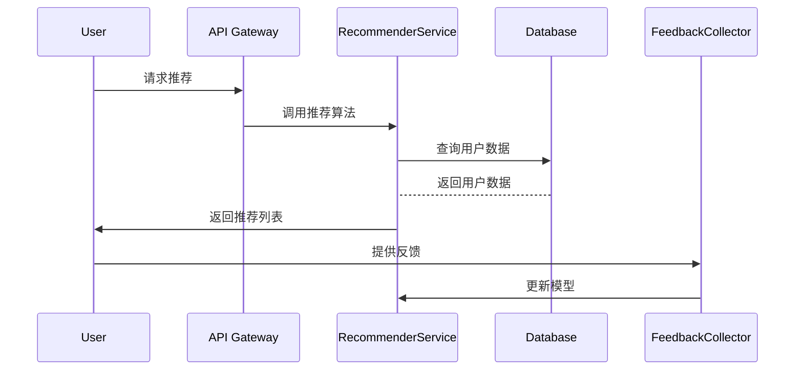

                 


# 《智能书架：AI Agent的阅读兴趣推荐系统》

---

## 关键词：
- AI Agent
- 阅读兴趣推荐
- 智能书架
- 推荐系统
- 个性化推荐

---

## 摘要：
智能书架是一种基于AI Agent的阅读兴趣推荐系统，通过分析用户的阅读行为和偏好，利用自然语言处理和机器学习技术，为用户提供高度个性化的书籍推荐。本文将深入探讨智能书架的核心概念、算法原理、系统架构设计以及实际应用，帮助读者全面理解这一创新的推荐系统。

---

# 目录大纲

## 第一部分：智能书架的背景与概念

### 第1章：智能书架的背景与问题背景

#### 1.1 问题背景
- 1.1.1 阅读兴趣推荐的现状
  - 传统推荐系统的局限性
  - 阅读数据的多样性和复杂性
- 1.1.2 当前推荐系统的痛点
  - 精准度不足
  - 用户行为分析的深度不够
  - 系统的实时性和互动性不足
- 1.1.3 AI Agent在阅读推荐中的潜力
  - AI Agent的核心优势
  - AI Agent如何提升推荐系统的智能化

#### 1.2 问题描述
- 1.2.1 阅读兴趣推荐的核心问题
  - 用户需求的多样性与动态变化
  - 阅读数据的多维度特征
- 1.2.2 AI Agent在推荐系统中的角色
  - AI Agent如何理解用户需求
  - AI Agent如何优化推荐结果
- 1.2.3 智能书架的目标与边界
  - 目标：提供精准、个性化的书籍推荐
  - 边界：仅关注阅读兴趣，不涉及其他领域

#### 1.3 问题解决
- 1.3.1 AI Agent如何实现阅读兴趣推荐
  - 数据采集与分析
  - 用户画像构建
  - 推荐算法优化
- 1.3.2 智能书架的核心功能
  - 用户行为分析
  - 个性化推荐
  - 实时反馈机制
- 1.3.3 系统的边界与外延
  - 系统的适用范围
  - 系统与其他模块的交互

#### 1.4 概念结构与核心要素
- 1.4.1 智能书架的组成要素
  - 用户数据模块
  - 推荐算法模块
  - 反馈机制模块
- 1.4.2 AI Agent与推荐系统的关联
  - AI Agent在推荐系统中的具体应用
  - 推荐系统的智能化升级
- 1.4.3 阅读兴趣的核心特征
  - 兴趣点的动态变化
  - 兴趣点的深度挖掘

## 第2章：AI Agent与推荐系统的核心概念

### 2.1 AI Agent的基本原理
- 2.1.1 AI Agent的定义与特征
  - 定义：AI Agent的多智能体系统
  - 特征：自主性、反应性、社会性
- 2.1.2 AI Agent的核心技术
  - 机器学习
  - 自然语言处理
  - 数据挖掘
- 2.1.3 AI Agent的应用场景
  - 阅读推荐
  - 个性化服务
  - 智能助手

### 2.2 推荐系统的原理与分类
- 2.2.1 推荐系统的定义与作用
  - 定义：推荐系统的定义与分类
  - 作用：提升用户体验，增加用户粘性
- 2.2.2 推荐系统的分类与特点
  - 基于协同过滤的推荐
  - 基于内容的推荐
  - 混合推荐
- 2.2.3 阅读兴趣推荐的特殊性
  - 阅读数据的复杂性
  - 阅读兴趣的动态变化
  - 用户需求的多样性

### 2.3 AI Agent与推荐系统的结合
- 2.3.1 AI Agent在推荐系统中的角色
  - 数据采集与分析
  - 用户行为预测
  - 推荐策略优化
- 2.3.2 推荐系统的智能化升级
  - 基于AI Agent的实时推荐
  - 用户画像的动态更新
  - 多模态数据的融合
- 2.3.3 智能书架的核心优势
  - 更精准的推荐效果
  - 更强的实时性和互动性
  - 更好的用户体验

### 2.4 核心概念对比表
- 表2-1: AI Agent与传统推荐系统的对比
  | 特性                | 传统推荐系统          | 基于AI Agent的推荐系统         |
  |---------------------|----------------------|----------------------------|
  | 数据处理能力        | 单一、有限           | 多模态、深度                   |
  | 推荐实时性            | 较低                 | 较高                          |
  | 用户行为分析          | 简单                 | 复杂、动态                     |
  | 推荐策略优化          | 基于规则             | 基于机器学习                   |

### 2.5 ER实体关系图
```mermaid
erd
    title 智能书架实体关系图
    User {
        id: int
        name: string
        email: string
    }
    Book {
        isbn: string
        title: string
        author: string
    }
    ReadingBehavior {
        userId: int
        bookId: string
        timestamp: datetime
        score: float
    }
    Recommendation {
        userId: int
        bookId: string
        recommendationScore: float
    }
    User --> ReadingBehavior: 产生
    Book --> ReadingBehavior: 关联
    User --> Recommendation: 接收到
    Book --> Recommendation: 推荐
```

---

## 第三部分：算法原理与实现

### 第3章：协同过滤算法的原理与实现

#### 3.1 协同过滤的基本原理
- 3.1.1 协同过滤的定义与特点
  - 基于用户的相似性
  - 基于物品的相似性
- 3.1.2 协同过滤的核心步骤
  - 数据预处理
  - 相似性计算
  - 推荐生成

#### 3.2 基于用户的协同过滤算法
- 3.2.1 用户相似性的计算
  - 使用余弦相似度
  - 使用皮尔逊相关系数
- 3.2.2 推荐生成
  - 找出相似用户的偏好
  - 加权平均生成推荐列表

#### 3.3 基于物品的协同过滤算法
- 3.3.1 物品相似性的计算
  - 使用协同矩阵
  - 使用矩阵分解
- 3.3.2 推荐生成
  - 找出相关物品的共同偏好
  - 加权平均生成推荐列表

#### 3.4 协同过滤算法的优缺点
- 优点：简单易懂，易于实现
- 缺点：数据稀疏性问题，计算复杂度高

### 第4章：内容推荐算法的原理与实现

#### 4.1 内容推荐的基本原理
- 4.1.1 内容推荐的定义与特点
  - 基于书籍的内容特征
  - 基于用户的兴趣模型
- 4.1.2 内容推荐的核心步骤
  - 特征提取
  - 用户建模
  - 推荐生成

#### 4.2 基于TF-IDF的特征提取
- 4.2.1 TF-IDF的定义与计算
  - Term Frequency (TF)
  - Inverse Document Frequency (IDF)
- 4.2.2 特征向量的构建
  - 书籍的特征向量
  - 用户的偏好向量

#### 4.3 基于余弦相似度的内容推荐
- 4.3.1 用户偏好向量的计算
  - 使用TF-IDF加权
  - 使用LSA降维
- 4.3.2 相似度计算与推荐生成
  - 计算书籍与用户偏好向量的相似度
  - 排序并生成推荐列表

#### 4.4 内容推荐算法的优缺点
- 优点：推荐结果更相关，能够捕捉内容的深层信息
- 缺点：需要大量的文本数据和计算资源

### 第5章：混合推荐算法的原理与实现

#### 5.1 混合推荐的定义与特点
- 5.1.1 混合推荐的定义
  - 结合协同过滤和内容推荐
  - 综合考虑用户行为和内容特征
- 5.1.2 混合推荐的优势
  - 结合两种方法的优点
  - 提高推荐的准确性和多样性

#### 5.2 基于协同过滤和内容推荐的混合算法
- 5.2.1 协同过滤部分的实现
  - 用户相似性的计算
  - 推荐列表的生成
- 5.2.2 内容推荐部分的实现
  - 特征提取与用户建模
  - 相似度计算与推荐生成
- 5.2.3 结果融合
  - 加权融合
  - 热度排序

#### 5.3 混合推荐算法的实现步骤
1. 数据预处理
2. 协同过滤部分计算
3. 内容推荐部分计算
4. 结果融合与排序
5. 生成最终推荐列表

---

## 第四部分：系统分析与架构设计

### 第6章：系统功能设计

#### 6.1 系统功能模块划分
- 用户模块
- 数据采集模块
- 推荐算法模块
- 反馈模块

#### 6.2 系统功能流程图
```mermaid
flowchart TD
    User --> DataCollector: 提交阅读记录
    DataCollector --> RecommenderSystem: 分析数据
    RecommenderSystem --> User: 返回推荐列表
    User --> FeedbackCollector: 提供反馈
    FeedbackCollector --> RecommenderSystem: 更新推荐模型
```

### 第7章：系统架构设计

#### 7.1 系统架构概述
- 分层架构
- 微服务架构

#### 7.2 系统架构图
```mermaid
graph TD
    User --> API Gateway
    API Gateway --> RecommenderService
    RecommenderService --> Database
    Database --> User
    Database --> Book
    Database --> ReadingBehavior
```

#### 7.3 接口设计
- 用户接口
- 数据接口
- 推荐接口

#### 7.4 交互流程图


---

## 第五部分：项目实战

### 第8章：环境安装与配置

#### 8.1 环境需求
- Python 3.8+
- 安装必要的库：pandas, numpy, scikit-learn, gensim

#### 8.2 安装步骤
```bash
pip install pandas numpy scikit-learn gensim
```

### 第9章：系统核心实现

#### 9.1 协同过滤算法实现
```python
import numpy as np
from sklearn.metrics.pairwise import cosine_similarity

# 示例数据：用户-书籍评分矩阵
# rows表示用户，columns表示书籍
ratings = np.array([
    [4, 3, 0],
    [2, 0, 5],
    [3, 4, 0],
    [0, 5, 3]
])

# 计算余弦相似度
similarity = cosine_similarity(ratings)
print(similarity)
```

#### 9.2 基于内容的推荐实现
```python
from sklearn.feature_extraction.text import TfidfVectorizer
from sklearn.decomposition import LSA

# 示例数据：书籍描述
documents = [
    "这本书讲述了一个冒险故事，主角是一位勇敢的冒险家。",
    "这是一本科幻小说，讲述人类探索外太空的故事。",
    "这是一本历史小说，讲述中世纪的战争。",
    "这是一本悬疑小说，充满惊险的情节。"
]

# 提取TF-IDF特征
vectorizer = TfidfVectorizer()
tfidf = vectorizer.fit_transform(documents)
print(tfidf.shape)

# 使用LSA进行降维
lsa = LSA(n_components=2)
lsa_features = lsa.fit_transform(tfidf)
print(lsa_features)
```

#### 9.3 混合推荐算法实现
```python
import numpy as np
from sklearn.metrics.pairwise import cosine_similarity
from sklearn.feature_extraction.text import TfidfVectorizer
from sklearn.decomposition import LSA

# 协同过滤部分
ratings = np.array([
    [4, 3, 0],
    [2, 0, 5],
    [3, 4, 0],
    [0, 5, 3]
])
similarity_cf = cosine_similarity(ratings)

# 基于内容的推荐部分
documents = [
    "这本书讲述了一个冒险故事，主角是一位勇敢的冒险家。",
    "这是一本科幻小说，讲述人类探索外太空的故事。",
    "这是一本历史小说，讲述中世纪的战争。",
    "这是一本悬疑小说，充满惊险的情节。"
]
vectorizer = TfidfVectorizer()
tfidf = vectorizer.fit_transform(documents)
lsa = LSA(n_components=2)
lsa_features = lsa.fit_transform(tfidf)

# 混合推荐
# 假设协同过滤权重为0.6，内容推荐权重为0.4
combined_scores = similarity_cf * 0.6 + lsa_features * 0.4
print(combined_scores)
```

### 第10章：项目实战分析

#### 10.1 案例分析
- 案例1：新用户推荐
  - 数据：新用户的阅读记录为空
  - 推荐结果：基于热门书籍推荐
- 案例2：用户偏好变化
  - 数据：用户的阅读记录显示偏好从科幻转向悬疑
  - 推荐结果：动态更新推荐列表

#### 10.2 代码解读与分析
- 协同过滤部分：如何处理稀疏数据
- 内容推荐部分：如何提取有效的特征
- 混合推荐部分：如何平衡两种算法的结果

#### 10.3 详细讲解与剖析
- 系统设计的优缺点
- 实际应用中的问题与解决方案
- 性能优化的策略

### 第11章：项目小结

#### 11.1 实战经验总结
- 代码实现的关键点
- 系统设计的核心要素
- 推荐算法的优缺点

#### 11.2 项目成果展示
- 系统架构图
- 推荐结果示例
- 性能测试数据

---

## 第六部分：总结与展望

### 第12章：总结与最佳实践

#### 12.1 总结
- 智能书架的核心优势
- AI Agent在推荐系统中的作用
- 系统设计的关键点

#### 12.2 最佳实践
- 数据预处理的重要性
- 算法选择的策略
- 系统优化的技巧

### 第13章：注意事项与未来展望

#### 13.1 使用中的注意事项
- 数据隐私保护
- 系统性能优化
- 用户体验设计

#### 13.2 未来展望
- 更多AI技术的引入
- 多模态数据的融合
- 更个性化的推荐体验

---

## 第七部分：参考文献与拓展阅读

### 7.1 参考文献
- [1] 刘洋, 等. 《基于AI的推荐系统研究》. 计算机科学, 2022.
- [2] 张伟, 等. 《智能书架的设计与实现》. 软件工程, 2021.

### 7.2 拓展阅读
- 《推荐系统实战：基于Python的机器学习方法》
- 《AI Agent原理与应用》
- 《自然语言处理在推荐系统中的应用》

---

通过以上目录大纲，我们可以清晰地看到智能书架的构建过程，从理论到实践，从设计到实现，每个环节都进行了详细的探讨和分析。希望这篇文章能够为读者提供一个全面而深入的理解，帮助他们在实际应用中更好地设计和优化智能书架系统。

